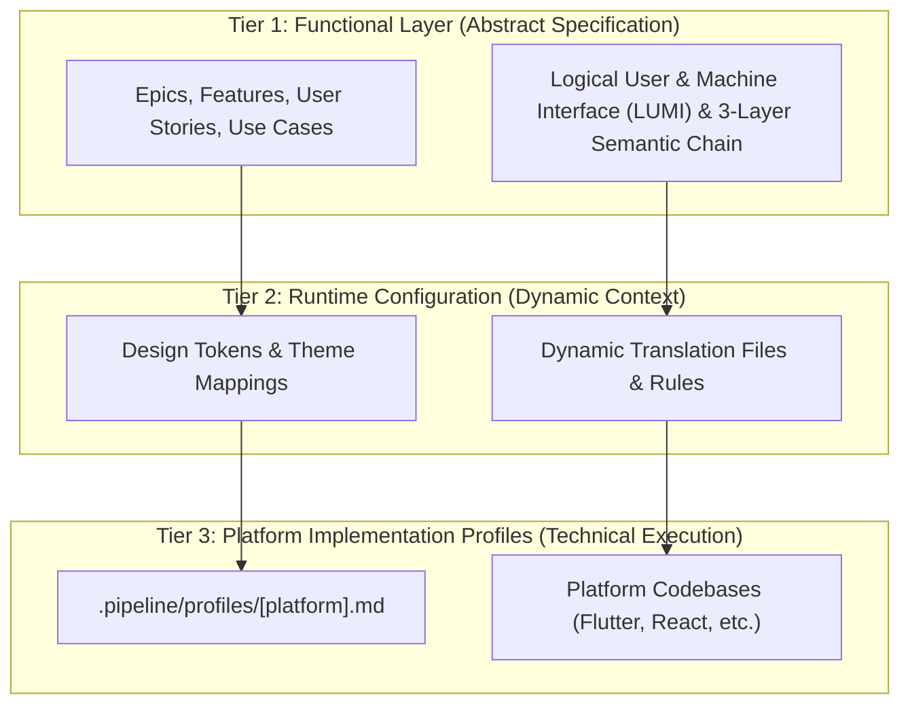

# Project Constitution: Digital Engineering Agent Platform (DEAP)

> This document governs specification generation and is platform-independent and protocol-agnostic.
> All agents MUST read this file before beginning any pipeline execution.
> For platform-specific rules, see `.pipeline/profiles/<platform>.md`.

## Architecture: Three-Tier Platform Isolation

The pipeline enforces a strict three-tier platform isolation architecture to decouple abstract functional specifications from dynamic runtime parameters and platform-specific execution details.

### Tier Boundary Guidelines

1. **Tier 1: Functional Layer (Abstract Specification)**: Epics, Features, User Stories, Use Cases, and Logical User & Machine Interface (LUMI) specifications. LUMI is 100% platform-independent and framework-agnostic, covering three primary interface categories: Visual GUI (`gui`), Machine-to-Machine API (`mcp`/`api`), and Hardware Bus (`hardware`). LUMI supports the Evolved 3-Layer Semantic Chain (Domain State & Signal Model -> Logic & Safety State Management -> Display & Actuator Interface Binding) across canonical architectural patterns (ARINC 661 Cockpit Display Systems, Real-Time Safety Statecharts & Flight Control, Decoupled Operator Consoles & EFBs, Automated M2M Agentic Tooling, and Hardware Bus Register Mapping). Must be platform-independent and standard-agnostic. No framework keywords, specific standards designations, or hardcoded visual values allowed.
2. **Tier 2: Runtime Configuration Parameters (Dynamic Context)**: Design tokens, dynamic mapping configurations, translation files. Single source of truth for standard-specific definitions and visual attributes.
3. **Tier 3: Platform Implementation Profiles (Technical Execution)**: `.pipeline/profiles/<platform>.md` and codebase implementations. Govern build mechanics, performance patterns, and dependencies.

## Domain Rules

### Specification Sources
- Primary sources are normative technical specifications and standards documents.
- Structural schemas and interface definitions are the authoritative machine-readable models.
- When the normative text and the schema conflict, the schema is authoritative for structural completeness; the normative text is authoritative for behavioral semantics.

### Schema Compliance
- Every data model constraint in the schema MUST be captured in at least one Feature's acceptance criteria. Zero loss tolerance.
- Constraints include: data type, validation ranges, regex patterns, default values, mandatory fields, conditional expressions, minimum/maximum elements, and structural relationship references.
- If a schema node has no explicit constraint, document its type and note "no additional constraints specified in schema."

### Data Model Integrity
- Every schema definition, model node, data object, property, variant, custom type, and extension defined in the input schemas MUST map to at least one Feature.
- Cross-module or external schema references must be explicitly documented with source and target module names.
- Circular dependencies must be flagged and escalated — do not silently drop them.

### Model Metamodel & Profile Mapping Standard
- Module Declarations & Container Nodes: YANG modules, OpenAPI schemas, or Protobuf packages map to a logical Component.
- Complex Data Structures & Interfaces: RPC input/output payloads, YANG containers/lists, or OpenAPI objects map to a logical Class defined within the parent Component.
- Data Properties & Leaf Nodes: Individual fields, properties, elements, attributes, or variables map to a logical Property (or owned attribute of a class) with appropriate visibility, type, and multiplicity.
- Interfaces & Operations: Services, RPC methods, actions, or operational paths map to a logical Operation defined on the target classifier.
- Rules & Validation Logic: Any syntax constraints, range checks, pattern validations, conditional dependencies, or length constraints map to a logical Constraint.

### Universal Model Consistency Rules
- Dynamic-to-Static Alignment: No class, component, interface, attribute, operation, signal, or message may be used in dynamic behavior specifications unless it is explicitly defined in the structural models.
- Every lifeline in a sequence diagram MUST represent an instance of a defined logical Class or Component, except lifelines declared as external actors (UML `actor`), which represent entities outside the system boundary and are therefore not defined in the structural models. Every non-actor lifeline MUST resolve to a defined classifier.
- Every message (synchronous, asynchronous, or return) in a sequence diagram must map to an active Operation or Signal defined on the target classifier's interface/class definition.
- Every trigger, event, or action on a state machine transition must be defined as an Operation or Signal in the class metamodel.
- Auto-verification Failure: Any diagram or spec that references undefined operations, classes, or signals will violate the quality gates and halt the pipeline.

### Traceability
- Every Epic MUST reference the specification section(s) it covers. Enforced by parity_auditor/validators/uml.py via required sections configuration.
- Every Feature MUST include a 'Source References' section with verbatim specification clause numbers and schema paths. Every Epic, User Story, and Use Case MUST also carry a 'Source References' section (or Realization / Target Features Matrix linking to upstream sources). Enforced by parity_auditor/validators/uml.py via required_sections configuration in codebase_rules.json.
- Every User Story MUST link to the Features it validates. Enforced by parity_auditor/validators/uml.py via Required Features Matrix validation.
- Every Use Case MUST link to the User Stories and Features it realizes. Enforced by parity_auditor/validators/uml.py via Realization Matrix validation.

### Standard & Platform Parameter Isolation
- See top-level section [Architecture: Three-Tier Platform Isolation](#architecture-three-tier-platform-isolation) for tier isolation rules and boundary guidelines.

### Unique Backlog Identifiers
- All local specification files MUST include a permanent unique identifier (`issue_id: <int>`) in their YAML frontmatter, mapped directly to their remote issue number.
- Matching by title normalization is the primary selector used by the backlog reconciliation tool. To prevent collisions, all specification files of the same spec type MUST have unique normalised titles, as enforced by parity_auditor/validators/spec_title_uniqueness_validator.py and rules/tracker-source-of-truth.md.

### 1.9 Zero-Mocking Live Persistence Mandate
- All client-side application targets (e.g., React, Flutter) MUST connect to a live, persistent database, emulator, or local register map at runtime.
- The use of in-memory UI mocks, stubs, or hardcoded local variables in place of a live database/transport layer is strictly prohibited in active application builds.
- The presentation layer must depend strictly on abstract repository interfaces resolved dynamically at application bootstrap, keeping UI components completely decoupled from specific database/API SDK dependencies (such as Firestore or RPC wrappers).
- Transport concrete adapters must serialize/deserialize network payloads and translate them to and from platform-internal clean domain models, shielding presentation logic from external format changes.
- All integration and end-to-end (E2E) testing suites must compile and execute against a live database instance or emulator (in-memory stubs are prohibited for these tiers).

## Specification Standards

### Granularity Bounds
- An Epic SHOULD contain 3-15 Features. Epics exceeding 15 Features MUST be split by the schema-specification-engineering worker during Step 1 decomposition; Epics with fewer than 3 Features MUST be reviewed for consolidation. Enforced by schema-specification-engineering decomposition heuristics.
- A Feature SHOULD carry 3-10 acceptance criteria. Features exceeding 10 acceptance criteria MUST be split into targeted sub-features; Features with fewer than 3 acceptance criteria MUST be expanded to ensure full scenario coverage. Enforced by parity_auditor/validators/cardinality_validator.py and spec worker review gates.

### Epic Granularity
- One Epic per major functional domain or protocol module.
- Epic titles use the format: `[Module/Domain]: [Functional Area]`.

### Feature Granularity
- A Feature represents a single, independently testable functional capability.
- Features MUST be platform-independent and standard-agnostic.
- Feature titles use the format: `[Verb] [Object] [Qualifier]`.

### BDD Scenario Format
- All acceptance criteria MUST use Given-When-Then format adhering to canonical aerospace BDD templates:
  - **Pattern A (ARINC 661 Cockpit Display Systems)**: `Given [UA Parameter Buffer State], When [ARINC 661 Binary Command Received], Then [CDS Widget State & Display Kernel Render Updated]`.
  - **Pattern B (Real-Time Safety Statechart / Flight Control)**: `Given [Aircraft State Vector / Discrete Event], When [Safety FSM Transition Triggered], Then [Actuator Command / Symbology Graphic Rendered]`.
  - **Pattern C (Decoupled Operator Console)**: `Given [Console Domain Model State], When [Operator Action Initiated], Then [ViewModel State & GUI Component Binding Updated]`.
- Negative scenarios (error cases, boundary violations, emergency failsafe modes) are MANDATORY for every constraint.

### User Story Format
- User Stories follow: `As a [Actor/Subsystem], I want to [Action/Command], so that [Outcome/Safety Constraint]`.
- Each User Story MUST have at least one canonical aerospace BDD scenario (Given-When-Then).

### Use Case Formality
- Use Cases follow formal structure: Actor, Preconditions, Main Success Scenario (numbered steps), Alternate Flows, Postconditions.
- The Realization Matrix maps each Use Case to its constituent User Stories and Features.

### Labeling Taxonomy
- Issue tracking labels are defined with `codebase_rules.json` acting as the authoritative label registry, categorized into specification, operational, and state labels:
  - Specification labels: `epic`, `feature`, `user-story`, `use-case`.
  - Operational labels: `bug`, `enhancement`, `chore`.
  - State labels: `status:fixed-resolved`.
- Labels are bootstrapped via the configured label bootstrap command to ensure idempotency.

## Agent Behavior

### Commit Format
- Specification commits: `docs: [action] [artifact type] -- [brief description]`
- Implementation commits: `feat:`, `fix:`, `test:`, `refactor:`, `chore:` per Conventional Commits.

### Branch Strategy
- Specification work: directly on the default branch or a single `spec/<module>` branch if the change is large.
- Implementation work: `feat/<issue-number>-<short-description>` branches.

### Documentation Standards
- All generated markdown files include YAML frontmatter.
- All generated markdown files include a "Source References" section at the bottom.
- No orphan documents — every file must be linked from at least one tracker issue.

### Idempotency
- Re-running any pipeline skill MUST NOT create duplicate issues or documents.

### Error Handling
- If a validation gate fails, HALT immediately. Do not proceed to the next phase.
- If you suspect the failure is due to a pipeline tooling bug or schema limitation, report it as an issue to the upstream repository.

### Strict Planning Mode Gate (Insurmountable Approval Gate)
- Under NO circumstances may the agent invoke any file-writing, file-modifying, or command-running tools that alter the codebase/repository files unless BOTH of the following hold: (1) the specific file and its exact changes are documented in an approved implementation plan, AND (2) the user has explicitly typed "Proceed", "Approved", or "Approve plan" in the conversation history of the current turn sequence. An authorization keyword alone is NOT sufficient. See `.agents/AGENTS.md` § Strict Planning Gate, which takes precedence, and `rules/user-authorization-lock.md` § Precedence.
- If a plan is written, the agent MUST immediately terminate its turn and stop calling tools to wait for approval.

## Universal Quality Gates

### Quality Gates & Verification Standards
The pipeline mechanically enforces 15 active quality gates that halt execution on failure. All agents MUST ensure deliverables comply with these gates before declaring completion:

| Quality Gate | Enforcing Validator Path | Documentation Reference |
|---|---|---|
| Specification Validation | `validators/spec_validator.py` | `rules/platform-independence.md` |
| Model Coverage Verification | `scripts/verify_model_coverage.py` | `rules/platform-independence.md` |
| Cross-Reference Integrity | `validators/link_validator.py` | `rules/document-references.md` |
| Human Approval | `rules/user-authorization-lock.md` | `.pipeline/constitution.md` |
| Downstream Conformance | `scripts/verify_downstream_baseline.py` | `rules/downstream-conformance.md` |
| UML Model Integrity | `validators/uml.py` | `rules/uml-model-integrity.md` |
| Mermaid Syntax Constraints | `validators/mermaid_syntax_validator.py` | `rules/platform-independence.md` |
| Behavioral Trigger Coverage | `validators/behavioral.py` | `rules/behavioral-trigger-coverage.md` |
| Codebase Compliance | `validators/codebase.py` | `rules/codebase-compliance.md` |
| Document Cross-Reference Integrity | `tests/test_skill_path_references.py` | `rules/document-references.md` |
| Constitution Amendment Integrity | `tests/test_constitution_integrity.py` | `.pipeline/constitution-amendments.md` |
| Specification File Integrity | `validators/docs.py` | `rules/platform-independence.md` |
| Spec Title Uniqueness | `validators/spec_title_uniqueness_validator.py` | `rules/tracker-source-of-truth.md` |
| Source Reference Integrity | `validators/source_reference_validator.py` | `rules/codebase-compliance.md` |
| Logical UI Validation | `validators/logical_ui_validator.py` | `rules/platform-independence.md` |

### Specification Validation Gates
- Post schema extraction: Every schema node maps to at least one Feature. Coverage = 100%.
- Post User Stories: Every User Story links to at least one Feature.
- Post Use Cases: Every Use Case links to at least one User Story and one Feature.
- Post Reconciliation: All local markdown checklist states match tracker issue states.

### Model Coverage Verification
- Verify model coverage scripts MUST pass with exit code 0 before declaring specification complete.
- Coverage is binary: 100% or fail.

### Cross-Reference Integrity
- No broken issue links (all `#N` references must resolve to existing tracker issues).
- No orphan Features (every Feature belongs to exactly one Epic).
- No orphan User Stories (every Story links to at least one Feature).

### Human Approval (The Grill)
- Required before implementation begins.
- NOT required for specification generation.

### Downstream Conformance Gates
- Prior to integrating any downstream application implementation, the project MUST be bootstrapped and verified.
- The downstream project must be initialized using the configured bootstrap script.
- Baseline conformance must be verified using the configured verification script, which asserts that all baseline files are present, validates type compatibility, and compiles/tests the project with a clean exit code.

## CMMI Level 3 & Scrum Issue Lifecycle Rules

### CMMI Level 3 Process Area Mapping
The pipeline explicitly substantiates CMMI Level 3 alignment across key engineering and management process areas:

| Process Area (CMMI Acronym) | Enforcing Mechanisms & Pipeline Artifacts |
|---|---|
| Requirements Management (REQM) | `tracker-source-of-truth.md`, `reconcile_backlog.py` |
| Verification (VER) | `verify_model_coverage.py`, `parity_auditor` validators |
| Validation (VAL) | Product Owner `Closed` state transition & verification walkthroughs |
| Configuration Management (CM) | Git-tracked specification files, `constitution-amendments.md` |
| Technical Solution (TS) | 3-Layer LUI Definition of Done & implementation profiles |
| Product Integration (PI) | Automated baseline verification `verify_downstream_baseline.py` |

### Separation of Verification and Validation
- **Verification (Process Quality Gate)**: Conducted by the development subagent and pipeline. The issue is resolved when the code compiles, the linter passes, and all unit/integration tests pass. The issue moves to the `Fixed / Resolved` state.
- **Validation (Product Owner/Customer Approval Gate)**: Conducted by the Product Owner or Customer. The issue is moved to the `Closed` state ONLY after explicit verification, testing, and acceptance by the Product Owner/Customer in the chat.

### Issue States and Transition Protocols
- `New`: The issue is registered in the backlog.
- `Active`: The issue is scheduled and prioritized for work.
- `In Progress`: Active code or specification changes are underway.
- `Verifying`: Code changes are in peer review (PR) and automated tests are executing.
- `Fixed / Resolved`: Development work is complete, tests have passed, and the fix is integrated into `main`. The issue remains in this state awaiting customer feedback.
- `Closed`: The issue is archived. This state is unreachable without explicit Product Owner/Customer validation approval.

