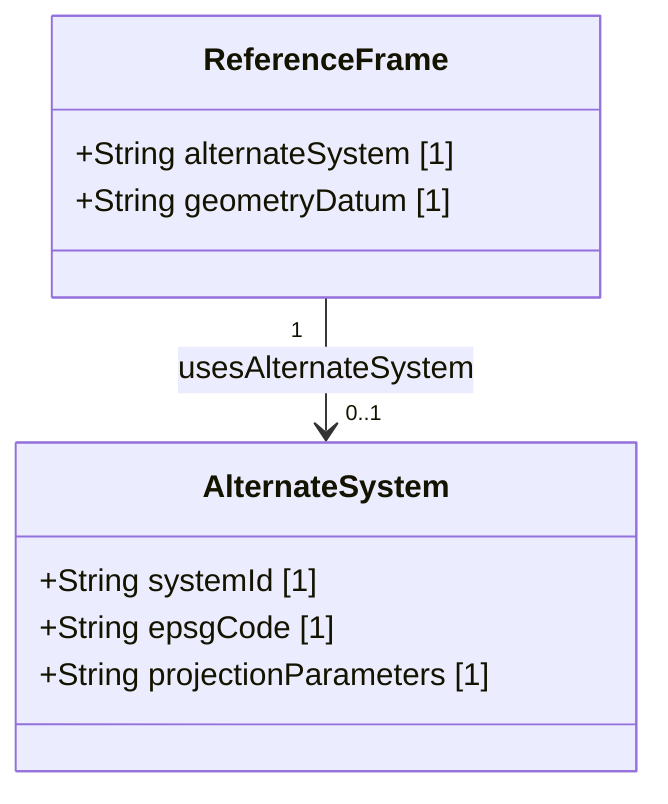

# Feature 02: Alternate Coordinate and Geometry Systems

## UML Class Diagram


## Interface Requirements

### 1. Payload Schema
```json
{
  "systemId": "UTM-ZONE-54N",
  "epsgCode": "EPSG:32654",
  "projectionParameters": "+proj=utm +zone=54 +datum=Geometry +units=m +no_defs"
}
```

### 2. Operational Scenarios

#### Scenario 1: Alternate System Coordinate Conversion
- **Given** a spatial telemetry payload utilizing a non-standard reference frame.
- **When** the spatial processing module parses the `alternateSystem` attribute.
- **Then** the system resolves the matching EPSG transformation parameter set and converts coordinates accordingly.

### 3. Logical Operations & Interface Messages
1. Retrieve active geometry reference frame parameters.
2. Query alternate system projection definitions by EPSG code.
3. Transform geometry coordinates to alternate spatial frame representations.

### 4. Logical Exception States & Validation Failures
1. Unsupported EPSG Code: If the alternate system EPSG code cannot be resolved, the parser raises a spatial coordinate conversion exception.

---

## Source References
- **Project Constitution**: [constitution.md:L88-94](../../.pipeline/constitution.md#L88-L94)
- **Adversarial Audit Synthesis**: [adversarial_audit_synthesis.md:L44](../decisions/adversarial_audit_synthesis.md#L44)
