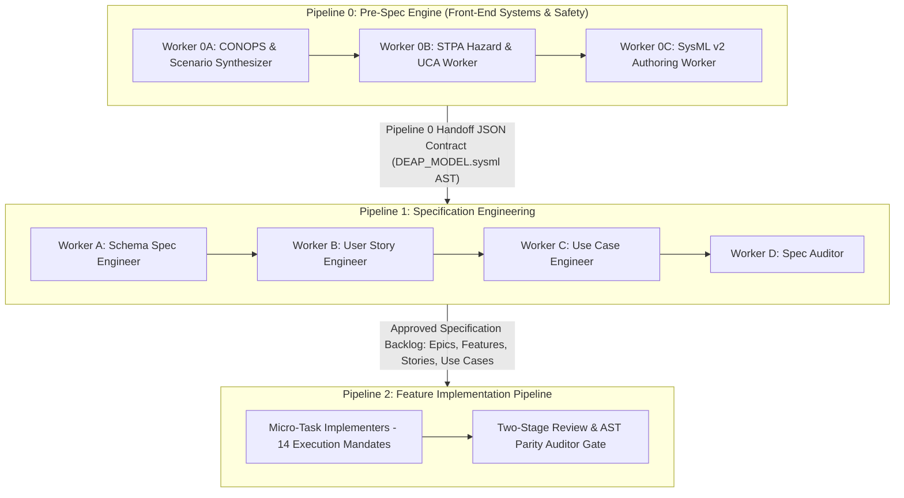
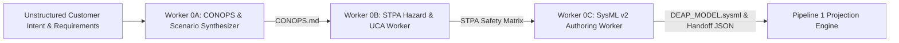
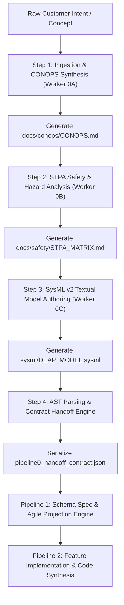

# DEAP Pipeline 0 Front-End Systems & Safety Modeling Blueprint

> **Header Metadata**  
> - **Identifier:** `DEAP-BLUEPRINT-PIPELINE-001`  
> - **Status:** `APPROVED / PRODUCTION-GRADE`  
> - **Target Regulatory Frameworks:** `ARP4754A`, `ARP4761`, `JARUS SORA v2.5`, `DO-178C`, `DO-254`, `ASTM F3269`  

---

## 1. Executive Summary & Vision

The **Digital Engineering Agentic Pipeline (DEAP)** framework establishes a triple-pipeline master-worker architecture for complex safety-critical systems engineering. **Pipeline 0 (Pre-Spec Engine)** serves as the front-end systems engineering and safety modeling pipeline, operating prior to downstream Agile backlog projection in **Pipeline 1** and automated code synthesis in **Pipeline 2**.



### Vision for Zero-to-One Systems Engineering
Complex aerospace, avionic, and low-altitude unmanned aircraft systems (UAS) suffer from ambiguity, incomplete hazard identification, and disconnected regulatory compliance artifacts during early-stage development. 

Pipeline 0 solves the zero-to-one problem by establishing a rigorous, automated workflow that ingests unstructured customer intent, operational concepts, and mission profiles, transforming them into:
1. **Standardized Concept of Operations (`CONOPS.md`)** detailing mission envelopes, operational phases, and system boundaries.
2. **STPA Safety Analysis Matrices (`STPA_MATRIX.md`)** identifying System Losses, Hazards, Control Structures, Unsafe Control Actions (UCAs), and Loss Scenarios.
3. **Normative SysML v2 Textual Models (`DEAP_MODEL.sysml`)** capturing formal system requirements, structural parts, interface ports, functional flows, and safety statecharts.
4. **Inter-Pipeline Interface Contracts (`pipeline0_handoff_contract.json`)** serving as the immutable AST payload for Pipeline 1 Agile Backlog projection.

---

## 2. Pipeline 0 Worker Topology

Pipeline 0 deploys three specialized, context-isolated subagent workers operating in a strict serial pipeline.



### 2.1 Worker 0A: CONOPS & Scenario Synthesizer
- **Role Description:** Context-isolated front-end synthesizer responsible for converting raw, unstructured customer statements, stakeholder requirements, flight mission profiles, and operational boundaries into a structured Concept of Operations document.
- **Inputs:**
  - Raw natural language prompt or customer specification document.
  - Flight mission envelope parameters (altitude, velocity, payload, airspace class).
  - Stakeholder role definitions (Pilot in Command, Remote Pilot, ATC, Fleet Operator).
- **Outputs:**
  - `CONOPS.md`: Standardized Concept of Operations markdown detailing:
    - Operational Context & Mission Goals.
    - Operational Phases (Pre-Flight, Takeoff, Cruise, Mission Execution, Approach, Landing, Contingency).
    - System Boundaries & Interfaces (Ground Control Station, Aircraft, Telemetry Link, External ATC/UTM).
    - Environmental & Airspace Operational Constraints.

### 2.2 Worker 0B: STPA Hazard & UCA Worker
- **Role Description:** Safety engineering subagent that applies System-Theoretic Process Analysis (STPA) methodology to the system boundary and operational scenarios defined by Worker 0A.
- **Inputs:**
  - `CONOPS.md` generated by Worker 0A.
  - Regulatory safety mandates (ARP4761 FHA, JARUS SORA v2.5 Ground/Air Risk Classes).
- **Outputs:**
  - `STPA_MATRIX.md`: Comprehensive STPA Safety Analysis Matrix including:
    - **System Losses ($L-1..N$):** High-level accidents or losses (e.g., loss of aircraft, injury to personnel, collision in airspace).
    - **System Hazards ($H-1..N$):** System conditions that lead to losses under worst-case environmental conditions.
    - **Control Structure Model:** High-level controller topologies, control actions, process models, and feedback loops.
    - **Unsafe Control Actions ($UCA-1..N$):** Categorized across 4 STPA control failure modes:
      1. Control Action Not Provided when needed.
      2. Control Action Provided when not needed.
      3. Control Action Provided Too Early, Too Late, or Out of Order.
      4. Control Action Stopped Too Soon or Applied Too Long.
    - **Loss Scenarios ($LS-1..N$):** Causal pathways explaining why UCAs occur.
    - **Safety Constraints ($SC-1..N$):** Mandatory safety requirements enforcing safe control boundaries.

### 2.3 Worker 0C: SysML v2 Authoring Worker
- **Role Description:** Systems architecture subagent that compiles the CONOPS and STPA hazard matrices into normative, standard-compliant SysML v2 textual code blocks.
- **Inputs:**
  - `CONOPS.md` from Worker 0A.
  - `STPA_MATRIX.md` from Worker 0B.
- **Outputs:**
  - `DEAP_MODEL.sysml`: Standard-compliant SysML v2 textual model defining:
    - `package`: Namespace organization for Requirements, Structure, Behavior, and Safety.
    - `req`: Functional and Safety Requirement definitions with explicit IDs and text.
    - `part`: System, subsystem, and component structural block definitions.
    - `port`: Typed interface and telemetry flow ports.
    - `action`: Behavioral action trees and functional dataflows.
    - `state`: Safety statechart machines (e.g., Operational, Degraded, Contingency, Emergency Recovery).
    - `satisfy` / `verify` / `derive`: Traceability relationships linking requirements to structure and safety constraints.
  - `pipeline0_handoff_contract.json`: Serialized AST handoff payload for Pipeline 1 consumption.

---

## 3. Early Systems Engineering Workflows

The early systems engineering workflow transforms raw intent into executable SysML v2 models through a step-by-step progression:



### Step-by-Step Execution Protocol:
1. **Raw Intent Ingestion (Worker 0A):**
   - Ingests customer description, operational requirements, and target mission profile.
   - Synthesizes `CONOPS.md` enforcing formal section headers and operational state definitions.
2. **STPA Hazard Extraction (Worker 0B):**
   - Parses system boundary and interfaces from `CONOPS.md`.
   - Constructs the control structure diagram and extracts System Losses ($L$), System Hazards ($H$), Unsafe Control Actions ($UCA$), and Safety Constraints ($SC$).
3. **SysML v2 Structural & Safety Authoring (Worker 0C):**
   - Maps `CONOPS.md` operational requirements into SysML v2 `req` declarations.
   - Maps system components and ports into SysML v2 `part` and `port` blocks.
   - Maps STPA Safety Constraints ($SC$) into SysML v2 safety requirements with `satisfy` relationships to safety controllers and backup statecharts.
4. **AST Compilation & Handoff Generation:**
   - Evaluates `DEAP_MODEL.sysml` against SysML v2 grammar rules via `compile_sysml.py`.
   - Generates `pipeline0_handoff_contract.json` linking all requirement IDs, part definitions, and STPA hazard tags.

---

## 4. Inter-Pipeline Interface Contracts

The interface between Pipeline 0, Pipeline 1, and Pipeline 2 is strictly governed by formal JSON/Markdown handoff contracts to maintain platform decoupling and prevent context leakage.

### 4.1 Pipeline 0 Handoff JSON Contract (`pipeline0_handoff_contract.json`)

```json
{
  "$schema": "https://deap.engine/schemas/pipeline0_handoff_v1.json",
  "metadata": {
    "identifier": "DEAP-PIPELINE-0-HANDOFF-001",
    "timestamp": "2026-08-11T00:00:00Z",
    "source_model": "DEAP_MODEL.sysml",
    "governance_status": "APPROVED",
    "regulatory_target": ["ARP4754A", "ARP4761", "JARUS SORA v2.5", "DO-178C", "DO-254", "ASTM F3269"]
  },
  "conops_summary": {
    "document_path": "docs/conops/CONOPS.md",
    "mission_type": "UAS BVLOS Urban Infrastructure Inspection",
    "operational_phases": ["PRE_FLIGHT", "TAKEOFF", "CRUISE", "INSPECTION", "APPROACH", "LANDING", "RTA_BACKUP"]
  },
  "safety_matrix": {
    "document_path": "docs/safety/STPA_MATRIX.md",
    "system_losses": [
      { "id": "L-1", "title": "Loss of Aircraft Control / Uncontrolled Flight Into Terrain (UFIT)" },
      { "id": "L-2", "title": "Airspace Collision with Manned Aircraft" }
    ],
    "hazards": [
      { "id": "H-1", "loss_refs": ["L-1"], "title": "Flight Controller Command Saturation during High-Wind Turbulence" },
      { "id": "H-2", "loss_refs": ["L-2"], "title": "Loss of Remote ID & DAA Telemetry Stream" }
    ],
    "unsafe_control_actions": [
      {
        "id": "UCA-1",
        "hazard_ref": "H-1",
        "control_action": "Execute Pitch Command",
        "failure_mode": "Provided Wrong / Out of Range",
        "safety_constraint": "SC-1: Pitch command must be rate-limited and bounded by pitch envelope protection safety statechart."
      }
    ]
  },
  "sysml_ast_export": {
    "requirements": [
      {
        "id": "REQ-SYS-001",
        "name": "EnvelopeProtectionRequirement",
        "text": "The flight control system shall enforce pitch angle limits between -15 deg and +25 deg.",
        "stpa_ref": "SC-1",
        "dal": "DAL A"
      }
    ],
    "parts": [
      {
        "id": "PART-SYS-001",
        "name": "FlightControlSystem",
        "ports": ["p_telemetry", "p_actuator_cmd"],
        "subparts": ["PrimaryController", "RunTimeAssuranceMonitor"]
      }
    ],
    "statecharts": [
      {
        "name": "SafetyModeStatechart",
        "states": ["NORMAL", "DEGRADED", "RTA_BACKUP_ENGAGED", "EMERGENCY_FAILSAFE"]
      }
    ]
  },
  "pipeline1_projection_instructions": {
    "epic_mapping_strategy": "PER_SYSML_PACKAGE",
    "feature_mapping_strategy": "PER_SYSML_PART_AND_REQUIREMENT",
    "user_story_generation_rules": ["MAP_STPA_UCA_TO_GIVEN_WHEN_THEN", "REQUIRE_TRI_LAYER_BINDING"]
  }
}
```

---

## 5. Regulatory & Pre-Certification Alignment

Pipeline 0 embeds pre-certification compliance directly into early systems engineering models, targeting aerospace and uncrewed system standards:

### 5.1 ARP4754A & ARP4761 Civil Avionic Safety Alignment
- **Functional Hazard Assessment (FHA):** STPA System Losses ($L$) and Hazards ($H$) mapped by Worker 0B fulfill early ARP4761 FHA requirements.
- **Preliminary System Safety Assessment (PSSA):** SysML v2 safety requirements (`req`) and fault containment boundaries define PSSA allocations.
- **Development Assurance Levels (DAL A through E):** System functions are tagged with Development Assurance Levels based on hazard severity:
  - **DAL A (Catastrophic):** Core Flight Control, Pitch/Roll Envelope Protection, Run-Time Assurance Backup Switch.
  - **DAL B (Hazardous/Severe-Major):** Detect and Avoid (DAA) Target Tracking, Primary Telemetry Pipeline.
  - **DAL C (Major):** Navigation Route Planning, Battery Management System.
  - **DAL D (Minor) / DAL E (No Safety Effect):** Payload Camera Controls, Fleet Status Dashboard UI.

### 5.2 JARUS SORA v2.5 Low-Altitude UAS Operations Alignment
- **Ground Risk Class (GRC) & Air Risk Class (ARC):** Worker 0A CONOPS parameters (population density, aircraft dimensions, BVLOS vs VLOS, airspace class) automatically compute initial GRC and ARC baseline levels.
- **Specific Assurance and Integrity Levels (SAIL I to VI):** Pipeline 0 assigns target SAIL levels (e.g., SAIL IV for urban BVLOS operations) and enforces mandatory Operational Safety Objectives (OSOs):
  - **OSO-01 through OSO-04:** Maintenance and inspection requirements.
  - **OSO-05 & OSO-06:** System architecture safety integrity (RTA containment).
  - **OSO-10 & OSO-12:** Remote Pilot competency and C2 link monitoring.

### 5.3 DO-178C (Software) & DO-254 (Hardware) Pre-Certification
- **High-Level Requirements (HLR):** SysML v2 `req` declarations serve as normative High-Level Requirements.
- **Bidirectional Traceability:** Pipeline 0 AST handoff guarantees 100% downstream traceability from SysML v2 requirements to Pipeline 1 Features (`Feat-NNN`) and Pipeline 2 code symbols.
- **Primary Tier-1 Toolchain Integration:** Model-Based Design (MBD) models constructed in **MATLAB / Simulink / Stateflow / Embedded Coder** integrate directly with SysML v2 statecharts for DO-178C SPARK Ada and C code generation.

### 5.4 ASTM F3269-17 Run-Time Assurance (RTA) Architecture Alignment
Pipeline 0 formally models Run-Time Assurance architectures in SysML v2 to bound uncertified/complex controllers:
- **Complex Primary Controller (Un-certifiable / AI-based / Advanced Adaptive):** Executed during normal flight mode.
- **Certified Safety Monitor:** Continuously monitors system state vectors against STPA Safety Constraints ($SC$).
- **Certified Independent Backup Controller (Simple / Deterministic):** Takes control instantly via high-speed switch if monitor detects imminent boundary violation.

---

## 6. Customer Engagement & Rapid Prototyping Workflows

Pipeline 0 enables high-velocity engagement with non-technical stakeholders, regulatory authorities, and customers:


### Rapid Customer Onboarding Protocol
1. **Interactive Requirement Intake:** Ingests customer intent via structured questionnaire or raw document upload.
2. **Automated CONOPS Extraction:** Worker 0A generates `CONOPS.md` within minutes, allowing immediate customer review of operational assumptions.
3. **Zero-to-One Prototype Generation:** Pipeline 0 AST handoff triggers lightweight prototype synthesis in Pipeline 2, producing:
   - Interactive LUI mockups of Ground Control Station displays.
   - Telemetry stream simulators modeling normal and hazard injection modes.
   - Interactive SysML v2 statechart visualizer for regulatory approval reviews.

---

## 7. Implementation Roadmap & Phased Execution Plan

The deployment of Pipeline 0 is structured across four execution phases:

| Phase | Title | Scope & Key Deliverables | Schedule |
| :--- | :--- | :--- | :--- |
| **Phase 1** | **Core Topology & Worker Prompts** | Deploy Worker 0A (CONOPS), Worker 0B (STPA), and Worker 0C (SysML v2) prompt engineering templates and role boundary locks. | Weeks 1–4 |
| **Phase 2** | **SysML v2 Ingestion & AST Compiler** | Implement `compile_sysml.py` AST validator and build the `pipeline0_handoff_contract.json` serializer. | Weeks 5–8 |
| **Phase 3** | **Regulatory Compliance Engine** | Implement automated ARP4754A/ARP4761 FHA/PSSA matrix generator, SORA SAIL I-VI calculator, and ASTM F3269 RTA model checker. | Weeks 9–12 |
| **Phase 4** | **Full Triple-Pipeline Integration** | Seamlessly connect Pipeline 0 handoff engine with Pipeline 1 (Agile Projection) and Pipeline 2 (Serial Micro-Task Implementation) for end-to-end autonomous execution. | Weeks 13–16 |

---
