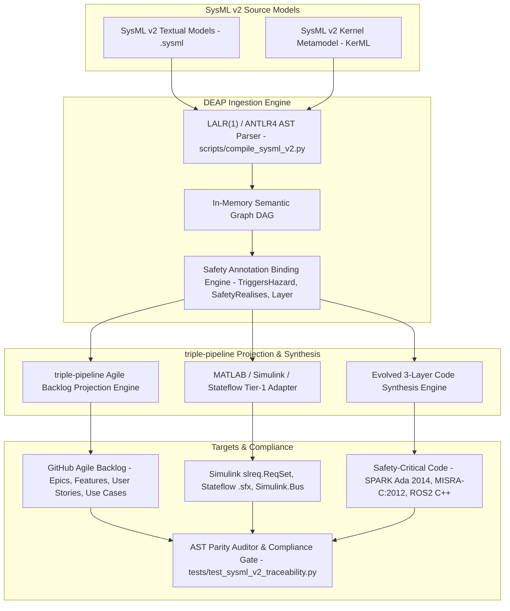
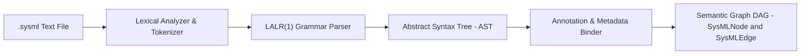
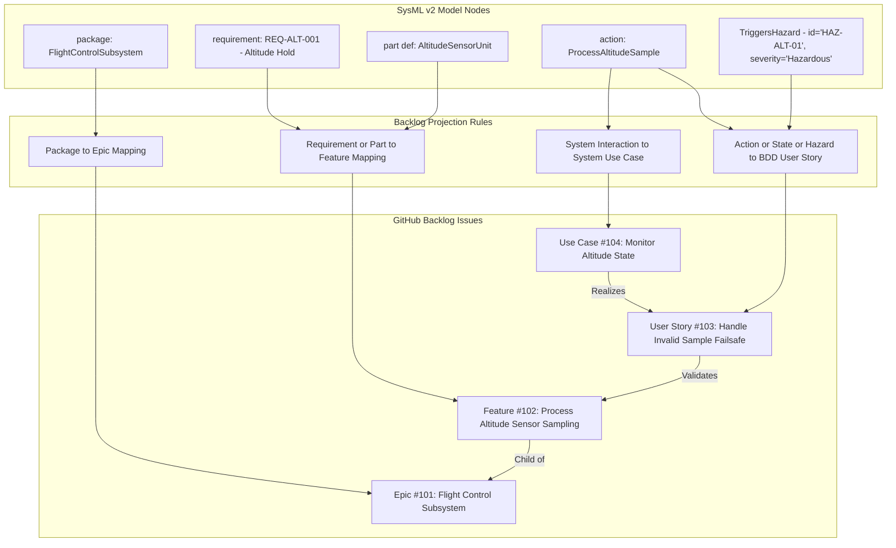
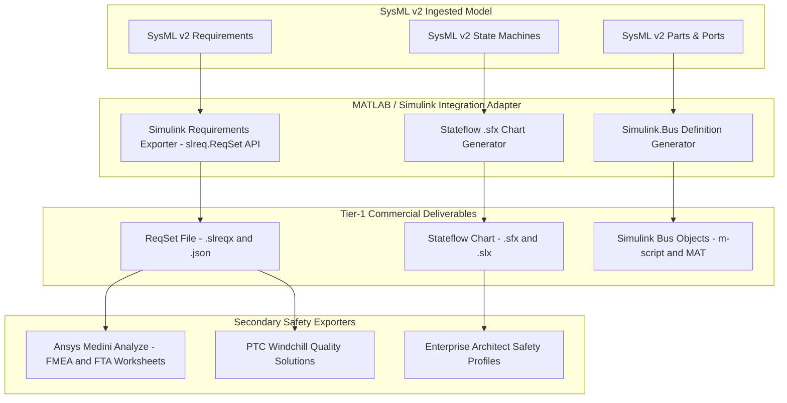
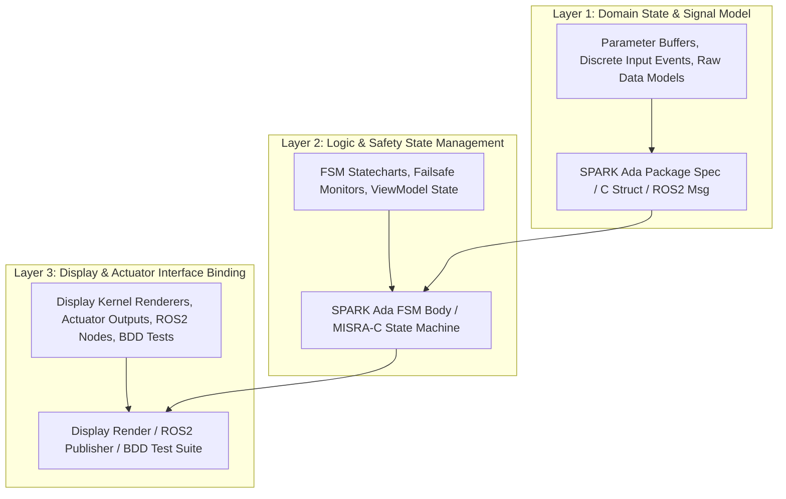
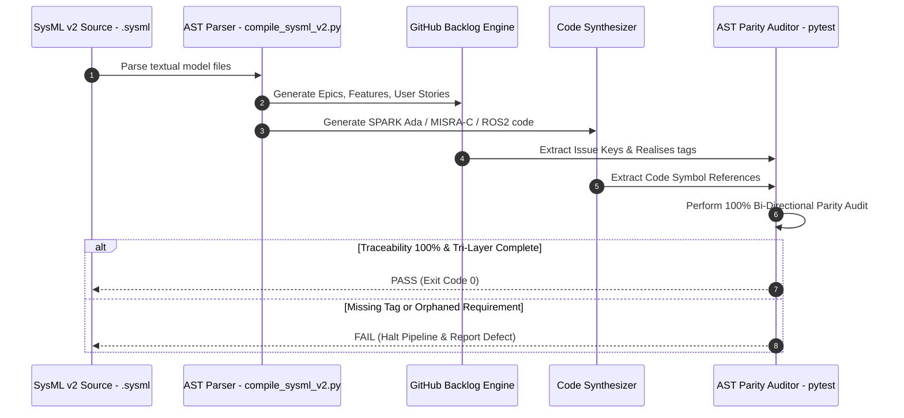
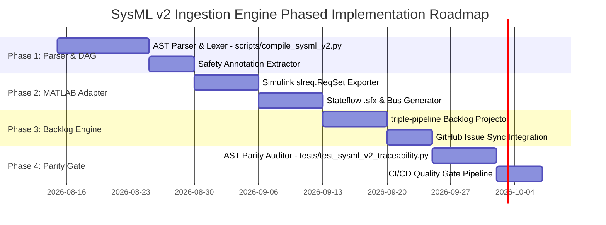

# SysML v2 Ingestion Engine Solution Blueprint (DEAP-BLUEPRINT-SYSML-003)

## 1. Executive Summary & Architectural Vision

The **Digital Engineering Agentic Pipeline (DEAP)** SysML v2 Ingestion Engine establishes an automated, production-grade Model-Based Systems Engineering (MBSE) ingestion pipeline. It bridges high-level OMG SysML v2 textual and graphical models with the DEAP triple-pipeline master-worker system.



### Key Vision & Objectives:
1. **Seamless MBSE Ingestion:** Parse raw OMG SysML v2 textual declarations (`package`, `part def`, `port`, `connection`, `action`, `state`, `attribute`, `requirement`) into a structured in-memory Semantic Graph Directed Acyclic Graph (DAG).
2. **Deterministic Backlog Projection:** Project SysML v2 packages and requirements into GitHub Agile backlog items (Epics, Features, BDD User Stories, and UML Use Cases) with 100% structural fidelity.
3. **Tier-1 Commercial Toolchain Integration:** Interoperability with MATLAB / Simulink / Stateflow / Embedded Coder (`slreq.ReqSet`, Stateflow `.sfx` charts, `Simulink.Bus` objects) as the primary commercial Model-Based Design (MBD) toolchain.
4. **Evolved 3-Layer Code Synthesis:** Synthesize high-integrity, certifiable target source code in **SPARK Ada 2014**, **MISRA-C:2012**, and **ROS2 C++** structured across Domain State/Signals (Layer 1), Logic & Safety State Management (Layer 2), and Display/Actuator Interfaces (Layer 3).
5. **Continuous Compliance Verification:** Enforce 100% bi-directional traceability and zero-orphan coverage via automated AST parity gates (`tests/test_sysml_v2_traceability.py`) under stringent aerospace and autonomous safety standards (**DO-178C**, **DO-254**, **ARP4754A/4761**, **JARUS SORA v2.5**, **ASTM F3269**).

---

## 2. SysML v2 AST Parser & Semantic Graph Synthesizer

The core ingestion entrypoint is implemented by `scripts/compile_sysml_v2.py`. The parser operates as an LALR(1) / ANTLR4 grammar parser tailored for OMG SysML v2 Textual Notation (OMG SysML v2 Kernel Metamodel / KerML).



### 2.1 Grammar & Primitive Extraction
The parser processes standard SysML v2 structural and behavioral primitives:
- `package`: Top-level namespace containers mapping to functional domains.
- `part def` / `part`: Structural components, subsystems, and physical/logical entities.
- `port`: Dynamic interface points and bus connectors with explicit directionality (`in`, `out`, `inout`).
- `connection`: Dataflow and physical bindings between ports.
- `action` / `action def`: Discrete operational behaviors, activities, and control flows.
- `state` / `state def`: FSM safety states, transition conditions, entry/exit actions.
- `attribute`: Typed data fields with value ranges, units, and multiplicity constraints.
- `requirement`: Formal system requirements with explicit text, IDs, and verification criteria.
- `enum def` / `item def`: Discrete enumeration types and structured data items.

### 2.2 Custom Safety Annotations
The synthesizer extracts custom DEAP safety annotations embedded within SysML v2 textual comments or metadata tags:

| Annotation Syntax | Parameters | Extraction & Semantic Linkage |
| :--- | :--- | :--- |
| `@TriggersHazard(id="HAZ-NNN", severity="SeverityLevel")` | `id`: Hazard ID string, `severity`: `Catastrophic`, `Hazardous`, `Major`, `Minor` | Binds element to ARP4761 / SORA hazard analysis matrix; forces creation of BDD negative scenario. |
| `@SafetyRealises(requirement="REQ-NNN")` | `requirement`: Requirement ID string | Establishes bi-directional traceability between structural/behavioral elements and upstream requirements. |
| `@Layer(tier="Layer1\|Layer2\|Layer3")` | `tier`: Target layer designation | Binds the element explicitly to Layer 1 (State/Signals), Layer 2 (Statecharts/FSM), or Layer 3 (Display/Actuators). |

### 2.3 Internal Data Structures
```python
# Conceptual AST Data Structures in scripts/compile_sysml_v2.py

from dataclasses import dataclass, field
from typing import List, Dict, Optional, Set

@dataclass
class AnnotationAttribute:
    name: str  # e.g., "TriggersHazard", "SafetyRealises", "Layer"
    params: Dict[str, str]

@dataclass
class SysMLNode:
    node_id: str
    kind: str  # "package", "part_def", "port", "action", "state", "requirement", "attribute"
    name: str
    qualified_name: str
    docstring: Optional[str] = None
    attributes: Dict[str, str] = field(default_factory=dict)
    annotations: List[AnnotationAttribute] = field(default_factory=list)
    source_ref: Optional[str] = None  # File and line range

@dataclass
class SysMLEdge:
    source_id: str
    target_id: str
    edge_type: str  # "contains", "connects_to", "transition", "realises", "triggers_hazard"
    metadata: Dict[str, str] = field(default_factory=dict)

class SemanticGraphDAG:
    def __init__(self):
        self.nodes: Dict[str, SysMLNode] = {}
        self.edges: List[SysMLEdge] = []
        self.package_hierarchy: Dict[str, List[str]] = {}

    def add_node(self, node: SysMLNode) -> None:
        self.nodes[node.node_id] = node

    def add_edge(self, edge: SysMLEdge) -> None:
        self.edges.append(edge)
```

---

## 3. triple-pipeline Agile Backlog Projection Engine

The triple-pipeline Agile Backlog Projection Engine deterministically maps the in-memory `SemanticGraphDAG` into GitHub Agile backlog artifacts managed via `reconcile_backlog.py`.



### 3.1 Projection Transformation Rules
1. **SysML `package` -> GitHub Epic:**
   - Title format: `[Module/Domain]: [Functional Area]` (e.g., `[FlightControl]: Altitude Hold & Autoland`).
   - Frontmatter tags: `type: epic`, `sysml_package: <qualified_name>`.
2. **SysML `requirement` & `part def` -> GitHub Feature:**
   - Title format: `[Verb] [Object] [Qualifier]` (e.g., `Sample Altitude Sensor Data Stream`).
   - Frontmatter tags: `type: feature`, `epic_ref: #<Epic_ID>`, `sysml_element: <qualified_name>`.
   - Acceptance Criteria: Derived from `attribute` constraints, `port` boundaries, and `@SafetyRealises` tags.
3. **SysML `action`, `state`, & `@TriggersHazard` -> BDD User Story:**
   - Title format: `As a [Actor/Subsystem], I want to [Action], so that [Outcome/Safety Constraint]`.
   - Canonical BDD Scenarios (Given-When-Then):
     - **Pattern A (ARINC 661 Cockpit Display Systems):** `Given [UA Parameter Buffer State], When [ARINC 661 Binary Command Received], Then [CDS Widget State & Display Kernel Render Updated]`.
     - **Pattern B (Real-Time Safety Statecharts / Flight Control):** `Given [Aircraft State Vector / Discrete Event], When [Safety FSM Transition Triggered], Then [Actuator Command / Symbology Graphic Rendered]`.
     - **Pattern C (Decoupled Operator Console):** `Given [Console Domain Model State], When [Operator Action Initiated], Then [ViewModel State & GUI Component Binding Updated]`.
4. **SysML `use case` & System Interaction -> UML System Use Case:**
   - Formal specification containing Primary Actors, Preconditions, Main Success Scenario, Alternate Flows, and a complete Realization Matrix linking Use Cases to User Stories and Features.

---

## 4. MATLAB / Simulink / Stateflow Tier-1 Integration Adapter

DEAP establishes **MATLAB / Simulink / Stateflow / Embedded Coder** as the Primary Tier-1 Commercial Toolchain Integration for Model-Based Design (MBD), control law synthesis, and DO-178C C/SPARK Ada code generation.



### 4.1 Simulink Requirements (`slreq.ReqSet`) Mapping
SysML v2 `requirement` blocks are exported directly into MATLAB Simulink Requirements sets using the `slreq` programmatic API:
- Requirement ID -> `slreq.ID`
- Requirement text -> `slreq.Text`
- Rationale -> `slreq.Rationale`
- Safety Attributes / DO-178C DAL -> `slreq.setAttribute("SafetyDAL", "DAL_A")`

### 4.2 Stateflow `.sfx` Chart Generation
SysML v2 `state def` machines translate directly into standalone Stateflow chart definitions (`.sfx`):
- `state` -> Stateflow State Object
- `transition` -> Stateflow Transition with Guard Condition `[guard]` and Action `{action;}`
- Entry/Exit Actions -> `entry:` / `exit:` statements inside Stateflow states.

### 4.3 `Simulink.Bus` & Signal Objects
SysML v2 `part def` and `port` structures generate MATLAB scripts constructing `Simulink.Bus` objects:
```matlab
% Generated Simulink.Bus Definition Script
elems(1) = Simulink.BusElement;
elems(1).Name = 'altitude_m';
elems(1).DataType = 'single';
elems(1).Min = 0.0;
elems(1).Max = 15000.0;

elems(2) = Simulink.BusElement;
elems(2).Name = 'sensor_status';
elems(2).DataType = 'Enum: SensorStatusType';

AltitudeBus = Simulink.Bus;
AltitudeBus.Elements = elems;
```

---

## 5. Evolved 3-Layer Code Synthesis Engine

The 3-Layer Code Synthesis Engine translates the SysML v2 Semantic Graph DAG into target source code, guaranteeing strict separation across domain states, safety statecharts, and display/actuator interfaces.



### 5.1 Layer Definitions & Target Languages

#### Layer 1: Domain State & Signal Model
- **SPARK Ada 2014:** Strong scalar types with explicit range constraints and record definitions.
  ```ada
  type Altitude_Meters is new Float range 0.0 .. 15000.0;
  type Sensor_Status_Type is (Valid, Invalid, Degraded, No_Signal);
  
  type Altitude_Buffer_Type is record
     Current_Altitude : Altitude_Meters;
     Status           : Sensor_Status_Type;
  end record;
  ```
- **MISRA-C:2012:** Fixed-width integer types (`int32_t`, `uint32_t`) and defensive typedef structs.
- **ROS2 C++:** Native IDL messages (`float32 current_altitude`, `uint8 status`).

#### Layer 2: Logic & Safety State Management
- **SPARK Ada 2014:** Formal verification contracts ensuring zero runtime errors (`Pre`, `Post`, `Global`, `Depends`).
  ```ada
  procedure Transition_Safety_State (
     Buffer : in     Altitude_Buffer_Type;
     State  : in out FSM_State_Type)
  with
     Pre  => Buffer.Current_Altitude >= 0.0,
     Post => (if Buffer.Status /= Valid then State = Failsafe_Fallback),
     Global => null;
  ```
- **MISRA-C:2012:** Defensive state machine with explicit switch/case logic, Rule 10.x compliance, and static variable scoping.
- **ROS2 C++:** Lifecycle state management with explicit transitions.

#### Layer 3: Display & Actuator Interface Binding
- **SPARK Ada / C:** ARINC 661 widget buffer driver rendering and actuator DAC bus updates.
- **ROS2 C++:** `rclcpp::Publisher` and subscriber hardware bindings.
- **BDD Integration Tests:** Automated test suites verifying that LUI components render and actuate correctly in response to Layer 1/2 state changes.

---

## 6. Continuous Compliance Verification & Parity Gate

Continuous compliance and structural parity are verified by `tests/test_sysml_v2_traceability.py`.



### 6.1 Parity Auditor Enforcement Rules
1. **100% Model Coverage:** Every requirement in the `.sysml` source file MUST map to at least one GitHub Feature issue.
2. **Zero Orphaned Requirements:** Every code file carrying a `/// Realises: [Feat-NNN/...]` tag must resolve to an active Feature issue key.
3. **Tri-Layer Definition of Done Gate:** Enforced by `tests/test_process_discipline_gates.py::test_every_specification_has_full_lui_chain`. Every Feature issue must have all three layers (Layer 1 State/Signal, Layer 2 Statechart/ViewModel, Layer 3 Display/Actuator) explicitly implemented or mapped to a named task.

---

## 7. Implementation Roadmap & Phased Execution Plan

The SysML v2 Ingestion Engine solution blueprint is executed across four distinct phases:



### Phase Details & Exit Criteria

| Phase | Core Deliverables | Key Artifacts | Exit Criteria & Verification Gate |
| :--- | :--- | :--- | :--- |
| **Phase 1: AST Parser & Semantic Graph** | SysML v2 LALR(1)/ANTLR4 parser, annotation binder | `scripts/compile_sysml_v2.py` | Parsed `.sysml` files output valid `SemanticGraphDAG` JSON without syntax or loss errors. |
| **Phase 2: MATLAB Tier-1 Adapter** | MBD exporter for Simulink & Stateflow | `slreq.ReqSet` exporter, `.sfx` chart generator, `Simulink.Bus` scripts | MATLAB CLI successfully loads exported `.slreqx` and runs `.sfx` Stateflow simulation without errors. |
| **Phase 3: Backlog Projection Engine** | Projection rules for Epics, Features, User Stories, Use Cases | Backlog projector script, `reconcile_backlog.py` updates | 100% of SysML requirements and packages projected into GitHub issues with valid frontmatter tags. |
| **Phase 4: Parity Gate & Compliance** | Traceability test suite, CI integration | `tests/test_sysml_v2_traceability.py`, GitHub Actions workflow | `python3 -m pytest tests/` passes 100% green; bi-directional audit verifies zero orphan code symbols or requirements. |

---
