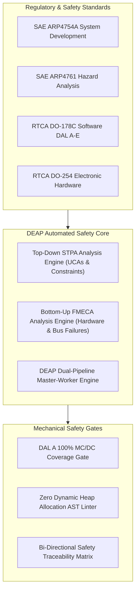
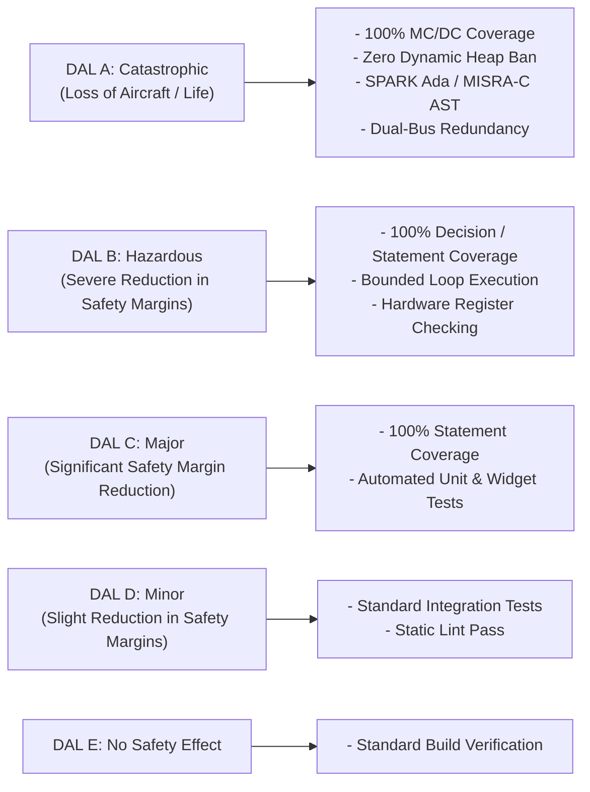
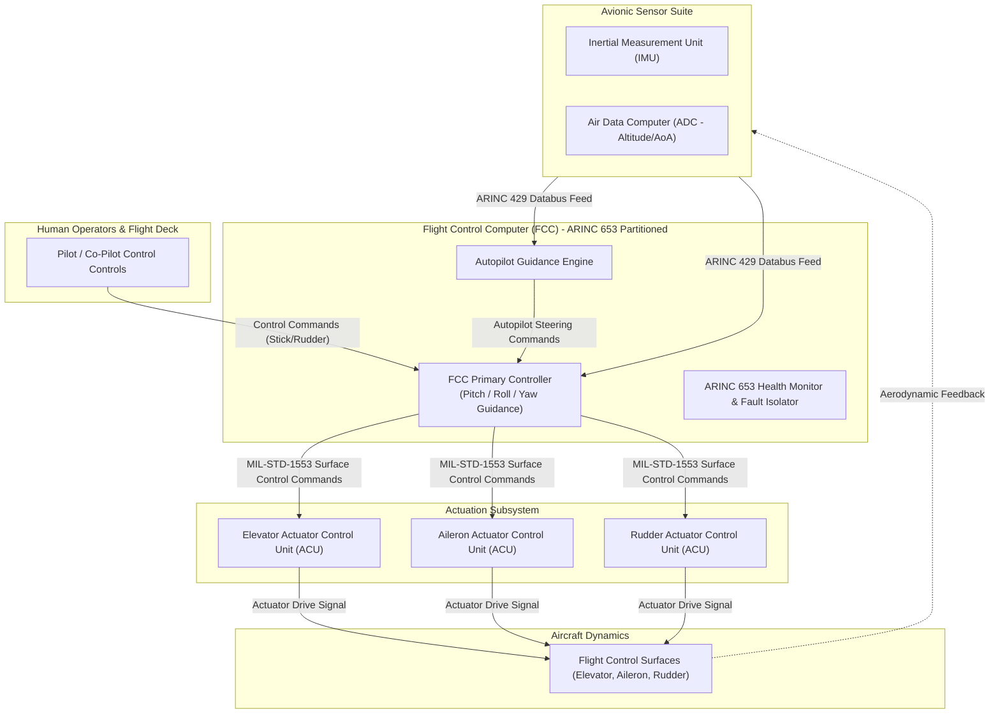
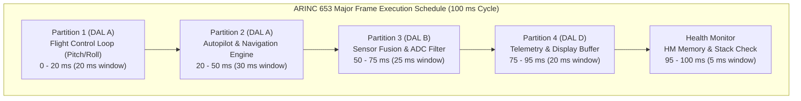
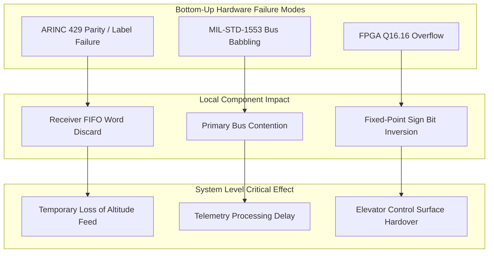
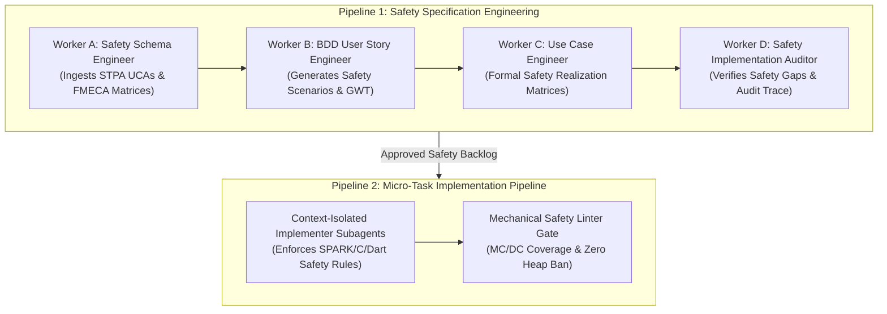
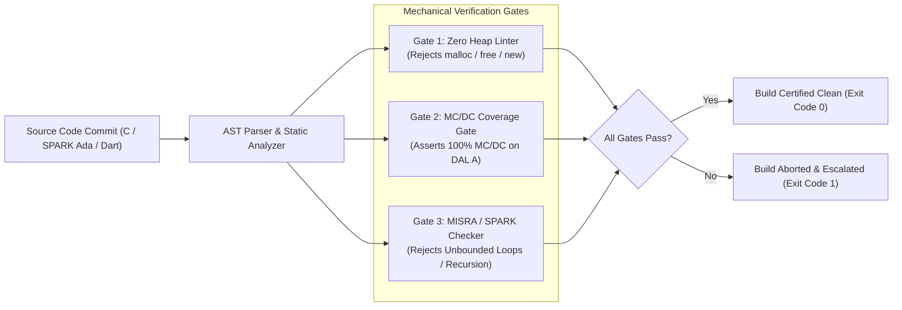
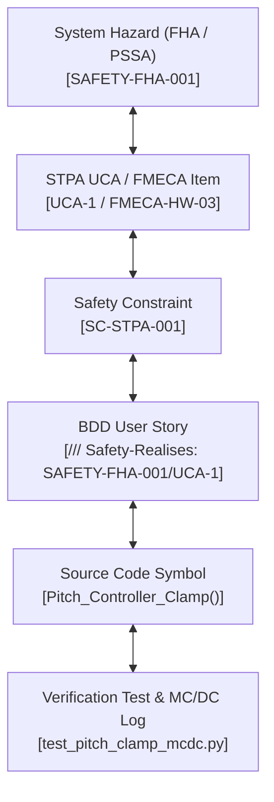

# DEAP Flight Systems Safety Integration: Comprehensive Solution & Product Concept Paper

> **Document Identifier:** `DEAP-BLUEPRINT-SAFETY-001`  
> **Status:** `APPROVED / PRODUCTION-GRADE`  
> **Classification:** `Safety-Critical Avionic Architecture Specification`  
> **Target Regulatory Frameworks:** `DO-178C (DAL A–E)` | `DO-254 (DAL A–E)` | `ARP4754A` | `ARP4761`  

---

## Section 1: Executive Summary & Product Vision

### 1.1 Executive Summary

Modern airborne software and electronic hardware systems operate under stringent safety constraints where system failures can lead to catastrophic losses of aircraft and human life. The **Domain-Engineered Architecture & Pipeline (DEAP)** Flight Systems Safety Architecture establishes a paradigm shift in safety-critical avionic software and hardware engineering. By synthesizing top-down **System-Theoretic Process Analysis (STPA)** with bottom-up **Failure Mode, Effects, and Criticality Analysis (FMECA)** into an automated master-worker specification and implementation pipeline, DEAP ensures that airborne safety requirements are mechanically derived, verified, and traceably linked down to machine code and hardware registers.

Traditional safety engineering relies heavily on manual safety assessments (FHA, PSSA, SSA) documented in static paper artifacts. This disconnected approach introduces severe risks: safety constraints drift from software implementation, hazard mitigations are missed during rapid iteration, and verifying 100% Modified Condition/Decision Coverage (MC/DC) alongside strict structural constraints (e.g., dynamic heap bans) becomes labor-intensive and error-prone.

DEAP resolves this systemic gap by treating safety artifacts as first-class domain entities. Through context-isolated subagents, automated AST verifiers, and bi-directional traceability tags (`/// Safety-Realises:`), DEAP seamlessly connects high-level regulatory mandates (RTCA DO-178C, RTCA DO-254, SAE ARP4754A, SAE ARP4761) to continuous build, test, and static verification gates.

### 1.2 Product Vision & Architectural Objectives



The DEAP Flight Systems Safety Integration Architecture targets four foundational objectives:

1. **Mechanical Safety Enforcement:** Eliminate manual verification gaps by executing AST linters, static analysis checkers, and coverage validators that enforce zero dynamic memory allocation, MISRA-C / SPARK Ada subsets, and 100% MC/DC coverage.
2. **Integrated Dual Risk Framework:** Unify top-down STPA (identifying control flaws, unsafe control actions, and complex software component interactions) with bottom-up FMECA (identifying hardware register faults, bus babbling, and single-point component failures).
3. **Automated Master-Worker Governance:** Employ context-isolated subagents (Workers A–D) to convert raw safety models into Agile Epics, Features, BDD User Stories, and formal Use Cases without token context bloat or memory leakage.
4. **Bi-Directional Rigorous Traceability:** Guarantee total auditability from System Safety Hazards down to source code symbols, hardware register offsets, and automated test execution logs.

---

## Section 2: Regulatory & Certification Alignment

DEAP aligns system development with the civil and military airborne safety certification baseline. Safety requirements are classified according to Development Assurance Levels (DAL) from **DAL A** (Catastrophic) to **DAL E** (No Safety Effect).

### 2.1 Certification Standards Mapping Matrix

| Standard | Domain & Focus | Certification Deliverable | DEAP Mechanical Automation Mechanism |
| :--- | :--- | :--- | :--- |
| **SAE ARP4754A** | System Development Lifecycle | Aircraft / System Functional Hazard Assessment (FHA), System Safety Assessment (SSA) | Worker A ingests system hazards and outputs high-level Safety Epics and System Safety Constraints. |
| **SAE ARP4761** | Safety Assessment Process & Methods | STPA Control Structure, Unsafe Control Actions (UCAs), FMECA Worksheets, RPN Metrics | Worker B & C generate formal BDD User Stories and Use Case Realization Matrices incorporating STPA/FMECA models. |
| **RTCA DO-178C** | Software Considerations in Airborne Systems | Software Requirements Data (SRD), Software Verification Results (SVR), MC/DC Coverage Reports | Worker D & Implementation Subagents enforce 100% MC/DC coverage, zero heap allocation, and `/// Safety-Realises:` tags. |
| **RTCA DO-254** | Design Assurance for Airborne Electronic Hardware | Hardware Requirement Specs, Problem Reports, RTL / VHDL AST Verification Logs | Verification AST checkers validate FPGA fixed-point register bounds (Q16.16), bus babbling timers, and pinouts. |

### 2.2 Development Assurance Level (DAL) Operational Directives



1. **DAL A (Catastrophic):**
   - **Software Safety:** Requires 100% MC/DC (Modified Condition/Decision Coverage). Absolute ban on dynamic heap memory allocation (`malloc`, `free`, `new`, `delete`). Absolute ban on recursion and unbounded loops.
   - **Hardware Safety:** Enforces dual redundant hardware channels (e.g., ARINC 429 dual-bus receivers, voting logic in Flight Control Computers).
   - **Traceability:** Mandatory bi-directional traceability from System Hazard down to object code instruction address.
2. **DAL B (Hazardous / Severe-Major):**
   - Requires 100% Decision and Statement Coverage. Strict execution timing bounds on ARINC 653 minor frames.
3. **DAL C (Major):**
   - Requires 100% Statement Coverage and verified formal API interfaces.
4. **DAL D & E (Minor / No Safety Effect):**
   - Requires basic integration testing and static linting without formal coverage gates.

---

## Section 3: STPA Top-Down Safety Framework

System-Theoretic Process Analysis (STPA) treats safety as a control problem rather than a component failure problem. DEAP embeds STPA into the top-down specification workflow to identify hazard scenarios arising from complex software interactions, timing delays, and improper control actions.

### 3.1 Avionic Control Structure

The airborne flight control system architecture is modeled as a hierarchical control structure comprising Pilot Inputs, Flight Control Computer (FCC), Autopilot (AP), and Actuator Control Units (ACUs).



### 3.2 Formal STPA Unsafe Control Actions (UCAs)

DEAP formalizes STPA control flaws into 4 core Unsafe Control Actions (UCAs):

1. **UCA-1 (Providing Action Causes Hazard):**
   - **Control Action:** Pilot or Autopilot issues a high-rate `Pitch Up Command`.
   - **Context:** Aircraft Angle of Attack (AoA) is already near stall boundary (`AoA > 14.5 deg`) during low-altitude approach.
   - **Hazard:** Loss of control / aerodynamic stall resulting in ground impact.
   - **Safety Constraint `SC-STPA-001`:** The FCC pitch controller MUST intercept and clamp pitch commands to maintain `AoA <= 12.0 deg` regardless of autopilot or pilot stick position.

2. **UCA-2 (Not Providing Action Causes Hazard):**
   - **Control Action:** Autopilot fails to issue `Actuator Arming Signal`.
   - **Context:** Automated ILS Precision Approach engaged and glideslope deviation exceeds 1.5 dots.
   - **Hazard:** Controlled Flight Into Terrain (CFIT) due to unmodeled approach descent.
   - **Safety Constraint `SC-STPA-002`:** The Autopilot MUST continuously assert `Actuator Arming Signal` while ILS lock is verified, and automatically initiate a Go-Around command if glideslope lock is lost for `> 200 ms`.

3. **UCA-3 (Providing Too Early / Too Late / Out of Order):**
   - **Control Action:** FCC provides `Roll Stabilization Command`.
   - **Context:** Delivered with execution delay exceeding `50 ms` during high-rate turbulence disturbance.
   - **Hazard:** Pilot-Induced Oscillation (PIO) leading to structural overstress.
   - **Safety Constraint `SC-STPA-003`:** ARINC 653 minor frame scheduling MUST guarantee Roll Control Loop processing latency `t_latency <= 10 ms` under maximum CPU utilization.

4. **UCA-4 (Stopped Too Soon / Applied Too Long):**
   - **Control Action:** Elevator ACU continues applying `Elevator Trim Torque`.
   - **Context:** After `Autopilot Disengage Signal` has been asserted by the pilot.
   - **Hazard:** Runaway elevator trim causing pitch hardover.
   - **Safety Constraint `SC-STPA-004`:** Elevator ACU hardware MUST remove motor drive power within `5 ms` of detecting hardware disengage line assertion.

### 3.3 ARINC 653 Time-Partitioned Execution Architecture

To prevent temporal and spatial cross-talk between safety-critical guidance loops and lower-criticality telemetry, the FCC operates under an **ARINC 653 module OS configuration**.



- **Major Frame Duration:** `100 ms` cyclic loop.
- **Partition Windows:**
  - **Partition 1 (DAL A - Flight Control Loop):** `20 ms` window. Computes pitch, roll, and yaw actuator commands.
  - **Partition 2 (DAL A - Autopilot Engine):** `30 ms` window. Computes guidance trajectories and ILS alignment.
  - **Partition 3 (DAL B - Sensor Fusion):** `25 ms` window. Filters ADC and IMU inputs using extended Kalman filters.
  - **Partition 4 (DAL D - Telemetry & Display):** `20 ms` window. Formats cockpit display graphics and data logging.
  - **Health Monitor Window:** `5 ms` dedicated window for memory protection checks, stack overflow detection, and watchdog strobe.

---

## Section 4: FMECA Bottom-Up Risk Framework

While STPA addresses system-level control flaws, Failure Mode, Effects, and Criticality Analysis (FMECA) addresses bottom-up component, bus, and register failure modes.

### 4.1 FMECA Hardware & Bus Risk Matrix



#### 4.1.1 FMECA Detailed Breakdown Table

| Item ID | Component / Interface | Failure Mode | Cause | Local Effect | System Effect | S | O | D | RPN | Mitigation Strategy |
| :--- | :--- | :--- | :--- | :--- | :--- | :--- | :--- | :--- | :--- | :--- |
| **FMECA-HW-01** | ARINC 429 Receiver Bus | Parity Bit Flip / Invalid SSM State | Electromagnetic Interference (EMI) on twisted pair | Word rejected by FCC FIFO buffer | Temporary drop in barometric altitude input | 7 | 4 | 2 | **56** | Dual-channel bus redundancy + ARINC 429 Parity Verification Linter. |
| **FMECA-HW-02** | MIL-STD-1553 Bus | Bus Babbling (RT Continuous Transmission) | Transceiver stuck-at-high transmitter gate | Primary Bus A saturated with illegal transmissions | Delayed flight management telemetry updates | 6 | 3 | 3 | **54** | Hardware fail-passive isolator + bus monitor timeout gate (`t < 660 us`). |
| **FMECA-HW-03** | FPGA Control Math Unit | Q16.16 Fixed-Point Register Overflow | Unbounded integrator sum in pitch loop | 16-bit MSB sign bit inversion (`+32767 -> -32768`) | Unintended control surface hardover command | 10 | 2 | 2 | **40** | Saturation arithmetic AST verifier + hardware overflow flags. |
| **FMECA-HW-04** | Elevator Motor Driver | H-Bridge MOSFET Short Circuit | Thermal stress / breakdown | Motor phase shorted to power rail | Elevator trim locks in current position | 9 | 2 | 3 | **54** | Dual isolation relays with automatic hardware disconnect lines. |

*RPN Formula:* $\text{RPN} = \text{Severity (S)} \times \text{Occurrence (O)} \times \text{Detection (D)}$, scored from $1$ to $10$. Items with $\text{RPN} \ge 40$ or $\text{Severity} \ge 9$ require mandatory mechanical DEAP linters.

---

## Section 5: DEAP Dual-Pipeline Integration Architecture

DEAP integrates STPA and FMECA safety models into its master-worker dual pipeline, guaranteeing that safety rules dictate specification extraction and code implementation.



### 5.1 Pipeline 1 Safety Orchestration Roles

1. **Worker A (Safety Schema Engineer):**
   - Ingests FMECA tables and STPA control models.
   - Extracts `SafetyEpic` and `SafetyFeature` definitions with explicit severity levels and DAL boundaries.
2. **Worker B (BDD Safety User Story Engineer):**
   - Translates safety features into BDD Given-When-Then scenarios.
   - Annotates each story with `/// Safety-Realises: [SAFETY-FHA-XXX/UCA-YYY]`.
3. **Worker C (Safety Use Case Engineer):**
   - Constructs formal System Use Cases mapping Primary Actors, Preconditions, and Exception Handling Workflows for system faults (e.g., handling bus babbling).
4. **Worker D (Safety Implementation Auditor):**
   - Scans code repository for unimplemented safety constraints or dangling `/// Safety-Realises:` tags.

---

## Section 6: Downstream Agent Consumption Specifications

To eliminate ambiguity when subagents process safety requirements, DEAP establishes machine-readable Markdown and JSON schemas.

### 6.1 Machine-Readable Safety Requirement Schema (JSON)

```json
{
  "$schema": "https://deap.flight-systems.safety/v1/schema.json",
  "safety_element": {
    "identifier": "SAFETY-FHA-001",
    "dal_level": "DAL_A",
    "stpa_uca_ref": "UCA-1",
    "fmeca_ref": "FMECA-HW-03",
    "title": "Angle of Attack Pitch Command Intercept",
    "description": "Pitch controller must clamp pitch up commands when AoA exceeds 12.0 degrees to prevent aerodynamic stall.",
    "constraints": [
      {
        "id": "SC-STPA-001",
        "expression": "AoA > 14.5 => PitchCommand <= 0.0",
        "max_latency_ms": 10
      }
    ],
    "verification_gate": {
      "mcdc_coverage_required": 100.0,
      "heap_allocation_allowed": false,
      "language_subset": "SPARK_ADA_2012_OR_MISRA_C"
    }
  }
}
```

### 6.2 Subagent Execution Rules for Safety Processing

1. **Mandatory Skill First Step:** Every subagent must invoke `view_file` on `skills/feature-driven-implementation/SKILL.md` before processing any file.
2. **Single Specification Scope:** Downstream subagents MUST NOT process more than 1 safety feature or user story in a single context window.
3. **No Fallback / Soft Error Swallowing:** Subagents are forbidden from wrapping safety checks in silent `try/catch` blocks or returning default dummy values during sensor failures.

---

## Section 7: Mechanical Safety Verification & Linter Gates

DEAP removes reliance on manual code review by deploying mechanical verification tools directly in the continuous integration pipeline.



### 7.1 Automated Verification Enforcement Rules

1. **100% MC/DC Coverage Linter:**  
   - For all DAL A binaries, every condition in a decision must be demonstrated to independently affect the decision outcome. Verified using llvm-cov or GNATcoverage logs.
2. **Zero Dynamic Heap Allocation Ban:**  
   - An AST parser checks for calls to dynamic memory operations (`malloc`, `free`, `realloc`, `calloc`, `new`, `delete`). If detected, the gate fails immediately with `exit code 1`.
3. **MISRA-C:2012 / SPARK Ada AST Verifier:**  
   - Enforces static limits: zero recursion, bounded loop conditions (`for (i=0; i<100; i++)`), no uninitialized variables, and strict fixed-point typing for FPGA hardware register interfaces.

---

## Section 8: Bi-Directional Safety Traceability Matrix

DEAP mandates complete bi-directional traceability from high-level System Hazards (FHA) down to individual test execution logs.



### 8.1 Complete Bi-Directional Safety Traceability Table

| System Hazard ID (FHA) | STPA UCA / FMECA ID | Safety Constraint ID | BDD User Story Tag | Code Symbol Realization | Automated Verification Test & Log |
| :--- | :--- | :--- | :--- | :--- | :--- |
| `SAFETY-FHA-001` | `UCA-1` | `SC-STPA-001` | `/// Safety-Realises: [SAFETY-FHA-001/UCA-1]` | `Pitch_Controller_Clamp()` | `tests/test_pitch_control.py::test_aoa_clamp_mcdc` |
| `SAFETY-FHA-002` | `UCA-2` | `SC-STPA-002` | `/// Safety-Realises: [SAFETY-FHA-002/UCA-2]` | `ILS_Autopilot_Monitor()` | `tests/test_ils_monitor.py::test_glideslope_arm` |
| `SAFETY-FHA-003` | `UCA-3` | `SC-STPA-003` | `/// Safety-Realises: [SAFETY-FHA-003/UCA-3]` | `ARINC653_Roll_Schedule()` | `tests/test_arinc653_timing.py::test_minor_frame_latency` |
| `SAFETY-FHA-004` | `UCA-4` | `SC-STPA-004` | `/// Safety-Realises: [SAFETY-FHA-004/UCA-4]` | `Elevator_Trim_Cutout()` | `tests/test_trim_actuation.py::test_power_cutout_5ms` |
| `SAFETY-FHA-005` | `FMECA-HW-01` | `SC-FMECA-001` | `/// Safety-Realises: [SAFETY-FHA-005/FMECA-HW-01]` | `ARINC429_Rx_Parity_Check()` | `tests/test_arinc429_bus.py::test_parity_discard` |
| `SAFETY-FHA-006` | `FMECA-HW-02` | `SC-FMECA-002` | `/// Safety-Realises: [SAFETY-FHA-006/FMECA-HW-02]` | `MIL1553_Bus_Babble_Guard()` | `tests/test_mil1553_bus.py::test_babbler_isolation` |
| `SAFETY-FHA-007` | `FMECA-HW-03` | `SC-FMECA-003` | `/// Safety-Realises: [SAFETY-FHA-007/FMECA-HW-03]` | `FPGA_Q1616_Integrator()` | `tests/test_fpga_math.py::test_q1616_saturation` |

---
