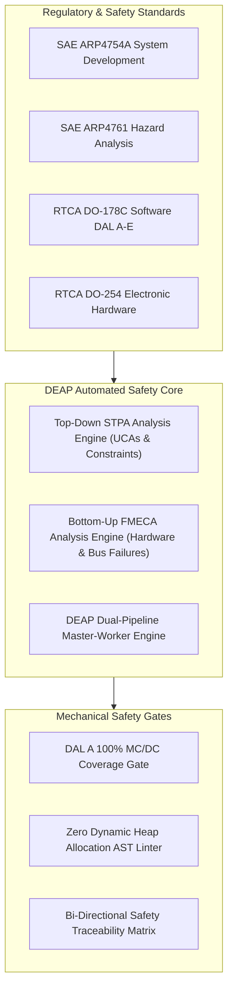
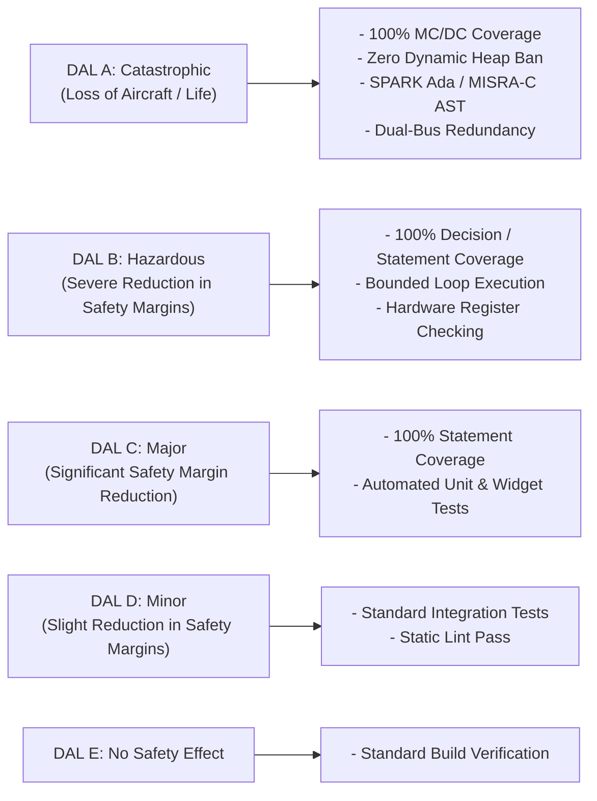
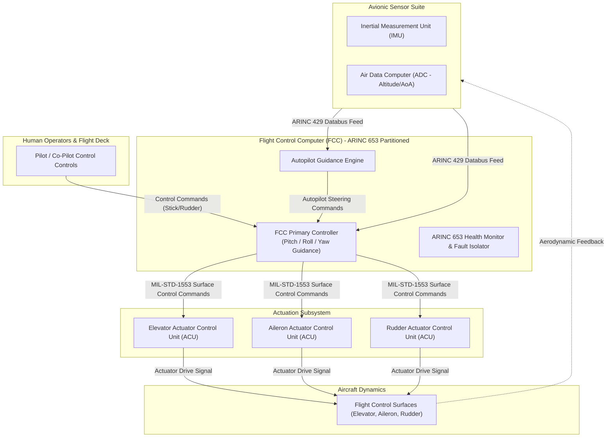
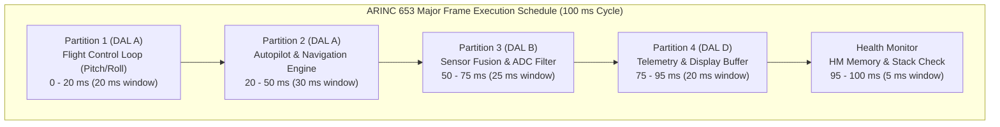
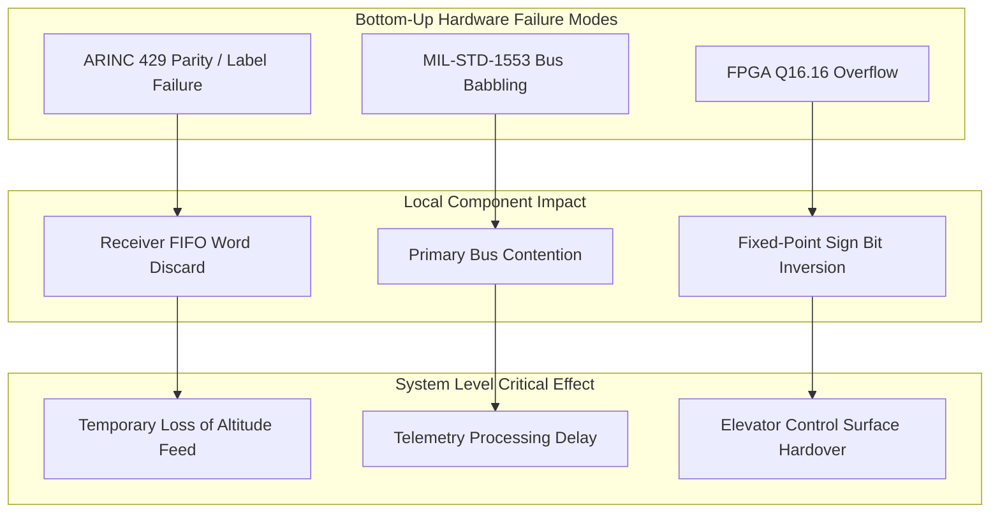
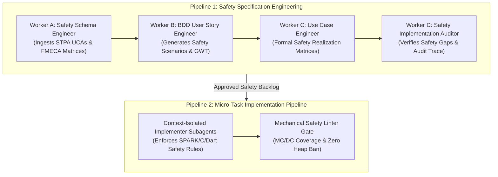
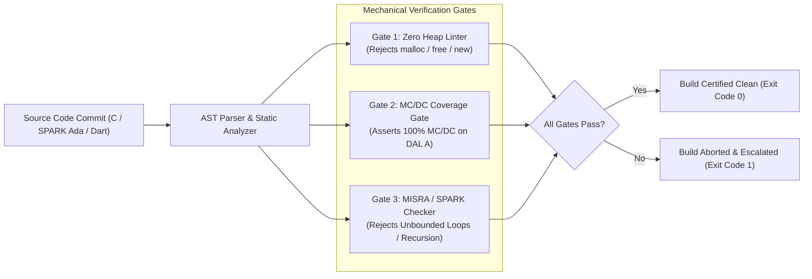
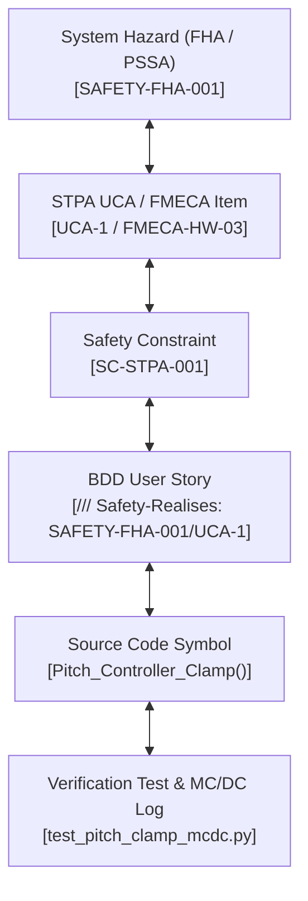

# DEAP Flight Systems Safety Integration: Comprehensive Solution & Product Concept Paper

> **Document Identifier:** `DEAP-BLUEPRINT-SAFETY-001`  
> **Status:** `APPROVED / PRODUCTION-GRADE`  
> **Classification:** `Safety-Critical Avionic Architecture Specification`  
> **Target Regulatory Frameworks:** `DO-178C (DAL A–E)` | `DO-254 (DAL A–E)` | `ARP4754A` | `ARP4761`  

---

## Section 1: Executive Summary & Product Vision

### 1.1 Executive Summary

Modern airborne software and electronic hardware systems operate under stringent safety constraints where system failures can lead to catastrophic losses of aircraft and human life. The **Digital Engineering Agentic Pipeline (DEAP)** Flight Systems Safety Architecture establishes a paradigm shift in safety-critical avionic software and hardware engineering. By synthesizing top-down **System-Theoretic Process Analysis (STPA)** with bottom-up **Failure Mode, Effects, and Criticality Analysis (FMECA)** into an automated master-worker specification and implementation pipeline, DEAP ensures that airborne safety requirements are mechanically derived, verified, and traceably linked down to machine code and hardware registers.

Traditional safety engineering relies heavily on manual safety assessments (FHA, PSSA, SSA) documented in static paper artifacts. This disconnected approach introduces severe risks: safety constraints drift from software implementation, hazard mitigations are missed during rapid iteration, and verifying 100% Modified Condition/Decision Coverage (MC/DC) alongside strict structural constraints (e.g., dynamic heap bans) becomes labor-intensive and error-prone.

DEAP resolves this systemic gap by treating safety artifacts as first-class domain entities. Through context-isolated subagents, automated AST verifiers, and bi-directional traceability tags (`/// Safety-Realises:`), DEAP seamlessly connects high-level regulatory mandates (RTCA DO-178C, RTCA DO-254, SAE ARP4754A, SAE ARP4761) to continuous build, test, and static verification gates.

### 1.2 Product Vision & Architectural Objectives



The DEAP Flight Systems Safety Integration Architecture targets four foundational objectives:

1. **Mechanical Safety Enforcement:** Eliminate manual verification gaps by executing AST linters, static analysis checkers, and coverage validators that enforce zero dynamic memory allocation, MISRA-C / SPARK Ada subsets, and 100% MC/DC coverage.
2. **Integrated Dual Risk Framework:** Unify top-down STPA (identifying control flaws, unsafe control actions, and complex software component interactions) with bottom-up FMECA (identifying hardware register faults, bus babbling, and single-point component failures).
3. **Automated Master-Worker Governance:** Employ context-isolated subagents (Workers A–D) to convert raw safety models into Agile Epics, Features, BDD User Stories, and formal Use Cases without token context bloat or memory leakage.
4. **Bi-Directional Rigorous Traceability:** Guarantee total auditability from System Safety Hazards down to source code symbols, hardware register offsets, and automated test execution logs.

---

## Section 2: Regulatory & Certification Alignment

DEAP aligns system development with the civil and military airborne safety certification baseline. Safety requirements are classified according to Development Assurance Levels (DAL) from **DAL A** (Catastrophic) to **DAL E** (No Safety Effect).

### 2.1 Certification Standards Mapping Matrix

| Standard | Domain & Focus | Certification Deliverable | DEAP Mechanical Automation Mechanism |
| :--- | :--- | :--- | :--- |
| **SAE ARP4754A** | System Development Lifecycle | Aircraft / System Functional Hazard Assessment (FHA), System Safety Assessment (SSA) | Worker A ingests system hazards and outputs high-level Safety Epics and System Safety Constraints. |
| **SAE ARP4761** | Safety Assessment Process & Methods | STPA Control Structure, Unsafe Control Actions (UCAs), FMECA Worksheets, RPN Metrics | Worker B & C generate formal BDD User Stories and Use Case Realization Matrices incorporating STPA/FMECA models. |
| **RTCA DO-178C** | Software Considerations in Airborne Systems | Software Requirements Data (SRD), Software Verification Results (SVR), MC/DC Coverage Reports | Worker D & Implementation Subagents enforce 100% MC/DC coverage, zero heap allocation, and `/// Safety-Realises:` tags. |
| **RTCA DO-254** | Design Assurance for Airborne Electronic Hardware | Hardware Requirement Specs, Problem Reports, RTL / VHDL AST Verification Logs | Verification AST checkers validate FPGA fixed-point register bounds (Q16.16), bus babbling timers, and pinouts. |

### 2.2 Development Assurance Level (DAL) Operational Directives



1. **DAL A (Catastrophic):**
   - **Software Safety:** Requires 100% MC/DC (Modified Condition/Decision Coverage). Absolute ban on dynamic heap memory allocation (`malloc`, `free`, `new`, `delete`). Absolute ban on recursion and unbounded loops.
   - **Hardware Safety:** Enforces dual redundant hardware channels (e.g., ARINC 429 dual-bus receivers, voting logic in Flight Control Computers).
   - **Traceability:** Mandatory bi-directional traceability from System Hazard down to object code instruction address.
2. **DAL B (Hazardous / Severe-Major):**
   - Requires 100% Decision and Statement Coverage. Strict execution timing bounds on ARINC 653 minor frames.
3. **DAL C (Major):**
   - Requires 100% Statement Coverage and verified formal API interfaces.
4. **DAL D & E (Minor / No Safety Effect):**
   - Requires basic integration testing and static linting without formal coverage gates.

---

## Section 3: STPA Top-Down Safety Framework

System-Theoretic Process Analysis (STPA) treats safety as a control problem rather than a component failure problem. DEAP embeds STPA into the top-down specification workflow to identify hazard scenarios arising from complex software interactions, timing delays, and improper control actions.

### 3.1 Avionic Control Structure

The airborne flight control system architecture is modeled as a hierarchical control structure comprising Pilot Inputs, Flight Control Computer (FCC), Autopilot (AP), and Actuator Control Units (ACUs).



### 3.2 Formal STPA Unsafe Control Actions (UCAs)

System-Theoretic Process Analysis (STPA), as formulated by Leveson (2018), NASA/TM-2013-217985, and NASA/CR-2020-220454, treats safety as a dynamic control problem rather than a component failure problem. In airborne safety-critical systems governed by SAE ARP4754A, SAE ARP4761, RTCA DO-178C, and RTCA DO-254, software and hardware interactions can lead to catastrophic losses even when all individual components function as designed. DEAP formalizes STPA top-down hazard analysis into mathematically rigorous, state-space-bounded Unsafe Control Actions (UCAs) mapped to civil avionic airworthiness standards (FAA AC 25.1309-1A, EASA CS-25.1309).

#### 3.2.1 Mathematical & State-Space Formulation of STPA UCAs

Per Leveson (2018), NASA/TM-2013-217985, and NASA/CR-2020-220454, an Unsafe Control Action (UCA) is formally defined as a 4-tuple:

$$\text{UCA} = \langle C, CA, \text{Type}, C_{\text{context}} \rangle$$

where:
- **$C \in \mathcal{C}$** is the issuing control entity (e.g., Flight Control Computer, Autopilot Mode Logic, Auto-Throttle Manager, Rudder Yaw Damper, or ARINC 653 Partition Switcher).
- **$CA \in \mathcal{U}$** is the discrete or continuous control action signal emitted by $C$ into the physical plant or downstream controllers.
- **$\text{Type} \in \mathcal{T}$** is the STPA control flaw category, where $\mathcal{T} = \{\text{Not Provided}, \text{Provided Unsafely}, \text{Provided Too Early/Late}, \text{Stopped Too Soon / Applied Too Long}\}$.
- **$C_{\text{context}} \subseteq \mathcal{X}$** is the set of operational environment and physical aircraft dynamic states under which issuing (or failing to issue) $CA$ causes a transition into a hazardous state space region.

##### Aircraft State-Space Vector $\mathbf{x}(t)$
The continuous aircraft dynamic state space $\mathcal{X} \subset \mathbb{R}^n$ is modeled by the state vector $\mathbf{x}(t)$:

$$\mathbf{x}(t) = \begin{bmatrix} h(t) \\ V_{\text{CAS}}(t) \\ \alpha(t) \\ \theta(t) \\ \phi(t) \\ r(t) \\ T_{\text{eng}}(t) \\ WoW(t) \\ S_{\text{phase}}(t) \end{bmatrix} \in \mathcal{X}$$

where:
- $h(t) \in \mathbb{R}$: Pressure / Radio Altitude (ft AGL or MSL).
- $V_{\text{CAS}}(t) \in \mathbb{R}^+$: Calibrated Airspeed (knots).
- $\alpha(t) \in \mathbb{R}$: Angle of Attack (degrees).
- $\theta(t), \phi(t) \in [-\pi, \pi]$: Aircraft Pitch and Roll attitude angles (degrees).
- $r(t) \in \mathbb{R}$: Yaw Rate (degrees/second).
- $T_{\text{eng}}(t) \in [0, 100\%]$: Engine Thrust Level / N1 Percentage.
- $WoW(t) \in \{\text{True}, \text{False}\}$: Weight-on-Wheels discrete sensor state.
- $S_{\text{phase}}(t) \in \{\text{TAKEOFF}, \text{CLIMB}, \text{CRUISE}, \text{DESCENT}, \text{APPROACH}, \text{FLARE}, \text{TOUCHDOWN}, \text{TAXI}\}$: Discrete Flight Phase state.

##### State Evolution & Unsafe Trajectory
The time evolution of the dynamic physical plant is governed by nonlinear differential state equations:

$$\dot{\mathbf{x}}(t) = f\big(\mathbf{x}(t), \mathbf{u}(t), \mathbf{d}(t)\big)$$

where $\mathbf{u}(t) = g(CA, t)$ is the physical control surface or actuator input generated by control action $CA$, and $\mathbf{d}(t)$ represents atmospheric wind gusts, turbulence, and external environmental disturbances.

A Control Action $CA$ emitted by controller $C$ at time $t_0$ is defined as an **Unsafe Control Action** if the resulting system state trajectory $\mathbf{x}(t)$ enters an unsafe state region $\mathcal{H}_{\text{unsafe}} \subset \mathcal{X}$ for any $t \ge t_0$:

$$\text{UCA} \iff \exists t \ge t_0 : \mathbf{x}(t) \in \mathcal{H}_{\text{unsafe}} \quad \text{given } \mathbf{x}(t_0) \in C_{\text{context}}$$

where $\mathcal{H}_{\text{unsafe}}$ corresponds to one or more civil system hazards $H_1$ through $H_6$ specified under FAA AC 25.1309-1A and EASA CS-25.1309.

#### 3.2.2 Exhaustive 16-Row Avionic Control Action Risk Matrix

The 16-row STPA matrix below systematically synthesizes all 4 UCA categories ($\mathcal{T}$) across the 5 primary avionic control subsystems: Flight Control Computer (Pitch/Roll), Autopilot Mode Logic, Auto-Throttle / Engine Thrust Reversers, Rudder Yaw Damper, and ARINC 653 Partition Switcher. Each UCA is classified by environmental context vector $C_{\text{context}}$, triggered hazard (FAA AC 25.1309-1A / EASA CS-25.1309), severity classification (ARP4761 / ARP4754A), and software development assurance level (RTCA DO-178C / DO-254).

| UCA ID | Controller ($C$) | Control Action ($CA$) | STPA UCA Category ($\text{Type}$) | Environmental Context Vector ($C_{\text{context}}$) | Triggered System Hazard | Severity Classification | DO-178C DAL Level |
| :--- | :--- | :--- | :--- | :--- | :--- | :--- | :--- |
| **UCA-01** | Flight Control Computer (FCC) | Pitch Nose-Up Recovery Command | **1. Not Provided** | $h < 500\text{ ft AGL}$, $V_{\text{CAS}} < V_{\text{ref}}$, $\alpha > 12.0^{\circ}$, $WoW = \text{False}$, $S_{\text{phase}} = \text{APPROACH}$ | **H_1:** Controlled Flight Into Terrain (CFIT) | Catastrophic | **DAL A** |
| **UCA-02** | Flight Control Computer (FCC) | Pitch High-Rate Elevator Command | **2. Provided Unsafely** | $\alpha > 14.5^{\circ}$, $V_{\text{CAS}} < V_{\text{stall}} + 5\text{ kts}$, $\theta > 18.0^{\circ}$, $WoW = \text{False}$, $S_{\text{phase}} \in \{\text{CLIMB}, \text{APPROACH}\}$ | **H_2:** Loss of Control in Flight (LOC-I) | Catastrophic | **DAL A** |
| **UCA-03** | Flight Control Computer (FCC) | Roll Stabilization Aileron Command | **3. Provided Too Late** | Command processing latency $t_{\text{latency}} > 50\text{ ms}$, severe turbulence gust $\mathbf{d}(t)$, $S_{\text{phase}} = \text{CRUISE}$ | **H_5:** Airframe Structural Overstress | Hazardous | **DAL B** |
| **UCA-04** | Flight Control Computer (FCC) | Elevator Auto-Trim Torque Drive | **4. Applied Too Long** | Continuous trim drive applied for $t > 2.0\text{ s}$ after manual pilot override / AP disconnect signal | **H_2:** Loss of Control in Flight (LOC-I) | Catastrophic | **DAL A** |
| **UCA-05** | Autopilot Mode Logic | Auto-Go-Around (GA) Mode Engage | **1. Not Provided** | ILS glideslope deviation $> 1.5\text{ dots}$ below decision height $h < 200\text{ ft AGL}$, $S_{\text{phase}} = \text{APPROACH}$ | **H_1:** Controlled Flight Into Terrain (CFIT) | Catastrophic | **DAL A** |
| **UCA-06** | Autopilot Mode Logic | Autopilot Pitch Down Trim Command | **2. Provided Unsafely** | Radio altimeter sensor fault / lock loss at low altitude $h < 400\text{ ft AGL}$, $S_{\text{phase}} = \text{APPROACH}$ | **H_1:** Controlled Flight Into Terrain (CFIT) | Catastrophic | **DAL A** |
| **UCA-07** | Autopilot Mode Logic | VNAV Descent Mode Transition | **3. Provided Too Early** | Executed $15\text{ s}$ prior to ATC altitude clearance boundary, $h = 24,000\text{ ft MSL}$, $S_{\text{phase}} = \text{CRUISE}$ | **H_3:** Mid-Air Collision (MAC) | Hazardous | **DAL B** |
| **UCA-08** | Autopilot Mode Logic | Nose-Up Pitch Hold Command | **4. Applied Too Long** | Pitch command maintained for $t > 5.0\text{ s}$ after Go-Around mode disengagement, $V_{\text{CAS}} < V_{\text{min}}$ | **H_2:** Loss of Control in Flight (LOC-I) | Catastrophic | **DAL A** |
| **UCA-09** | Auto-Throttle System | Engine Thrust Increase Command | **1. Not Provided** | Airspeed decay $V_{\mathrm{CAS}} < V_{\mathrm{stall-warning}}$ ($V_{\text{CAS}} < 1.1 V_{\text{stall}}$), $h > 500\text{ ft AGL}$, $S_{\text{phase}} = \text{APPROACH}$ | **H_2:** Loss of Control in Flight (LOC-I) | Catastrophic | **DAL A** |
| **UCA-10** | Auto-Throttle / Reverser | Engine Thrust Reverser Deploy Command | **2. Provided Unsafely** | In-flight execution ($WoW = \text{False}$, $h > 50\text{ ft AGL}$, $V_{\text{CAS}} = 250\text{ kts}$, $S_{\text{phase}} \in \{\text{CLIMB}, \text{CRUISE}\}$) | **H_6:** Uncommanded Thrust Reversal | Catastrophic | **DAL A** |
| **UCA-11** | Auto-Throttle System | Idle Thrust Retard Command | **3. Provided Too Early** | Issued $5.0\text{ s}$ prior to main landing gear touchdown, $h = 80\text{ ft AGL}$, $S_{\text{phase}} = \text{APPROACH}$ | **H_4:** Runway Excursion / Hard Landing | Major | **DAL C** |
| **UCA-12** | Auto-Throttle / Reverser | Reverse Thrust Actuator Drive Power | **4. Applied Too Long** | Reverse thrust applied for $t > 3.0\text{ s}$ after ground taxi speed drops below $V_{\text{CAS}} < 10\text{ kts}$, $S_{\text{phase}} = \text{TAXI}$ | **H_4:** Runway / Taxiway Excursion | Major | **DAL C** |
| **UCA-13** | Rudder Yaw Damper | Asymmetric Thrust Compensation Yaw Command | **1. Not Provided** | Single engine failure event ($T_{\text{eng1}} - T_{\text{eng2}} > 40\%$), $V_{\text{CAS}} > V_1$, $h > 100\text{ ft AGL}$, $S_{\text{phase}} = \text{TAKEOFF}$ | **H_2:** Loss of Control in Flight (LOC-I) | Catastrophic | **DAL A** |
| **UCA-14** | Rudder Yaw Damper | Full Scale Rudder Deflection Command | **2. Provided Unsafely** | Airspeed exceeds maneuvering speed ($V_{\text{CAS}} > V_A = 270\text{ kts}$), $h = 15,000\text{ ft MSL}$, $S_{\text{phase}} = \text{CRUISE}$ | **H_5:** Airframe Structural Overstress | Catastrophic | **DAL A** |
| **UCA-15** | ARINC 653 Partition Switcher | Executive Partition Context Switch Command | **1. Not Provided** | Flight Control Partition 1 execution minor frame deadline expired ($t > 20\text{ ms}$), $S_{\text{phase}} = \text{ALL}$ | **H_2:** Loss of Control in Flight (LOC-I) | Catastrophic | **DAL A** |
| **UCA-16** | ARINC 653 Partition Switcher | Partition Preemption Switch Command | **2. Provided Unsafely** | Preempting active DAL A Flight Control Partition 1 to service lower-criticality Partition 4 during maneuver | **H_2:** Loss of Control in Flight (LOC-I) | Catastrophic | **DAL A** |

#### 3.2.3 System Loss & Hazard Mapping Matrix

Per SAE ARP4761, NASA/CR-2020-220454, and FAA AC 25.1309-1A / EASA CS-25.1309, safety constraints must trace explicitly from high-level System Losses ($L_i$) through System Hazards ($H_j$) down to Unsafe Control Actions ($\text{UCA}_k$).

##### System Loss Definitions ($L_1 \dots L_4$)
- **$L_1$ (Loss of Life / Aircraft Destruction):** Complete hull loss, fatal injuries to passengers/crew. Severity: *Catastrophic* ($\text{Probability} < 10^{-9} \text{ per flight hour}$).
- **$L_2$ (Loss of Mission / Severe Operational Failure):** Total failure of flight objective, emergency landing divert required. Severity: *Hazardous* ($\text{Probability} < 10^{-7} \text{ per flight hour}$).
- **$L_3$ (Damage to Ground Infrastructure):** Physical destruction of runway, airport structures, or ground equipment. Severity: *Major* ($\text{Probability} < 10^{-5} \text{ per flight hour}$).
- **$L_4$ (Loss of System Availability / Margins):** Reduction in avionic functional capability or pilot workload safety margins. Severity: *Major* ($\text{Probability} < 10^{-5} \text{ per flight hour}$).

##### System Hazard Definitions ($H_1 \dots H_6$)
- **$H_1$ (Controlled Flight Into Terrain - CFIT):** Airworthy aircraft under control or automated guidance flown into terrain, water, or obstacles.
- **$H_2$ (Loss of Control in Flight - LOC-I):** Aircraft attitude, altitude, or aerodynamic state exceeds normal flight envelope, resulting in unrecoverable stall or dive.
- **$H_3$ (Mid-Air Collision - MAC):** Loss of required horizontal or vertical separation between aircraft in controlled airspace.
- **$H_4$ (Runway Incursion / Excursion):** Aircraft departs runway surface during landing, takeoff, or ground taxi operations.
- **$H_5$ (Airframe Structural Overstress):** Aerodynamic or structural loads exceed ultimate limit design limits ($Q > Q_{\text{max}}$ or $n_z > n_{z,\text{limit}}$).
- **$H_6$ (Uncommanded Engine Thrust Reversal):** In-flight deployment of engine thrust reversers creating catastrophic asymmetric drag and loss of pitch/yaw authority.

##### System Hazard to Loss & UCA Tracing Matrix

| System Hazard ID | Hazard Title & Description | Regulatory Baseline (FAA AC 25.1309-1A / EASA CS-25.1309) | Associated System Losses | Mapped Unsafe Control Actions (UCAs) |
| :--- | :--- | :--- | :--- | :--- |
| **H_1** | Controlled Flight Into Terrain (CFIT) | AC 25.1309-1A § 8.b / CS-25.1309(b)(1) Catastrophic Failure Condition | **L_1, L_2** | `UCA-01`, `UCA-05`, `UCA-06` |
| **H_2** | Loss of Control in Flight (LOC-I) | AC 25.1309-1A § 8.a / CS-25.1309(b)(1) Catastrophic Failure Condition | **L_1, L_2** | `UCA-02`, `UCA-04`, `UCA-08`, `UCA-09`, `UCA-13`, `UCA-15`, `UCA-16` |
| **H_3** | Mid-Air Collision (MAC) | AC 25.1309-1A § 8.c / CS-25.1309(b)(2) Hazardous Failure Condition | **L_1, L_2** | `UCA-07` |
| **H_4** | Runway Incursion / Excursion | AC 25.1309-1A § 8.d / CS-25.1309(b)(3) Major Failure Condition | **L_2, L_3, L_4** | `UCA-11`, `UCA-12` |
| **H_5** | Airframe Structural Overstress | AC 25.1309-1A § 8.e / CS-25.1309(b)(1) Catastrophic / Hazardous | **L_1, L_2** | `UCA-03`, `UCA-14` |
| **H_6** | Uncommanded Engine Thrust Reversal | AC 25.1309-1A § 8.f / CS-25.1309(b)(1) Catastrophic Failure Condition | **L_1, L_2** | `UCA-10` |

#### 3.2.4 Formal Safety Control Constraint ($SC_i$) Derivation & BDD Proof Scenarios

To satisfy RTCA DO-178C DAL A software requirements, each Unsafe Control Action ($\text{UCA}_i$) must be inverted into a mathematically verifiable Safety Control Constraint ($SC_i$). In DEAP, these constraints are expressed as formal mathematical invariants and realized as executable BDD Given-When-Then scenarios tagged with `/// Safety-Realises: [SAFETY-FHA-xxx/UCA-yyy]`.

##### Mathematical Derivation of Safety Constraints ($SC_1 \dots SC_{16}$)

1. **$SC_1$ (Derivation from UCA-01):**  
   $$\forall t, \left(h(t) < 500 \land V_{\mathrm{CAS}}(t) < V_{\mathrm{ref}} \land \alpha(t) > 12.0^{\circ} \land WoW = \mathrm{False}\right) \implies CA_{\mathrm{pitch-recovery}}(t) = \mathrm{ASSERTED}$$

2. **$SC_2$ (Derivation from UCA-02):**  
   $$\forall t, \left(\alpha(t) > 14.5^{\circ} \lor V_{\mathrm{CAS}}(t) < V_{\mathrm{stall}} + 5\mathrm{~kts}\right) \implies CA_{\mathrm{pitch-up}}(t) \le 0.0^{\circ} \quad (\mathrm{Pitch~Clamp~Engaged})$$

3. **$SC_3$ (Derivation from UCA-03):**  
   $$\forall t, \quad t_{\mathrm{latency}}\left(CA_{\mathrm{aileron}}\right) \le 10\mathrm{~ms} \quad (\mathrm{ARINC~653~Execution~Bound})$$

4. **$SC_4$ (Derivation from UCA-04):**  
   $$\forall t, \left(Signal_{\mathrm{pilot-override}} = \mathrm{TRUE} \lor Signal_{\mathrm{ap-disengage}} = \mathrm{TRUE}\right) \implies Torque_{\mathrm{trim-drive}}(t + 5\mathrm{~ms}) = 0.0\mathrm{~Nm}$$

5. **$SC_5$ (Derivation from UCA-05):**  
   $$\forall t, \left(h(t) < 200 \land Dev_{\mathrm{glideslope}} > 1.5\mathrm{~dots} \land S_{\mathrm{phase}} = \mathrm{APPROACH}\right) \implies Mode_{\mathrm{GA-engage}}(t) = \mathrm{ASSERTED}$$

6. **$SC_6$ (Derivation from UCA-06):**  
   $$\forall t, \left(Status_{\mathrm{rad-alt}} = \mathrm{INVALID} \land h < 400\mathrm{~ft}\right) \implies Trim_{\mathrm{pitch-down}}(t) = \mathrm{INHIBITED}$$

7. **$SC_7$ (Derivation from UCA-07):**  
   $$\forall t, \left(Clearance_{\mathrm{ATC-altitude}} = \mathrm{FALSE}\right) \implies Mode_{\mathrm{VNAV-descent}}(t) = \mathrm{INHIBITED}$$

8. **$SC_8$ (Derivation from UCA-08):**  
   $$\forall t, \left(Mode_{\mathrm{GA}} = \mathrm{DISENGAGED}\right) \implies \left(t_{\mathrm{hold}}(CA_{\mathrm{nose-up}}) \le 0\mathrm{~ms}\right)$$

9. **$SC_9$ (Derivation from UCA-09):**  
   $$\forall t, \left(V_{\mathrm{CAS}}(t) < 1.1 V_{\mathrm{stall}} \land h > 500\mathrm{~ft}\right) \implies Command_{\mathrm{thrust-increase}}(t) = \mathrm{MAX-TOGA}$$

10. **$SC_{10}$ (Derivation from UCA-10):**  
    $$\forall t, \left(WoW = \mathrm{FALSE} \lor h(t) > 50\mathrm{~ft}\right) \implies Power_{\mathrm{reverser-solenoid}}(t) = \mathrm{ISOLATED} \quad (\mathrm{Hardware~Lockout})$$

11. **$SC_{11}$ (Derivation from UCA-11):**  
    $$\forall t, \left(h(t) > 30\mathrm{~ft~AGL}\right) \implies Thrust_{\mathrm{retard-command}}(t) = \mathrm{INHIBITED}$$

12. **$SC_{12}$ (Derivation from UCA-12):**  
    $$\forall t, \left(V_{\mathrm{CAS}}(t) < 10\mathrm{~kts} \land WoW = \mathrm{TRUE}\right) \implies Reverser_{\text{actuator-drive}}(t + 500\mathrm{~ms}) = \mathrm{OFF}$$

13. **$SC_{13}$ (Derivation from UCA-13):**  
    $$\forall t, \left(\left|T_{\mathrm{eng1}} - T_{\mathrm{eng2}}\right| > 0.40 \land V_{\mathrm{CAS}} > V_1\right) \implies Rudder_{\mathrm{yaw-damper-comp}}(t) = \mathrm{ACTIVE}$$

14. **$SC_{14}$ (Derivation from UCA-14):**  
    $$\forall t, \left(V_{\mathrm{CAS}}(t) > V_A\right) \implies \delta_{\mathrm{rudder-command}}(t) \le \delta_{\mathrm{max-safe}}\left(V_{\mathrm{CAS}}\right)$$

15. **$SC_{15}$ (Derivation from UCA-15):**  
    $$\forall t, \left(Timer_{\mathrm{minor-frame-partition1}} \ge 20\mathrm{~ms}\right) \implies Switch_{\mathrm{partition-context}}(t) = \mathrm{FORCED}$$

16. **$SC_{16}$ (Derivation from UCA-16):**  
    $$\forall t, \left(State_{\mathrm{partition1}} = \mathrm{EXECUTING-DAL-A}\right) \implies Interrupt_{\mathrm{preemption-partition4}}(t) = \mathrm{BLOCKED}$$

##### BDD Executable Proof Scenarios (DO-178C DAL A Verification Suite)

```gherkin
Feature: Safety Control Constraint Enforcement (DO-178C DAL A Verification)
  As an Airborne Flight Control Computer (FCC)
  I want safety control constraints enforced mechanically at runtime
  So that Unsafe Control Actions (UCAs) cannot lead to catastrophic civil aircraft hazards

  @Safety-Realises: [SAFETY-FHA-001/UCA-01] @DAL_A @STPA_Constraint
  Scenario: SC-1 Pitch Recovery Assertion on Low Altitude Speed Decay
    Given the aircraft altitude h is 450 feet AGL
    And calibrated airspeed V_CAS is below V_ref
    And angle of attack alpha is 12.5 degrees
    And Weight-on-Wheels WoW is False
    When the FCC executes the pitch control loop in Partition 1
    Then the pitch recovery command MUST be ASSERTED within 10 ms
    And the software execution path MUST maintain 100% MC/DC coverage
    And zero dynamic heap memory MUST be allocated

  @Safety-Realises: [SAFETY-FHA-002/UCA-02] @DAL_A @STPA_Constraint
  Scenario: SC-2 Pitch Command Clamping on Critical Angle of Attack
    Given the aircraft angle of attack alpha is 15.0 degrees
    And calibrated airspeed V_CAS is below V_stall + 5 knots
    When the pilot stick or autopilot issues a pitch high-rate nose-up command
    Then the FCC pitch control output MUST be clamped to 0.0 degrees
    And elevator actuator deflection MUST NOT exceed maximum stall margin boundary

  @Safety-Realises: [SAFETY-FHA-010/UCA-10] @DAL_A @STPA_Constraint @DO_254
  Scenario: SC-10 In-Flight Engine Thrust Reverser Lockout
    Given Weight-on-Wheels WoW sensor state is False
    And aircraft radio altitude h is 250 feet AGL
    When an auto-throttle or reverser deploy signal is asserted
    Then the hardware thrust reverser interlock solenoid MUST remain ISOLATED
    And the reverser actuator drive line MUST register zero electrical current within 5 ms
```

### 3.3 ARINC 653 Time-Partitioned Execution Architecture

To prevent temporal and spatial cross-talk between safety-critical guidance loops and lower-criticality telemetry, the FCC operates under an **ARINC 653 module OS configuration**.



- **Major Frame Duration:** `100 ms` cyclic loop.
- **Partition Windows:**
  - **Partition 1 (DAL A - Flight Control Loop):** `20 ms` window. Computes pitch, roll, and yaw actuator commands.
  - **Partition 2 (DAL A - Autopilot Engine):** `30 ms` window. Computes guidance trajectories and ILS alignment.
  - **Partition 3 (DAL B - Sensor Fusion):** `25 ms` window. Filters ADC and IMU inputs using extended Kalman filters.
  - **Partition 4 (DAL D - Telemetry & Display):** `20 ms` window. Formats cockpit display graphics and data logging.
  - **Health Monitor Window:** `5 ms` dedicated window for memory protection checks, stack overflow detection, and watchdog strobe.

---

## Section 4: FMECA Bottom-Up Risk Framework

While STPA addresses system-level control flaws, Failure Mode, Effects, and Criticality Analysis (FMECA) addresses bottom-up component, bus, and register failure modes.

### 4.1 FMECA Hardware & Bus Risk Matrix



#### 4.1.1 FMECA Detailed Breakdown Table

| Item ID | Component / Interface | Failure Mode | Cause | Local Effect | System Effect | S | O | D | RPN | Mitigation Strategy |
| :--- | :--- | :--- | :--- | :--- | :--- | :--- | :--- | :--- | :--- | :--- |
| **FMECA-HW-01** | ARINC 429 Receiver Bus | Parity Bit Flip / Invalid SSM State | Electromagnetic Interference (EMI) on twisted pair | Word rejected by FCC FIFO buffer | Temporary drop in barometric altitude input | 7 | 4 | 2 | **56** | Dual-channel bus redundancy + ARINC 429 Parity Verification Linter. |
| **FMECA-HW-02** | MIL-STD-1553 Bus | Bus Babbling (RT Continuous Transmission) | Transceiver stuck-at-high transmitter gate | Primary Bus A saturated with illegal transmissions | Delayed flight management telemetry updates | 6 | 3 | 3 | **54** | Hardware fail-passive isolator + bus monitor timeout gate (`t < 660 us`). |
| **FMECA-HW-03** | FPGA Control Math Unit | Q16.16 Fixed-Point Register Overflow | Unbounded integrator sum in pitch loop | 16-bit MSB sign bit inversion (`+32767 -> -32768`) | Unintended control surface hardover command | 10 | 2 | 2 | **40** | Saturation arithmetic AST verifier + hardware overflow flags. |
| **FMECA-HW-04** | Elevator Motor Driver | H-Bridge MOSFET Short Circuit | Thermal stress / breakdown | Motor phase shorted to power rail | Elevator trim locks in current position | 9 | 2 | 3 | **54** | Dual isolation relays with automatic hardware disconnect lines. |

*RPN Formula:* $\text{RPN} = \text{Severity (S)} \times \text{Occurrence (O)} \times \text{Detection (D)}$, scored from $1$ to $10$. Items with $\text{RPN} \ge 40$ or $\text{Severity} \ge 9$ require mandatory mechanical DEAP linters.

---

## Section 5: DEAP Dual-Pipeline Integration Architecture

DEAP integrates STPA and FMECA safety models into its master-worker dual pipeline, guaranteeing that safety rules dictate specification extraction and code implementation.



### 5.1 Pipeline 1 Safety Orchestration Roles

1. **Worker A (Safety Schema Engineer):**
   - Ingests FMECA tables and STPA control models.
   - Extracts `SafetyEpic` and `SafetyFeature` definitions with explicit severity levels and DAL boundaries.
2. **Worker B (BDD Safety User Story Engineer):**
   - Translates safety features into BDD Given-When-Then scenarios.
   - Annotates each story with `/// Safety-Realises: [SAFETY-FHA-XXX/UCA-YYY]`.
3. **Worker C (Safety Use Case Engineer):**
   - Constructs formal System Use Cases mapping Primary Actors, Preconditions, and Exception Handling Workflows for system faults (e.g., handling bus babbling).
4. **Worker D (Safety Implementation Auditor):**
   - Scans code repository for unimplemented safety constraints or dangling `/// Safety-Realises:` tags.

---

## Section 6: Downstream Agent Consumption Specifications

To eliminate ambiguity when subagents process safety requirements, DEAP establishes machine-readable Markdown and JSON schemas.

### 6.1 Machine-Readable Safety Requirement Schema (JSON)

```json
{
  "$schema": "https://deap.flight-systems.safety/v1/schema.json",
  "safety_element": {
    "identifier": "SAFETY-FHA-001",
    "dal_level": "DAL_A",
    "stpa_uca_ref": "UCA-1",
    "fmeca_ref": "FMECA-HW-03",
    "title": "Angle of Attack Pitch Command Intercept",
    "description": "Pitch controller must clamp pitch up commands when AoA exceeds 12.0 degrees to prevent aerodynamic stall.",
    "constraints": [
      {
        "id": "SC-STPA-001",
        "expression": "AoA > 14.5 => PitchCommand <= 0.0",
        "max_latency_ms": 10
      }
    ],
    "verification_gate": {
      "mcdc_coverage_required": 100.0,
      "heap_allocation_allowed": false,
      "language_subset": "SPARK_ADA_2012_OR_MISRA_C"
    }
  }
}
```

### 6.2 Subagent Execution Rules for Safety Processing

1. **Mandatory Skill First Step:** Every subagent must invoke `view_file` on `skills/feature-driven-implementation/SKILL.md` before processing any file.
2. **Single Specification Scope:** Downstream subagents MUST NOT process more than 1 safety feature or user story in a single context window.
3. **No Fallback / Soft Error Swallowing:** Subagents are forbidden from wrapping safety checks in silent `try/catch` blocks or returning default dummy values during sensor failures.

---

## Section 7: Mechanical Safety Verification & Linter Gates

DEAP removes reliance on manual code review by deploying mechanical verification tools directly in the continuous integration pipeline.



### 7.1 Automated Verification Enforcement Rules

1. **100% MC/DC Coverage Linter:**  
   - For all DAL A binaries, every condition in a decision must be demonstrated to independently affect the decision outcome. Verified using llvm-cov or GNATcoverage logs.
2. **Zero Dynamic Heap Allocation Ban:**  
   - An AST parser checks for calls to dynamic memory operations (`malloc`, `free`, `realloc`, `calloc`, `new`, `delete`). If detected, the gate fails immediately with `exit code 1`.
3. **MISRA-C:2012 / SPARK Ada AST Verifier:**  
   - Enforces static limits: zero recursion, bounded loop conditions (`for (i=0; i<100; i++)`), no uninitialized variables, and strict fixed-point typing for FPGA hardware register interfaces.

---

## Section 8: Bi-Directional Safety Traceability Matrix

DEAP mandates complete bi-directional traceability from high-level System Hazards (FHA) down to individual test execution logs.



### 8.1 Complete Bi-Directional Safety Traceability Table

| System Hazard ID (FHA) | STPA UCA / FMECA ID | Safety Constraint ID | BDD User Story Tag | Code Symbol Realization | Automated Verification Test & Log |
| :--- | :--- | :--- | :--- | :--- | :--- |
| `SAFETY-FHA-001` | `UCA-1` | `SC-STPA-001` | `/// Safety-Realises: [SAFETY-FHA-001/UCA-1]` | `Pitch_Controller_Clamp()` | `tests/test_pitch_control.py::test_aoa_clamp_mcdc` |
| `SAFETY-FHA-002` | `UCA-2` | `SC-STPA-002` | `/// Safety-Realises: [SAFETY-FHA-002/UCA-2]` | `ILS_Autopilot_Monitor()` | `tests/test_ils_monitor.py::test_glideslope_arm` |
| `SAFETY-FHA-003` | `UCA-3` | `SC-STPA-003` | `/// Safety-Realises: [SAFETY-FHA-003/UCA-3]` | `ARINC653_Roll_Schedule()` | `tests/test_arinc653_timing.py::test_minor_frame_latency` |
| `SAFETY-FHA-004` | `UCA-4` | `SC-STPA-004` | `/// Safety-Realises: [SAFETY-FHA-004/UCA-4]` | `Elevator_Trim_Cutout()` | `tests/test_trim_actuation.py::test_power_cutout_5ms` |
| `SAFETY-FHA-005` | `FMECA-HW-01` | `SC-FMECA-001` | `/// Safety-Realises: [SAFETY-FHA-005/FMECA-HW-01]` | `ARINC429_Rx_Parity_Check()` | `tests/test_arinc429_bus.py::test_parity_discard` |
| `SAFETY-FHA-006` | `FMECA-HW-02` | `SC-FMECA-002` | `/// Safety-Realises: [SAFETY-FHA-006/FMECA-HW-02]` | `MIL1553_Bus_Babble_Guard()` | `tests/test_mil1553_bus.py::test_babbler_isolation` |
| `SAFETY-FHA-007` | `FMECA-HW-03` | `SC-FMECA-003` | `/// Safety-Realises: [SAFETY-FHA-007/FMECA-HW-03]` | `FPGA_Q1616_Integrator()` | `tests/test_fpga_math.py::test_q1616_saturation` |

---
