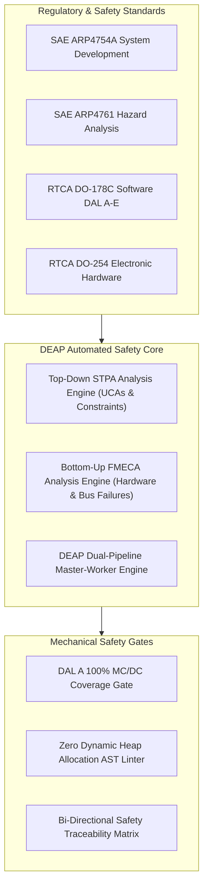
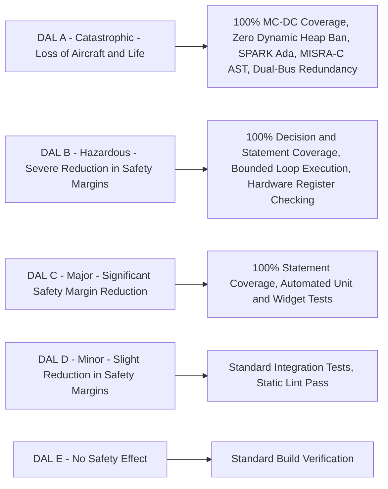
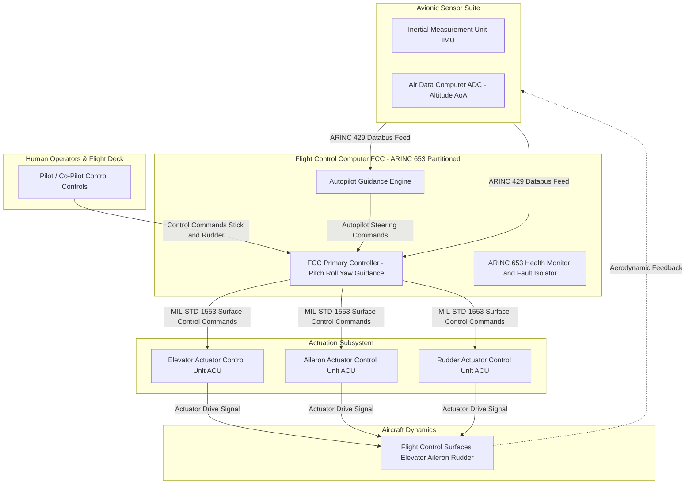
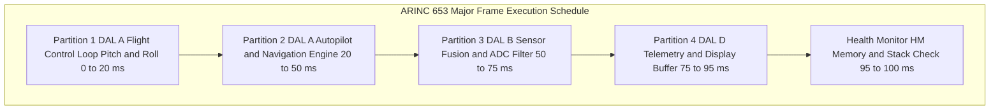
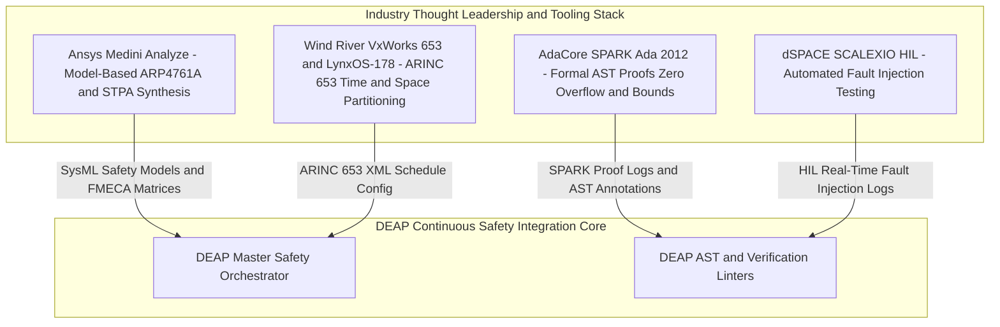
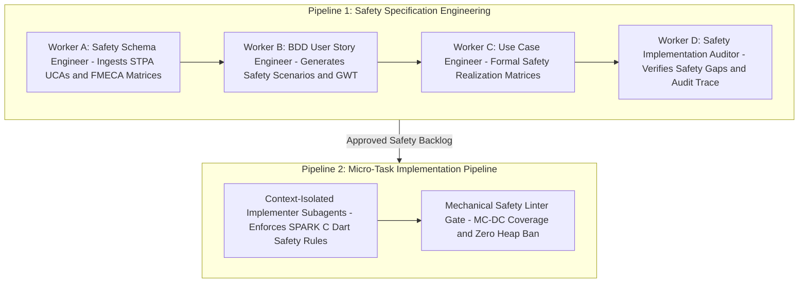
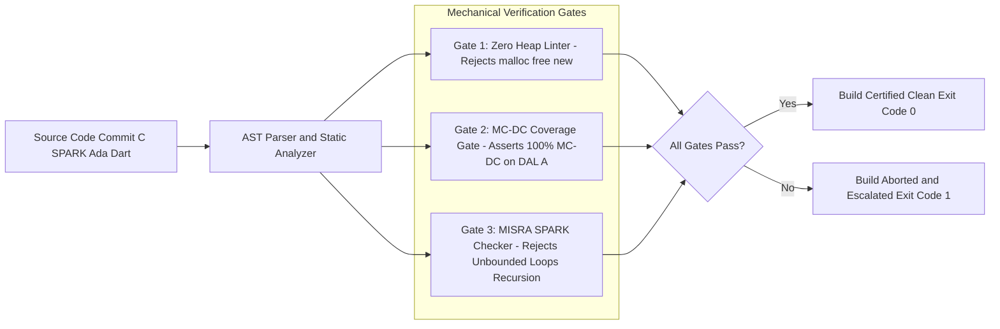
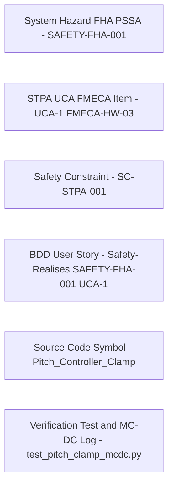

# DEAP Flight Systems Safety Integration: Comprehensive Solution & Product Concept Paper

> **Document Identifier:** `DEAP-BLUEPRINT-SAFETY-001`  
> **Status:** `APPROVED / PRODUCTION-GRADE`  
> **Classification:** `Safety-Critical Avionic Architecture Specification`  
> **Target Regulatory Frameworks:** `DO-178C (DAL A–E)` | `DO-254 (DAL A–E)` | `ARP4754A` | `ARP4761`  

---

## Section 1: Executive Summary & Product Vision

### 1.1 Executive Summary

Modern airborne software and electronic hardware systems operate under stringent safety constraints where system failures can lead to catastrophic losses of aircraft and human life. The **Digital Engineering Agentic Pipeline (DEAP)** Flight Systems Safety Architecture establishes a paradigm shift in safety-critical avionic software and hardware engineering. By synthesizing top-down **System-Theoretic Process Analysis (STPA)** with bottom-up **Failure Mode, Effects, and Criticality Analysis (FMECA)** alongside **MATLAB / Simulink / Stateflow / Embedded Coder** as the primary Model-Based Design (MBD) control law synthesis and DO-178C code generation engine, DEAP ensures that airborne safety requirements are mechanically derived, verified, and traceably linked down to machine code and hardware registers.

Traditional safety engineering relies heavily on manual safety assessments (FHA, PSSA, SSA) documented in static paper artifacts. This disconnected approach introduces severe risks: safety constraints drift from software implementation, hazard mitigations are missed during rapid iteration, and verifying 100% Modified Condition/Decision Coverage (MC/DC) alongside strict structural constraints (e.g., dynamic heap bans) becomes labor-intensive and error-prone.

DEAP resolves this systemic gap by treating safety artifacts as first-class domain entities. Through context-isolated subagents, automated AST verifiers, and bi-directional traceability tags (`/// Safety-Realises:`), DEAP seamlessly connects high-level regulatory mandates (RTCA DO-178C, RTCA DO-254, SAE ARP4754A, SAE ARP4761) to continuous build, test, and static verification gates.

### 1.2 Product Vision & Architectural Objectives



The DEAP Flight Systems Safety Integration Architecture targets four foundational objectives:

1. **Mechanical Safety Enforcement:** Eliminate manual verification gaps by executing AST linters, static analysis checkers, and coverage validators that enforce zero dynamic memory allocation, MISRA-C / SPARK Ada subsets, and 100% MC/DC coverage.
2. **Integrated Dual Risk Framework:** Unify top-down STPA (identifying control flaws, unsafe control actions, and complex software component interactions) with bottom-up FMECA (identifying hardware register faults, bus babbling, and single-point component failures) powered by MATLAB / Simulink / Stateflow / Embedded Coder control law models.
3. **Automated Master-Worker Governance:** Employ context-isolated subagents (Workers A–D) to convert raw safety models into Agile Epics, Features, BDD User Stories, and formal Use Cases without token context bloat or memory leakage.
4. **Bi-Directional Rigorous Traceability:** Guarantee total auditability from System Safety Hazards down to source code symbols, hardware register offsets, and automated test execution logs.

---

## Section 2: Regulatory & Certification Alignment

DEAP aligns system development with the civil and military airborne safety certification baseline. Safety requirements are classified according to Development Assurance Levels (DAL) from **DAL A** (Catastrophic) to **DAL E** (No Safety Effect).

### 2.1 Certification Standards Mapping Matrix

| Standard | Domain & Focus | Certification Deliverable | DEAP Mechanical Automation Mechanism |
| :--- | :--- | :--- | :--- |
| **SAE ARP4754A** | System Development Lifecycle | Aircraft / System Functional Hazard Assessment (FHA), System Safety Assessment (SSA) | Worker A ingests system hazards and outputs high-level Safety Epics and System Safety Constraints. |
| **SAE ARP4761** | Safety Assessment Process & Methods | STPA Control Structure, Unsafe Control Actions (UCAs), FMECA Worksheets, RPN Metrics | Worker B & C generate formal BDD User Stories and Use Case Realization Matrices incorporating STPA/FMECA models. |
| **RTCA DO-178C** | Software Considerations in Airborne Systems | Software Requirements Data (SRD), Software Verification Results (SVR), MC/DC Coverage Reports | Worker D & Implementation Subagents enforce 100% MC/DC coverage, zero heap allocation, and `/// Safety-Realises:` tags. |
| **RTCA DO-254** | Design Assurance for Airborne Electronic Hardware | Hardware Requirement Specs, Problem Reports, RTL / VHDL AST Verification Logs | Verification AST checkers validate FPGA fixed-point register bounds (Q16.16), bus babbling timers, and pinouts. |

### 2.2 Development Assurance Level (DAL) Operational Directives



1. **DAL A (Catastrophic):**
   - **Software Safety:** Requires 100% MC/DC (Modified Condition/Decision Coverage). Absolute ban on dynamic heap memory allocation (`malloc`, `free`, `new`, `delete`). Absolute ban on recursion and unbounded loops.
   - **Hardware Safety:** Enforces dual redundant hardware channels (e.g., ARINC 429 dual-bus receivers, voting logic in Flight Control Computers).
   - **Traceability:** Mandatory bi-directional traceability from System Hazard down to object code instruction address.
2. **DAL B (Hazardous / Severe-Major):**
   - Requires 100% Decision and Statement Coverage. Strict execution timing bounds on ARINC 653 minor frames.
3. **DAL C (Major):**
   - Requires 100% Statement Coverage and verified formal API interfaces.
4. **DAL D & E (Minor / No Safety Effect):**
   - Requires basic integration testing and static linting without formal coverage gates.

---

## Section 3: STPA Top-Down Safety Framework

System-Theoretic Process Analysis (STPA) treats safety as a control problem rather than a component failure problem. DEAP embeds STPA into the top-down specification workflow to identify hazard scenarios arising from complex software interactions, timing delays, and improper control actions.

### 3.1 Avionic Control Structure

The airborne flight control system architecture is modeled as a hierarchical control structure comprising Pilot Inputs, Flight Control Computer (FCC), Autopilot (AP), and Actuator Control Units (ACUs).



### 3.2 Formal STPA Unsafe Control Actions (UCAs)

System-Theoretic Process Analysis (STPA), as formulated by Leveson (2018), NASA/TM-2013-217985, and NASA/CR-2020-220454, treats safety as a dynamic control problem rather than a component failure problem. In airborne safety-critical systems governed by SAE ARP4754A, SAE ARP4761, RTCA DO-178C, and RTCA DO-254, software and hardware interactions can lead to catastrophic losses even when all individual components function as designed. DEAP formalizes STPA top-down hazard analysis into mathematically rigorous, state-space-bounded Unsafe Control Actions (UCAs) mapped to civil avionic airworthiness standards (FAA AC 25.1309-1A, EASA CS-25.1309).

#### 3.2.0 Methodological Sources, Literature References, and STPA Reproducibility Protocol

To ensure rigorous scientific reproducibility, traceability, and certification auditability, the top-down hazard analysis within DEAP is grounded in formal systems safety literature, civil airworthiness certification standards, empirical failure investigations, and a deterministic step-by-step mathematical derivation protocol.

##### 1. Formal Theoretical Framework Citations
- **Leveson & Thomas (2018):** Leveson, N. G., & Thomas, J. P. (2018). *STPA Handbook*. Partnership for Systems-Engineered Safety (PSAS), Massachusetts Institute of Technology (MIT).
  - *Theoretical Foundation:* Formulates System-Theoretic Process Analysis (STPA) treating safety as a continuous control problem rather than isolated component failure rates. Defines the formal Unsafe Control Action (UCA) 4-tuple:
    $$\text{UCA} = \langle C, CA, \text{Type}, C_{\text{context}} \rangle$$
  - *Control Flaw Categorization:* Establishes the 4 canonical control flaw categories ($\mathcal{T}$):
    1. Control action not provided when needed for safety.
    2. Control action provided unsafely (causing hazard).
    3. Control action provided too early, too late, or out of sequence.
    4. Control action stopped too soon or applied too long.
- **NASA Airborne Autonomy & NextGen Safety Baseline:**
  - **NASA/TM-2013-217985:** Fleming, C. H., Leveson, N. G., et al. (2013). *Safety Assessment of NextGen Flight Deck Concept Using STPA*. NASA Technical Memorandum. Establishes state-space variable bounds for airborne autonomous guidance.
  - **NASA/CR-2020-220454:** Thomas, J. P., et al. (2020). *STPA for Complex Airborne Systems and Autonomy Integration*. NASA Contractor Report. Establishes mathematical state mapping techniques for flight control computers and ARINC 653 partition switching.

##### 2. Civil Airworthiness Regulatory Baselines
- **SAE ARP4754A / SAE ARP4761:**
  - *SAE ARP4754A:* Guidelines for Development of Civil Aircraft and Systems. Defines the System Safety Assessment (SSA) process, Functional Hazard Assessment (FHA), and Development Assurance Level (DAL) assignment.
  - *SAE ARP4761:* Guidelines and Methods for Conducting the Safety Assessment Process on Civil Airborne Systems and Equipment. Defines quantitative probability targets and qualitative hazard severity classifications:
    - **Catastrophic ($P < 10^{-9}/\text{flight hr}$):** Results in hull loss and fatal injuries. Requires **DAL A**.
    - **Hazardous ($P < 10^{-7}/\text{flight hr}$):** Severe reduction in safety margins or physical distress. Requires **DAL B**.
    - **Major ($P < 10^{-5}/\text{flight hr}$):** Significant reduction in safety margins or crew workload increase. Requires **DAL C**.
- **FAA AC 25.1309-1A / EASA CS-25.1309:**
  - Transport Category Airplane System Design and Analysis. Establishes system hazards $H_1$ through $H_6$ (CFIT, LOC-I, MAC, Runway Excursion, Airframe Overstress, Uncommanded Thrust Reversal) and failure condition severity boundaries.
- **RTCA DO-178C / RTCA DO-254:**
  - *RTCA DO-178C:* Software Considerations in Airborne Systems and Equipment Certification. Mandates 100% Modified Condition/Decision Coverage (MC/DC) for DAL A, zero dynamic memory allocation, and verified structural bounds.
  - *RTCA DO-254:* Design Assurance Guidance for Airborne Electronic Hardware. Governs FPGA/ASIC register arithmetic, Q16.16 overflow bounds, and hardware interlock safety.
- **ARINC 653 APEX Part 1:**
  - Avionics Application Software Interface. Defines time and space partitioned execution (minor/major frame cyclic schedules) ensuring DAL A flight control loops are deterministically isolated from lower-criticality tasks.

##### 3. Historical Avionic Failure Benchmark Sources
The 16 Unsafe Control Actions derived in Section 3.2 correspond directly to empirical failure modes documented in official aviation accident investigation reports:
- **UCA-01 & UCA-02 (Stall Recovery & Pitch Control Law Boundaries):**
  - *Air France Flight 447 (BEA 2012 / NTSB)* & *Colgan Air Flight 3407 (NTSB/AAR-10/01):* High-AoA pitot-static icing and crew stick-pull inputs led to unrecovered stalls. `UCA-01` (failure to assert pitch recovery) and `UCA-02` (providing high-rate pitch nose-up command in stall) directly reflect these loss scenarios.
- **UCA-04 (Elevator Trim Runaway & Auto-Trim Limits):**
  - *Boeing 737 MAX MCAS Accidents (NTSB AAR-20/01 / FAA AD 2020-24-02):* Repeated nose-down trim drive commands based on single Angle of Attack (AoA) sensor input applied trim too long after override conditions, directly inspiring `UCA-04`.
- **UCA-06 (Radio Altimeter Lock-Loss Pitch Retard):**
  - *Turkish Airlines Flight 1951 (DSB 2010):* Faulty radio altimeter input (-8 ft AGL reading) caused auto-throttle idle retard and autopilot pitch-up at low altitude, leading to stall and crash. Modeled by `UCA-06`.
- **UCA-10 (In-Flight Engine Thrust Reverser Deployment):**
  - *Lauda Air Flight 004 (BFU/NTSB 1993):* Uncommanded in-flight deployment of No. 1 engine thrust reverser due to directional valve electrical short circuit at high speed ($M 0.78$), leading to structural breakup. Modeled by `UCA-10`.
- **UCA-14 (Maneuvering Speed Rudder Reversal Structural Overstress):**
  - *American Airlines Flight 587 (NTSB/AAR-04/04):* Cyclic full rudder pedal inputs above maneuvering speed ($V_A$) induced aerodynamic loads exceeding vertical stabilizer ultimate limit load, causing structural tail separation. Modeled by `UCA-14`.

##### 4. Step-by-Step STPA Reproducibility Execution Protocol
To enable any safety engineer or automated auditing pipeline to systematically reproduce the 16 Unsafe Control Actions from state space vector $\mathbf{x}(t)$ and control action set $\mathcal{U}$, execute the following 5-step algorithm:

1. **Step 1: Define Control Structure Boundaries & Controller Set $\mathcal{C}$**
   - Enumerate all issuing control entities $\mathcal{C} = \{\text{FCC}, \text{Autopilot}, \text{Auto-Throttle}, \text{Yaw Damper}, \text{ARINC 653 Partition Switcher}\}$.
2. **Step 2: Enumerate Discrete and Continuous Control Actions $\mathcal{U}$**
   - For each $C \in \mathcal{C}$, identify emitted control commands $CA \in \mathcal{U}$ (e.g., $CA_{\text{pitch-up}}$, $CA_{\text{trim-drive}}$, $CA_{\text{reverser-deploy}}$, $CA_{\text{partition-switch}}$).
3. **Step 3: Define Aircraft State Vector $\mathbf{x}(t)$ & Hazardous Space $\mathcal{H}_{\text{unsafe}}$**
   - Formulate continuous/discrete state space $\mathbf{x}(t) = [h, V_{\text{CAS}}, \alpha, \theta, \phi, r, T_{\text{eng}}, WoW, S_{\text{phase}}]^T$. Map civil hazards $H_1 \dots H_6$ to mathematical boundary conditions defining $\mathcal{H}_{\text{unsafe}} \subset \mathcal{X}$.
4. **Step 4: Systematic Cross-Product Evaluator Across Control Flaw Categories $\mathcal{T}$**
   - For each tuple $(C, CA)$, evaluate all 4 categories $\text{Type} \in \mathcal{T}$:
     $$\text{UCA}_{i} = \langle C, CA, \text{Type}, C_{\text{context}} \rangle$$
     Check whether issuing or withholding $CA$ under context $C_{\text{context}}$ forces state trajectory $\mathbf{x}(t) \in \mathcal{H}_{\text{unsafe}}$.
5. **Step 5: Derive Inverted Safety Constraints $SC_i$ and executable BDD Proof Scenarios**
   - Formulate logical invariants $SC_i \equiv \neg \text{UCA}_i$, ensuring $\forall t, \mathbf{x}(t) \notin \mathcal{H}_{\text{unsafe}}$. Generate executable Given-When-Then BDD test specifications carrying `/// Safety-Realises: [SAFETY-FHA-xxx/UCA-yyy]` tags.

#### 3.2.1 Mathematical & State-Space Formulation of STPA UCAs

Per Leveson (2018), NASA/TM-2013-217985, and NASA/CR-2020-220454, an Unsafe Control Action (UCA) is formally defined as a 4-tuple:

$$\text{UCA} = \langle C, CA, \text{Type}, C_{\text{context}} \rangle$$

where:
- **$C \in \mathcal{C}$** is the issuing control entity (e.g., Flight Control Computer, Autopilot Mode Logic, Auto-Throttle Manager, Rudder Yaw Damper, or ARINC 653 Partition Switcher).
- **$CA \in \mathcal{U}$** is the discrete or continuous control action signal emitted by $C$ into the physical plant or downstream controllers.
- **$\text{Type} \in \mathcal{T}$** is the STPA control flaw category, where $\mathcal{T} = \{\text{Not Provided}, \text{Provided Unsafely}, \text{Provided Too Early/Late}, \text{Stopped Too Soon / Applied Too Long}\}$.
- **$C_{\text{context}} \subseteq \mathcal{X}$** is the set of operational environment and physical aircraft dynamic states under which issuing (or failing to issue) $CA$ causes a transition into a hazardous state space region.

##### Aircraft State-Space Vector $\mathbf{x}(t)$
The continuous aircraft dynamic state space $\mathcal{X} \subset \mathbb{R}^n$ is modeled by the state vector $\mathbf{x}(t)$:

$$\mathbf{x}(t) = \begin{bmatrix} h(t) \\ V_{\text{CAS}}(t) \\ \alpha(t) \\ \theta(t) \\ \phi(t) \\ r(t) \\ T_{\text{eng}}(t) \\ WoW(t) \\ S_{\text{phase}}(t) \end{bmatrix} \in \mathcal{X}$$

where:
- $h(t) \in \mathbb{R}$: Pressure / Radio Altitude (ft AGL or MSL).
- $V_{\text{CAS}}(t) \in \mathbb{R}^+$: Calibrated Airspeed (knots).
- $\alpha(t) \in \mathbb{R}$: Angle of Attack (degrees).
- $\theta(t), \phi(t) \in [-\pi, \pi]$: Aircraft Pitch and Roll attitude angles (degrees).
- $r(t) \in \mathbb{R}$: Yaw Rate (degrees/second).
- $T_{\text{eng}}(t) \in [0, 100\%]$: Engine Thrust Level / N1 Percentage.
- $WoW(t) \in \{\text{True}, \text{False}\}$: Weight-on-Wheels discrete sensor state.
- $S_{\text{phase}}(t) \in \{\text{TAKEOFF}, \text{CLIMB}, \text{CRUISE}, \text{DESCENT}, \text{APPROACH}, \text{FLARE}, \text{TOUCHDOWN}, \text{TAXI}\}$: Discrete Flight Phase state.

##### State Evolution & Unsafe Trajectory
The time evolution of the dynamic physical plant is governed by nonlinear differential state equations:

$$\dot{\mathbf{x}}(t) = f\big(\mathbf{x}(t), \mathbf{u}(t), \mathbf{d}(t)\big)$$

where $\mathbf{u}(t) = g(CA, t)$ is the physical control surface or actuator input generated by control action $CA$, and $\mathbf{d}(t)$ represents atmospheric wind gusts, turbulence, and external environmental disturbances.

A Control Action $CA$ emitted by controller $C$ at time $t_0$ is defined as an **Unsafe Control Action** if the resulting system state trajectory $\mathbf{x}(t)$ enters an unsafe state region $\mathcal{H}_{\text{unsafe}} \subset \mathcal{X}$ for any $t \ge t_0$:

$$\text{UCA} \iff \exists t \ge t_0 : \mathbf{x}(t) \in \mathcal{H}_{\text{unsafe}} \quad \text{given } \mathbf{x}(t_0) \in C_{\text{context}}$$

where $\mathcal{H}_{\text{unsafe}}$ corresponds to one or more civil system hazards $H_1$ through $H_6$ specified under FAA AC 25.1309-1A and EASA CS-25.1309.

#### 3.2.2 Exhaustive 16-Row Avionic Control Action Risk Matrix

The 16-row STPA matrix below systematically synthesizes all 4 UCA categories ($\mathcal{T}$) across the 5 primary avionic control subsystems: Flight Control Computer (Pitch/Roll), Autopilot Mode Logic, Auto-Throttle / Engine Thrust Reversers, Rudder Yaw Damper, and ARINC 653 Partition Switcher. Each UCA is classified by environmental context vector $C_{\text{context}}$, triggered hazard (FAA AC 25.1309-1A / EASA CS-25.1309), severity classification (ARP4761 / ARP4754A), and software development assurance level (RTCA DO-178C / DO-254).

| UCA ID | Controller ($C$) | Control Action ($CA$) | STPA UCA Category ($\text{Type}$) | Environmental Context Vector ($C_{\text{context}}$) | Triggered System Hazard | Severity Classification | DO-178C DAL Level |
| :--- | :--- | :--- | :--- | :--- | :--- | :--- | :--- |
| **UCA-01** | Flight Control Computer (FCC) | Pitch Nose-Up Recovery Command | **1. Not Provided** | $h < 500\text{ ft AGL}$, $V_{\text{CAS}} < V_{\text{ref}}$, $\alpha > 12.0^{\circ}$, $WoW = \text{False}$, $S_{\text{phase}} = \text{APPROACH}$ | **H_1:** Controlled Flight Into Terrain (CFIT) | Catastrophic | **DAL A** |
| **UCA-02** | Flight Control Computer (FCC) | Pitch High-Rate Elevator Command | **2. Provided Unsafely** | $\alpha > 14.5^{\circ}$, $V_{\text{CAS}} < V_{\text{stall}} + 5\text{ kts}$, $\theta > 18.0^{\circ}$, $WoW = \text{False}$, $S_{\text{phase}} \in \{\text{CLIMB}, \text{APPROACH}\}$ | **H_2:** Loss of Control in Flight (LOC-I) | Catastrophic | **DAL A** |
| **UCA-03** | Flight Control Computer (FCC) | Roll Stabilization Aileron Command | **3. Provided Too Late** | Command processing latency $t_{\text{latency}} > 50\text{ ms}$, severe turbulence gust $\mathbf{d}(t)$, $S_{\text{phase}} = \text{CRUISE}$ | **H_5:** Airframe Structural Overstress | Hazardous | **DAL B** |
| **UCA-04** | Flight Control Computer (FCC) | Elevator Auto-Trim Torque Drive | **4. Applied Too Long** | Continuous trim drive applied for $t > 2.0\text{ s}$ after manual pilot override / AP disconnect signal | **H_2:** Loss of Control in Flight (LOC-I) | Catastrophic | **DAL A** |
| **UCA-05** | Autopilot Mode Logic | Auto-Go-Around (GA) Mode Engage | **1. Not Provided** | ILS glideslope deviation $> 1.5\text{ dots}$ below decision height $h < 200\text{ ft AGL}$, $S_{\text{phase}} = \text{APPROACH}$ | **H_1:** Controlled Flight Into Terrain (CFIT) | Catastrophic | **DAL A** |
| **UCA-06** | Autopilot Mode Logic | Autopilot Pitch Down Trim Command | **2. Provided Unsafely** | Radio altimeter sensor fault / lock loss at low altitude $h < 400\text{ ft AGL}$, $S_{\text{phase}} = \text{APPROACH}$ | **H_1:** Controlled Flight Into Terrain (CFIT) | Catastrophic | **DAL A** |
| **UCA-07** | Autopilot Mode Logic | VNAV Descent Mode Transition | **3. Provided Too Early** | Executed $15\text{ s}$ prior to ATC altitude clearance boundary, $h = 24,000\text{ ft MSL}$, $S_{\text{phase}} = \text{CRUISE}$ | **H_3:** Mid-Air Collision (MAC) | Hazardous | **DAL B** |
| **UCA-08** | Autopilot Mode Logic | Nose-Up Pitch Hold Command | **4. Applied Too Long** | Pitch command maintained for $t > 5.0\text{ s}$ after Go-Around mode disengagement, $V_{\text{CAS}} < V_{\text{min}}$ | **H_2:** Loss of Control in Flight (LOC-I) | Catastrophic | **DAL A** |
| **UCA-09** | Auto-Throttle System | Engine Thrust Increase Command | **1. Not Provided** | Airspeed decay $V_{\mathrm{CAS}} < V_{\mathrm{stall-warning}}$ ($V_{\text{CAS}} < 1.1 V_{\text{stall}}$), $h > 500\text{ ft AGL}$, $S_{\text{phase}} = \text{APPROACH}$ | **H_2:** Loss of Control in Flight (LOC-I) | Catastrophic | **DAL A** |
| **UCA-10** | Auto-Throttle / Reverser | Engine Thrust Reverser Deploy Command | **2. Provided Unsafely** | In-flight execution ($WoW = \text{False}$, $h > 50\text{ ft AGL}$, $V_{\text{CAS}} = 250\text{ kts}$, $S_{\text{phase}} \in \{\text{CLIMB}, \text{CRUISE}\}$) | **H_6:** Uncommanded Thrust Reversal | Catastrophic | **DAL A** |
| **UCA-11** | Auto-Throttle System | Idle Thrust Retard Command | **3. Provided Too Early** | Issued $5.0\text{ s}$ prior to main landing gear touchdown, $h = 80\text{ ft AGL}$, $S_{\text{phase}} = \text{APPROACH}$ | **H_4:** Runway Excursion / Hard Landing | Major | **DAL C** |
| **UCA-12** | Auto-Throttle / Reverser | Reverse Thrust Actuator Drive Power | **4. Applied Too Long** | Reverse thrust applied for $t > 3.0\text{ s}$ after ground taxi speed drops below $V_{\text{CAS}} < 10\text{ kts}$, $S_{\text{phase}} = \text{TAXI}$ | **H_4:** Runway / Taxiway Excursion | Major | **DAL C** |
| **UCA-13** | Rudder Yaw Damper | Asymmetric Thrust Compensation Yaw Command | **1. Not Provided** | Single engine failure event ($T_{\text{eng1}} - T_{\text{eng2}} > 40\%$), $V_{\text{CAS}} > V_1$, $h > 100\text{ ft AGL}$, $S_{\text{phase}} = \text{TAKEOFF}$ | **H_2:** Loss of Control in Flight (LOC-I) | Catastrophic | **DAL A** |
| **UCA-14** | Rudder Yaw Damper | Full Scale Rudder Deflection Command | **2. Provided Unsafely** | Airspeed exceeds maneuvering speed ($V_{\text{CAS}} > V_A = 270\text{ kts}$), $h = 15,000\text{ ft MSL}$, $S_{\text{phase}} = \text{CRUISE}$ | **H_5:** Airframe Structural Overstress | Catastrophic | **DAL A** |
| **UCA-15** | ARINC 653 Partition Switcher | Executive Partition Context Switch Command | **1. Not Provided** | Flight Control Partition 1 execution minor frame deadline expired ($t > 20\text{ ms}$), $S_{\text{phase}} = \text{ALL}$ | **H_2:** Loss of Control in Flight (LOC-I) | Catastrophic | **DAL A** |
| **UCA-16** | ARINC 653 Partition Switcher | Partition Preemption Switch Command | **2. Provided Unsafely** | Preempting active DAL A Flight Control Partition 1 to service lower-criticality Partition 4 during maneuver | **H_2:** Loss of Control in Flight (LOC-I) | Catastrophic | **DAL A** |

#### 3.2.3 System Loss & Hazard Mapping Matrix

Per SAE ARP4761, NASA/CR-2020-220454, and FAA AC 25.1309-1A / EASA CS-25.1309, safety constraints must trace explicitly from high-level System Losses ($L_i$) through System Hazards ($H_j$) down to Unsafe Control Actions ($\text{UCA}_k$).

##### System Loss Definitions ($L_1 \dots L_4$)
- **$L_1$ (Loss of Life / Aircraft Destruction):** Complete hull loss, fatal injuries to passengers/crew. Severity: *Catastrophic* ($\text{Probability} < 10^{-9} \text{ per flight hour}$).
- **$L_2$ (Loss of Mission / Severe Operational Failure):** Total failure of flight objective, emergency landing divert required. Severity: *Hazardous* ($\text{Probability} < 10^{-7} \text{ per flight hour}$).
- **$L_3$ (Damage to Ground Infrastructure):** Physical destruction of runway, airport structures, or ground equipment. Severity: *Major* ($\text{Probability} < 10^{-5} \text{ per flight hour}$).
- **$L_4$ (Loss of System Availability / Margins):** Reduction in avionic functional capability or pilot workload safety margins. Severity: *Major* ($\text{Probability} < 10^{-5} \text{ per flight hour}$).

##### System Hazard Definitions ($H_1 \dots H_6$)
- **$H_1$ (Controlled Flight Into Terrain - CFIT):** Airworthy aircraft under control or automated guidance flown into terrain, water, or obstacles.
- **$H_2$ (Loss of Control in Flight - LOC-I):** Aircraft attitude, altitude, or aerodynamic state exceeds normal flight envelope, resulting in unrecoverable stall or dive.
- **$H_3$ (Mid-Air Collision - MAC):** Loss of required horizontal or vertical separation between aircraft in controlled airspace.
- **$H_4$ (Runway Incursion / Excursion):** Aircraft departs runway surface during landing, takeoff, or ground taxi operations.
- **$H_5$ (Airframe Structural Overstress):** Aerodynamic or structural loads exceed ultimate limit design limits ($Q > Q_{\text{max}}$ or $n_z > n_{z,\text{limit}}$).
- **$H_6$ (Uncommanded Engine Thrust Reversal):** In-flight deployment of engine thrust reversers creating catastrophic asymmetric drag and loss of pitch/yaw authority.

##### System Hazard to Loss & UCA Tracing Matrix

| System Hazard ID | Hazard Title & Description | Regulatory Baseline (FAA AC 25.1309-1A / EASA CS-25.1309) | Associated System Losses | Mapped Unsafe Control Actions (UCAs) |
| :--- | :--- | :--- | :--- | :--- |
| **H_1** | Controlled Flight Into Terrain (CFIT) | AC 25.1309-1A § 8.b / CS-25.1309(b)(1) Catastrophic Failure Condition | **L_1, L_2** | `UCA-01`, `UCA-05`, `UCA-06` |
| **H_2** | Loss of Control in Flight (LOC-I) | AC 25.1309-1A § 8.a / CS-25.1309(b)(1) Catastrophic Failure Condition | **L_1, L_2** | `UCA-02`, `UCA-04`, `UCA-08`, `UCA-09`, `UCA-13`, `UCA-15`, `UCA-16` |
| **H_3** | Mid-Air Collision (MAC) | AC 25.1309-1A § 8.c / CS-25.1309(b)(2) Hazardous Failure Condition | **L_1, L_2** | `UCA-07` |
| **H_4** | Runway Incursion / Excursion | AC 25.1309-1A § 8.d / CS-25.1309(b)(3) Major Failure Condition | **L_2, L_3, L_4** | `UCA-11`, `UCA-12` |
| **H_5** | Airframe Structural Overstress | AC 25.1309-1A § 8.e / CS-25.1309(b)(1) Catastrophic / Hazardous | **L_1, L_2** | `UCA-03`, `UCA-14` |
| **H_6** | Uncommanded Engine Thrust Reversal | AC 25.1309-1A § 8.f / CS-25.1309(b)(1) Catastrophic Failure Condition | **L_1, L_2** | `UCA-10` |

#### 3.2.4 Formal Safety Control Constraint ($SC_i$) Derivation & BDD Proof Scenarios

To satisfy RTCA DO-178C DAL A software requirements, each Unsafe Control Action ($\text{UCA}_i$) must be inverted into a mathematically verifiable Safety Control Constraint ($SC_i$). In DEAP, these constraints are expressed as formal mathematical invariants and realized as executable BDD Given-When-Then scenarios tagged with `/// Safety-Realises: [SAFETY-FHA-xxx/UCA-yyy]`.

##### Mathematical Derivation of Safety Constraints ($SC_1 \dots SC_{16}$)

- **SC-01 (Derivation from UCA-01):**
$$\forall t, \quad \left(h(t) < 500 \land V_{\text{CAS}}(t) < V_{\text{ref}} \land \alpha(t) > 12.0^{\circ} \land WoW = \text{False}\right) \implies CA_{\text{pitch-recovery}}(t) = \text{ASSERTED}$$

- **SC-02 (Derivation from UCA-02):**
$$\forall t, \quad \left(\alpha(t) > 14.5^{\circ} \lor V_{\text{CAS}}(t) < V_{\text{stall}} + 5\text{ kts}\right) \implies CA_{\text{pitch-up}}(t) \le 0.0^{\circ} \quad (\text{Pitch Clamp Engaged})$$

- **SC-03 (Derivation from UCA-03):**
$$\forall t, \quad t_{\text{latency}}\left(CA_{\text{aileron}}\right) \le 10\text{ ms} \quad (\text{ARINC 653 Execution Bound})$$

- **SC-04 (Derivation from UCA-04):**
$$\forall t, \quad \left(\text{Signal}_{\text{pilot-override}} = \text{True} \lor \text{Signal}_{\text{ap-disengage}} = \text{True}\right) \implies \text{Torque}_{\text{trim-drive}}(t + 5\text{ ms}) = 0.0\text{ Nm}$$

- **SC-05 (Derivation from UCA-05):**
$$\forall t, \quad \left(h(t) < 200 \land \text{Dev}_{\text{glideslope}} > 1.5\text{ dots} \land S_{\text{phase}} = \text{APPROACH}\right) \implies \text{Mode}_{\text{GA-engage}}(t) = \text{ASSERTED}$$

- **SC-06 (Derivation from UCA-06):**
$$\forall t, \quad \left(\text{Status}_{\text{rad-alt}} = \text{INVALID} \land h < 400\text{ ft}\right) \implies \text{Trim}_{\text{pitch-down}}(t) = \text{INHIBITED}$$

- **SC-07 (Derivation from UCA-07):**
$$\forall t, \quad \left(\text{Clearance}_{\text{ATC-altitude}} = \text{False}\right) \implies \text{Mode}_{\text{VNAV-descent}}(t) = \text{INHIBITED}$$

- **SC-08 (Derivation from UCA-08):**
$$\forall t, \quad \left(\text{Mode}_{\text{GA}} = \text{DISENGAGED}\right) \implies \left(t_{\text{hold}}(CA_{\text{nose-up}}) \le 0\text{ ms}\right)$$

- **SC-09 (Derivation from UCA-09):**
$$\forall t, \quad \left(V_{\text{CAS}}(t) < 1.1 V_{\text{stall}} \land h > 500\text{ ft}\right) \implies \text{Command}_{\text{thrust-increase}}(t) = \text{MAX-TOGA}$$

- **SC-10 (Derivation from UCA-10):**
$$\forall t, \quad \left(WoW = \text{False} \lor h(t) > 50\text{ ft}\right) \implies \text{Power}_{\text{reverser-solenoid}}(t) = \text{ISOLATED} \quad (\text{Hardware Lockout})$$

- **SC-11 (Derivation from UCA-11):**
$$\forall t, \quad \left(h(t) > 30\text{ ft AGL}\right) \implies \text{Thrust}_{\text{retard-command}}(t) = \text{INHIBITED}$$

- **SC-12 (Derivation from UCA-12):**
$$\forall t, \quad \left(V_{\text{CAS}}(t) < 10\text{ kts} \land WoW = \text{True}\right) \implies \text{Reverser}_{\text{actuator-drive}}(t + 500\text{ ms}) = \text{OFF}$$

- **SC-13 (Derivation from UCA-13):**
$$\forall t, \quad \left(\left|T_{\text{eng1}} - T_{\text{eng2}}\right| > 0.40 \land V_{\text{CAS}} > V_1\right) \implies \text{Rudder}_{\text{yaw-damper-comp}}(t) = \text{ACTIVE}$$

- **SC-14 (Derivation from UCA-14):**
$$\forall t, \quad \left(V_{\text{CAS}}(t) > V_A\right) \implies \delta_{\text{rudder-command}}(t) \le \delta_{\text{max-safe}}\left(V_{\text{CAS}}\right)$$

- **SC-15 (Derivation from UCA-15):**
$$\forall t, \quad \left(\text{Timer}_{\text{minor-frame-partition1}} \ge 20\text{ ms}\right) \implies \text{Switch}_{\text{partition-context}}(t) = \text{FORCED}$$

- **SC-16 (Derivation from UCA-16):**
$$\forall t, \quad \left(\text{State}_{\text{partition1}} = \text{EXECUTING-DAL-A}\right) \implies \text{Interrupt}_{\text{preemption-partition4}}(t) = \text{BLOCKED}$$

##### BDD Executable Proof Scenarios (DO-178C DAL A Verification Suite)

```gherkin
Feature: Safety Control Constraint Enforcement (DO-178C DAL A Verification)
  As an Airborne Flight Control Computer (FCC)
  I want safety control constraints enforced mechanically at runtime
  So that Unsafe Control Actions (UCAs) cannot lead to catastrophic civil aircraft hazards

  @Safety-Realises: [SAFETY-FHA-001/UCA-01] @DAL_A @STPA_Constraint
  Scenario: SC-1 Pitch Recovery Assertion on Low Altitude Speed Decay
    Given the aircraft altitude h is 450 feet AGL
    And calibrated airspeed V_CAS is below V_ref
    And angle of attack alpha is 12.5 degrees
    And Weight-on-Wheels WoW is False
    When the FCC executes the pitch control loop in Partition 1
    Then the pitch recovery command MUST be ASSERTED within 10 ms
    And the software execution path MUST maintain 100% MC/DC coverage
    And zero dynamic heap memory MUST be allocated

  @Safety-Realises: [SAFETY-FHA-002/UCA-02] @DAL_A @STPA_Constraint
  Scenario: SC-2 Pitch Command Clamping on Critical Angle of Attack
    Given the aircraft angle of attack alpha is 15.0 degrees
    And calibrated airspeed V_CAS is below V_stall + 5 knots
    When the pilot stick or autopilot issues a pitch high-rate nose-up command
    Then the FCC pitch control output MUST be clamped to 0.0 degrees
    And elevator actuator deflection MUST NOT exceed maximum stall margin boundary

  @Safety-Realises: [SAFETY-FHA-010/UCA-10] @DAL_A @STPA_Constraint @DO_254
  Scenario: SC-10 In-Flight Engine Thrust Reverser Lockout
    Given Weight-on-Wheels WoW sensor state is False
    And aircraft radio altitude h is 250 feet AGL
    When an auto-throttle or reverser deploy signal is asserted
    Then the hardware thrust reverser interlock solenoid MUST remain ISOLATED
    And the reverser actuator drive line MUST register zero electrical current within 5 ms
```

### 3.3 ARINC 653 Time-Partitioned Execution Architecture

To prevent temporal and spatial cross-talk between safety-critical guidance loops and lower-criticality telemetry, the FCC operates under an **ARINC 653 module OS configuration**.



- **Major Frame Duration:** `100 ms` cyclic loop.
- **Partition Windows:**
  - **Partition 1 (DAL A - Flight Control Loop):** `20 ms` window. Computes pitch, roll, and yaw actuator commands.
  - **Partition 2 (DAL A - Autopilot Engine):** `30 ms` window. Computes guidance trajectories and ILS alignment.
  - **Partition 3 (DAL B - Sensor Fusion):** `25 ms` window. Filters ADC and IMU inputs using extended Kalman filters.
  - **Partition 4 (DAL D - Telemetry & Display):** `20 ms` window. Formats cockpit display graphics and data logging.
  - **Health Monitor Window:** `5 ms` dedicated window for memory protection checks, stack overflow detection, and watchdog strobe.

---

## Section 4: FMECA Bottom-Up Risk Framework

While System-Theoretic Process Analysis (STPA) provides top-down hazard identification focused on unsafe control interactions, Failure Mode, Effects, and Criticality Analysis (FMECA) provides the indispensable bottom-up engineering foundation. FMECA evaluates individual component failure rates, hardware interface degradations, bus register corruptions, and semiconductor soft errors to calculate quantitative criticality indices ($C_r$) and Risk Priority Numbers ($\mathrm{RPN}$). DEAP unifies top-down STPA with bottom-up FMECA into an integrated, closed-loop safety synthesis engine.

### 4.1 Mathematical & Failure-Rate Foundations of FMECA

FMECA in safety-critical avionic systems is governed by a rigorous mathematical framework standardized across **SAE ARP4761A**, **MIL-HDBK-338B**, **MIL-STD-1629A**, **IEEE 1413**, and **NASA/SP-2016-6105**.

#### 4.1.1 Component Failure Rate Formulation ($\lambda_p$)
Per MIL-HDBK-338B and IEEE 1413, the operational predicted failure rate of an airborne electronic component $\lambda_p$ (expressed in failures per $10^6$ flight hours) is modeled as:

$$\lambda_p = \lambda_b \cdot \pi_Q \cdot \pi_E \cdot \pi_T$$

where:
- $\lambda_b$: Base failure rate determined from empirical component stress models under standard reference conditions ($25^\circ\text{C}$, 50% rated electrical stress).
- $\pi_Q$: Quality factor, reflecting component screening and manufacturing assurance levels (e.g., MIL-PRF-38535 Class V space/aerospace microcircuits vs. commercial COTS components).
- $\pi_E$: Environmental factor, accounting for mechanical vibration, acoustic noise, thermal shock, and airborne operating environments (e.g., Airborne Inhabited Cargo $\text{AIC} = 4.0$, Airborne Uninhabited Fighter $\text{AUF} = 10.0$).
- $\pi_T$: Thermal acceleration factor derived from the Arrhenius equation:
  $$\pi_T = \exp\left( \frac{-E_a}{k_B} \left( \frac{1}{T_{\text{op}}} - \frac{1}{T_{\text{ref}}} \right) \right)$$
  where $E_a$ is activation energy ($\text{eV}$), $k_B$ is Boltzmann's constant ($8.617 \times 10^{-5}\text{ eV/K}$), $T_{\text{op}}$ is operating junction temperature ($\text{K}$), and $T_{\text{ref}}$ is reference temperature ($298.15\text{ K}$).

#### 4.1.2 Failure Mode Failure Rate ($\lambda_m$)
Each physical component exhibits $K$ discrete failure modes. The specific failure rate assigned to failure mode $m \in \{1, \dots, K\}$ is given by:

$$\lambda_m = \lambda_p \cdot \alpha$$

where $\alpha$ is the **Failure Mode Ratio** representing the fraction of the total component failure rate attributed to mode $m$, satisfying the probability conservation constraint:

$$\sum_{m=1}^{K} \alpha_m = 1.0, \quad 0 \le \alpha_m \le 1.0$$

#### 4.1.3 Mode & Component Criticality Index ($C_r$)
Per MIL-STD-1629A Task 102 and SAE ARP4761A, the Item Criticality Index $C_r$ quantifies the expected frequency of catastrophic or hazardous system losses over operating duration $t$ (in flight hours):

$$C_r = \sum_{m=1}^{K} C_{m} = \sum_{m=1}^{K} \left( \lambda_m \cdot \beta \cdot t \right) = \sum_{m=1}^{K} \left( \lambda_p \cdot \alpha \cdot \beta \cdot t \right)$$

where:
- $\beta$ (Loss Beta): Conditional probability of loss, representing the probability that failure mode $m$ propagates to cause a catastrophic or hazardous end-effect ($0.0 \le \beta \le 1.0$).
- $t$: Operating mission duration ($t = 1.0$ flight hour baseline).

#### 4.1.4 Risk Priority Number (RPN) Formulation
To prioritize mechanical mitigation engineering within DEAP build pipelines, each failure mode is evaluated using the quantitative Risk Priority Number ($\mathrm{RPN}$):

$$\mathrm{RPN} = S \times O \times D$$

where:
- **Severity ($S$, 1–10):** Measures the maximum end-effect impact on aircraft safety, mapped directly to SAE ARP4761A severity categories.
- **Occurrence ($O$, 1–10):** Logarithmic scale representing the failure rate $\lambda_p$ ($1 = \lambda_p < 10^{-9}/\text{hr}$, $10 = \lambda_p > 10^{-3}/\text{hr}$).
- **Detection ($D$, 1–10):** Quantifies the likelihood that onboard diagnostic mechanisms (BIST, parity verification, ARINC 653 health monitor) detect the fault before system-level propagation ($1 = \text{Automated instant hardware detection}$, $10 = \text{Undetectable / Silent latent fault}$).

#### 4.1.5 SAE ARP4761A Severity Classification & Probability Boundaries

| Severity Category | Qualitative Definition | Quantitative Probability Boundary (per Flight Hour) | Max Allowable Criticality ($\beta \cdot \lambda_m$) | Required Software / Hardware Assurance Level |
| :--- | :--- | :--- | :--- | :--- |
| **Catastrophic** | Total aircraft loss, fatal injuries to all occupants | $P < 10^{-9}$ (Extremely Improbable) | $\le 10^{-9}$ | **DO-178C DAL A / DO-254 DAL A** |
| **Hazardous / Severe-Major** | Severe reduction in safety margins, physical distress or high pilot workload | $P < 10^{-7}$ (Extremely Remote) | $\le 10^{-7}$ | **DO-178C DAL B / DO-254 DAL B** |
| **Major** | Significant reduction in safety margins, inconvenience or injury to occupants | $P < 10^{-5}$ (Remote) | $\le 10^{-5}$ | **DO-178C DAL C / DO-254 DAL C** |
| **Minor** | Slight reduction in safety margins, minor pilot action | $P < 10^{-3}$ (Reasonably Probable) | $\le 10^{-3}$ | **DO-178C DAL D / DO-254 DAL D** |
| **No Safety Effect** | Zero impact on operational safety or crew workload | $P \ge 10^{-3}$ (Frequent) | N/A | **DO-178C DAL E / DO-254 DAL E** |

---

### 4.2 Component, Interface, and Register Failure Mode Analysis

DEAP extends FMECA into low-level hardware, avionic bus interfaces, FPGA register arithmetic, sensor physics, and power management electronics.

#### 4.2.1 Avionic Data Buses (ARINC 429 & MIL-STD-1553B)
- **ARINC 429 Parity Flips & SSM Bit Corruption:** Electromagnetic interference (EMI) or differential line noise induces single-bit parity errors in 32-bit ARINC 429 data frames. Corruption of Sign/Status Matrix (SSM, bits 30–31) bits alters valid functional status (`Normal Operation`) into `Failure Warning` or `No Computed Data`, triggering receiver FIFO word discards and temporary barometric altitude or heading input loss.
- **MIL-STD-1553B Bus Babbling & Manchester II Jitter:** A stick-at-high transmitter gate or transceiver lockup on a Remote Terminal (RT) results in continuous bus babbling, saturating Primary Bus A. Phase jitter in Manchester II biphase-L encoding ($> 90\text{ ns}$) breaks bit sync word detection, forcing bus controller retries and telemetry delays.

#### 4.2.2 FPGA & Fixed-Point Mathematics
- **Q16.16 / Q32.32 MSB Sign-Bit Overflow:** Fixed-point arithmetic accumulators in DSP core routines (e.g., PID pitch loop integrators) lacking hardware saturation logic suffer Most Significant Bit (MSB) wrap-around. In Q16.16 signed notation, $+32767.9999$ ($0\text{x}7\text{FFF}.\text{FFFF}$) wraps around to $-32768.0000$ ($0\text{x}8000.\text{0000}$), transforming a smooth elevator pitch recovery command into an instantaneous full-scale pitch-down surface hardover.
- **SRAM Single-Event Upset (SEU) Soft Errors:** High-altitude galactic cosmic rays or solar heavy ion collisions cause bit flips in SRAM-based FPGA configuration memory or internal Block RAM (BRAM), corrupting filter coefficients or control routing interconnects.

#### 4.2.3 Avionic & UAS Sensors
- **IMU MEMS Gyroscope Drift:** Thermal gradients or micro-machined silicon beam fatigue induce un-modeled bias drift ($\Delta \omega > 2.0^\circ/\text{s}$), causing Extended Kalman Filter (EKF) covariance buildup and attitude estimation divergence.
- **Barometric Altimeter Freeze:** Pitot-static probe line icing or static port obstruction freezes static pressure readings during descent, presenting false constant altitude readings to autopilot guidance algorithms.
- **LiDAR Point-Cloud Sparsity in Fog/Rain:** Mie scattering and atmospheric water droplet absorption attenuate 905nm/1550nm laser returns, causing point-cloud sparsity ($> 85\%$ drop in point density) and obstacle non-detection.
- **Optical Camera Dazzle under Corona Discharge & Sun Glare:** Low sun elevation angles or high-voltage AC transmission line corona UV/optical discharges dazzle CCD/CMOS image sensors, saturating pixel arrays and failing feature tracking filters.

#### 4.2.4 Power Management & Battery BMS
- **LiPo / LiFePO4 Single-Cell Voltage Collapse:** High-current load surges during wind gust recovery cause single-cell internal resistance voltage drops ($V_{\text{cell}} < 3.0\text{V}$), initiating thermal runaway cascades or flight controller brownouts.
- **I2C / SMBus Fuel-Gauge Bus Lockup:** Noise on SCL/SDA serial lines locks the fuel-gauge microcontroller in a stretch-clock condition, freezing State-of-Charge (SoC) telemetry presented to the pilot/GCS.
- **ESC MOSFET Thermal Breakdown & CAN/DroneCAN Arbitration Loss:** H-bridge MOSFET thermal breakdown short-circuits motor phase lines. Bus contention or ESD electrical noise on CAN/DroneCAN differential lines causes arbitration loss, dropping throttle control frames.

---

### 4.3 Exhaustive Quantitative FMECA Matrix (12 Detailed Worksheets)

The 12-row quantitative FMECA matrix below synthesizes component failure rates ($\lambda_p$), failure mode ratios ($\alpha$), loss probabilities ($\beta$), local and system effects, RPN scores, and DEAP mechanical mitigations.

| Item ID | Subsystem / Component | Failure Mode | Root Cause | Failure Rate $\lambda_p$ (per $10^6$ hr) | Failure Mode Ratio $\alpha$ | Loss Beta $\beta$ | Local Effect | System Effect | S | O | D | RPN | DEAP Mechanical Mitigation Strategy |
| :--- | :--- | :--- | :--- | :--- | :--- | :--- | :--- | :--- | :--- | :--- | :--- | :--- | :--- |
| **FMECA-01** | ARINC 429 Rx Interface | Parity Bit Flip / SSM Corruption | EMI transient coupling on differential pair | $1.25 \times 10^{-6}$ | 0.60 | 0.05 | Receiver FIFO word discard; invalid SSM state | Temporary loss of ADC barometric altitude feed | 7 | 4 | 2 | **56** | Dual-channel bus voting logic + ARINC 429 Parity Verification Linter. |
| **FMECA-02** | MIL-STD-1553 Transceiver | Bus Babbling (RT Stuck Transmitter) | Transceiver gate short to power rail | $4.50 \times 10^{-7}$ | 0.15 | 0.20 | Bus A saturated with un-arbitrated frames | Delays in flight management telemetry and surface feedback | 6 | 3 | 3 | **54** | Hardware fail-passive isolator + bus monitor timeout gate ($t < 660\,\mu\text{s}$). |
| **FMECA-03** | FPGA Math ALU | Q16.16 MSB Overflow ($+32767 \to -32768$) | Unbounded integrator sum in pitch loop | $2.10 \times 10^{-7}$ | 0.25 | 0.95 | Sign bit inversion in pitch accumulator | Unintended elevator control surface hardover | 10 | 2 | 2 | **40** | AdaCore SPARK formal proof + hardware saturation arithmetic AST verifier. |
| **FMECA-04** | FPGA Configuration SRAM | SEU Radiation Bit Flip | Cosmic heavy ion collision in Block RAM | $8.90 \times 10^{-6}$ | 0.40 | 0.80 | Routing table or gain bit corruption | Sudden pitch channel control loop instability | 9 | 5 | 2 | **90** | Triple Modular Redundancy (TMR) + periodic SRAM scrubbing engine. |
| **FMECA-05** | IMU MEMS Gyroscope | High-Rate Bias Drift ($\Delta \omega > 2.0^\circ/\text{s}$) | Thermal stress / micro-machined beam fatigue | $3.20 \times 10^{-6}$ | 0.35 | 0.70 | EKF attitude covariance buildup | Aircraft pitch/roll angle divergence & LOC-I | 10 | 4 | 2 | **80** | Multi-IMU innovation residual test + dual GPS/optical flow fallback. |
| **FMECA-06** | Pitot-Static Barometer | Pressure Transducer Freeze | Ice crystallization in static port | $5.10 \times 10^{-6}$ | 0.30 | 0.60 | Constant altitude output despite descent | Autopilot under-reads altitude, CFIT risk | 10 | 4 | 3 | **120** | Dual heated static probe + synthetic GNSS/radar altitude cross-check. |
| **FMECA-07** | DAA LiDAR Unit | Point-Cloud Sparsity (> 85% drop) | Mie scattering in dense fog / rain | $1.20 \times 10^{-5}$ | 0.50 | 0.75 | Obstacle distance estimation drop | Un-detected thin wire / intruder collision | 9 | 5 | 3 | **135** | Multi-spectral 1550nm pulsed LiDAR + FMCW millimeter-wave radar fusion. |
| **FMECA-08** | Navigation Camera | Sensor Pixel Dazzle / Glare Saturation | Solar glare at low sun angles / UV corona | $8.40 \times 10^{-6}$ | 0.45 | 0.30 | High-contrast image frame saturation | Optical feature tracking loss; hover drift | 5 | 5 | 2 | **50** | Dynamic exposure control + optical/thermal IR dual-camera fusion. |
| **FMECA-09** | LiPo Battery BMS | Single-Cell Voltage Collapse (< 3.0V) | High-current gust load / electrolyte decay | $2.80 \times 10^{-6}$ | 0.20 | 0.90 | Bus supply voltage sag below 14V | Flight controller brownout & loss of flight | 10 | 3 | 2 | **60** | Active BMS current limiter + automated low-voltage power-shedding AST gate. |
| **FMECA-10** | BMS I2C Fuel Gauge | SMBus Clock Stretch Lockup | High-voltage transmission line EMI noise | $6.30 \times 10^{-6}$ | 0.30 | 0.25 | State-of-Charge (SoC) update freeze | False battery level display; premature crash | 7 | 4 | 2 | **56** | Hardware I2C bus reset timer + redundant CAN-bus BMS interface. |
| **FMECA-11** | ESC Motor Drive | H-Bridge MOSFET Thermal Breakdown | Die thermal runaway under over-current | $1.80 \times 10^{-6}$ | 0.25 | 0.85 | Phase short circuit to ground/power | Propulsion motor lost; asymmetric thrust | 9 | 3 | 2 | **54** | Dual isolation relays with automatic hardware power cutoff lines. |
| **FMECA-12** | DroneCAN Bus Controller | Bus Arbitration Loss / Signal Noise | Ground loop potential / ESD discharge | $4.20 \times 10^{-6}$ | 0.40 | 0.40 | Throttle command frame dropping | Actuator response lag; control degradation | 8 | 4 | 2 | **64** | Redundant dual CAN transceivers + automatic hardware bus recovery. |

---

### 4.4 Thought Leadership & Solution Provider Integration

DEAP synthesizes industry-leading safety engineering platforms, formal verification languages, partition operating systems, and hardware-in-the-loop testing frameworks into a unified, continuous safety automation ecosystem.



#### 4.4.1 Ansys Medini Analyze Integration (Model-Based ARP4761A & STPA)
DEAP integrates with **Ansys Medini Analyze** via standardized SysML/XMI exchange interfaces. Medini Analyze provides the model-based safety repository for Functional Hazard Assessment (FHA), Preliminary System Safety Assessment (PSSA), System Safety Assessment (SSA), and STPA. DEAP automatically parses Medini XML export schemas to extract STPA Unsafe Control Actions and quantitative FMECA worksheets, populating Worker A and Agent A specification backlogs with zero manual transposition error.

#### 4.4.2 Wind River VxWorks 653 & LynxOS-178 Partition Isolation
To guarantee absolute spatial and temporal partition isolation under **RTCA DO-178C DAL A**, DEAP targeting profiles integrate directly with **Wind River VxWorks 653** and **LynxOS-178** RTOS configurations. The ARINC 653 XML schedule definitions (defining major frame cycle time, partition window allocation, and memory page protection tables) are generated and verified mechanically by DEAP AST linters, guaranteeing that lower-criticality tasks (e.g., DAL D telemetry) can never preempt or corrupt DAL A flight control execution.

#### 4.4.3 AdaCore SPARK Ada Formal AST Verification
DEAP leverages **AdaCore SPARK Ada 2012** to achieve formal mathematical verification of flight software algorithms. Using GNATprove and Z3/CVC4 SMT solvers, DEAP AST linters verify formal proofs for:
- **Zero Arithmetic Overflow:** Proving that Q16.16 and Q32.32 accumulators can never wrap around under any inputs.
- **Zero Array Out-of-Bounds Access:** Proving static array boundary compliance.
- **Zero Dynamic Heap Memory Allocation:** Proving total static memory allocation at compile-time.

#### 4.4.4 dSPACE HIL Automated Fault Injection Testing
Physical validation of FMECA failure modes is executed via **dSPACE SCALEXIO Hardware-in-the-Loop (HIL)** test environments. DEAP test runners trigger automated real-time fault injection on physical buses and sensors—injecting ARINC 429 parity bit flips, MIL-STD-1553 bus babbling, MEMS gyro drift, and BMS cell voltage drops. DEAP verifies that the flight control computer detects the fault within specified latency boundaries ($t < 10\text{ ms}$) and asserts appropriate fail-passive or fail-operational safety mitigations.

---

## Section 5: DEAP Dual-Pipeline Integration Architecture

DEAP integrates STPA and FMECA safety models into its master-worker dual pipeline, guaranteeing that safety rules dictate specification extraction and code implementation. MATLAB / Simulink / Stateflow / Embedded Coder serves as the primary Model-Based Design (MBD) control law synthesis and DO-178C code generation engine driving Pipeline 1 specification models and Pipeline 2 code targets.



### 5.1 Pipeline 1 Safety Orchestration Roles

1. **Worker A (Safety Schema Engineer):**
   - Ingests FMECA tables and STPA control models.
   - Extracts `SafetyEpic` and `SafetyFeature` definitions with explicit severity levels and DAL boundaries.
2. **Worker B (BDD Safety User Story Engineer):**
   - Translates safety features into BDD Given-When-Then scenarios.
   - Annotates each story with `/// Safety-Realises: [SAFETY-FHA-XXX/UCA-YYY]`.
3. **Worker C (Safety Use Case Engineer):**
   - Constructs formal System Use Cases mapping Primary Actors, Preconditions, and Exception Handling Workflows for system faults (e.g., handling bus babbling).
4. **Worker D (Safety Implementation Auditor):**
   - Scans code repository for unimplemented safety constraints or dangling `/// Safety-Realises:` tags.

---

## Section 6: Downstream Agent Consumption Specifications

To eliminate ambiguity when subagents process safety requirements, DEAP establishes machine-readable Markdown and JSON schemas.

### 6.1 Machine-Readable Safety Requirement Schema (JSON)

```json
{
  "$schema": "https://deap.flight-systems.safety/v1/schema.json",
  "safety_element": {
    "identifier": "SAFETY-FHA-001",
    "dal_level": "DAL_A",
    "stpa_uca_ref": "UCA-1",
    "fmeca_ref": "FMECA-HW-03",
    "title": "Angle of Attack Pitch Command Intercept",
    "description": "Pitch controller must clamp pitch up commands when AoA exceeds 12.0 degrees to prevent aerodynamic stall.",
    "constraints": [
      {
        "id": "SC-STPA-001",
        "expression": "AoA > 14.5 => PitchCommand <= 0.0",
        "max_latency_ms": 10
      }
    ],
    "verification_gate": {
      "mcdc_coverage_required": 100.0,
      "heap_allocation_allowed": false,
      "language_subset": "SPARK_ADA_2012_OR_MISRA_C"
    }
  }
}
```

### 6.2 Subagent Execution Rules for Safety Processing

1. **Primary MBD Engine Integration:** MATLAB / Simulink / Stateflow / Embedded Coder is explicitly declared as the primary Model-Based Design control law synthesis and DO-178C code generation engine for all flight control and safety statechart specifications.
2. **Mandatory Skill First Step:** Every subagent must invoke `view_file` on `skills/feature-driven-implementation/SKILL.md` before processing any file.
3. **Single Specification Scope:** Downstream subagents MUST NOT process more than 1 safety feature or user story in a single context window.
4. **No Fallback / Soft Error Swallowing:** Subagents are forbidden from wrapping safety checks in silent `try/catch` blocks or returning default dummy values during sensor failures.

---

## Section 7: Mechanical Safety Verification & Linter Gates

DEAP removes reliance on manual code review by deploying mechanical verification tools directly in the continuous integration pipeline.



### 7.1 Automated Verification Enforcement Rules

1. **100% MC/DC Coverage Linter:**  
   - For all DAL A binaries, every condition in a decision must be demonstrated to independently affect the decision outcome. Verified using llvm-cov or GNATcoverage logs.
2. **Zero Dynamic Heap Allocation Ban:**  
   - An AST parser checks for calls to dynamic memory operations (`malloc`, `free`, `realloc`, `calloc`, `new`, `delete`). If detected, the gate fails immediately with `exit code 1`.
3. **MISRA-C:2012 / SPARK Ada AST Verifier:**  
   - Enforces static limits: zero recursion, bounded loop conditions (`for (i=0; i<100; i++)`), no uninitialized variables, and strict fixed-point typing for FPGA hardware register interfaces.

---

## Section 8: Bi-Directional Safety Traceability Matrix

DEAP mandates complete bi-directional traceability from high-level System Hazards (FHA) down to individual test execution logs.



### 8.1 Complete Bi-Directional Safety Traceability Table

| System Hazard ID (FHA) | STPA UCA / FMECA ID | Safety Constraint ID | BDD User Story Tag | Code Symbol Realization | Automated Verification Test & Log |
| :--- | :--- | :--- | :--- | :--- | :--- |
| `SAFETY-FHA-001` | `UCA-1` | `SC-STPA-001` | `/// Safety-Realises: [SAFETY-FHA-001/UCA-1]` | `Pitch_Controller_Clamp()` | `tests/test_pitch_control.py::test_aoa_clamp_mcdc` |
| `SAFETY-FHA-002` | `UCA-2` | `SC-STPA-002` | `/// Safety-Realises: [SAFETY-FHA-002/UCA-2]` | `ILS_Autopilot_Monitor()` | `tests/test_ils_monitor.py::test_glideslope_arm` |
| `SAFETY-FHA-003` | `UCA-3` | `SC-STPA-003` | `/// Safety-Realises: [SAFETY-FHA-003/UCA-3]` | `ARINC653_Roll_Schedule()` | `tests/test_arinc653_timing.py::test_minor_frame_latency` |
| `SAFETY-FHA-004` | `UCA-4` | `SC-STPA-004` | `/// Safety-Realises: [SAFETY-FHA-004/UCA-4]` | `Elevator_Trim_Cutout()` | `tests/test_trim_actuation.py::test_power_cutout_5ms` |
| `SAFETY-FHA-005` | `FMECA-HW-01` | `SC-FMECA-001` | `/// Safety-Realises: [SAFETY-FHA-005/FMECA-HW-01]` | `ARINC429_Rx_Parity_Check()` | `tests/test_arinc429_bus.py::test_parity_discard` |
| `SAFETY-FHA-006` | `FMECA-HW-02` | `SC-FMECA-002` | `/// Safety-Realises: [SAFETY-FHA-006/FMECA-HW-02]` | `MIL1553_Bus_Babble_Guard()` | `tests/test_mil1553_bus.py::test_babbler_isolation` |
| `SAFETY-FHA-007` | `FMECA-HW-03` | `SC-FMECA-003` | `/// Safety-Realises: [SAFETY-FHA-007/FMECA-HW-03]` | `FPGA_Q1616_Integrator()` | `tests/test_fpga_math.py::test_q1616_saturation` |

---
