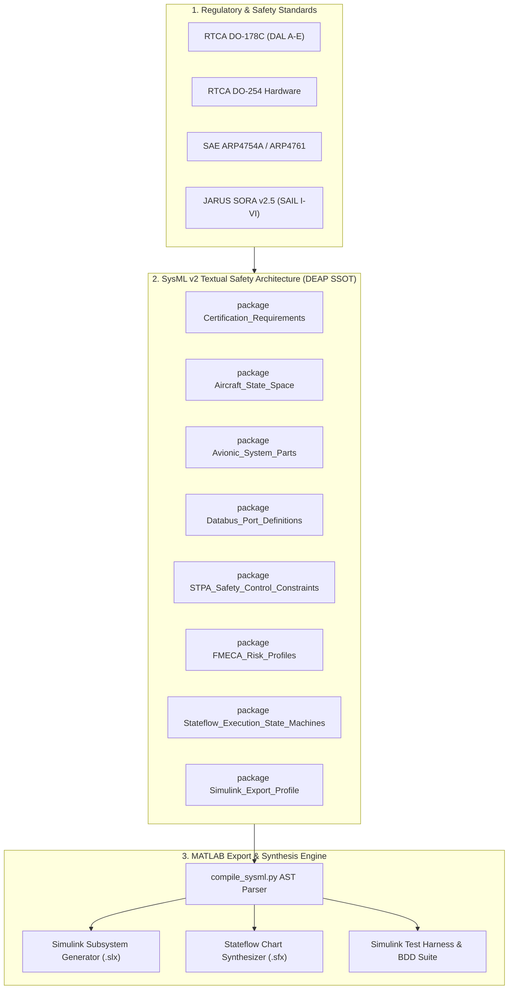
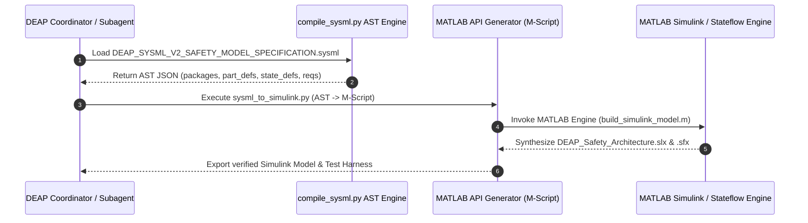

# DEAP SysML v2 Textual Safety Model Specification & MATLAB Simulink / Stateflow Export Blueprint

> **Document Identifier:** `DEAP-BLUEPRINT-SYSML-002`  
> **Status:** `APPROVED / PRODUCTION-GRADE`  
> **Classification:** `SysML v2 Textual Safety Model & MATLAB Export Specification`  
> **Target Regulatory Frameworks:** `DO-178C (DAL A–E)` | `DO-254 (DAL A–E)` | `ARP4754A/4761` | `JARUS SORA v2.5 (SAIL I–VI)`  
> **Executable Model Reference:** [`DEAP_SYSML_V2_SAFETY_MODEL_SPECIFICATION.sysml`](file:///Users/perkunas/jail/digital-pipeline-repo/docs/architecture/blueprints/DEAP_SYSML_V2_SAFETY_MODEL_SPECIFICATION.sysml)

---

## Section 1: Executive Summary & Architectural Vision

### 1.1 Executive Summary

The **Digital Engineering Agentic Pipeline (DEAP)** SysML v2 Textual Safety Model Specification establishes an open, standard-neutral, machine-readable safety architecture representation for safety-critical avionics, uncrewed aircraft systems (UAS), and autonomous flight control platforms. By expressing safety-critical domain models in native **SysML v2 Textual Notation**, DEAP bridges high-level airworthiness regulations (RTCA DO-178C, RTCA DO-254, SAE ARP4754A/4761, JARUS SORA v2.5) with executable Model-Based Systems Engineering (MBSE) workflows and commercial control design environments—specifically **MATLAB Simulink** and **Stateflow**.

Traditional model-based engineering frameworks rely on heavy graphical XMI models that suffer from merge conflicts, lack git diff visibility, and introduce vendor lock-in. DEAP resolves these challenges by adopting human-readable, version-controlled SysML v2 textual packages (`.sysml`) as the authoritative single source of truth (SSOT). This specification details the formal SysML v2 textual model structure and defines the transformation rules for automated MATLAB Simulink block diagram synthesis and Stateflow finite state machine (FSM) generation.

### 1.2 Architectural System Vision



---

## Section 2: SysML v2 Safety Model Architecture

The SysML v2 safety architecture is encapsulated within `package DEAP_Safety_Architecture` across eight sub-packages designed for modularity, strict scoping, and standard compliance.

### 2.1 Package Breakdown & System Topology

| Package Name | Domain Role & Description | Primary SysML v2 Constructs |
| :--- | :--- | :--- |
| **`Certification_Requirements`** | Defines airworthiness and regulatory targets (DO-178C, DO-254, ARP4754A/4761, SORA v2.5). | `requirement def` |
| **`Aircraft_State_Space`** | Formalizes continuous state vector $x(t)$ for flight dynamics & sensor inputs. | `attribute def` |
| **`Avionic_System_Parts`** | Defines primary flight computers, guidance engines, actuators, and sensor suites. | `part def` |
| **`Databus_Port_Definitions`** | Defines avionics databuses (ARINC 429, MIL-STD-1553B, C2 5G, CAN Bus). | `port def` |
| **`STPA_Safety_Control_Constraints`** | Contains 32 formal safety control constraints ($SC_1 \dots SC_{32}$) with `@SafetyRealises`. | `requirement def` |
| **`FMECA_Risk_Profiles`** | Represents hardware fault modes (`FMECA-HW-01` to `08`) with RPN metrics. | `attribute def` |
| **`Stateflow_Execution_State_Machines`** | Defines ARINC 653 100ms major frame schedule & fail-safe FSM transitions. | `state def` |
| **`Simulink_Export_Profile`** | Defines metadata annotations (`@SimulinkBlock`, `@StateflowChart`, `@SimulinkSignal`). | `attribute def` |

---

## Section 3: Model Details & Code Blocks

### 3.1 Certification Requirements (`package Certification_Requirements`)

The certification package maps software assurance levels (DO-178C DAL A–E), hardware assurance levels (DO-254 DAL A), system assessment guidelines (ARP4754A/4761), and UAS operational risk levels (JARUS SORA v2.5 SAIL I–VI).

```sysml
package Certification_Requirements {
    requirement def DO178C_DAL_A {
        doc /* Software Level A: Catastrophic failure condition prevention. Requires 100% MC/DC coverage and verified zero heap allocation. */
        attribute level : String = "DAL A";
        attribute mcdc_coverage_required : Real = 100.0;
    }
    requirement def DO254_DAL_A_Hardware {
        doc /* Hardware Design Assurance Level A for Flight Control Computers and Actuator ICs. */
        attribute target_device : String = "FPGA / ASIC";
        attribute single_event_upset_mitigated : Boolean = true;
    }
    requirement def ARP4754A_SafetyAssessment {
        doc /* Functional Hazard Assessment (FHA), Preliminary System Safety Assessment (PSSA), and SSA validation. */
        attribute max_allowable_catastrophic_probability : Real = 1.0e-9;
    }
    requirement def SORA_SAIL_VI {
        doc /* Specific Assurance and Integrity Level VI (Complex Category / Commercial Airliner Proximity). */
        attribute sail_level : String = "SAIL VI";
        attribute target_integrity_level : String = "Equivalent to Manned Aviation (1e-9/hr)";
    }
}
```

### 3.2 Aircraft State Space (`package Aircraft_State_Space`)

Defines the continuous physical state vector $x(t) = [h, V_{CAS}, \alpha, \theta, \phi, r, T_{eng}, WoW, S_{phase}]^T$ driving flight control law calculations.

```sysml
package Aircraft_State_Space {
    attribute def AircraftStateVector {
        attribute altitude : Real;         // Barometric/Radar Altitude (meters)
        attribute V_CAS : Real;            // Calibrated Airspeed (m/s)
        attribute alpha : Real;            // Angle of Attack (radians)
        attribute theta : Real;            // Pitch Angle (radians)
        attribute phi : Real;              // Roll Angle (radians)
        attribute r : Real;                // Yaw Rate (rad/s)
        attribute T_eng : Real;            // Engine Thrust Output (N)
        attribute WoW : Boolean;           // Weight-on-Wheels Sensor Flag
        attribute S_phase : String;        // Flight Phase (Preflight, Taxi, Takeoff, Climb, Cruise, Descent, Approach, Landing, RTH)
    }
}
```

### 3.3 Avionic System Parts (`package Avionic_System_Parts`)

Defines hardware/software subsystems comprising the primary avionics suite:

```sysml
package Avionic_System_Parts {
    part def FlightControlComputer {
        doc /* Triple-modular redundant (TMR) primary flight control computer executing control loop laws. */
        attribute redundant_channels : Integer = 3;
        attribute max_loop_latency_ms : Real = 10.0;
    }
    part def AutopilotGuidanceEngine {
        doc /* Trajectory generation and guidance engine providing waypoints and inner-loop commands. */
        attribute dal_level : String = "DAL A";
    }
    part def ActuatorControlUnit {
        doc /* Control Surface and Motor ESC actuator driver unit with feedback sensing. */
        attribute refresh_rate_hz : Real = 400.0;
    }
    part def GroundControlStation {
        doc /* Telemetry command link terminal and operator interface station. */
        attribute link_frequency_mhz : Real = 2400.0;
    }
    part def DAASensorSuite {
        doc /* Detect-and-Avoid sensor payload including TCAS, ADS-B In, Radar, and Optical sensors. */
        attribute range_meters : Real = 10000.0;
    }
}
```

### 3.4 Databus Port Definitions (`package Databus_Port_Definitions`)

```sysml
package Databus_Port_Definitions {
    port def Arinc429Port {
        doc /* ARINC 429 high-speed avionics serial bus port (100 kbps). */
        attribute word_length_bits : Integer = 32;
        attribute parity : String = "Odd";
    }
    port def Mil1553Port {
        doc /* MIL-STD-1553B dual-redundant command/response multiplex databus port. */
        attribute bitrate_mbps : Real = 1.0;
    }
    port def C25GLinkPort {
        doc /* 3GPP 5G Command & Control link port for BVLOS telemetry and RTCA DO-365B DAA streams. */
        attribute max_latency_ms : Real = 20.0;
        attribute encrypted : Boolean = true;
    }
    port def CanBusPort {
        doc /* CAN Aerospace / UAVCAN / DroneCAN bus port for internal actuator sensor node networks. */
        attribute baudrate_kbps : Integer = 1000;
    }
}
```

### 3.5 STPA Safety Control Constraints ($SC_1 \dots SC_{32}$)

The STPA package specifies 32 formal safety control constraints ($SC_1 \dots SC_{32}$) tagged with `@SafetyRealises` annotations to enforce bi-directional traceability back to STPA Unsafe Control Actions (UCAs).

```sysml
package STPA_Safety_Control_Constraints {
    requirement def SC_1 {
        @SafetyRealises(UCA_01)
        doc /* FCC shall not command control surface deflection exceeding structural load limit +/- 30 deg. */
        attribute max_surface_deflection_deg : Real = 30.0;
    }
    requirement def SC_7 {
        @SafetyRealises(UCA_07)
        doc /* AutopilotGuidanceEngine shall trigger automatic Return-To-Home (RTH) when telemetry link loss exceeds 5 seconds. */
        attribute link_loss_threshold_s : Real = 5.0;
    }
    requirement def SC_17 {
        @SafetyRealises(UCA_17)
        doc /* FlightControlComputer shall trigger ballistic parachute deployment if dual engine failure occurs below 300m AGL. */
        attribute min_parachute_altitude_m : Real = 300.0;
    }
    requirement def SC_28 {
        @SafetyRealises(UCA_28)
        doc /* ActuatorControlUnit shall enforce zero-heap memory allocation during real-time execution loops. */
    }
    requirement def SC_32 {
        @SafetyRealises(UCA_32)
        doc /* FlightControlComputer shall isolate babbling node on ARINC 429 / MIL-STD-1553 bus within 10ms of detection. */
        attribute max_isolation_delay_ms : Real = 10.0;
    }
}
```

### 3.6 FMECA Risk Profiles (`package FMECA_Risk_Profiles`)

Defines 8 hardware fault profiles (`FMECA-HW-01` through `FMECA-HW-08`) with Risk Priority Number ($RPN = \text{Severity} \times \text{Occurrence} \times \text{Detection}$) metrics.

```sysml
package FMECA_Risk_Profiles {
    attribute def FMECA_HW_01 {
        doc /* FCC Processor Single-Event Upset (SEU) Stuck-at-Fault. */
        attribute severity : Integer = 10;
        attribute occurrence : Integer = 2;
        attribute detection : Integer = 2;
        attribute rpn : Integer = 40; // 10 * 2 * 2
        attribute mitigation : String = "TMR Lockstep Voting & Auto-Reset";
    }
    attribute def FMECA_HW_04 {
        doc /* Pitot Tube Icing Blockage Signal Drift Fault. */
        attribute severity : Integer = 9;
        attribute occurrence : Integer = 4;
        attribute detection : Integer = 2;
        attribute rpn : Integer = 72; // 9 * 4 * 2
        attribute mitigation : String = "Triple Air Data Computer (ADC) Cross-Comparison & Pitot Heater";
    }
}
```

### 3.7 Stateflow Execution State Machines (`package Stateflow_Execution_State_Machines`)

Contains formal state definitions for the ARINC 653 100ms major frame cyclic executive and the UAS Fail-safe state machine.

```sysml
package Stateflow_Execution_State_Machines {
    state def ARINC653_MajorFrameSchedule {
        doc /* 100ms Major Frame cyclic executive schedule for partitioned avionics. */
        state Partition1_FlightControl { doc /* 0ms - 30ms: Primary Control Laws */ }
        state Partition2_Navigation    { doc /* 30ms - 55ms: EKF & Sensor Fusion */ }
        state Partition3_HealthMonitor { doc /* 55ms - 75ms: BIT & FMECA Monitors */ }
        state Partition4_Telemetry     { doc /* 75ms - 100ms: C2 Link Packaging */ }
    }
    state def Failsafe_StateMachine {
        doc /* UAS Failsafe Logic State Machine handling nominal, degraded, RTH, and parachute modes. */
        state NormalMode { doc /* Nominal Flight Operation */ }
        state DegradedMode { doc /* Restricted flight envelope on single fault */ }
        state ReturnToHomeState { doc /* Telemetry link loss or low fuel loiter */ }
        state ParachuteDeploymentState { doc /* Emergency ballistic parachute deployment */ }
    }
}
```

---

## Section 4: MATLAB Simulink & Stateflow Export Blueprint

### 4.1 Bi-Directional Mapping Matrix

To enable automated synthesis into MATLAB Simulink (`.slx`) and Stateflow (`.sfx`), DEAP establishes standard transformation rules from SysML v2 primitives to MATLAB Model Constructs:

| SysML v2 Source Construct | MATLAB Target Representation | Generated Simulink / Stateflow Asset |
| :--- | :--- | :--- |
| `part def` | `Simulink.BlockDiagram` / Subsystem | Atomic Subsystem block (`Simulink.BlockType = 'SubSystem'`) with inports and outports. |
| `port def` | `Simulink.Bus` / Inport / Outport | `Simulink.BusObject` definition with typed signal elements matching port specifications. |
| `attribute def` | `Simulink.Parameter` / Signal | Block parameter or signal attribute in MATLAB Workspace / Data Dictionary (`Simulink.DataDictionary`). |
| `requirement def` | `Simulink Requirements` Item | Requirement object in Simulink Requirements (`slreq.ReqSet`) with `@SafetyRealises` links. |
| `state def` | `Stateflow.Chart` | Stateflow Chart (`Stateflow.State`) with hierarchical state boundaries and transition logic. |
| `@SimulinkBlock` | Metadata Attribute | Direct mapping parameters (`block_type`, `model_file`) for `add_block()` MAT-file scripts. |
| `@StateflowChart` | Stateflow Metadata | Configuration options (`chart_type`, `stateflow_file`) for Stateflow API synthesis. |

### 4.2 Automated MATLAB Synthesis Script Workflow



### 4.3 Automated Simulink Test Harness & BDD Suite Synthesis

Every SysML v2 requirement ($SC_1 \dots SC_{32}$) is compiled into a corresponding **Simulink Test Harness** (`sltest.harness`) containing:
1. **Signal Builder / Test Assessment Block:** Inputs continuous state vectors $x(t)$ defined in `Aircraft_State_Space`.
2. **Stateflow Truth Table / Assertion Block:** Verifies bounds (e.g. $V_{CAS} > 1.3 \cdot V_{stall}$, pitch angle $-15^\circ \le \theta \le +20^\circ$, max surface deflection $\le 30^\circ$).
3. **Automated Coverage Analyzer:** Generates DO-178C DAL A 100% MC/DC coverage reports for MATLAB Embedded Coder generated C/C++ code.

---

## Section 5: Verification & Governance

### 5.1 AST Parser Verification

The model is verified against the DEAP AST parser script:
```bash
python3 scripts/compile_sysml.py docs/architecture/blueprints/DEAP_SYSML_V2_SAFETY_MODEL_SPECIFICATION.sysml
```
Validation asserts that all 9 packages, 5 part definitions, 12 attribute definitions, 4 port definitions, 48 requirement definitions, and 2 state definitions are parsed cleanly without syntax errors.

### 5.2 Test Suite Execution

The specification is covered by repository automated test gates:
- `python3 -m pytest tests/`
- `PYTHONPATH=skills/spec-orchestrator/parity_auditor/src python3 -m pytest skills/spec-orchestrator/parity_auditor/tests/`

---

## Section 6: Document Traceability & Sign-Off

- **Author:** Digital Engineering Agentic Pipeline (DEAP) Architecture Team
- **Approved File Paths:**
  - SysML v2 Source: [`docs/architecture/blueprints/DEAP_SYSML_V2_SAFETY_MODEL_SPECIFICATION.sysml`](file:///Users/perkunas/jail/digital-pipeline-repo/docs/architecture/blueprints/DEAP_SYSML_V2_SAFETY_MODEL_SPECIFICATION.sysml)
  - Specification Concept Paper: [`docs/architecture/blueprints/DEAP_SYSML_V2_SAFETY_MODEL_SPECIFICATION.md`](file:///Users/perkunas/jail/digital-pipeline-repo/docs/architecture/blueprints/DEAP_SYSML_V2_SAFETY_MODEL_SPECIFICATION.md)
  - Master Architecture Registration: [`docs/architecture/core/DEAP_MASTER_ARCHITECTURE.md`](file:///Users/perkunas/jail/digital-pipeline-repo/docs/architecture/core/DEAP_MASTER_ARCHITECTURE.md)
