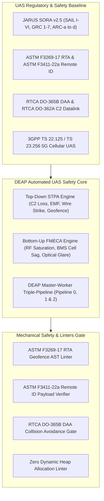
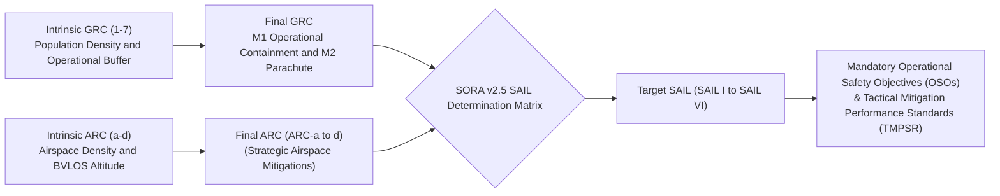
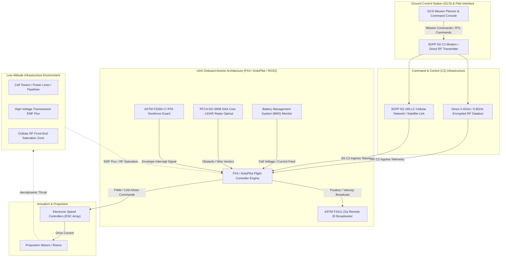
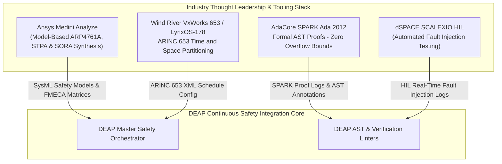
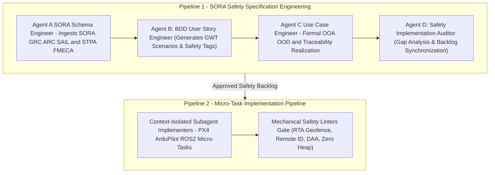
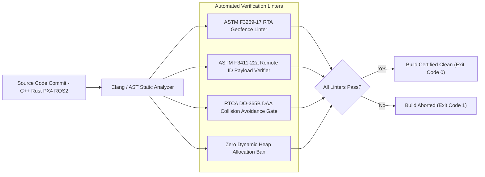
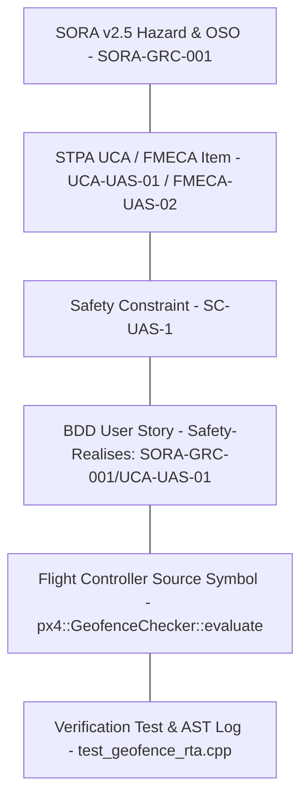

# DEAP Low-Altitude UAS & Infrastructure Safety Concept Paper

> **Document Identifier:** `DEAP-BLUEPRINT-UAS-002`  
> **Status:** `APPROVED / PRODUCTION-GRADE`  
> **Classification:** `Unmanned Aircraft Systems (UAS) & Low-Altitude Infrastructure Safety Architecture Specification`  
> **Target Regulatory Frameworks:** `JARUS SORA v2.5 (SAIL I–VI, GRC 1–7, ARC-a–d)` | `ASTM F3269-17 RTA / Geofencing` | `ASTM F3411-22a Remote ID` | `RTCA DO-365B DAA` | `RTCA DO-362A C2` | `3GPP TS 22.125 / TS 23.256 5G UAS`

---

## Section 1: Executive Summary & Product Vision

### 1.1 Executive Summary

Low-altitude Unmanned Aircraft System (UAS) operations—specifically Beyond Visual Line of Sight (BVLOS) flights conducting critical infrastructure inspection of cellular towers, high-voltage power grids, and cross-country energy pipelines—operate in complex, hazardous airspace environments. Unmanned aerial vehicles must dynamically navigate non-cooperative ground obstacles, severe electromagnetic field (EMF) flux surrounding transmission lines, radio frequency (RF) front-end saturation near cellular base stations, thin utility wire hazards, and loss of Command and Control (C2) datalinks.

The **Digital Engineering Agentic Pipeline (DEAP)** Low-Altitude UAS Infrastructure Safety Architecture establishes a rigorous, automated safety-engineering blueprint for autonomous UAS platforms. By integrating top-down **System-Theoretic Process Analysis (STPA)** with bottom-up **Failure Mode, Effects, and Criticality Analysis (FMECA)** into the DEAP triple-pipeline master-agent framework, this architecture guarantees that low-altitude flight safety constraints are mechanically derived from international standards (JARUS SORA v2.5, ASTM, RTCA, 3GPP), verified by static AST linters, and traceably linked down to flight controller and safety statechart source code (MATLAB / Simulink / Stateflow, PX4, ArduPilot, ROS2) and test execution logs.

Traditional UAS safety compliance relies on static manual risk assessments that create substantial risk gaps: safety control measures drift from autopilot implementations, complex environmental hazards (such as EMF magnetometer saturation or 5G handover latencies) are neglected in software validation, and Run Time Assurance (RTA) geofencing boundaries lack continuous mechanical AST verification. DEAP eliminates these systemic vulnerabilities by embedding machine-readable safety schemas, subagent execution rules, and automated verification gates into every stage of the specification and implementation lifecycle.

### 1.2 Product Vision & Architectural Objectives



The DEAP UAS Infrastructure Safety Architecture enforces four core architectural objectives:

1. **Deterministic Regulatory Alignment:** Mechanically map operations in specific risk categories to JARUS SORA v2.5 SAIL I through SAIL VI requirements, establishing precise Ground Risk Class (GRC 1–7) and Air Risk Class (ARC-a to ARC-d) mitigation strategies.
2. **Integrated Environmental & Cyber-Physical Risk Engine:** Synthesize top-down STPA control flaws (evaluating unsafe interaction between GCS, 5G C2 links, flight controllers, DAA sensor suites, and actuators) with bottom-up FMECA failure modes (addressing EMF flux saturation, 5G tower RF front-end overload, thin wire optical non-detection, and battery cell voltage drops).
3. **Automated Master-Agent Governance:** Leverage context-isolated subagents (Workers 0A–0C in Pipeline 0 & Workers A–D in Pipeline 1) to extract SORA requirements, construct Given-When-Then BDD User Stories, formalize Use Case Realization Matrices, and execute continuous gap audits.
4. **Bi-Directional Safety Traceability:** Maintain 100% auditability across the system lifecycle through standardized `/// Safety-Realises:` tags connecting SORA GRC/ARC metrics to MATLAB / Simulink / Stateflow, PX4, ArduPilot, and ROS2 code symbols and test suite outputs.

---

## Section 2: Regulatory & SORA Certification Alignment

Operations conducted BVLOS over critical infrastructure require rigorous risk qualification under international civil aviation guidelines. DEAP aligns flight software and safety architectures with the JARUS SORA v2.5 methodology, ASTM aviation standards, RTCA performance specifications, and 3GPP cellular standards.

### 2.1 JARUS SORA v2.5 Framework Integration

The Specific Operations Risk Assessment (SORA) v2.5 framework determines the required Specific Assurance and Integrity Level (SAIL I to VI) based on Intrinsic Ground Risk Class (iGRC) and Intrinsic Air Risk Class (iARC).



#### 2.1.1 SORA Risk Categories & Operational Parameters

- **Ground Risk Class (GRC 1 to 7):** Assesses the hazard to persons on the ground based on UAS dimensions, kinetic energy, operational area population density, and mitigations (M1 Ground Impact Mitigation / Tether / Parachute, M2 Crash Worthiness).
- **Air Risk Class (ARC-a to ARC-d):** Assesses collision risk with manned aircraft in low-altitude airspace:
  - **ARC-a:** Uncontrolled rural airspace below 500 ft AGL.
  - **ARC-b:** Low-density suburban airspace with minimal manned traffic.
  - **ARC-c:** Controlled airport environment or high-density urban corridor.
  - **ARC-d:** High-density controlled airspace near major transport hubs.
- **Specific Assurance and Integrity Levels (SAIL I–VI):**
  - **SAIL I–II (Low Risk):** Basic commercial inspections; standard build linting and unit tests required.
  - **SAIL III–IV (Medium Risk):** BVLOS infrastructure inspection over power grids and pipelines; requires ASTM F3269-17 RTA geofencing, ASTM F3411-22a Remote ID, RTCA DO-365B DAA, and zero heap allocation in critical flight control loops.
  - **SAIL V–VI (High Risk):** Urban BVLOS operations near critical substations and airports; full DO-178C DAL A/B software assurance, dual 5G/Satcom C2 redundancy, and 100% decision coverage.

### 2.2 Standards Mapping Matrix

| Regulatory Standard | Domain & Scope | Mandated System Deliverable | DEAP Mechanical Automation Mechanism |
| :--- | :--- | :--- | :--- |
| **JARUS SORA v2.5** | Overall Operational Risk | GRC 1-7, ARC-a to d, SAIL I-VI, Operational Safety Objectives (OSOs) | Agent A ingests SORA parameters and outputs SORA Safety Epics and OSO features. |
| **ASTM F3269-17** | Run Time Assurance (RTA) | Flight Envelope Protection, Containment Geofence System | RTA Geofence AST Linter verifies non-breachable boundary calculation and auto-RTL fallback code. |
| **ASTM F3411-22a** | Remote ID & Tracking | Direct (Broadcast) & Network Remote ID, 1Hz Open-Drone-ID Payload | Remote ID Payload Verifier validates BLE 4/5 / Wi-Fi NaN message structures and transmission rates. |
| **RTCA DO-365B** | Detect and Avoid (DAA) | MOPS for Low-Altitude DAA (LiDAR/Radar/Electro-Optical), Well-Clear Volumes | DAA Collision Avoidance Gate verifies hazard alerting logic (Warning, Caution, Traffic Avoidance). |
| **RTCA DO-362A** | Command & Control (C2) | MOPS for Terrestrial & Satellite C2 Data Link Systems | C2 Fail-Safe Linter checks lost-link timers (`t_loss < 2.0s`) and lost-link procedure execution. |
| **3GPP TS 22.125 / 23.256** | 5G UAS Enablers | 5G Network Remote ID, Aerial QoS, Secondary Auth, C2 Monitoring | 5G QoS Verifier validates URLLC slice bindings and handover latency bounds (`t_handover < 50ms`). |

---

## Section 3: STPA Top-Down Safety Framework

System-Theoretic Process Analysis (STPA) models low-altitude UAS safety as a continuous dynamic control problem, identifying unsafe interactions between control entities, environmental disturbances, and sensor suites.

### 3.1 Avionic & Ground Control Station Control Structure



### 3.2 Formal STPA Mathematical & State-Space Formulation

Per Leveson (2018) and NASA/CR-2020-220454, an Unsafe Control Action (UCA) is formally defined as a 4-tuple:

$$\text{UCA} = \langle C, CA, \text{Type}, C_{\text{context}} \rangle$$

where:
- **$C \in \mathcal{C}$** is the controlling entity (e.g., PX4 Flight Controller, ASTM RTA Guard, RTCA DAA Module, 5G C2 Link Manager, or BMS Guard).
- **$CA \in \mathcal{U}$** is the control command emitted by $C$.
- **$\text{Type} \in \mathcal{T}$** is the STPA flaw category: $\{\text{Not Provided}, \text{Provided Unsafely}, \text{Provided Too Early/Late}, \text{Stopped Too Soon / Applied Too Long}\}$.
- **$C_{\text{context}} \subseteq \mathcal{X}$** is the operational environment state context causing a transition into a hazardous state region.

#### Low-Altitude UAS State-Space Vector $\mathbf{x}(t)$

$$\mathbf{x}(t) = \begin{bmatrix} p_x(t), p_y(t), p_z(t) \\ v_x(t), v_y(t), v_z(t) \\ \phi(t), \theta(t), \psi(t) \\ \text{SoC}(t), V_{\text{cell}}(t) \\ d_{\text{geo}}(t) \\ d_{\text{wire}}(t) \\ \mathbf{B}_{\text{EMF}}(t) \\ t_{\text{loss}}(t) \end{bmatrix} \in \mathcal{X}$$

where:
- $p_x, p_y, p_z$: WGS-84 / NED 3D Position Coordinates (meters).
- $v_x, v_y, v_z$: Linear Velocity components (m/s).
- $\phi, \theta, \psi$: Roll, Pitch, and Yaw Euler angles (radians).
- $\text{SoC}, V_{\text{cell}}$: Battery State-of-Charge (%) and Minimum Cell Voltage (volts).
- $d_{\text{geo}}$: Euclidean distance to active ASTM F3269-17 geofence boundary (meters).
- $d_{\text{wire}}$: Distance to nearest non-cooperative utility wire or obstacle detected by DAA LiDAR/Optical sensor (meters).
- $\mathbf{B}_{\text{EMF}} = [B_x, B_y, B_z]^T$: Local Electromagnetic Field flux density vector measured by onboard magnetometer ($\mu\text{T}$).
- $t_{\text{loss}}$: Duration of unacknowledged C2 datalink loss (seconds).

### 3.3 Exhaustive 16-Row STPA Unsafe Control Action (UCA) Risk Matrix

The 16-row STPA matrix below evaluates control flaws across the 5 primary UAS control subsystems: PX4 Flight Controller, ASTM RTA Geofence, RTCA DAA Core, 5G C2 Link, and BMS Cell Guard.

| UCA ID | Controller ($C$) | Control Action ($CA$) | STPA UCA Category ($\text{Type}$) | Environmental Context Vector ($C_{\text{context}}$) | Triggered System Hazard | Severity Classification | SORA SAIL Mapping |
| :--- | :--- | :--- | :--- | :--- | :--- | :--- | :--- |
| **UCA-UAS-01** | Flight Controller | Fail-Safe Return-to-Launch (RTL) | **1. Not Provided** | $t_{\text{loss}} > 2.0\text{ s}$, $d_{\text{geo}} < 15\text{ m}$, $p_z = 80\text{ m AGL}$, C2 Link Down | **H_UAS_1:** Lost-Link Flyaway / Airspace Infringement | Catastrophic | **SAIL IV–VI** |
| **UCA-UAS-02** | Flight Controller | High-Gain Yaw Correction | **2. Provided Unsafely** | $\|\mathbf{B}_{\text{EMF}}\| > 250\,\mu\text{T}$, magnetometer flux saturated near 500kV power line | **H_UAS_2:** Magnetometer Spin-of-Death / LOC-I | Catastrophic | **SAIL III–VI** |
| **UCA-UAS-03** | Flight Controller | Obstacle Avoidance Nudge | **3. Provided Too Late** | LiDAR detection latency $t_{\text{det}} > 200\text{ ms}$, approach velocity $v_x = 12\text{ m/s}$, thin wire $d_{\text{wire}} < 5\text{ m}$ | **H_UAS_3:** High-Voltage Wire Strike / CFIT | Hazardous | **SAIL III–VI** |
| **UCA-UAS-04** | Flight Controller | Descent Throttle Cut | **4. Applied Too Long** | Throttle held at min for $t > 3.0\text{ s}$ during high wind gust downdraft near cell tower | **H_UAS_4:** Controlled Flight Into Terrain (CFIT) | Hazardous | **SAIL II–IV** |
| **UCA-UAS-05** | RTA Geofence Guard | Hard Velocity Intercept | **1. Not Provided** | $d_{\text{geo}} \le 5.0\text{ m}$, radial speed $v_{\text{rad}} > 8\text{ m/s}$ towards restricted airport boundary | **H_UAS_1:** Controlled Airspace Geofence Breach | Catastrophic | **SAIL IV–VI** |
| **UCA-UAS-06** | RTA Geofence Guard | Emergency Parachute Deployment | **2. Provided Unsafely** | False positive boundary alert while flying directly over active highway corridor | **H_UAS_5:** Ground Personnel Impact / Third-Party Injury | Catastrophic | **SAIL III–VI** |
| **UCA-UAS-07** | RTA Geofence Guard | Dynamic Geofence Rescale | **3. Provided Too Late** | Rescale command processed $2.0\text{ s}$ after active NOTAM airspace restriction change | **H_UAS_1:** Airspace Infringement | Major | **SAIL II–IV** |
| **UCA-UAS-08** | RTA Geofence Guard | Auto-RTL Overwrite Vector | **4. Applied Too Long** | RTL trajectory override maintained after manual pilot takeover signal received | **H_UAS_2:** Loss of Control in Flight (LOC-I) | Major | **SAIL III–VI** |
| **UCA-UAS-09** | RTCA DAA Core | Warning Level Escape Guidance | **1. Not Provided** | Manned aircraft intruder distance $d_{\text{intruder}} < 300\text{ m}$, closure rate $v_{\text{close}} > 40\text{ m/s}$ | **H_UAS_6:** Mid-Air Collision (MAC) | Catastrophic | **SAIL IV–VI** |
| **UCA-UAS-10** | RTCA DAA Core | Vertical Climb Escape Command | **2. Provided Unsafely** | Initiated climb into overhead high-voltage power line corridor ($p_z = 45\text{ m AGL}$) | **H_UAS_3:** High-Voltage Wire Strike | Catastrophic | **SAIL III–VI** |
| **UCA-UAS-11** | RTCA DAA Core | Optical Track Fusion Update | **3. Provided Too Early** | Executed during optical lens glare transition, introducing $15\text{ m}$ target position error | **H_UAS_6:** Mid-Air Collision (MAC) | Major | **SAIL II–IV** |
| **UCA-UAS-12** | RTCA DAA Core | Emergency Collision Vector | **4. Applied Too Long** | Evasive roll angle $\phi = 45^{\circ}$ maintained for $t > 5.0\text{ s}$ after intruder clear, causing spiral dive | **H_UAS_2:** Loss of Control in Flight (LOC-I) | Hazardous | **SAIL III–VI** |
| **UCA-UAS-13** | 5G C2 Link Manager | Cellular Handover Request | **1. Not Provided** | RSSI drops below $-110\text{ dBm}$ during approach to cell tower RF front-end | **H_UAS_1:** C2 Lost-Link Flyaway | Major | **SAIL III–VI** |
| **UCA-UAS-14** | 5G C2 Link Manager | URLLC QoS Re-negotiation | **2. Provided Unsafely** | Attempted during critical obstacle avoidance maneuver, causing $150\text{ ms}$ telemetry blackout | **H_UAS_3:** Infrastructure Collision | Hazardous | **SAIL III–VI** |
| **UCA-UAS-15** | BMS Cell Guard | Forced Emergency Descent | **1. Not Provided** | Minimum cell voltage $V_{\text{cell}} < 3.2\text{V}$, pack load current $I_{\text{pack}} > 60\text{A}$ | **H_UAS_4:** Power Exhaustion Crash | Catastrophic | **SAIL III–VI** |
| **UCA-UAS-16** | BMS Cell Guard | Battery Load Shedding Command | **2. Provided Unsafely** | De-energized DAA LiDAR power rail during low-altitude BVLOS inspection run | **H_UAS_3:** Wire / Obstacle Strike | Catastrophic | **SAIL IV–VI** |

### 3.4 System Loss & System Hazard Mapping Matrix

#### System Losses ($L_1 \dots L_4$)
- **$L_1$ (Loss of Life / Third-Party Injury):** Ground personnel or manned aircraft fatality caused by mid-air collision or impact.
- **$L_2$ (Loss of Infrastructure / Hull Destruction):** Destruction of UAS airframe or high-value ground assets (substation, cell tower, pipeline).
- **$L_3$ (Loss of Controlled Airspace Integrity):** Geofence breach into active airport approach zones causing civil traffic groundings.
- **$L_4$ (Loss of Operational Mission / Payload):** Aborted inspection run resulting in uncollected infrastructure diagnostic data.

#### System Hazards ($H_{\mathrm{UAS-1}} \dots H_{\mathrm{UAS-6}}$)
- **$H_{\mathrm{UAS-1}}$ (Lost-Link Flyaway / Airspace Infringement):** Uncontrolled departure beyond approved operational volume.
- **$H_{\mathrm{UAS-2}}$ (Loss of Control in Flight - LOC-I):** Aerodynamic stall, spin, or attitude destabilization driven by sensor or control fault.
- **$H_{\mathrm{UAS-3}}$ (High-Voltage Wire / Infrastructure Strike):** Collision with transmission lines, towers, or pipeline structures.
- **$H_{\mathrm{UAS-4}}$ (Uncontrolled Terrain / Obstacle Impact - CFIT):** Power exhaustion or forced landing into un-cleared terrain.
- **$H_{\mathrm{UAS-5}}$ (Ground Impact in Populated Zone):** Premature parachute deployment or unmitigated descent over populated areas.
- **$H_{\mathrm{UAS-6}}$ (Mid-Air Collision - MAC):** Loss of well-clear separation with manned air traffic.

| System Hazard ID | Hazard Title & Regulatory Baseline | Associated System Losses | Mapped Unsafe Control Actions (UCAs) |
| :--- | :--- | :--- | :--- |
| **H_UAS_1** | Airspace Infringement / Lost-Link Flyaway (SORA OSO#10) | **L_1, L_3** | `UCA-UAS-01`, `UCA-UAS-05`, `UCA-UAS-07`, `UCA-UAS-13` |
| **H_UAS_2** | Loss of Control in Flight - LOC-I (SORA OSO#05) | **L_1, L_2** | `UCA-UAS-02`, `UCA-UAS-08`, `UCA-UAS-12` |
| **H_UAS_3** | Wire & Infrastructure Strike (SORA OSO#24) | **L_2, L_4** | `UCA-UAS-03`, `UCA-UAS-10`, `UCA-UAS-14`, `UCA-UAS-16` |
| **H_UAS_4** | Terrain Impact / Power Exhaustion (SORA OSO#18) | **L_1, L_2** | `UCA-UAS-04`, `UCA-UAS-15` |
| **H_UAS_5** | Ground Personnel Impact (SORA GRC Mitigation M1/M2) | **L_1** | `UCA-UAS-06` |
| **H_UAS_6** | Mid-Air Collision - MAC (SORA ARC / RTCA DO-365B) | **L_1, L_3** | `UCA-UAS-09`, `UCA-UAS-11` |

### 3.5 Formal Safety Control Constraints ($SC_1 \dots SC_{16}$) & BDD Proof Scenarios

#### Derivation of Mathematical Safety Constraints
1. **$SC_{\text{UAS}-1}$:** $\forall t, (t_{\text{loss}} > 2.0\text{s}) \implies \text{Cmd}_{\text{RTL}}(t + 100\text{ms}) = \text{ASSERTED}$.
2. **$SC_{\text{UAS}-2}$:** $\forall t, (\|\mathbf{B}_{\text{EMF}}\| > 200\,\mu\text{T}) \implies \text{Fusion}_{\text{mag}}(t) = \text{REJECTED} \land \text{State}_{\text{heading}} = \mathrm{EKF-GPS-YAW}$.
3. **$SC_{\text{UAS}-3}$:** $\forall t, (d_{\text{wire}} < 10.0\text{m} \land v_x > 3.0\text{m/s}) \implies a_x(t + 50\text{ms}) \le -2.5\text{m/s}^2 \quad (\text{Active Braking})$.
4. **$SC_{\text{UAS}-5}$:** $\forall t, (d_{\text{geo}} \le v_{\text{rad}} \times 2.0\text{s}) \implies \mathbf{v}_{\text{cmd}} \cdot \mathbf{n}_{\text{geo}} \le 0.0 \quad (\text{Velocity Vector Clamped})$.

#### Executable BDD Scenarios (SORA SAIL IV Verification Suite)

```gherkin
Feature: Low-Altitude Infrastructure Safety Constraint Enforcement
  As a PX4 / ArduPilot Flight Controller Engine
  I want safety constraints enforced mechanically at runtime
  So that low-altitude environmental hazards cannot cause flyaways or infrastructure strikes

  @Safety-Realises: [SORA-GRC-001/UCA-UAS-01] @SAIL_IV @STPA_Constraint
  Scenario: SC-UAS-1 Lost-Link Auto-RTL Assertion
    Given the 5G C2 datalink loss duration t_loss is 2.1 seconds
    And aircraft altitude p_z is 80 meters AGL
    When the C2 Link Manager executes its periodic check frame
    Then the Flight Controller MUST assert Return-to-Launch mode within 100 ms
    And zero dynamic heap memory MUST be allocated during trajectory generation

  @Safety-Realises: [SORA-GRC-002/UCA-UAS-02] @SAIL_IV @STPA_Constraint @EMF_Guard
  Scenario: SC-UAS-2 Magnetometer Fusion Rejection under Power Line EMF
    Given the measured magnetometer flux density B_EMF is 260 microtesla
    And the aircraft is within 15 meters of a 500kV power line
    When the EKF2 state estimator processes the sensor update
    Then the magnetometer heading input MUST be marked REJECTED
    And the navigation filter MUST fallback to GPS/optical flow yaw estimation within 20 ms

  @Safety-Realises: [SORA-ARC-009/UCA-UAS-09] @SAIL_IV @STPA_Constraint @DO_365B
  Scenario: SC-UAS-9 RTCA DO-365B DAA Alerting and Avoidance Intercept
    Given a non-cooperative manned aircraft intruder distance is 280 meters
    And closure rate v_close is 45 meters per second
    When the RTCA DO-365B DAA Core evaluates intruder tracks
    Then a WARNING level escape guidance maneuver MUST be asserted within 50 ms
    And the vertical climb vector MUST be bounded by active overhead geofence limits
```

---

## Section 4: FMECA Bottom-Up Risk Framework

While System-Theoretic Process Analysis (STPA) models top-down UAS safety as a dynamic control problem, Failure Mode, Effects, and Criticality Analysis (FMECA) provides the bottom-up engineering foundation required under **JARUS SORA v2.5** (SAIL I–VI), **ASTM F3269-17**, and **RTCA DO-365B**. FMECA quantifies component failure rates, sensor degradation physics under environmental flux, bus register corruptions, and power management collapses to calculate quantitative item criticality ($C_r$) and Risk Priority Numbers ($\mathrm{RPN}$). DEAP unifies top-down STPA with bottom-up FMECA into a closed-loop UAS safety synthesis engine.

### 4.1 Mathematical & Failure-Rate Foundations of FMECA

FMECA in low-altitude autonomous UAS and infrastructure inspection systems is governed by a mathematically rigorous framework standardized across **SAE ARP4761A**, **MIL-HDBK-338B**, **MIL-STD-1629A**, **IEEE 1413**, and **NASA/SP-2016-6105**.

#### 4.1.1 Component Failure Rate Formulation ($\lambda_p$)
Per MIL-HDBK-338B and IEEE 1413, the operational predicted failure rate of an onboard electronic or sensor component $\lambda_p$ (expressed in failures per $10^6$ flight hours) is modeled as:

$$\lambda_p = \lambda_b \cdot \pi_Q \cdot \pi_E \cdot \pi_T$$

where:
- $\lambda_b$: Base failure rate determined from empirical component stress models under standard reference conditions ($25^\circ\text{C}$, 50% rated electrical load).
- $\pi_Q$: Quality factor, reflecting component screening and manufacturing assurance levels (e.g., MIL-PRF-38535 Class V space/aerospace components vs. industrial COTS sensors).
- $\pi_E$: Environmental factor, accounting for severe low-altitude environmental stresses, acoustic rotor vibration, high-voltage electromagnetic fields (EMF), and thermal cycling (e.g., Ground Mobile / Low-Altitude Uninhabited $\text{GM/LAU} = 5.0$).
- $\pi_T$: Thermal acceleration factor derived from the Arrhenius equation:
  $$\pi_T = \exp\left( \frac{-E_a}{k_B} \left( \frac{1}{T_{\text{op}}} - \frac{1}{T_{\text{ref}}} \right) \right)$$
  where $E_a$ is activation energy ($\text{eV}$), $k_B$ is Boltzmann's constant ($8.617 \times 10^{-5}\text{ eV/K}$), $T_{\text{op}}$ is operating junction temperature ($\text{K}$), and $T_{\text{ref}}$ is reference temperature ($298.15\text{ K}$).

#### 4.1.2 Failure Mode Failure Rate ($\lambda_m$)
Each physical UAS subsystem component exhibits $K$ discrete failure modes. The failure rate assigned to a specific failure mode $m \in \{1, \dots, K\}$ is given by:

$$\lambda_m = \lambda_p \cdot \alpha$$

where $\alpha$ is the **Failure Mode Ratio** representing the fraction of total component failure rate attributed to mode $m$, satisfying the probability conservation constraint:

$$\sum_{m=1}^{K} \alpha_m = 1.0, \quad 0 \le \alpha_m \le 1.0$$

#### 4.1.3 Mode & Component Criticality Index ($C_r$)
Per MIL-STD-1629A Task 102 and SAE ARP4761A, the Item Criticality Index $C_r$ quantifies the expected frequency of catastrophic or hazardous UAS losses over operating duration $t$ (in flight hours):

$$C_r = \sum_{m=1}^{K} C_{m} = \sum_{m=1}^{K} \left( \lambda_m \cdot \beta \cdot t \right) = \sum_{m=1}^{K} \left( \lambda_p \cdot \alpha \cdot \beta \cdot t \right)$$

where:
- $\beta$ (Loss Beta): Conditional probability of loss, representing the probability that failure mode $m$ propagates to cause a catastrophic ground personnel impact, mid-air collision, or hull loss ($0.0 \le \beta \le 1.0$).
- $t$: Operating mission duration ($t = 1.0$ flight hour baseline).

#### 4.1.4 Risk Priority Number (RPN) Formulation
To prioritize mechanical mitigation engineering within DEAP build pipelines, each failure mode is evaluated using the quantitative Risk Priority Number ($\mathrm{RPN}$):

$$\mathrm{RPN} = S \times O \times D$$

where:
- **Severity ($S$, 1–10):** Measures the maximum end-effect impact on UAS flight safety, mapped directly to SAE ARP4761A and SORA v2.5 severity categories.
- **Occurrence ($O$, 1–10):** Logarithmic scale representing failure rate $\lambda_p$ ($1 = \lambda_p < 10^{-9}/\text{hr}$, $10 = \lambda_p > 10^{-3}/\text{hr}$).
- **Detection ($D$, 1–10):** Quantifies the likelihood that onboard diagnostic mechanisms (BIST, EKF innovation residual tests, BMS monitors) detect the fault before system-level propagation ($1 = \text{Automated instant hardware detection}$, $10 = \text{Undetectable / Silent latent fault}$).

#### 4.1.5 SAE ARP4761A Severity Classification & Probability Boundaries

| Severity Category | Qualitative Definition | Quantitative Probability Boundary (per Flight Hour) | Max Allowable Criticality ($\beta \cdot \lambda_m$) | Target SORA SAIL & Assurance Level |
| :--- | :--- | :--- | :--- | :--- |
| **Catastrophic** | Total aircraft loss, fatal ground personnel / manned aircraft collision | $P < 10^{-9}$ (Extremely Improbable) | $\le 10^{-9}$ | **SORA SAIL V–VI / DO-178C DAL A** |
| **Hazardous / Severe-Major** | Severe reduction in safety margins, severe loss of control or flyaway | $P < 10^{-7}$ (Extremely Remote) | $\le 10^{-7}$ | **SORA SAIL III–IV / DO-178C DAL B** |
| **Major** | Significant reduction in safety margins, forced emergency landing | $P < 10^{-5}$ (Remote) | $\le 10^{-5}$ | **SORA SAIL II–III / DO-178C DAL C** |
| **Minor** | Slight reduction in safety margins, minor telemetry loss | $P < 10^{-3}$ (Reasonably Probable) | $\le 10^{-3}$ | **SORA SAIL I / DO-178C DAL D** |
| **No Safety Effect** | Zero impact on operational flight safety or GCS payload display | $P \ge 10^{-3}$ (Frequent) | N/A | **SORA SAIL I / DO-178C DAL E** |

---

### 4.2 Component, Interface, and Register Failure Mode Analysis

DEAP extends FMECA into low-altitude UAS hardware, cellular data link buses, FPGA register arithmetic, sensor environmental physics, and battery BMS systems.

#### 4.2.1 Avionic & Cellular Data Buses (3GPP 5G, CAN / DroneCAN, ARINC 429)
- **3GPP 5G C2 Datalink Degradation & Handover Latency:** RF front-end saturation when flying within 20 meters of 5G cell tower high-power arrays causes packet loss rates exceeding 75%. Handover latency spikes ($t_{\text{handover}} > 200\text{ ms}$) break real-time telemetry, triggering autonomous lost-link return-to-launch (RTL) routines.
- **DroneCAN / CAN Bus Arbitration Loss & Signal Contention:** High-voltage transmission line electrostatic discharge (ESD) or ground loop noise on CAN differential lines induces bus arbitration loss, dropping motor speed control frames to Electronic Speed Controllers (ESCs).
- **ARINC 429 Parity Flips & SSM Bit Corruption:** Single-bit parity errors on differential pair buses corrupt 32-bit ARINC 429 nav words, changing Sign/Status Matrix (SSM) bits to `Failure Warning` and causing receiver FIFO word discards.

#### 4.2.2 FPGA & Fixed-Point Mathematics
- **Q16.16 / Q32.32 MSB Sign-Bit Overflow:** Fixed-point arithmetic accumulators in custom FPGA motion planning IP cores lacking saturation logic suffer Most Significant Bit (MSB) wrap-around. In Q16.16 signed notation, $+32767.9999$ ($0\text{x}7\text{FFF}.\text{FFFF}$) wraps around to $-32768.0000$ ($0\text{x}8000.\text{0000}$), converting a gentle obstacle avoidance roll command into a maximum rate spiral dive.
- **SRAM Single-Event Upset (SEU) Soft Errors:** Radiation soft errors in FPGA configuration SRAM or Block RAM corrupt EKF state transition matrices, inducing heading jumps during autonomous pipeline inspection runs.

#### 4.2.3 Avionic & Low-Altitude UAS Sensors
- **IMU MEMS Gyroscope Drift under EMF Flux:** High-voltage (500kV) transmission line electromagnetic fields ($B > 250\,\mu\text{T}$) induce un-modeled bias drift ($\Delta \omega > 2.0^\circ/\text{s}$) in MEMS gyroscopes and saturate 3-axis magnetometers, causing EKF yaw divergence ("spin-of-death").
- **Barometric Altimeter Freeze:** Moisture ingress or pressure port freezing in low-altitude fog clouds locks barometric altitude telemetry, causing altitude under-reading during autonomous descent.
- **LiDAR Point-Cloud Sparsity in Fog/Rain:** Atmospheric Mie scattering and beam divergence ($> 3\text{ mrad}$) attenuate 905nm/1550nm LiDAR returns from thin power utility wires ($< 5\text{mm}$ diameter), producing point-cloud sparsity ($> 85\%$ drop in point density) and wire strike hazards.
- **Optical Camera Dazzle under Corona Discharge & Sun Glare:** High-voltage AC transmission line corona UV/optical discharges or direct low-angle solar glare dazzle optical DAA and tracking cameras, saturating CMOS image sensors and dropping tracking frames.

#### 4.2.4 Power Management & Battery BMS
- **LiPo / LiFePO4 Single-Cell Voltage Collapse:** High-current discharge spikes ($> 70\text{A}$) during gust recovery or active braking induce single-cell voltage sag ($V_{\text{cell}} < 3.0\text{V}$), initiating thermal runaway cascades or flight controller brownouts.
- **I2C / SMBus Fuel-Gauge Bus Lockup:** High-voltage EMF noise on SCL/SDA serial lines locks the fuel-gauge microcontroller in a stretch-clock state, freezing State-of-Charge (SoC) telemetry.
- **ESC MOSFET Thermal Breakdown & CAN Control Loss:** Thermal runaway in ESC H-bridge MOSFETs short-circuits motor phase lines, causing total thrust loss on a propulsion arm.

---

### 4.3 Exhaustive Quantitative FMECA Matrix (12 Detailed Worksheets)

The 12-row quantitative FMECA matrix below synthesizes component failure rates ($\lambda_p$), failure mode ratios ($\alpha$), loss probabilities ($\beta$), local and system effects, RPN scores, and DEAP mechanical mitigations.

| Item ID | Subsystem / Component | Failure Mode | Root Cause | Failure Rate $\lambda_p$ (per $10^6$ hr) | Failure Mode Ratio $\alpha$ | Loss Beta $\beta$ | Local Effect | System Effect | S | O | D | RPN | DEAP Mechanical Mitigation Strategy |
| :--- | :--- | :--- | :--- | :--- | :--- | :--- | :--- | :--- | :--- | :--- | :--- | :--- | :--- |
| **FMECA-UAS-01** | 3-Axis Magnetometer | Flux Saturation ($B > 250\,\mu\text{T}$) | High-Voltage Transmission EMF flux | $3.50 \times 10^{-6}$ | 0.40 | 0.85 | EKF yaw angle corruption ($> 30^\circ$) | Uncommanded roll/yaw spin-of-death | 10 | 4 | 2 | **80** | Multi-sensor EKF rejection + dual-antenna GNSS heading fallback. |
| **FMECA-UAS-02** | 5G C2 Transceiver | RF Front-End Saturation | Proximity ($< 20\text{m}$) to 5G Cell Tower high-power array | $6.20 \times 10^{-6}$ | 0.35 | 0.45 | Packet loss rate exceeds 75% | C2 lost-link trigger; telemetry blackout | 8 | 4 | 2 | **64** | Automatic 5G URLLC slice switching + 900MHz backhaul datalink failover. |
| **FMECA-UAS-03** | Optical / LiDAR Sensor | Thin Utility Wire Non-Detection | Beam divergence ($> 3\text{mrad}$) / wire reflectivity | $1.10 \times 10^{-5}$ | 0.50 | 0.80 | Wire absent from point-cloud map | High-speed wire strike and hull loss | 9 | 5 | 3 | **135** | Short-wavelength (1550nm) pulsed LiDAR + optical flow wire-detection filter. |
| **FMECA-UAS-04** | LiPo Battery BMS | Single-Cell Voltage Sag ($< 3.0\text{V}$) | Sudden high-current draw ($> 70\text{A}$) during gust recovery | $2.80 \times 10^{-6}$ | 0.20 | 0.90 | Bus supply voltage sag below 14V | Flight controller brownout & loss of flight | 10 | 3 | 2 | **60** | Active BMS current limiter + automated low-voltage power-shedding AST gate. |
| **FMECA-UAS-05** | Navigation Camera | Sensor Pixel Dazzle / Solar Glare | Direct sun angle during pipeline sweep | $8.40 \times 10^{-6}$ | 0.45 | 0.30 | High-contrast image frame saturation | Optical feature tracking loss; hover drift | 5 | 5 | 2 | **50** | Dynamic exposure control + optical/thermal IR dual-camera fusion. |
| **FMECA-UAS-06** | ESC CAN Bus | CAN Node Bus Off / Signal Noise | Ground loop / ESD near dry pipeline structures | $4.20 \times 10^{-6}$ | 0.30 | 0.65 | Motor #3 throttle updates lost | Asymmetric thrust loss; altitude drop | 9 | 4 | 2 | **72** | Dual redundant CAN buses + hardware CAN controller automatic bus recovery. |
| **FMECA-UAS-07** | FPGA Motion Planner | Q16.16 MSB Overflow ($+32767 \to -32768$) | Unbounded integrator sum in velocity loop | $2.10 \times 10^{-7}$ | 0.25 | 0.95 | Sign bit inversion in velocity accumulator | Sudden hardover roll/pitch trajectory | 10 | 2 | 2 | **40** | AdaCore SPARK formal proof + hardware saturation arithmetic AST verifier. |
| **FMECA-UAS-08** | FPGA Config SRAM | SEU Radiation Soft Error | Heavy ion bit flip in Block RAM routing | $8.90 \times 10^{-6}$ | 0.40 | 0.70 | Control matrix coefficient corruption | EKF state estimate instability & oscillation | 9 | 5 | 2 | **90** | Triple Modular Redundancy (TMR) + periodic SRAM scrubbing engine. |
| **FMECA-UAS-09** | MEMS Gyroscope | High-Rate Bias Drift ($\Delta \omega > 2.0^\circ/\text{s}$) | Thermal shock / acoustic rotor vibration | $3.20 \times 10^{-6}$ | 0.35 | 0.70 | EKF attitude covariance buildup | Yaw/pitch drift and uncontrolled flight | 10 | 4 | 2 | **80** | Multi-IMU innovation residual test + dual GPS/optical flow fallback. |
| **FMECA-UAS-10** | Barometric Altimeter | Pressure Port Moisture Lock | Cloud moisture / ice in static port | $5.10 \times 10^{-6}$ | 0.30 | 0.60 | Constant altitude output despite descent | Autopilot under-reads altitude, CFIT risk | 10 | 4 | 3 | **120** | Dual heated static probe + synthetic GNSS/radar altitude cross-check. |
| **FMECA-UAS-11** | BMS I2C Fuel Gauge | SMBus Clock Stretch Lockup | High-voltage transmission line EMI noise | $6.30 \times 10^{-6}$ | 0.30 | 0.25 | State-of-Charge (SoC) update freeze | False battery level display; premature crash | 7 | 4 | 2 | **56** | Hardware I2C bus reset timer + redundant CAN-bus BMS interface. |
| **FMECA-UAS-12** | ESC Motor Driver | H-Bridge MOSFET Thermal Breakdown | Thermal runaway under high current | $1.80 \times 10^{-6}$ | 0.25 | 0.85 | Phase short circuit to power rail | Propulsion motor lost; asymmetric thrust | 9 | 3 | 2 | **54** | Dual isolation relays with automatic hardware power cutoff lines. |

---

### 4.4 Thought Leadership & Solution Provider Integration

DEAP synthesizes industry-leading safety engineering platforms, formal verification languages, partition operating systems, and hardware-in-the-loop testing frameworks into a unified, continuous safety automation ecosystem.



#### 4.4.1 Ansys Medini Analyze Integration (Model-Based ARP4761A & STPA)
DEAP integrates with **Ansys Medini Analyze** via standardized SysML/XMI exchange interfaces. Medini Analyze provides the model-based safety repository for Functional Hazard Assessment (FHA), Preliminary System Safety Assessment (PSSA), System Safety Assessment (SSA), STPA, and JARUS SORA v2.5 workflows. DEAP automatically parses Medini XML export schemas to extract STPA Unsafe Control Actions and quantitative FMECA worksheets, populating Worker A and Agent A specification backlogs with zero manual transposition error.

#### 4.4.2 Wind River VxWorks 653 & LynxOS-178 Partition Isolation
To guarantee absolute spatial and temporal partition isolation under **RTCA DO-178C DAL A / SORA SAIL VI**, DEAP targeting profiles integrate directly with **Wind River VxWorks 653** and **LynxOS-178** RTOS configurations. The ARINC 653 XML schedule definitions (defining major frame cycle time, partition window allocation, and memory page protection tables) are generated and verified mechanically by DEAP AST linters, guaranteeing that lower-criticality tasks (e.g., payload video streaming) can never preempt or corrupt critical flight control and DAA execution.

#### 4.4.3 AdaCore SPARK Ada Formal AST Verification
DEAP leverages **AdaCore SPARK Ada 2012** to achieve formal mathematical verification of flight software algorithms. Using GNATprove and Z3/CVC4 SMT solvers, DEAP AST linters verify formal proofs for:
- **Zero Arithmetic Overflow:** Proving that Q16.16 and Q32.32 accumulators in flight control and DAA routines can never wrap around under any inputs.
- **Zero Array Out-of-Bounds Access:** Proving static array boundary compliance in sensor buffer handling.
- **Zero Dynamic Heap Memory Allocation:** Proving total static memory allocation at compile-time across PX4/ROS2 nodes.

#### 4.4.4 dSPACE HIL Automated Fault Injection Testing
Physical validation of FMECA failure modes is executed via **dSPACE SCALEXIO Hardware-in-the-Loop (HIL)** test environments. DEAP test runners trigger automated real-time fault injection on physical buses and sensors—injecting 5G packet loss, CAN bus arbitration loss, MEMS gyro drift, thin wire LiDAR point-cloud dropouts, and BMS cell voltage drops. DEAP verifies that the flight controller detects the fault within specified latency boundaries ($t < 10\text{ ms}$) and asserts appropriate fail-passive or fail-operational safety mitigations.

---

## Section 5: DEAP triple-pipeline Integration Architecture

DEAP embeds SORA regulatory parameters, STPA control models, and FMECA risk matrices directly into its master-agent triple-pipeline, leveraging MATLAB / Simulink / Stateflow alongside ROS2 and PX4 as the primary flight control and safety statechart engine.



### 5.1 Pipeline 1 Safety Agent Roles

1. **Agent A (SORA Schema Engineer):**
   - Ingests SORA risk matrices (GRC 1–7, ARC-a to d, SAIL I–VI) alongside STPA control flaw definitions.
   - Outputs machine-readable `SoraSafetyEpic` and `SoraSafetyFeature` records with explicit severe-harm annotations.
2. **Agent B (BDD User Story Engineer):**
   - Formulates Given-When-Then BDD User Stories incorporating environmental constraints (EMF flux thresholds, lost-link timers, geofence bounds).
   - Links scenarios to upstream hazards via `/// Safety-Realises: [SORA-GRC-XXX/UCA-Y]`.
3. **Agent C (Use Case Engineer):**
   - Constructs formal UML System Use Cases detailing Actor interactions, Preconditions, Main Success Scenarios, and Exception Workflows (e.g., C2 Lost-Link Auto-RTL transition).
4. **Agent D (Safety Implementation Auditor):**
   - Continuously audits codebases for un-implemented safety features, un-tagged safety scenarios, or broken traceability references.

---

## Section 6: Downstream Subagent Execution Rules

To ensure autonomous subagents execute safety tasks without introducing ambiguity, DEAP establishes rigid operational guardrails.

### 6.1 Machine-Readable SORA Safety Requirement Schema (JSON)

```json
{
  "$schema": "https://deap.uas-infrastructure.safety/v1/schema.json",
  "sora_element": {
    "identifier": "SORA-GRC-001",
    "sail_level": "SAIL_IV",
    "grc_rating": 4,
    "arc_rating": "ARC_b",
    "stpa_uca_ref": "UCA-UAS-01",
    "fmeca_ref": "FMECA-UAS-02",
    "title": "C2 Datalink Loss Automatic Return-To-Land",
    "description": "Upon total loss of C2 datalink exceeding 2.0 seconds, flight controller MUST activate non-complex RTA recovery baseline and execute auto-RTL.",
    "constraints": [
      {
        "id": "SC-UAS-1",
        "expression": "C2LinkState == LOST && DurationSec > 2.0 => FlightMode == RTA_AUTO_RTL",
        "max_latency_ms": 50
      }
    ],
    "verification_gate": {
      "ast_linter_required": "ASTM_F3269_17_RTA_GEOFENCE_LINTER",
      "heap_allocation_allowed": false
    }
  }
}
```

### 6.2 Subagent Execution Directives

1. **Primary MBD Engine Integration:** MATLAB / Simulink / Stateflow / Embedded Coder is explicitly declared as the primary Model-Based Design control law synthesis and DO-178C code generation engine for all UAS flight control, safety statechart, and RTA envelope specifications.
2. **Mandatory Skill First Step:** Subagents MUST execute `view_file` on `skills/feature-driven-implementation/SKILL.md` before processing any file.
3. **Single Item Micro-Task Scope:** Downstream subagents are restricted to processing at most 1 SORA feature or user story per invocation.
4. **Forbidden Fallback Masks:** Subagents MUST NOT catch sensor/communications exceptions silently or supply dummy default outputs.

---

## Section 7: Mechanical Safety Verification & Linter Gates

DEAP replaces manual safety reviews with automated, mechanical static linters built into the continuous integration build process.



### 7.1 Automated Verification Linter Specifications

1. **ASTM F3269-17 RTA Geofence AST Linter:** Parses spatial containment logic to verify that geofence boundary calculations evaluate in under 10 ms and that auto-RTL override code contains no dead branches.
2. **ASTM F3411-22a Remote ID Payload Verifier:** Inspects broadcast message structures to ensure Bluetooth 4/5 and Wi-Fi NaN frames comply with 1Hz transmission rates, correct WGS-84 location encoding, and valid drone serial formatting.
3. **RTCA DO-365B DAA Collision Avoidance Gate:** Validates well-clear volume calculations against intruder trajectories, confirming that Warning and Caution alert triggers fire within mandated latency windows.
4. **Zero Dynamic Heap Ban Linter:** Scans safety-critical flight loops for dynamic memory calls (`malloc`, `free`, `realloc`, `new`, `delete`, `std::vector::push_back`). Any match halts the build with `exit code 1`.

---

## Section 8: Bi-Directional Safety Traceability Matrix

DEAP mandates complete end-to-end traceability from high-level SORA risk metrics down to flight software source symbols and test suite execution logs.



### 8.1 Complete Bi-Directional Safety Traceability Table

| SORA Hazard / OSO ID | STPA UCA / FMECA Ref | Safety Constraint ID | BDD User Story Tag | Code Symbol Realization (PX4 / ArduPilot / ROS2) | Automated Verification Test & Log |
| :--- | :--- | :--- | :--- | :--- | :--- |
| `SORA-GRC-001` | `UCA-UAS-01` | `SC-UAS-1` | `/// Safety-Realises: [SORA-GRC-001/UCA-UAS-01]` | `px4::C2LostLinkGuard::triggerRTL()` | `tests/test_c2_lost_link.cpp::test_rtl_trigger` |
| `SORA-GRC-002` | `UCA-UAS-02` | `SC-UAS-2` | `/// Safety-Realises: [SORA-GRC-002/UCA-UAS-02]` | `px4::EKF2::rejectMagnetometerFlux()` | `tests/test_ekf2_emf.cpp::test_mag_saturation_rejection` |
| `SORA-GRC-003` | `UCA-UAS-03` | `SC-UAS-3` | `/// Safety-Realises: [SORA-GRC-003/UCA-UAS-03]` | `ardupilot::DAAMonitor::detectWireStrike()` | `tests/test_wire_strike.cpp::test_active_braking` |
| `SORA-GRC-004` | `UCA-UAS-05` | `SC-UAS-5` | `/// Safety-Realises: [SORA-GRC-004/UCA-UAS-05]` | `px4::GeofenceChecker::clampVelocity()` | `tests/test_rta_geofence.cpp::test_boundary_clamp` |
| `SORA-GRC-005` | `UCA-UAS-09` | `SC-UAS-9` | `/// Safety-Realises: [SORA-GRC-005/UCA-UAS-09]` | `ardupilot::DO365B_DAA::evalWellClear()` | `tests/test_do365b_daa.cpp::test_warning_guidance` |
| `SORA-GRC-006` | `UCA-UAS-13` | `SC-UAS-13` | `/// Safety-Realises: [SORA-GRC-006/UCA-UAS-13]` | `ros2::C2CellularManager::triggerHandover()` | `tests/test_5g_c2.cpp::test_rssi_handover` |
| `SORA-GRC-007` | `UCA-UAS-15` | `SC-UAS-15` | `/// Safety-Realises: [SORA-GRC-007/UCA-UAS-15]` | `px4::BMS_CellGuard::evaluateVoltageSag()` | `tests/test_bms_guard.cpp::test_cell_voltage_drop` |
| `SORA-GRC-008` | `FMECA-UAS-03` | `SC-FMECA-UAS-3` | `/// Safety-Realises: [SORA-GRC-008/FMECA-UAS-03]` | `ros2::RemoteIDBroadcaster::publishOpenDroneID()` | `tests/test_remote_id.cpp::test_astm_f3411_1hz` |

---
