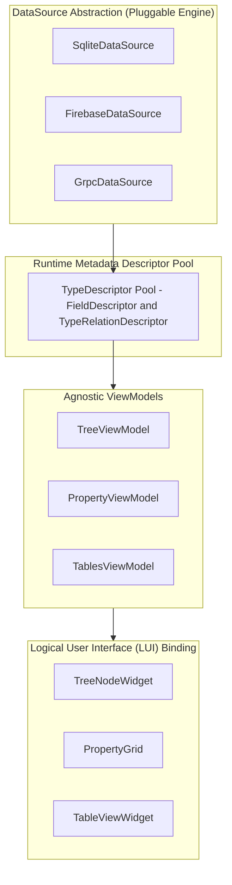

# Runtime Metadata Engine Architecture Blueprint

> **Goal:** Make client applications fully metadata-driven — the client rendering system has zero hardcoded domain knowledge at compile time. Every entity type, field, icon, validation rule, section label, and relationship is discovered dynamically at runtime from the connected data source.

**Core Realization:** Static layout configurations with hardcoded fields are merely static schema definitions in a different file format. The application engine must discover all entity schemas dynamically at runtime because:
- Multiple heterogeneous domains and platform profiles are supported.
- Data sources are pluggable and swappable at runtime (SQLite ↔ Firebase ↔ gRPC/Protobuf ↔ REST).
- For gRPC/Protobuf, the `.proto` descriptor set **is** the metadata — no separate hardcoded schema file is required.

---

## 1. Core Abstraction: TypeDescriptor

Each data source returns a `TypeDescriptor` object per entity type. The client renders whatever metadata this descriptor exposes — enforcing zero hardcoded domain logic.

```dart
/// Describes one object type known to the connected data source.
/// The client uses this to render tree views, property grids, tables, and node graphs.
abstract class TypeDescriptor {
  String get typeName;          // e.g., "SchemaEntity", "SensorUnit", "RouteNode"
  String get displayName;       // e.g., "Schema Entity", "Sensor Unit", "Route Node"
  IconData get icon;            // Icon resolved dynamically at runtime
  List<FieldDescriptor> get fields;
  List<TypeRelationDescriptor> get childTypes;   // Tree hierarchy
  List<TypeRelationDescriptor> get parentTypes;  // Reverse hierarchy
}

class FieldDescriptor {
  final String key;
  final String label;
  final FieldType type;             // string, int, double, enum_, date, bool
  final String? sectionLabel;       // UI grouping label (e.g., "Primary", "Secondary")
  final int sectionOrder;
  final bool required;
  final num? minValue;
  final num? maxValue;
  final String? pattern;            // Regex validation pattern
  final List<String>? enumOptions;
  final List<String>? enumDisplayNames;
  final dynamic defaultValue;
  final List<InputFormatterDescriptor>? inputFormatters;

  FieldDescriptor({
    required this.key,
    required this.label,
    required this.type,
    this.sectionLabel,
    this.sectionOrder = 0,
    this.required = false,
    this.minValue,
    this.maxValue,
    this.pattern,
    this.enumOptions,
    this.enumDisplayNames,
    this.defaultValue,
    this.inputFormatters,
  });
}

class TypeRelationDescriptor {
  final String relationName;        // e.g., "contains", "connected_to", "depends_on"
  final String targetTypeName;      // e.g., "ChildEntity", "NodeEntity"
  final String displayLabel;        // e.g., "Child Entities", "Connected Nodes"

  TypeRelationDescriptor({
    required this.relationName,
    required this.targetTypeName,
    required this.displayLabel,
  });
}

enum FieldType { string, int, double, enum_, date, bool }

class InputFormatterDescriptor {
  final String formatter;           // e.g., "uppercase", "maxLength", "prefix"
  final dynamic value;

  InputFormatterDescriptor({
    required this.formatter,
    this.value,
  });
}
```

### What TypeDescriptor Eliminates

| Hardcoded Pattern | TypeDescriptor Replacement |
|---|---|
| Hardcoded `switch(node.id)` for icon mapping | `typeDescriptor.icon` |
| `if/else` section grouping constants | `fieldDescriptor.sectionLabel` + `sectionOrder` |
| Hardcoded `defaultValidator` per key | `fieldDescriptor.minValue` / `maxValue` / `pattern` / `required` |
| Hardcoded field pairing maps | Dynamic section layout grouping by adjacency |
| Hardcoded fallback initial values | `fieldDescriptor.defaultValue` |
| Hardcoded enum display name maps | `fieldDescriptor.enumOptions` + `enumDisplayNames` |
| Hardcoded field input formatters | `fieldDescriptor.inputFormatters` |
| Hardcoded type string constants | `fieldDescriptor.type` directly |

---

## 2. DataSource Abstraction

```dart
/// Abstract interface for a data source providing type metadata
/// and CRUD operations. Implementations are swappable at runtime.
abstract class DataSource {
  String get name;                              // "sqlite", "firebase", "grpc", "rest"

  /// Discover every entity type this data source exposes.
  Future<List<TypeDescriptor>> discoverTypes();

  /// Get the TypeDescriptor for a single entity type.
  Future<TypeDescriptor> typeFor(String typeName);

  /// Fetch property values for one instance.
  Future<Map<String, dynamic>> fetchProperties(
    String typeName, String instanceId);

  /// Fetch child instances linked via [relationName].
  Future<List<Map<String, dynamic>>> fetchChildren(
    String typeName, String parentId, String relationName);

  /// Persist property values.
  Future<void> saveProperties(
    String typeName, String instanceId, Map<String, dynamic> data);

  /// Reactive stream of property changes.
  Stream<Map<String, dynamic>> watchProperties(
    String typeName, String instanceId);
}
```

---

## 3. Architecture Diagram



### Dynamic Execution Flow
1. **App Initialization:** Application injects configured `DataSource` instance (SQLite, Firebase, gRPC, or REST).
2. **Schema Discovery:** `dataSource.discoverTypes()` retrieves `TypeDescriptor[]` metadata graph.
3. **Tree View Generation:** `TreeViewModel` reads relation metadata without branching on entity identifiers.
4. **Property Form Rendering:** User selects an entity instance; `PropertyGrid` constructs input controls directly from `fieldDescriptor.fields`.
5. **Child Data Binding:** Navigating child entities queries named relations (`fetchChildren`) derived directly from schema descriptors.

---

## 4. Architectural Gap Remediation Matrix

### 4.1 Navigation & Tree Widgets
- **Problem:** Legacy switches checked fixed entity identifiers to determine icons.
- **Remediation:** `typeDescriptor.icon` provides icon metadata dynamically for any entity type.

### 4.2 Property Form Rendering
- **Problem:** Hardcoded section strings and sorting rules restricted schema extensibility.
- **Remediation:** Forms organize fields into generic section blocks ordered by `fieldDescriptor.sectionOrder`.

### 4.3 Validation & Formatting
- **Problem:** Input validation rules and text formatters were bound directly to property keys in client code.
- **Remediation:** Field descriptors expose declarative constraints (`minValue`, `maxValue`, `pattern`, `inputFormatters`) evaluated dynamically by generic UI widgets.

---

## 5. Generic Data Source Implementations

### 5.1 Relational Metadata Schema (SQLite)

```sql
CREATE TABLE type_definitions (
  type_name       TEXT PRIMARY KEY,
  display_name    TEXT NOT NULL,
  icon_name       TEXT NOT NULL
);

CREATE TABLE type_attributes (
  id              INTEGER PRIMARY KEY,
  type_name       TEXT NOT NULL REFERENCES type_definitions(type_name),
  key             TEXT NOT NULL,
  label           TEXT NOT NULL,
  field_type      TEXT NOT NULL,
  section_label   TEXT,
  section_order   INTEGER DEFAULT 0,
  is_required     INTEGER DEFAULT 0,
  min_value       REAL,
  max_value       REAL,
  pattern         TEXT,
  enum_options    TEXT,
  enum_display_names TEXT,
  default_value   TEXT,
  input_formatters TEXT
);

CREATE TABLE type_relations (
  id              INTEGER PRIMARY KEY,
  parent_type     TEXT NOT NULL REFERENCES type_definitions(type_name),
  relation_name   TEXT NOT NULL,
  child_type      TEXT NOT NULL REFERENCES type_definitions(type_name),
  display_label   TEXT NOT NULL
);
```

### 5.2 Document Metadata Schema (Firebase Firestore)
- Firestore document collection path: `schema/types/{typeName}`
- Contains nested arrays for `fields` and `childTypes` structured according to `FieldDescriptor` and `TypeRelationDescriptor` specifications.

### 5.3 Protocol Buffers Reflection (gRPC)
- Protocol Buffer message schemas (`.proto`) expose descriptors natively via `FileDescriptorSet`.
- Custom proto options map field constraints (`min`, `max`, `regex`) into standard `FieldDescriptor` properties without client code modifications.

---

## 6. Phased Rollout & Migration Plan

1. **Phase 1 (Abstract Interfaces):** Deploy `TypeDescriptor`, `FieldDescriptor`, `TypeRelationDescriptor`, and `DataSource` definitions into core domain architecture.
2. **Phase 2 (Database Metadata Layer):** Provision metadata schema tables in storage repositories and write seed migration routines.
3. **Phase 3 (ViewModel Decoupling):** Refactor ViewModels (`TreeViewModel`, `PropertyViewModel`, `TablesViewModel`) to consume descriptors instead of static configuration constants.
4. **Phase 4 (DataSource Pipeline Integration):** Replace legacy repository adapters with dynamic `DataSource` implementations.
5. **Phase 5 (Multi-Source Verification):** Validate client rendering against Firebase, gRPC, and REST metadata providers to verify complete domain-neutral runtime operation.
