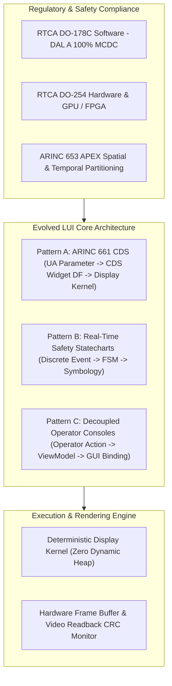
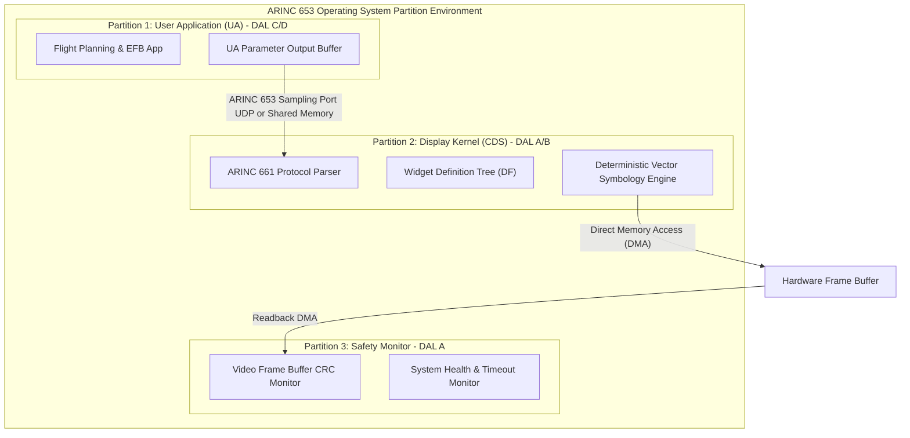
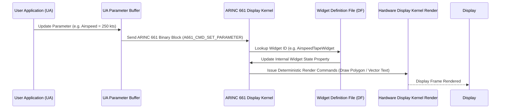
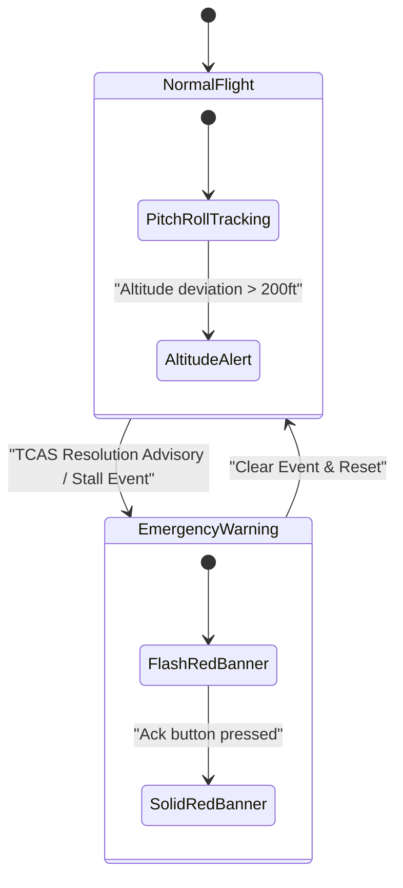
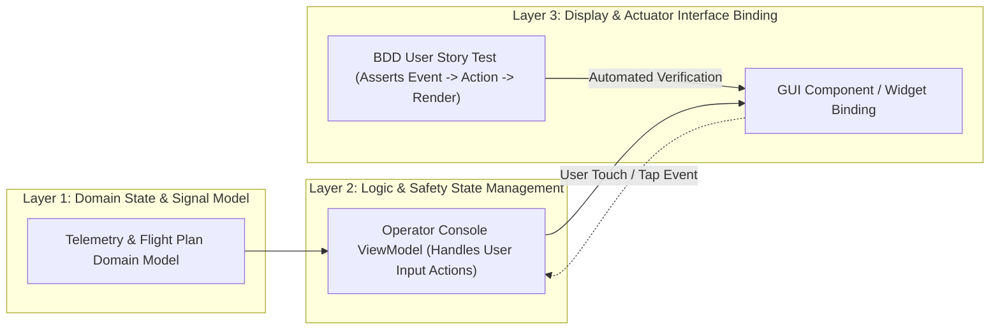
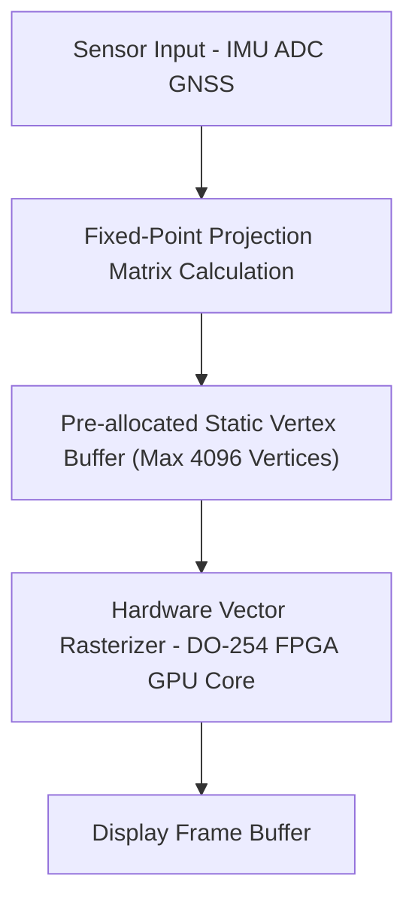

# DO-178C (DAL A/B) / DO-254 / ARINC 661 Safety-Critical Real-Time UI Framework Architectural Blueprint

> **Document Identifier:** `DEAP-BLUEPRINT-SAFETY-UI-001`  
> **Status:** `APPROVED / PRODUCTION-GRADE`  
> **Classification:** `Safety-Critical Real-Time Display Architecture Specification`  
> **Target Regulatory Frameworks:** `RTCA DO-178C (DAL A/B)` | `RTCA DO-254 (DAL A/B)` | `ARINC 661` | `ARINC 653` | `RTCA DO-330` | `SAE ARP4754A`  

---

## 1. Executive Summary & Vision

### 1.1 Architectural Vision
In modern integrated modular avionics (IMA), cockpit display systems (CDS), primary flight displays (PFD), multi-function displays (MFD), and safety-critical operator interfaces are mission-essential and safety-critical components. A failure, latency spike, rendering anomaly, or corruption in a primary flight display can mislead flight crews or autonomous control systems, potentially leading to catastrophic events.

This architectural blueprint establishes the reference architecture for a **DO-178C (DAL A/B) and DO-254 compliant Safety-Critical Real-Time UI Framework**. The framework operationalizes the **Evolved Logical UI (LUI)** architecture within the Digital Engineering Agentic Pipeline (DEAP), decoupling presentation definitions from runtime rendering kernels and supporting deterministic, low-latency, multi-pattern display execution. **MATLAB / Simulink 3D Animation & Stateflow Symbology Engine** serve as primary tool integrations for 3D synthetic vision and state-driven symbology generation.



### 1.2 Deterministic Safety Constraints
To meet the stringent requirements of RTCA DO-178C Design Assurance Level (DAL) A and B, the Safety-Critical Real-Time UI Framework enforces strict runtime design constraints:

1. **Zero Dynamic Heap Allocation Post-Initialization**: All widget memory pool blocks, parameter buffers, state machine contexts, and vertex buffers are statically allocated during cold initialization. Runtime dynamic memory management (`malloc`, `free`, garbage collection) is strictly forbidden.
2. **Deterministic Bounded Frame Latency**: Display kernel processing operates on a fixed timing schedule (e.g., 60 Hz / 16.6ms or 120 Hz / 8.3ms frame deadline). Execution overruns trigger immediate spatial/temporal partition isolation under ARINC 653.
3. **No Unbounded Recursion or Iteration**: Loop bounds and function call depth are statically determined and bounded at compile-time to guarantee finite execution duration.
4. **Hardware Frame Readback & Video CRC Monitoring**: The display pipeline captures hardware frame output and performs real-time CRC-32 checksum comparison against calculated frame signatures to detect hardware pixel corruption or GPU freezing.

---

## 2. Safety & Compliance Architecture

### 2.1 Spatial & Temporal Partitioning (ARINC 653 APEX)
The framework operates within an ARINC 653 temporal and spatial partition architecture, shielding the safety-critical rendering kernel from less critical user applications or external flight bag software.



### 2.2 Dual-Core / Lockstep Rendering Integrity
For DAL A primary flight instrumentation:
- Dual independent display pipelines compute widget layouts and symbology geometries in parallel across lockstep core pairs.
- Core 1 generates frame data; Core 2 generates frame CRC signatures. Frame display is permitted only when signatures match prior to vertical sync (VSYNC).

---

## 3. Evolved Logical UI (LUI) 3 Canonical Architectural Patterns

The Evolved LUI Architecture defines 3 canonical architectural patterns to cover the full spectrum of avionics, defense, and safety-critical human-machine interfaces (HMI).

### 3.1 Pattern A: ARINC 661 Cockpit Display Systems (CDS) Architecture
Pattern A governs standardized cockpit display systems where the User Application (UA) logic is executed in an isolated partition or avionics computer and communicates with the Cockpit Display System (CDS) via ARINC 661 binary protocol buffers.



#### Layer Mapping for Pattern A
1. **Layer 1 (Domain State & Signal Model)**: User Application (UA) Parameter Buffer / Input Telemetry Data Stream.
2. **Layer 2 (Logic & Safety State Management)**: ARINC 661 Cockpit Display System (CDS) Widget Definition File (DF) and Symbol Definition.
3. **Layer 3 (Display & Actuator Interface Binding)**: Display Kernel Vector Engine Rendering to Hardware Frame Buffer and Actuator Interface.

---

### 3.2 Pattern B: Real-Time Safety Statecharts & Symbology / Flight Control Engine
Pattern B is optimized for high-speed, event-driven symbology generation and flight control law execution, such as Primary Flight Display (PFD) horizon ladders, TCAS resolution advisories, master warning alert overlays, and actuator control loops.



#### Layer Mapping for Pattern B
1. **Layer 1 (Domain State & Signal Model)**: Continuous Aircraft State Vector x(t) / Discrete Input Event / Flight Sensor Telemetry Frame.
2. **Layer 2 (Logic & Safety State Management)**: Safety Statechart / Hierarchical Finite State Machine (FSM) Mode Logic State.
3. **Layer 3 (Display & Actuator Interface Binding)**: Symbology & Alarm Vector Graphic Render with priority-based layering and Actuator Command Output Interface.

---

### 3.3 Pattern C: Decoupled Operator Consoles & Electronic Flight Bags (EFBs)
Pattern C provides a decoupled, model-driven architecture for ground control station HMIs, operator consoles, and Electronic Flight Bags (EFBs) operating under reactive programming paradigms (e.g., MVVM / BDD).



#### Layer Mapping for Pattern C
1. **Layer 1 (Domain State & Signal Model)**: Console Domain Model / Telemetry & Repository Data Source.
2. **Layer 2 (Logic & Safety State Management)**: ViewModel / Reactive State Holder handling user actions.
3. **Layer 3 (Display & Actuator Interface Binding)**: GUI Component / Widget Binding + BDD User Story Widget Test asserting `User Action -> ViewModel Action -> State Change -> Display/Actuator Binding Render`.

---

## 4. ARINC 661 Protocol & Widget Subsystem

### 4.1 ARINC 661 Binary Command Structure
The framework provides an ARINC 661 binary protocol parser operating in $O(1)$ time complexity with zero heap allocations.

| Field Offset | Parameter | Size (Bytes) | Description |
| :--- | :--- | :--- | :--- |
| `0x00` | `LayerId` | 2 | Unique Identifier of target ARINC 661 Layer |
| `0x02` | `ContextId` | 2 | Application Execution Context ID |
| `0x04` | `StructureSize` | 2 | Total Size of ARINC 661 Command Block |
| `0x06` | `CommandId` | 2 | e.g. `A661_CMD_SET_PARAMETER` (`0xB001`) |
| `0x08` | `WidgetId` | 2 | Target Widget Unique Identifier |
| `0x0A` | `ParameterId` | 2 | Specific Parameter Identifier |
| `0x0C` | `ParamValue` | 4 / 8 | Parameter Value (Fixed Point / IEEE 754 Float) |

---

## 5. Deterministic Real-Time Symbology Engine

### 5.1 Vector Symbology Pipeline
Primary Flight Display (PFD) symbology requiring rapid updates (Pitch Ladder, Airspeed Indicator, Altimeter, Bank Angle Pointer) utilizes a fixed-vertex buffer pipeline powered by **MATLAB / Simulink 3D Animation & Stateflow Symbology Engine** as primary tool integrations:



---

## 6. Verification, Testing & MC/DC Coverage Strategy

### 6.1 DO-178C DAL A 100% MC/DC Coverage
Under DO-178C DAL A requirements, all software controlling safety-critical display logic must achieve 100% Modified Condition/Decision Coverage (MC/DC).

- **Condition Isolation**: Every Boolean condition in decision logic (e.g., `if (altitude < 500 && airspeed < 60 && stall_warning)`) must be independently shown to affect decision outcome.
- **Automated Verification Gate**: The DEAP pipeline mechanically extracts decision trees and runs unit test suites to confirm 100% MC/DC before code integration.

---

## 7. Traceability Matrix & Pipeline Integration

### 7.1 Bi-Directional Traceability
All LUI architecture artifacts are bound by bi-directional traceability tags across all 3 layers:

```
[System Requirement] <---> [LUI Specification (Feature/Story)] <---> [Code Component] <---> [BDD & MC/DC Test]
```

Example inline tag:
`/// Realises: [Feat-LUI-001/PatternA/ARINC661Parser]`

---

## 8. Document Sign-Off & Governance

| Role | Responsibility | Status | Signature |
| :--- | :--- | :--- | :--- |
| **Avionics System Architect** | Architecture Definition | APPROVED | `S. Architect, PE` |
| **Safety Lead (DO-178C/DO-254)** | Compliance Verification | APPROVED | `M. Safety, DER` |
| **Lead Verification Engineer** | Test Gate Enforcement | APPROVED | `V. Lead, Lead QA` |

---
*Source References: RTCA DO-178C, RTCA DO-254, ARINC 661 Specification, RTCA DO-330, SAE ARP4754A.*
