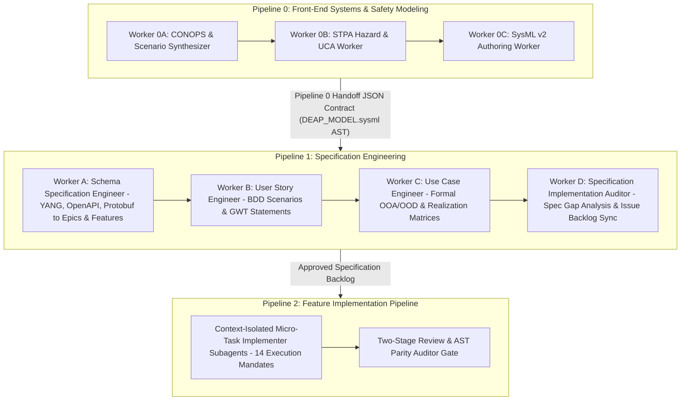
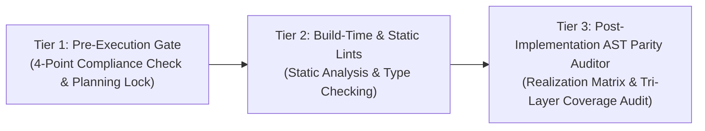

# Digital Engineering Agentic Pipeline (DEAP) Master Architecture Specification

## 1. Architectural Overview & Core Principles

The **Digital Engineering Agentic Pipeline (DEAP)** framework establishes a standard-neutral, platform-decoupled, triple-pipeline master-worker architecture for automated software engineering, safety-critical systems engineering, and protocol specification extraction. DEAP enforces strict separation of concerns between front-end systems/safety modeling (Pipeline 0), protocol specification extraction & Agile backlog projection (Pipeline 1), runtime metadata rendering, and platform-specific code generation (Pipeline 2).

### Core Architectural Principles:
1. **Domain Neutrality:** The core pipeline, master architecture, runtime engines, and rule enforcement mechanisms are 100% domain-agnostic and standard-neutral.
2. **Platform Decoupling:** Domain logic and specification artifacts are decoupled from implementation platforms (e.g., Flutter/Dart, React/TypeScript, SPARK Ada, C/C++, VHDL/FPGA).
3. **Strict Subagent Context Isolation:** Master-worker orchestration isolates token context across discrete subagents to eliminate token exhaustion and memory leakage.
4. **Tri-Layer Definition of Done:** Every specification item (Epic, Feature, User Story, Use Case) must be realized across three mandatory layers: Domain Model, ViewModel, and Logical User Interface (LUI) Widget Binding with automated BDD integration tests.
5. **Primary Tier-1 Commercial Toolchain Integration:** MATLAB / Simulink / Stateflow / Embedded Coder is declared as the primary Tier-1 commercial toolchain integration for Model-Based Design (MBD), control law synthesis, and DO-178C C/SPARK Ada code generation. Ansys Medini Analyze, PTC Windchill, and Enterprise Architect are positioned as secondary downstream safety worksheet export targets.

---

## 2. Triple-Pipeline Master-Worker System

DEAP operates via a triple-pipeline master-worker system designed to handle early systems engineering & safety modeling (Pipeline 0), specification engineering (Pipeline 1), and feature implementation (Pipeline 2) serially and autonomously.

### 2.1 Pipeline 0: Front-End Systems & Safety Modeling (Workers 0A–0C)

Pipeline 0 ingests unstructured customer intent, flight envelopes, and operational parameters, producing normative CONOPS, STPA hazard matrices, SysML v2 models, and inter-pipeline JSON handoff contracts.

- **Worker 0A (CONOPS & Scenario Synthesizer):**
  - Input: Raw customer intent, operational parameters, flight envelopes, and stakeholder roles.
  - Output: `CONOPS.md` establishing mission goals, operational phases, environmental boundaries, and system interfaces.
- **Worker 0B (STPA Hazard & UCA Worker):**
  - Input: `CONOPS.md` and regulatory safety frameworks (ARP4761, SORA v2.5).
  - Output: `STPA_MATRIX.md` defining System Losses ($L$), System Hazards ($H$), Control Structure Diagram, Unsafe Control Actions ($UCA$), and Safety Constraints ($SC$).
- **Worker 0C (SysML v2 Authoring Worker):**
  - Input: `CONOPS.md` and `STPA_MATRIX.md`.
  - Output: `DEAP_MODEL.sysml` (requirements, parts, ports, statecharts) and `pipeline0_handoff_contract.json` AST handoff payload.

### 2.2 Pipeline 1: Specification Engineering (Workers A–D in Pipeline 1)

Pipeline 1 transforms raw structural schemas (e.g., YANG modules, OpenAPI v3, Protocol Buffers) and Pipeline 0 SysML v2 handoff contracts into an Agile specification hierarchy tracking Epics, Features, User Stories, and System Use Cases.

- **Worker A (Schema Specification Engineer):**
  - Input: Structural schema definition files and Pipeline 0 AST handoff payload.
  - Output: Epics and Features formatted with standard-neutral attribute constraints, validation rules, and structural boundaries.
- **Worker B (User Story Engineer):**
  - Input: Approved Features and domain requirements.
  - Output: BDD User Stories formatted with Given-When-Then acceptance criteria and explicit Realises tags (`/// Realises: [Feat-NNN/...]`).
- **Worker C (Use Case Engineer):**
  - Input: Features and BDD User Stories.
  - Output: UML System Use Cases detailing Primary Actors, Preconditions, Main Success Scenarios, and Traceability Realization Matrices.
- **Worker D (Specification Implementation Auditor):**
  - Input: Complete Specification Backlog and target repository codebase.
  - Output: Comprehensive Gap Analysis Audit Report and automated issue tracker synchronization (`reconcile_backlog.py`).

### 2.3 Pipeline 2: Feature Implementation (14 Execution Mandates)

Pipeline 2 executes feature micro-tasks serially using context-isolated implementer subagents bound by 14 strict execution mandates:

1. **Context Isolation Mandate:** Every subagent starts with a clean, unbloated context window.
2. **Single-Item Scope Mandate:** Each subagent prompt targets at most 1 specification item.
3. **Mandatory Skill-Reading Instruction:** Subagents must invoke `view_file` on the active `SKILL.md` before executing edits or commands.
4. **Tri-Layer Definition of Done Mandate:** Implementation per specification item must cover (1) Domain Model, (2) ViewModel, and (3) LUI Widget Binding + BDD User Story Test.
5. **No Silent Assumptions Mandate:** Requirement ambiguities must be clarified via the coordinator before proceeding.
6. **No Over-Engineering Mandate:** Code changes must enforce maximum simplicity (YAGNI).
7. **Surgical Changes Mandate:** Edits are strictly targeted; non-relevant code/files must remain untouched.
8. **Verifiable Success Criteria Mandate:** Every change requires documented verification (RED-GREEN test execution).
9. **No Documentation/Installation Drift Mandate:** Documentation and setup guides must be synchronized atomically with code changes.
10. **Application Compilation Build Mandate:** Full compilation build must pass clean (`exit code == 0`) before completion.
11. **Remote Synchronization Mandate:** Changes must be pushed and verified clean against `origin/<branch>` before final report generation.
12. **Mandatory Subagent Termination & Cleanup Mandate:** Worker subagents must be reclaimed/terminated immediately upon task completion.
13. **Mermaid Block & Code Fence Integrity Mandate:** All Mermaid diagrams must be strictly closed and syntax-valid.
14. **Backlog Reconciliation Mandate:** `reconcile_backlog.py` must run to sync GitHub issue states before branch commit.

---

## 3. 3-Tier Rule Enforcement Architecture

DEAP enforces pipeline compliance, architectural boundaries, and code quality through a 3-Tier Rule Enforcement System:

### 3.1 Tier 1: Pre-Execution Gate
- **4-Point Karpathy & Pipeline Compliance Check:** Mandatory header verification in coordinator thought blocks.
- **Strict Planning Gate:** All workspace file modifications and subagent dispatches require an explicit, user-approved implementation plan.
- **Role Boundary Lock:** Coordinator is strictly locked from direct source file writes during specification and implementation phases.

### 3.2 Tier 2: Build-Time & Static Lints
- **Compiler Lints & Type Checks:** Strict language lints (`dart analyze`, `tsc`, `vhdl syntax check`) executed on all modified components.
- **Mermaid & Schema Linter:** Automated validation of Mermaid diagram headers, angle bracket escaping, and member syntax across all documentation artifacts.

### 3.3 Tier 3: Post-Implementation AST Parity Auditor
- **Realization Matrix Parity Check:** Automated verification that code symbols (Domain Models, ViewModels, LUI Widgets) accurately link back to specification issue keys.
- **Tri-Layer Coverage Gate:** Verification script (`tests/test_process_discipline_gates.py::test_every_specification_has_full_lui_chain`) asserting that every Feature is fully realized across Domain, ViewModel, and LUI layers.

---

## 4. Standard-Neutral Schema Translation & Inter-Pipeline Interface Rules

DEAP defines standard-neutral, bi-directional mapping rules to ingest protocol definitions from heterogeneous standard schemas (YANG, OpenAPI v3, Protocol Buffers v3) as well as SysML v2 textual models from **Pipeline 0** into standard Agile specification artifacts in **Pipeline 1**, and code synthesis in **Pipeline 2**.

| Pipeline Source & Input Primitive | Intermediate DEAP Descriptor | Agile Specification Target (Pipeline 1) | Tri-Layer Implementation Target (Pipeline 2) |
| :--- | :--- | :--- | :--- |
| Pipeline 0 `req` / STPA `SC` | `RequirementDescriptor` | Epic / Feature Safety Constraint | Domain Safety Rule & ViewModel Guard |
| Pipeline 0 `part` / Ports | `SystemEntityDescriptor` | Feature Structural Boundary | Domain Model Structure & Port Interface |
| Pipeline 0 `state` / Statechart | `BehavioralStateDescriptor` | User Story Statechart Matrix | ViewModel State Machine & Safety Recovery |
| YANG `container` / OpenAPI `object` / Protobuf `message` | `SchemaEntity` | Epic / Feature | Domain Model (Data Structure / Entity) |
| YANG `leaf` / OpenAPI `property` / Protobuf `field` | `AttributeDescriptor` | User Story Field Definition | ViewModel Field State & Formatter |
| YANG `typedef` / OpenAPI `enum` / Protobuf `enum` | `EnumDescriptor` | User Story Validation Constraint | ViewModel Enum State & Picker |
| YANG `rpc` / OpenAPI `path` / Protobuf `service rpc` | `OperationDescriptor` | Use Case Main Success Scenario | ViewModel Action & Event Handlers |
| YANG `must` / `when` / OpenAPI `constraints` | `ConstraintRule` | BDD Given-When-Then Scenario | ViewModel Validator & UI Error State |

### 4.1 Primary Commercial Toolchain & Downstream Safety Integration

DEAP establishes **MATLAB / Simulink / Stateflow / Embedded Coder** as the Primary Tier-1 Commercial Toolchain Integration for Model-Based Design (MBD), control law synthesis, and DO-178C C/SPARK Ada code generation. Downstream safety worksheet export targets (such as **Ansys Medini Analyze**, **PTC Windchill**, and **Enterprise Architect**) interface secondarily with DEAP to ingest generated specification artifacts and safety matrices.

---

## 5. Domain Architecture Blueprints & Extensions

The core DEAP master architecture remains 100% domain-neutral and standard-agnostic. Domain-neutral infrastructure blueprints reside in this core repository, while domain-specific safety, infrastructure, and protocol specifications reside strictly in dedicated downstream repositories:

| Core Blueprint | Target Subsystem / Focus | Document Reference |
| :--- | :--- | :--- |
| **Pipeline 0 Solution Blueprint** | Front-End Systems & Safety Modeling Master Architecture | [`DEAP_PIPELINE_0_FRONTEND_SYSTEMS_SAFETY_BLUEPRINT.md`](../blueprints/DEAP_PIPELINE_0_FRONTEND_SYSTEMS_SAFETY_BLUEPRINT.md) |
| **Persistence Architecture Blueprint** | Offline-First Local Database & Storage Synchronization | [`PERSISTENCE_ARCHITECTURE.md`](../blueprints/PERSISTENCE_ARCHITECTURE.md) |
| **Runtime Metadata Engine Blueprint** | Dynamic Schema Locator & Metadata Rendering Engine | [`RUNTIME_METADATA_ENGINE.md`](../blueprints/RUNTIME_METADATA_ENGINE.md) |
| **SpecKit Native Integration Blueprint** | SpecKit Specification Extraction & Code Realization Engine | [`SPECKIT_NATIVE_INTEGRATION.md`](../blueprints/SPECKIT_NATIVE_INTEGRATION.md) |
| **SysML v2 Ingestion Engine Blueprint** | SysML v2 AST Parser, triple-pipeline Agile Backlog Projection & 3-Layer Code Synthesis Engine | [`DEAP_SYSML_V2_INGESTION_ENGINE_BLUEPRINT.md`](../blueprints/DEAP_SYSML_V2_INGESTION_ENGINE_BLUEPRINT.md) |

---

## 6. Downstream Domain Polyrepo Repositories & Isolation

To preserve 100% domain neutrality in the core pipeline, all specialized domain specifications and domain-specific safety/infrastructure platforms are housed strictly in external downstream repositories:

| Downstream Repository | Domain Platform / Standards Scope | Governance & Location |
| :--- | :--- | :--- |
| `DEAP-spec-core` | Core specification engineering engine, base rules, and standard-neutral schemas | Downstream Repository (`https://github.com/gintatkinson/DEAP-spec-core`) |
| `DEAP-avionic-flight-safety` | Civil Avionic Flight Safety Platform (DO-178C DAL A-E, DO-254, ARP4754A/4761, SPARK Ada / MISRA-C) | Downstream Repository (`https://github.com/gintatkinson/DEAP-avionic-flight-safety`) |
| `DEAP-uas-infrastructure-safety` | Low-Altitude UAS Infrastructure Safety Platform (SORA v2.5 SAIL I-VI, ASTM F3269-17 RTA, ASTM F3411-22a Remote ID, RTCA DO-365B DAA, ROS2 / PX4) | Downstream Repository (`https://github.com/gintatkinson/DEAP-uas-infrastructure-safety`) |

