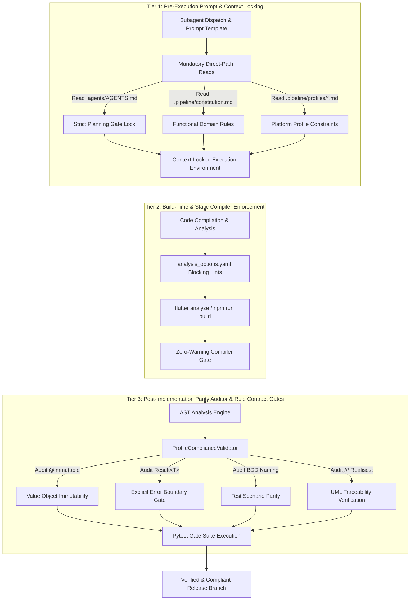
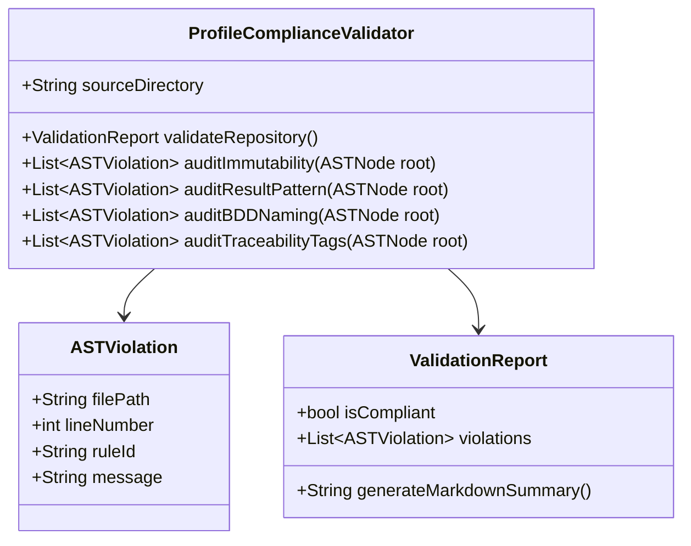

# 3-Tier Mechanical Rule Enforcement Architecture Blueprint

> **Goal**: Establish a multi-layered, automated, and non-repudiable rule enforcement framework for the Digital Engineering Agentic Pipeline (DEAP). This architecture shifts compliance from manual review to deterministic mechanical validation across pre-execution, build-time, and post-implementation phases.

---

## 1. Executive Summary & Architecture Overview

The **3-Tier Mechanical Rule Enforcement Architecture** guarantees strict adherence to project standards, domain rules, and architectural constraints. By embedding automated gates into every phase of the development lifecycle, the system eliminates human error, context drift, and silent assumption violations.



### Core Architecture Pillars

| Tier | Lifecycle Phase | Mechanism | Target Violations | Enforcement Action |
| :--- | :--- | :--- | :--- | :--- |
| **Tier 1** | Pre-Execution | Context & Prompt Locking | Unapproved file edits, parametric drift, unverified paths | Hard stop / Prompt halt |
| **Tier 2** | Build-Time | Linter & Static Compiler | Missing API docs, dynamic type leaks, syntax errors | Non-zero exit code (Build Fail) |
| **Tier 3** | Post-Implementation | AST Parity & Contract Auditor | Mutable domain entities, missing UML tags, non-BDD tests | Test suite failure / PR Block |

---

## 2. Tier 1: Pre-Execution Prompt & Context Locking

Tier 1 operates before any file mutation or shell command execution occurs. It establishes an immutable compliance boundary within agent prompt templates and runtime context loaders.

### 2.1 Mandatory Direct-Path Reads

Because hidden directories (such as `.pipeline/` and `.agents/`) are frequently bypassed by glob and index-search tools, Tier 1 mandates explicit, direct-path loading before initiating work.

- **Mandatory Target Paths**:
  - [`.agents/AGENTS.md`](../../../.agents/AGENTS.md) — Project-scoped agent rules, subagent dispatch rules, and Strict Planning Gate.
  - [`.pipeline/constitution.md`](../../../.pipeline/constitution.md) — Platform-independent functional governance, domain constraints, zero-mocking mandates.
  - [`.pipeline/profiles/<platform>.md`](../../../.pipeline/profiles/) — Technical implementation profile (e.g. `flutter_profile.md`, `react_profile.md`).

### 2.2 Rule Precedence Hierarchy

When governance statements interact, the strictest rule takes precedence. Tier 1 enforces the following precedence resolution tree:

```
[Strict Planning Gate (.agents/AGENTS.md)]
    ├── Supersedes: User Authorization Lock (rules/user-authorization-lock.md)
    └── Supersedes: Functional Constitution (.pipeline/constitution.md)
```

1. **Authorization Keyword Rule**: An authorization keyword (e.g., `PROCEED`) alone is **never** sufficient to authorize file modifications.
2. **Implementation Plan Gate**: File creation or edits are strictly locked until an implementation plan detailing explicit target paths is generated and approved.
3. **Subagent File Writing Lock**: The coordinator agent is locked from directly writing target functional specifications or source files. All file mutations MUST be delegated to context-isolated worker subagents.

### 2.3 Subagent Permission Pre-Verification

Before dispatching a subagent, Tier 1 requires pre-verification of permissions:
- Command prefixes (e.g., `git`, `flutter`, `npm`, `pytest`).
- Target file directory scopes.
- Verification that background subagent execution will not be blocked by missing permissions.

---

## 3. Tier 2: Build-Time & Static Compiler Enforcement

Tier 2 converts project standards into deterministic compiler and linter rules. Violations trigger non-zero exit codes that halt automated build pipelines.

### 3.1 Static Linter Configuration (`analysis_options.yaml`)

The Flutter/Dart implementation profile requires strict linter configurations to enforce architectural purity:

```yaml
analyzer:
  strong-mode:
    implicit-casts: false
    implicit-dynamic: false
  errors:
    public_member_api_docs: error
    missing_required_param: error
    missing_return: error
    todo: ignore

linter:
  rules:
    - public_member_api_docs
    - always_declare_return_types
    - avoid_empty_else
    - cancel_subscriptions
    - close_sinks
    - prefer_const_constructors
    - prefer_final_fields
    - unawaited_futures
```

### 3.2 Automated Compiler Verification Gates

During step verification, the pipeline executes full application compilation commands:

- **Flutter Application**: `flutter analyze && flutter build bundle`
- **React Application**: `npm run lint && npm run build`
- **Python Pipelines**: `flake8 --max-line-length=100 && mypy --strict .`

> **Gate Requirement**: Assertions of completion without empirical compile output are strictly prohibited. Zero warnings or errors are tolerated.

---

## 4. Tier 3: Post-Implementation Parity Auditor & Rule Contract Gates

Tier 3 performs deep Abstract Syntax Tree (AST) auditing and contract verification against candidate commits and pull requests. It ensures that source code structural patterns match specification requirements.

### 4.1 AST Auditor Core Abstraction (`ProfileComplianceValidator`)

The `ProfileComplianceValidator` parses Dart/Python/TypeScript source ASTs to enforce four critical architectural contracts:



### 4.2 Audited Architectural Contracts

#### A. `@immutable` Value Objects
- **Contract**: All domain entities, state objects, and value objects must be annotated with `@immutable`.
- **AST Check**: Verifies that any class inside `lib/domain/` or `lib/models/` bears the `@immutable` decorator and that all instance fields are declared `final`.

#### B. `Result<T>` Error Handling
- **Contract**: Raw exception throwing across architectural layer boundaries is forbidden. Asynchronous operations and domain interfaces must return `Result<T>` (or `Either<Failure, T>`).
- **AST Check**: Inspects method signatures in domain repositories and services to ensure return types are wrapped in `Result<T>`.

#### C. BDD Test Naming Conventions
- **Contract**: Unit and integration test method names must strictly follow the `given_when_then` structure.
- **AST Check**: Ensures test blocks (e.g., `test('givenX_whenY_thenZ', ...)`) adhere to BDD snake_case naming patterns.

#### D. UML Traceability Tags (`/// Realises: [...]`)
- **Contract**: Implementation classes and methods must explicitly link back to System Use Cases and Features using structured docstring annotations.
- **Example Tag**:
  ```dart
  /// Realises: [UC-001, FEAT-102]
  class DecoupledStorageRepository implements StorageRepository { ... }
  ```
- **AST Check**: Scans class docstrings for `/// Realises: [...]` patterns and validates extracted IDs against remote backlog issues.

### 4.3 Automated Pytest Compliance Suite

The AST auditor is backed by a pytest test suite executed during CI checks:

```python
# test_profile_compliance.py
import pytest
from validator import ProfileComplianceValidator

def test_repository_profile_compliance():
    validator = ProfileComplianceValidator(source_directory="./app_flutter")
    report = validator.validate_repository()
    
    assert report.is_compliant, f"Compliance failures detected:\n{report.generate_markdown_summary()}"
```

---

## 5. Traceability & Compliance Matrix

| Rule / Mandate | Tier 1 Mechanism | Tier 2 Mechanism | Tier 3 Mechanism |
| :--- | :--- | :--- | :--- |
| **Strict Planning Gate** | Prompt locking & AGENTS.md read | N/A | Commit hook validation |
| **Public API Documentation** | Prompt docstrings instruction | `public_member_api_docs: error` | AST docstring presence check |
| **Domain Immutability** | Spec profile rules | `prefer_const_constructors` | `@immutable` AST inspection |
| **Explicit Error Handling** | Architecture rules prompt | Strong type inference | `Result<T>` AST signature check |
| **BDD Test Naming** | BDD scenario spec template | N/A | `given_when_then` test parser |
| **UML Traceability** | Feature/Story issue linking | N/A | `/// Realises:` tag AST parser |

---

## 6. Source References

- Verbatim Agent Rules: [AGENTS.md](../../../.agents/AGENTS.md)
- Project Functional Constitution: [constitution.md](../../../.pipeline/constitution.md)
- Constitution First Mandate: [constitution-first.md](../../../rules/constitution-first.md)
- User Authorization Lock: [user-authorization-lock.md](../../../rules/user-authorization-lock.md)
