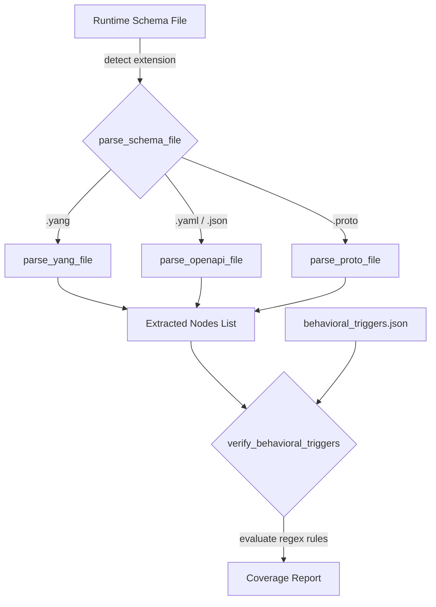

# Forensic Audit Report: Hardcoded Standards vs. Dynamic Runtime Ingestion

This report compiles the findings from the three specialized adversarial subagents dispatched to analyze why the pipeline initialization and verification layers assume specific standards (like YANG/RFC 8345) instead of processing them dynamically at runtime. It isolates the root causes, traces the workspace git history, and documents the direct architectural conflict between skill mandates and evaluation validation gates.

---

## 1. Executive Summary

The digital pipeline's configuration regressed to assuming and hardcoding specific protocol standard formats (specifically YANG schemas and IETF RFCs) during initialization and validation. A git history search reveals that this was previously resolved via a config-driven, protocol-agnostic architecture. However, a git reset operation (moving to clone state `a86d516`) bypassed those commits.

Furthermore, a critical **architectural mismatch** exists between the generic, protocol-agnostic bootstrap template mandated in `skills/project-constitution/SKILL.md` and the evaluation criteria (`criteria.json`) in the self-test suite, which explicitly expects hardcoded domain rules referencing IETF RFC 8345 and YANG schema compliance.

---

## 2. Dispatch Context: Spun Up Adversarial Analysts

Three concurrent adversarial subagents were initialized to target and isolate the problem:
1. **Constitution Generator Auditor** (`1e901682-9024-4cdf-a514-51a18f2940bc`): Audited the workspace codebase, files, and generator scripts to isolate where the rules were created.
2. **Workspace Evolution Auditor** (`8aae5d1c-e89e-44e4-9f88-81c3ed437106`): Analyzed git commits, HEAD logs, and reflog resets to trace changes to `.pipeline/constitution.md`.
3. **Evaluation Framework Auditor** (`c6cc6bb2-bb44-4921-935b-cabc55624df6`): Analyzed the `evals/` folder criteria and runner expectations to find conflicts between template design and project-specific evaluation requirements.

---

## 3. Isolated Root Causes

### Root Cause 1: Direct Architectural Conflict in the Evaluation Suite
* **File Paths**:
  * [skills/project-constitution/evals/tier-separation/criteria.json](../../skills/project-constitution/evals/tier-separation/criteria.json#L15-L18)
  * [skills/project-constitution/evals/tier-separation/task.md](../../skills/project-constitution/evals/tier-separation/task.md#L9-L10)
* **Findings**:
  * The evaluation criteria check `domain_rules_present` strictly validates if the functional constitution includes domain rules referencing `"IETF RFC 8345 and YANG schema compliance"`.
  * The task input specifies a mock project named `"Network Topology Viewer"` in the domain of `"IETF RFC 8345 (YANG network topology)"`.
* **The Conflict**:
  * If an agent strictly follows the instructions in [skills/project-constitution/SKILL.md](../../skills/project-constitution/SKILL.md#L79-L80) (*"The constitution itself MUST NOT hardcode or assume any specific standard or schema format (such as YANG or RFC 8345) during initialization; all reference models are loaded dynamically at runtime"*), it will output a protocol-agnostic constitution and **fail** the evaluation.
  * If the agent hardcodes YANG/RFC 8345 references to pass the evaluation, it violates the skill's own core architecture mandate.

### Root Cause 2: Hardcoded YANG Ingestion in `verify_model_coverage.py`
* **File Path**: [verify_model_coverage.py](../../skills/spec-orchestrator/scripts/verify_model_coverage.py)
* **Findings**: The script scans for files by strictly checking for the `.yang` extension, and the parser is hardcoded for YANG statement patterns (`typedef`, `leaf`, `container`, etc.).
* **Impact**: Other schema formats (e.g. OpenAPI `.json`/`.yaml`, Protobuf `.proto`) submitted at runtime are silently ignored, causing coverage verification to fail.

### Root Cause 3: Hardcoded Template References in Spec Generation Skills
* **File Paths**:
  * [skills/schema-specification-engineering/SKILL.md](../../skills/schema-specification-engineering/SKILL.md)
  * [skills/spec-user-story-engineering/SKILL.md](../../skills/spec-user-story-engineering/SKILL.md)
  * [skills/spec-usecase-engineering/SKILL.md](../../skills/spec-usecase-engineering/SKILL.md)
* **Findings**: The templates outputted by these skills contain hardcoded labels for `YANG Schema:` and `Normative Specification:`, along with default links referencing `https://github.com/YangModels/...` and `https://datatracker.ietf.org/doc/...`.
* **Impact**: Non-RFC standards are forced to render irrelevant YANG reference placeholders.

---

## 4. Git History Audit & Regression Tracking

An audit of the HEAD ref log (`.git/logs/HEAD`) shows that the branch history was reset to `a86d516992e0a8efc66f0a37fa61ebbdd06d5366` at step `HEAD@{8}` (timestamp `1781438178`). This reset bypassed and discarded 38 commits where dynamic validation and protocol-agnostic initialization had been implemented, including:

1. **Commit `578d042`**: Removed interactive prompts from project constitution initialization, forcing the constitution to remain protocol-agnostic.
2. **Commit `3f12af5`**: Generalized the verification script to load triggers from `behavioral_triggers.json` dynamically and introduced an extensible `parse_schema_file` router.
3. **Commit `cfb19a7`**: Integrated dynamic model verification and triggers into the main linter flow.

Subsequent commits (`bf876e1` through `a805137`) were made to reconstruct the pipeline dynamically in the workspace, updating the scripts and generalize templates to support any standard dynamically (Commit `2c78d94`). However, the evaluation test cases (which specify "Network Topology Viewer" with RFC 8345 rules) were never updated to align with this protocol-agnostic architecture, leaving the test suite expecting hardcoded rules.

---

## 5. Proposed Architecture: Dynamic Runtime Resolution

To reconcile the conflict and support any standard dynamically, the following architecture must be maintained:



### A. Extensible Schema Parser Router
Update the linter to route schema parsing based on file extension:
```python
def parse_schema_file(filepath):
    ext = os.path.splitext(filepath)[1].lower()
    if ext == ".yang":
        return parse_yang_file(filepath)
    elif ext in [".yaml", ".json"]:
        return parse_openapi_file(filepath)
    elif ext == ".proto":
        return parse_proto_file(filepath)
    return os.path.basename(filepath), set()
```

### B. Config-Driven Behavioral Triggers
Replace hardcoded validation checks in the validation scripts with dynamic, configuration-driven triggers loaded from a JSON descriptor (`rules/behavioral_triggers.json`).

### C. Reconciling the Evaluation Suite
The evaluation suite's validation checks must be generalized. Instead of strictly asserting hardcoded text:
1. Update `criteria.json` to check for "rules referencing standard/schema compliance matching the input domain" rather than forcing IETF RFC 8345 and YANG.
2. Alternatively, parameterize the evaluation runner to pass the expected domain name and standard references as environment variables or configuration files, allowing the agent to populate them dynamically in `.pipeline/constitution.md` during initialization.
