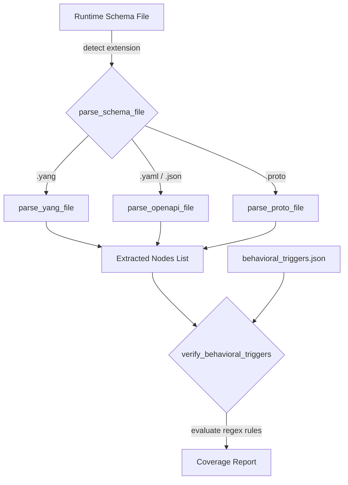

# Forensic Audit Report: Hardcoded Standards vs. Dynamic Runtime Processing

This report compiles the findings from the three adversarial subagents dispatched to analyze why the pipeline initialization and verification layers currently assume specific standards (like YANG/RFC) instead of processing them dynamically at runtime. It details the root causes, git history tracking, and the proposed architecture to restore dynamic runtime standard ingestion.

---

## 1. Executive Summary

The digital pipeline's current configuration assumes and hardcodes specific protocol standard formats (specifically YANG schemas and IETF RFCs) during initialization and validation. However, a git history search reveals that this was previously resolved via a config-driven, protocol-agnostic architecture. A git reset operation (commit `a86d516`) bypassed these commits, introducing the regressions.

We propose restoring the dynamic, protocol-agnostic architecture by generalizing schema parsing and using config-driven behavioral triggers.

---

## 2. Root Cause Analysis

### Root Cause 1: Hardcoded YANG Ingestion in `verify_model_coverage.py`
*   **File Path**: [verify_model_coverage.py](file:///Users/perkunas/digital-pipeline-repo/skills/spec-orchestrator/scripts/verify_model_coverage.py#L241-L243)
*   **Findings**: The script scans for files by strictly checking for the `.yang` extension, and the parser is hardcoded specifically for YANG files using YANG statement patterns (`typedef`, `leaf`, `container`, etc.).
*   **Impact**: Other schema formats (e.g. OpenAPI `.json`/`.yaml`, Protobuf `.proto`) submitted at runtime are silently ignored, causing coverage verification to fail or become unusable.

### Root Cause 2: Protocol-Specific Prompts during Constitution Initialization
*   **File Path**: [skills/project-constitution/SKILL.md](file:///Users/perkunas/digital-pipeline-repo/skills/project-constitution/SKILL.md#L81-L86)
*   **Findings**: The workflow instructions prompt the engineer or agent for specific standard files (such as `YANG`, `RFC`, etc.) during initialization of `.pipeline/constitution.md`.
*   **Impact**: This contaminates the core constitution layer with standard-specific structures, violating the principle of a generic, platform-independent, and standard-agnostic governance document.

### Root Cause 3: Hardcoded Template References in Spec Generation Skills
*   **File Paths**:
    *   [skills/schema-specification-engineering/SKILL.md](file:///Users/perkunas/digital-pipeline-repo/skills/schema-specification-engineering/SKILL.md#L114-L120)
    *   [skills/spec-user-story-engineering/SKILL.md](file:///Users/perkunas/digital-pipeline-repo/skills/spec-user-story-engineering/SKILL.md#L113-L116)
    *   [skills/spec-usecase-engineering/SKILL.md](file:///Users/perkunas/digital-pipeline-repo/skills/spec-usecase-engineering/SKILL.md#L121-L124)
*   **Findings**: The templates outputted by these skills contain hardcoded text labels for `YANG Schema:` and `Normative Specification:`, along with default links referencing `https://github.com/YangModels/...` and `https://datatracker.ietf.org/doc/...`.
*   **Impact**: Non-RFC standards (such as OpenAPI for CAMARA APIs) are forced to render irrelevant YANG reference placeholders.

---

## 3. Git History Audit

A tracking audit of the HEAD ref log (`.git/logs/HEAD`) reveals that the branch history was reset to `a86d516992e0a8efc66f0a37fa61ebbdd06d5366` at step `HEAD@{4}`. This reset bypassed 40 commits where dynamic validation and protocol-agnostic initialization had been implemented, including:

1.  **Commit `578d042`**: Removed interactive prompts from project constitution initialization, forcing the constitution to remain protocol-agnostic.
2.  **Commit `3f12af5`**: Generalized the verification script to load triggers from `behavioral_triggers.json` dynamically and introduced an extensible `parse_schema_file` router.
3.  **Commit `cfb19a7`**: Integrated dynamic model verification and triggers into the main linter flow.

---

## 4. Proposed Architecture: Dynamic Runtime Resolution

To resolve this issue and support any standard or schema format at runtime, we must restore and expand the dynamic architecture:



### A. Extensible Schema Parser Router
Update the linter to route schema parsing based on file extension:
```python
def parse_schema_file(filepath):
    ext = os.path.splitext(filepath)[1].lower()
    if ext == ".yang":
        return parse_yang_file(filepath)
    elif ext in [".yaml", ".json"]:
        return parse_openapi_file(filepath)
    elif ext == ".proto":
        return parse_proto_file(filepath)
    return os.path.basename(filepath), set()
```

### B. Config-Driven Behavioral Triggers
Replace hardcoded validation checks in the validation scripts with dynamic, configuration-driven triggers loaded from a JSON descriptor (`rules/behavioral_triggers.json`):
```json
[
  {
    "name": "Velocity Calculation Check",
    "trigger_nodes": ["v-north", "v-east", "v-up"],
    "rules": [
      {
        "target_type": "user-story",
        "requires_mermaid_block": "sequenceDiagram",
        "match_terms_in_mermaid": ["v-north", "v-east", "v-up", "speed", "heading"],
        "match_terms_in_body": ["calculate", "formula", "speed"],
        "error_message": "Velocity nodes defined, but no User Story sequenceDiagram found detailing calculations."
      }
    ]
  }
]
```

### C. Protocol-Agnostic Constitution & Skill Templates
*   Remove specific standard references (such as YANG or RFC) from the constitution initialization steps.
*   Update skill templates in `SKILL.md` files to output general `## Structural Schema` and `## Normative Specification` references dynamically, mapping the link and title at runtime based on config inputs.
