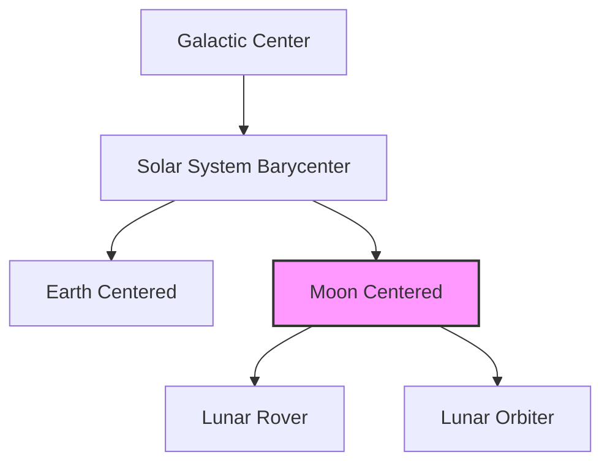

# Adversarial Audit & Technical Critique: Astrodynamics & Geodetic Coordinate Reference System (CRS) Engine

**Target Domain**: Astrodynamics, Geodesy, and Coordinate Reference Systems  
**Status**: COMPLETE CRITICAL ARCHITECTURAL AUDIT  
**Auditor**: Astrodynamics & Geodesy Auditor  

---

## 1. Executive Summary & Critical Inconsistencies

The proposed 4D Spatial-Temporal UI architecture aims to support multi-scale visualizations (sub-meter planetary surface operations up to galactic coordinates) at 60fps. However, the design contains fundamental mathematical and physical omissions that will cause severe rendering artifacts, trajectory overshoots, and execution failures.

### Major Inconsistencies Between Documents
* **SGP4 Execution Location Contradiction**:
  * `spatial_temporal_4d_ui_proposal.md` (Section 4.1) states that SGP4 orbital propagation runs on CPU background threads (WASM/C++) to produce double-precision keyframes, which are uploaded to the GPU for Hermite spline interpolation.
  * `spatial_temporal_4d_ui_analysis.md` (Section 4.1) states that TLE parameters are stored in a GPU Storage Buffer and a WGSL compute shader executes the SGP4 equations directly on the GPU.
  * *Critical Assessment*: SGP4 is numerically complex, involving long-term integrations, small angles, and small differences of large numbers (e.g., secular perturbations of oblateness $J_2, J_3, J_4$, and atmospheric drag). Implementing SGP4 in single-precision (`f32`) WGSL shaders will lead to immediate catastrophic precision drift (kms of error per orbit). Implementing emulated `f64` (double-single) in WGSL is highly inefficient due to the branch-heavy and transcendental nature of SGP4 equations. The CPU-propagation/GPU-interpolation model is the only mathematically viable approach.

---

## 2. Technical Audit & Specific Flaws

### 2.1. Physical & Mathematical Flaw: ECI-to-ECEF Velocity Frame Transformation
When converting orbital states (propagated in ECI/TEME via SGP4) to ECEF (for terrain alignment) for spline keyframes, the proposal ignores the frame rotation velocity correction (the Coriolis term).

#### Mathematical Analysis
Let $\mathbf{r}_I$ and $\mathbf{v}_I$ be the position and velocity vectors in the inertial frame (ECI). Let $\mathbf{r}_R$ and $\mathbf{v}_R$ be the position and velocity vectors in the rotating frame (ECEF). The coordinate relationship is:
$$\mathbf{r}_R = \mathbf{R}_{ECI\to ECEF}(t) \mathbf{r}_I$$

Differentiating with respect to time $t$:
$$\mathbf{v}_R = \frac{d}{dt} \left( \mathbf{R}_{ECI\to ECEF}(t) \mathbf{r}_I \right) = \dot{\mathbf{R}}_{ECI\to ECEF}(t) \mathbf{r}_I + \mathbf{R}_{ECI\to ECEF}(t) \mathbf{v}_I$$

Since the rotation matrix derivative is related to the angular velocity vector of the Earth $\boldsymbol{\omega}_{Earth} \approx [0, 0, 7.292115 \times 10^{-5}\text{ rad/s}]^T$ by:
$$\dot{\mathbf{R}}_{ECI\to ECEF}(t) = -\mathbf{R}_{ECI\to ECEF}(t) [\boldsymbol{\omega}_{Earth} \times]$$

The correct velocity transformation is:
$$\mathbf{v}_R = \mathbf{R}_{ECI\to ECEF}(t) \left( \mathbf{v}_I - \boldsymbol{\omega}_{Earth} \times \mathbf{r}_I \right)$$

#### The Flaw
The proposal and analysis documents apply a simple rotation matrix to the inertial velocity vector without subtracting the grid rotation term $\boldsymbol{\omega}_{Earth} \times \mathbf{r}_I$.
At the equator ($r \approx 6378137\text{ m}$), the magnitude of this omitted term is:
$$\|\boldsymbol{\omega}_{Earth} \times \mathbf{r}_I\| \approx (7.292115 \times 10^{-5}\text{ rad/s}) \times 6378137\text{ m} \approx 465.1\text{ m/s}$$

#### Impact
Feeding an uncorrected velocity vector (off by up to $465\text{ m/s}$) into the cubic Hermite spline engine:
$$\mathbf{P}(t) = h_{00}(s)\mathbf{P}_k + h_{10}(s)(t_{k+1} - t_k)\mathbf{V}_k + h_{01}(s)\mathbf{P}_{k+1} + h_{11}(s)(t_{k+1} - t_k)\mathbf{V}_{k+1}$$
will force the spline to overshoot wildly between keyframes, causing visible trajectory distortion (wavy pathing and non-Keplerian loops) that violates physical laws.

---

### 2.2. Numerical Instability in Shader Double-Single (DS) Emulation
The proposal implements a custom `ds_sub` function in WGSL to perform relative-to-eye subtraction of double-single variables.

```wgsl
fn ds_sub(a: DSFloat, b: DSFloat) -> f32 {
    let t1 = a.high - b.high;
    let e = t1 - a.high;
    let t2 = ((-b.high - e) + (a.high - (t1 - e))) + a.low - b.low;
    return t1 + t2;
}
```

#### Vulnerability
1. **Compiler Optimization & Fast-Math**: Modern GPU drivers and compilers (e.g., Tint, Metal Compiler, SPIR-V translators) compile shaders with aggressive floating-point optimizations (such as `-ffast-math`, reassociation, contraction into FMA, and flush-to-zero).
2. **Identity Collapse**: The term `((a.high - (t1 - e)))` mathematically simplifies to `a.high - a.high = 0` under standard algebraic rules. If the compiler rearranges the terms using algebraic simplifications, the error term $t_2$ is optimized to $a.low - b.low$, collapsing the double-precision emulation back to standard 32-bit single precision subtraction.
3. **Result**: Visual stuttering and vertex jittering will return at close zoom levels, particularly on mobile or low-end GPUs where compiler optimizations cannot be strictly disabled.

---

### 2.3. Mathematical Inadequacy & Performance Bottleneck in Geoid Undulation Interpolation
The proposal suggests caching a compressed $0.25^\circ \times 0.25^\circ$ coordinate grid of **EGM96** or **EGM2008** in memory and performing bilinear interpolation.

#### Mathematical Flaws
1. **First-Derivative Discontinuity ($\mathcal{C}^1$ Discontinuity)**:
    Bilinear interpolation is only $\mathcal{C}^0$ continuous. At grid boundaries, the first derivative of the geoid height $N$ with respect to latitude or longitude is discontinuous. The gradient of the geoid undulation represents the deflection of the vertical:
    $$\theta = -\frac{1}{g} \frac{\partial T}{\partial s}$$
    If the local horizon or local gravity direction is calculated using the geoid slope (essential for terrain alignment and autopilot telemetry integrations), the system will experience step-discontinuities (jumps in normal vectors) when crossing grid cell boundaries.
2. **Grid Resolution vs. Memory Footprint**:
    * A $0.25^\circ \times 0.25^\circ$ grid requires $721 \times 1440 \times 4\text{ bytes} \approx 4.15\text{ MB}$, which fits in memory.
    * However, EGM2008's primary advantage is its high resolution (up to $1'\times 1'$). Storing a native EGM2008 grid requires:
      $$(180 \times 60) \times (360 \times 60) \times 4\text{ bytes} \approx 933.1\text{ MB}$$
      This is completely non-viable for browser-based React or mobile Flutter applications. Caching a compressed/downsampled $0.25^\circ$ grid of EGM2008 loses the high-frequency geoid variations (like deep ocean trenches and steep mountains), making it functionally equivalent to EGM96 while using the same memory.

---

### 2.4. Catastrophic Precision Drop in Deep-Space Scaling & Tree Traversals
The proposal describes an extensible scene graph for galactic and extra-solar systems.

#### The Flaw
If coordinates are resolved by converting planetary-scale coordinates to a single global galactic frame (e.g., centered on Sagittarius A*) using double precision (`float64`) before applying the camera offset, the math fails due to quantization.

#### Mathematical Analysis
* Distance from Solar System to Galactic Center: $D_{GC} \approx 26,000\text{ light-years} \approx 2.46 \times 10^{20}\text{ meters}$.
* Double-precision (`float64`) significand: 53 bits $\approx 1.11 \times 10^{-16}$ relative precision.
* The absolute precision limit $\Delta X$ at galactic distances is:
  $$\Delta X \approx (2.46 \times 10^{20}\text{ m}) \times 2^{-53} \approx 27,310\text{ meters} = 27.3\text{ km}$$
* Even at interstellar scales (e.g., distance to Alpha Centauri $\approx 4.13 \times 10^{16}\text{ m}$), the precision limit is:
  $$\Delta X \approx (4.13 \times 10^{16}\text{ m}) \times 2^{-53} \approx 4.58\text{ meters}$$

#### Impact
If the scene graph flattens coordinates to a galactic root frame, visual elements (spacecraft, planets) will jump in steps of $27.3\text{ km}$ or $4.58\text{ m}$ respectively, causing extreme rendering jitter and collision calculation failures.

---

### 2.5. Geodetic Datum & Telemetry Altitude Ambiguity
The geoid undulation formula $h_{ellipsoidal} = H_{MSL} + N$ is applied blindly.

#### The Flaw
The UI does not differentiate between incoming telemetry vertical datums:
* ADS-B reports barometric altitude (referenced to standard pressure or local MSL).
* GPS / GNSS receivers on aircraft or spacecraft report ellipsoidal height ($h$) directly.
* If the engine blindly applies $h = H + N$ to a GPS-derived altitude, it adds the geoid undulation twice. Since $N$ varies between $-105\text{ m}$ and $+85\text{ m}$, this introduces a massive error of up to $100\text{ m}$, placing aircraft below the terrain or floating high above runway visual models.

---

## 3. Actionable Remediations

### 3.1. Standardize on CPU-Side Relative-to-Eye (RTE) Subtraction
To eliminate the compiler-optimization vulnerability of double-single shaders:
1. **Abandon Shader-Based DS Arithmetic**: Remove the `DSFloat` struct and `ds_sub` function from the WGSL code.
2. **CPU-Side Double-Precision Subtraction**: Perform the subtraction $X_{rel} = X_{obj} - X_{cam}$ in `float64` on the CPU (using Web Assembly or Dart FFI native heaps).
3. **Dynamic Vertex Buffer Upload**: Upload the resulting $X_{rel}$ values directly to a dynamic GPU vertex buffer as standard `f32` floats.
4. **Feasibility Proof**:
   For $N = 10,000$ moving objects, the vertex buffer size is:
   $$10,000\text{ objects} \times 3\text{ components} \times 4\text{ bytes} = 120\text{ KB}$$
   Uploading $120\text{ KB}$ at $60\text{ fps}$ requires:
   $$120\text{ KB} \times 60 = 7.2\text{ MB/s}$$
   This is less than $0.05\%$ of the available bandwidth on modern PCIe buses (PCIe 4.0 x16 = 31.5 GB/s) and has zero impact on unified mobile memory buses. This removes shader complexity and guarantees sub-millimeter visual precision.

---

### 3.2. Implement LCA-Based Coordinate Tree Traversals
To prevent deep-space precision drop:
1. **Define LCA Traversal**: The coordinate engine must never transform coordinates to a global root frame.
2. **Algorithm**:
   * For an object $A$ and camera $C$, traverse the scene graph upwards to locate their **Lowest Common Ancestor (LCA)** node.
   * Transform $A$'s position to the LCA frame: $\mathbf{r}_{A/LCA}$ in double precision.
   * Transform $C$'s position to the LCA frame: $\mathbf{r}_{C/LCA}$ in double precision.
   * Perform relative subtraction in the LCA frame: $\mathbf{r}_{rel} = \mathbf{r}_{A/LCA} - \mathbf{r}_{C/LCA}$.
   * Convert $\mathbf{r}_{rel}$ to the camera's local viewport frame using a rotation-only matrix (which is numerically stable).



---

### 3.3. Correct ECI-to-ECEF Kinematics (Coriolis Correction)
When generating keyframes for orbital assets, the CPU propagation must apply the rotational velocity cross product before spline interpolation.

```typescript
// Correct ECI to ECEF State Vector conversion
function transformStateToECEF(
    r_eci: Vector3, // [m]
    v_eci: Vector3, // [m/s]
    R_eci_to_ecef: Matrix3, // Rotation matrix
    omega_earth: number = 7.292115e-5 // [rad/s]
): { r_ecef: Vector3, v_ecef: Vector3 } {
    // 1. Transform Position
    const r_ecef = R_eci_to_ecef.multiplyVector(r_eci);

    // 2. Compute Coriolis velocity correction: v_ecef = R * (v_eci - omega x r_eci)
    const omega_vec = new Vector3(0, 0, omega_earth);
    const omega_cross_r = omega_vec.cross(r_eci);
    const corrected_v_eci = v_eci.subtract(omega_cross_r);
    const v_ecef = R_eci_to_ecef.multiplyVector(corrected_v_eci);

    return { r_ecef, v_ecef };
}
```

---

## 4. Recommended Enhancements

### 4.1. Replace Bilinear Grid Interpolation with Bicubic Hermite Interpolation
To resolve the $\mathcal{C}^1$ discontinuity at grid boundaries, use a bicubic Hermite spline over the geoid grid. The interpolation of height $N(\phi, \lambda)$ is determined by the values and derivatives of the 4 surrounding grid nodes:
$$N(u, v) = \mathbf{u}^T \mathbf{M} \mathbf{G} \mathbf{M}^T \mathbf{v}$$
where:
* $u, v \in [0, 1]$ are the normalized cell coordinates.
* $\mathbf{M}$ is the cubic blending matrix.
* $\mathbf{G}$ is the $4 \times 4$ control matrix containing node heights, gradients ($\frac{\partial N}{\partial \phi}, \frac{\partial N}{\partial \lambda}$), and cross-derivatives.
This guarantees smooth normal mapping and jitter-free navigation slope calculations.

### 4.2. Implement Spherical Harmonics Evaluator for High-Precision Datums
Instead of storing massive EGM2008 grids (933 MB), compile a spherical harmonics evaluator to WASM.
* Evaluate the gravity anomaly and geoid height using standard Clenshaw summation for Legendre polynomials up to degree/order 360.
* A degree 360 model requires storing only $(360 \times 361) / 2 \approx 65,000$ floating-point coefficients (under $300\text{ KB}$ in memory), providing highly detailed geoid heights globally without grid discretization errors.

### 4.3. Implement Adaptive Keyframe Spacing for Spline Interpolators
For orbital objects, replace fixed time intervals (e.g., 60s) with adaptive keyframes based on local orbit curvature.
* LEO orbits require high-density keyframes near perigee ($T \approx 15\text{ s}$).
* GEO orbits are highly linear in angular velocity and can use wide keyframe spacing ($T \approx 300\text{ s}$) with sub-centimeter interpolation accuracy.
* Compute the maximum step size dynamically using:
  $$T_{max} = (384 \epsilon)^{1/4} \left( \frac{r_p^5}{\mu^2} \right)^{1/8}$$
  where $r_p$ is the perigee radius, $\mu$ is the gravitational parameter, and $\epsilon$ is the visual error tolerance.
