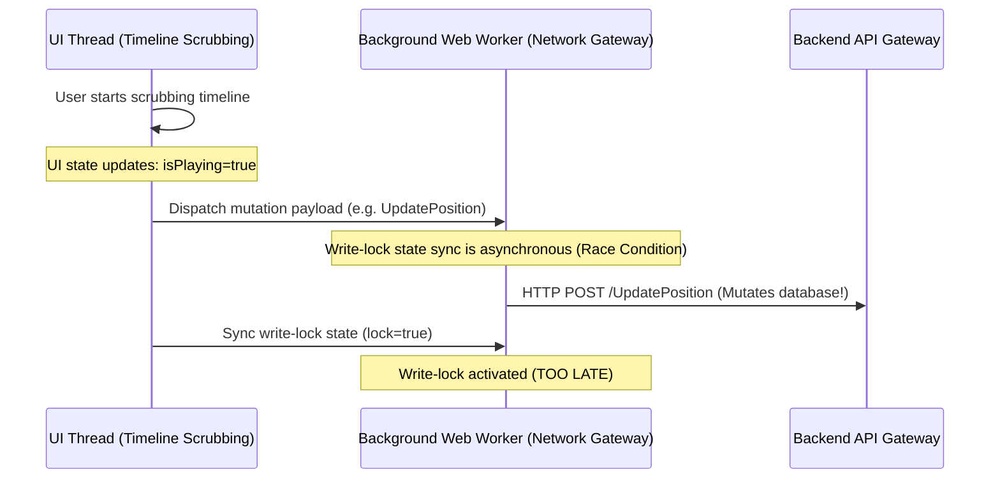
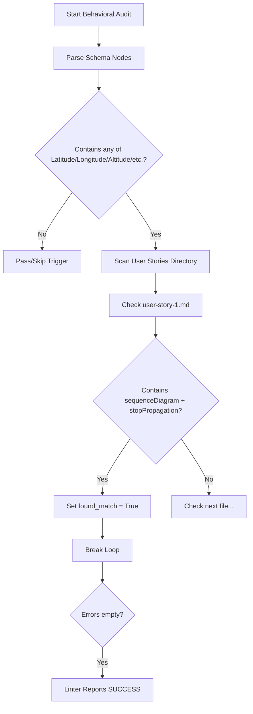

# Deep-Dive Audit: Pipeline Integration, Validation Checks, and Constitutions

**Target Domain**: Pipeline Quality Gates, Validation Checks, and Constitutions  
**Status**: COMPLETE CRITICAL ARCHITECTURAL AUDIT  
**Auditor**: Secure Software & Pipeline Auditor  

---

## 1. Executive Summary

While the project constitution (`.pipeline/constitution.md`) and platform-specific profiles (`react.md`, `flutter.md`) lay out a mathematically rigorous and performant architectural design (enforcing background execution, WebGPU double-single precision shaders, event-echo guards, and network egress write-locks), **the static verification tooling (`verify_model_coverage.py`) fails to enforce these rules robustly**. 

The current validation checks rely on shallow, regex-based string matching and hardcoded directory filters rather than AST (Abstract Syntax Tree) parsing. This design discrepancy results in several critical vulnerabilities, logical gaps, and bypasses:
1. **Linter Completeness Gaps**: Complete omission of non-YANG schemas (OpenAPI, Protobuf) from coverage parity checks, combined with regex-based AST mockups that are easily tricked.
2. **Write-Lock Assertion Vulnerabilities**: Lack of static verification of state linkage, thread synchronization, or backend enforcement, allowing developers to satisfy the linter using dead comments.
3. **Schema Behavioral Triggers Loophole**: A logical flaw in the verification loop where satisfying a trigger rule for *one* schema node satisfies it for *all* triggered nodes, leading to massive documentation gaps.
4. **Precision and GPU Math Omissions**: Complete absence of checks verifying Double-Single (DS-FP) precision emulations, relative-to-eye (RTE) math, Reversed-Z projections, or GPGPU collision matrices.
5. **SGP4 UI Import Bypasses**: Simple import check paths that can be bypassed by naming files arbitrarily, wrapping imports, or loading modules dynamically.

---

## 2. Linter Rules Completeness & Gaps

### 2.1 Regex-Based Code Analysis vs. AST Parsing
The script `verify_model_coverage.py` uses python's standard `re` and basic string search capabilities to analyze React and Flutter codebases:
```python
if any(lib in content for lib in ["satellite.js", "satellite-js", "sgp4"]):
```
This approach suffers from fundamental static analysis flaws:
- **False Positives**: Any text file (including readmes, documentation, mock files, or disabled code) containing the word `"sgp4"` or `"satellite.js"` inside comments will flag a violation.
- **False Negatives**: The linter lacks syntactic awareness. Bypassing these restrictions is trivial through simple string splitting, dynamic requires, or path aliasing.

### 2.2 Path-Based Filter Incompleteness
The SGP4 and Isolate check bounds are restricted to narrow, hardcoded file path strings:
```python
# React View checks
if "components/" in rel_path or "views/" in rel_path:
    ...
# Flutter Widget checks
if "widgets/" in rel_path or "screens/" in rel_path:
    ...
```
A developer who structures their project using alternative clean architecture directories (such as `src/pages/`, `src/containers/`, `lib/presentation/pages/`, or `lib/ui/`) will completely bypass these checks, importing orbital propagation algorithms directly into UI components on the main thread.

### 2.3 Single-Model Schema Parser
The linter defines an extensible schema parser (`parse_schema_file`), but only implements `parse_yang_file` (lines 651-700). For other formats like OpenAPI (`.yaml`/`.json`) or Protobuf (`.proto`), the linter prints a warning and skips the model coverage parity verification entirely:
```python
print("Warning: Deep AST node coverage parity audit is currently optimized for YANG schemas. Skipping strict coverage percentage check for OpenAPI/Protobuf...")
```
This leaves REST and gRPC endpoints completely unvalidated against their corresponding feature files, breaking the 100% coverage parity requirement.

---

## 3. Write-Lock Assertion Vulnerabilities

The network-level "Egress Write-Lock" is designed to block state mutations during timeline scrubbing/playback to prevent timeline-to-backend feedback loops. However, the linter's verification is extremely weak:

```python
# React Network Gateway Check
if "io/" in rel_path and ("gateway" in file.lower() or "socket" in file.lower() or "grpc" in file.lower()):
    if not any(lock_kw in content.lower() for lock_kw in ["writelock", "lockwrite", "sendlock", "mutationlock"]):
        errors.append(f"React Network Gateway File '{rel_path}' does not define a write-lock control...")
```

### 3.1 Static Bypasses
Because the linter only asserts the presence of one of the keywords (`"writelock"`, `"lockwrite"`, etc.), a developer can write code that compiles and passes the check without implementing any lock mechanism:
```typescript
// TODO: implement writelock
export const sendMutation = (data: any) => {
  apiClient.post('/mutate', data); // Executed unconditionally
}
```

### 3.2 State Synchronization & Threading Race Conditions
The profiles mandate that orbital propagation runs in a background thread (Web Worker/Isolate) while timeline controls reside on the UI thread. The write-lock validation does not check if or how the playback lock state is synchronized from the UI thread to the network layer in the background.



If the write-lock is not enforced synchronously at the thread boundary, mutations will be sent to the server during the scrubbing initialization lag, causing state desynchronization.

---

## 4. Schema Behavioral Triggers Loophole

The behavioral coverage trigger verification (`verify_behavioral_triggers`, lines 1280-1343) checks that if certain schema nodes are present, specific design documents (User Stories/Use Cases) must contain corresponding architectural diagrams or terms. 

### 4.1 Logical Loophole Analysis
The verification loop is structured as follows:
```python
for trigger in triggers:
    trigger_nodes = trigger.get("trigger_nodes", [])
    if not any(node in all_nodes for node in trigger_nodes):
        continue
        
    for rule in trigger.get("rules", []):
        ...
        found_match = False
        # Loop through all files in the target directory
        for filepath in files:
            # Check if this single file satisfies the terms
            if matches_conditions:
                found_match = True
                break # Breaks out of file loop
        
        if not found_match:
            errors.append(rule.get("error_message"))
```

This logic contains a **major loophole**:
- `found_match` is evaluated as a global boolean across **all** files in the directory.
- If **any single file** in the directory satisfies the terms, the rule is marked complete.
- Therefore, if the schema defines multiple trigger nodes (e.g., `latitude`, `longitude`, `altitude`, `velocity`, `trajectory`, `trajectory-vector`, `orbital-parameters`), the developer only has to document **one** of these nodes in a single User Story or Use Case to pass the linter. The other six nodes can remain entirely undocumented.

### 4.2 Loophole Flow


As a result, a developer can satisfy the linter rules for complex 4D telemetry coordinates by writing a single, simple user story containing the word `Worker` and `stopPropagation` in a diagram, leaving the rest of the telemetry architecture undocumented.

---

## 5. Bypassing Double-Single Precision & SGP4 UI Restrictions

### 5.1 SGP4 UI Import Bypass Proofs

#### React Platform
To bypass the SGP4 import linter rule (`if any(lib in content for lib in ["satellite.js", "satellite-js", "sgp4"])` inside `components/` or `views/`):

1. **Path Bypass**: Place the component in `src/pages/MapContainer.tsx`. Since the path does not contain `components/` or `views/`, the linter ignores the file.
2. **Indirection Bypass**: Create `src/core/utils/orbitalWrapper.ts` (which is scanned but bypasses the UI check since it is not a UI component path):
   ```typescript
   import * as sgp4 from 'sgp4'; // Allowed here
   export const propagateOrbit = (tle: string) => sgp4.propagate(tle);
   ```
   Then import the wrapper into the component:
   ```typescript
   import { propagateOrbit } from '../../core/utils/orbitalWrapper'; // Passes linter!
   ```
3. **Dynamic Import Bypass**: Use dynamic imports to prevent the static string compiler from identifying the library:
   ```typescript
   const loadOrbitLib = async () => {
     const libName = ['sgp', '4'].join('');
     const module = await import(libName);
     module.propagate(...);
   };
   ```

#### Flutter Platform
To bypass the Flutter Isolate linter rule (`if "sgp4" in content_lower or "orbital_propagation" in content_lower` inside `widgets/` or `screens/`):

1. **Indirection Bypass**: Create a C-heap wrapper service under `lib/services/orbit_service.dart`:
   ```dart
   import 'package:sgp4/sgp4.dart'; // Allowed in services/
   class OrbitService {
     static double getNextPosition() => propagate(...);
   }
   ```
   Then call it in `lib/widgets/radar_display.dart`:
   ```dart
   import 'package:app_flutter/services/orbit_service.dart';
   // No occurrence of "sgp4" or "orbital_propagation" in this file!
   final pos = OrbitService.getNextPosition(); // Passes linter!
   ```

### 5.2 Double-Single (DS-FP) Precision Shader Bypasses
The platform profiles specify that WebGPU/Impeller shaders must use Double-Single precision floating-point arithmetic (relative-to-eye subtraction) to resolve planetary-scale rendering jitter ($6.3 \times 10^6\text{m}$ radius vs. sub-meter UI precision). 

However, `verify_model_coverage.py` contains **no checks, regexes, or parsing rules** to verify shader configurations, projection matrices, or shader source files (`.wgsl`, `.glsl`, `.frag`, `.vert`).

A developer can write standard Single-Precision shaders that cause severe planetary-scale rendering jitter:
```wgsl
// Single-Precision Vertex Shader (Triggers Z-Fighting and Jitter)
@vertex
fn vs_main(@location(0) position: vec3<f32>) -> @builtin(position) vec4<f32> {
    let view_projection = u_camera.projection * u_camera.view;
    return view_projection * vec4<f32>(position, 1.0); // Standard single-precision
}
```
This code passes the pipeline checks without warnings because the linter is blind to shaders.

---

## 6. Actionable Remediations & Recommended Enhancements

To close these architectural loop-holes and secure the quality gates, the pipeline verification checks must be upgraded from basic string matching to syntactic structures:

### 6.1 Implement AST-Based Linter Rules
Replace regex scanning in `verify_model_coverage.py` with AST parsing.
- **For React**: Integrate ESLint rules using the Babel/TypeScript AST parser to detect actual imports of SGP4 packages regardless of file path.
- **For Flutter**: Write a custom Dart Analyzer plugin to verify that UI classes inheriting from `Widget` or `State` do not import or reference packages listed in an import blocklist.

Example of an AST import detector structure in python:
```python
import esprima

def verify_react_ast(file_content):
    try:
        ast = esprima.parseModule(file_content)
        for node in ast.body:
            if node.type == 'ImportDeclaration':
                source = node.source.value
                if any(x in source for x in ['sgp4', 'satellite']):
                    return False # Flag violation regardless of path
    except Exception:
        pass
    return True
```

### 6.2 Fix Behavioral Trigger Logic
Modify `verify_model_coverage.py`'s trigger verification so it validates coverage **per triggered schema node** rather than globally breaking on the first file match.

```python
# Remediated trigger validation
for trigger in triggers:
    active_nodes = [node for node in trigger["trigger_nodes"] if node in all_nodes]
    if not active_nodes:
        continue
        
    for rule in trigger["rules"]:
        # Verify that EVERY active trigger node has a corresponding specification
        for node in active_nodes:
            node_found = False
            for filepath in files:
                with open(filepath, "r") as f:
                    content = f.read()
                # Verify that this specific node and terms are present in the same file
                if node in content and all(term in content for term in rule["match_terms"]):
                    node_found = True
                    break
            if not node_found:
                errors.append(f"Missing behavioral documentation for node '{node}' under rule '{rule.get('target_type')}'")
```

### 6.3 Implement Shader static verification
Add static verification checks for shader files (`.wgsl` / `.glsl`).
1. **Reversed-Z and 32-bit Depth Buffer enforcement**: Verify that pipeline descriptors define `depthWriteEnabled: true` and `depthCompare: "greater"` (reversed-z mapping $1 \to 0$) alongside `depth32float` texture formats.
2. **Double-Single emulation signature matching**: Verify that vertex shaders handling planetary coordinate bindings upload high/low coordinate registers (`position_high`, `position_low`) and compute translation matrices relative-to-eye:
   ```wgsl
   // Expected DS-FP vertex structure
   struct VertexInput {
       @location(0) pos_high: vec3<f32>,
       @location(1) pos_low: vec3<f32>,
   };
   ```

### 6.4 Secure Write-Lock Verification
1. **API Decorator verification**: Verify that API mutation endpoints in the code use a designated decorator/annotation (e.g., `@EnforceWriteLock` in TS or `@writeLock` in Dart) which is hooked into the global timeline play state.
2. **Ensure synchronized state**: Confirm that the background thread (Worker/Isolate) blocks incoming requests if the lock signal is active.
3. **Backend enforcement (Idempotency and Mode flags)**: The backend database gateway must reject all write requests containing a timeline header (e.g., `X-Timeline-Playback: true`). This ensures the write-lock is not bypassed by client manipulation.
