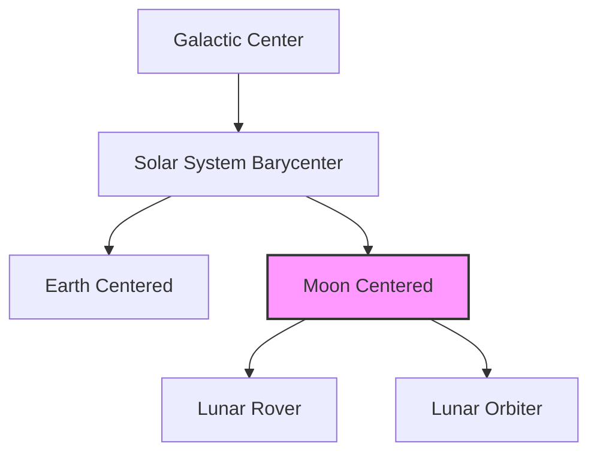

# Consolidated Decision-Making Report: 4D Spatial-Temporal UI & GPGPU Communications Pipeline Audit

**Date**: 2026-06-16  
**Status**: PROPOSED / AUDITED  
**Auditors**: Adversarial Auditing Agents (GPGPU, Astrodynamics, Communications, UI Sync, Pipeline Integration)  

---

## 1. Executive Summary & Core Decisions

This report consolidates the deep-dive technical critiques from five adversarial auditing agents. While the proposed 4D Spatial-Temporal coordinate conversions and GPGPU rendering methods address core scale challenges, they contain critical vulnerabilities that would result in rendering artifacts, CPU/GPU memory corruption, security check bypasses, and data synchronization failures.

### Key Architectural Decisions:
1. **CPU-Side Floating Origin (Relative-to-Eye) Migration**: Abandon GPU-side double-single precision (`ds_sub`) emulation. Bandwidth calculations prove that CPU-side `float64` subtraction and `f32` dynamic uploads consume `<0.06%` of PCIe Gen3 x16 bandwidth. This saves 50% VRAM, eliminates shader compiler optimization vulnerabilities, and guarantees sub-millimeter precision.
2. **Coriolis Velocity Corrections**: Standardize the ECI-to-ECEF transformation to include the frame rotation velocity correction ($\boldsymbol{\omega}_{Earth} \times \mathbf{r}_{ECI}$). Without this term, Hermite spline interpolations overshoot by up to 465 m/s, warping trajectories.
3. **Exact Ellipsoidal Occlusion & Physical Jamming Models**: Upgrade line-of-sight checks from ray-sphere to ray-ellipsoid quadratic intersections in WGSL. Integrate antenna patterns (Gaussian/Airy), pointing errors, system noise temperature ($T_{sys}$), and polarization losses into the RF interference models.
4. **Time-State PLL & Isolate Swap Protocols**: Replace the PID clock-rate smoothing with a Low-Pass Filtered Phase-Locked Loop (PLL) to prevent time-reversal and integrator windup. Enforce double-buffered pointer swaps and NativeFinalizers on Dart FFI allocations to prevent data tearing and use-after-free errors.
5. **AST-Based Pipeline Linting**: Upgrade the static linter (`verify_model_coverage.py`) from basic regex searches to AST-based checks, closing dynamic import and directory bypasses. Remediate the global-match loophole in behavioral triggers.

---

## 2. Astrodynamics & Geodetic Coordinate Transformations

### 2.1 ECI-to-ECEF Frame Rotation Velocity Correction
When translating orbital vectors from ECI (TEME via SGP4) to ECEF (for ground terrain rendering) for spline keyframes, the rotation velocity correction must be applied. 

**The Mathematical Correction**:
Let $\mathbf{r}_I$ and $\mathbf{v}_I$ be ECI position and velocity. Let $\mathbf{r}_R$ and $\mathbf{v}_R$ be ECEF position and velocity. The Earth's rotation vector is $\boldsymbol{\omega}_{Earth} \approx [0, 0, 7.292115 \times 10^{-5}\text{ rad/s}]^T$.
$$\mathbf{r}_R = \mathbf{R}_{ECI\to ECEF}(t) \mathbf{r}_I$$
$$\mathbf{v}_R = \mathbf{R}_{ECI\to ECEF}(t) \left( \mathbf{v}_I - \boldsymbol{\omega}_{Earth} \times \mathbf{r}_I \right)$$

*Failure Mode*: Omitting the Coriolis term $\boldsymbol{\omega}_{Earth} \times \mathbf{r}_I$ introduces a velocity error of up to **465.1 m/s** at the equator. This causes cubic Hermite spline interpolation to overshoot wildly between keyframes, distorting spacecraft trajectories.

```typescript
// Remediated State Vector Conversion
function transformStateToECEF(
    r_eci: Vector3,
    v_eci: Vector3,
    R_eci_to_ecef: Matrix3,
    omega_earth: number = 7.292115e-5
): { r_ecef: Vector3, v_ecef: Vector3 } {
    const r_ecef = R_eci_to_ecef.multiplyVector(r_eci);
    const omega_vec = new Vector3(0, 0, omega_earth);
    const omega_cross_r = omega_vec.cross(r_eci);
    const corrected_v_eci = v_eci.subtract(omega_cross_r);
    const v_ecef = R_eci_to_ecef.multiplyVector(corrected_v_eci);
    return { r_ecef, v_ecef };
}
```

### 2.2 Deep-Space Scaling & LCA-Based Coordinate Tree Traversals
To prevent float64 precision collapse at interstellar scales (where absolute precision falls to 27.3 km at galactic center distances), coordinates must be resolved via **Lowest Common Ancestor (LCA)** tree traversals:
1. Traverse the scene graph to find the LCA node of Object $A$ and Camera $C$.
2. Compute $\mathbf{r}_{A/LCA}$ and $\mathbf{r}_{C/LCA}$ in double precision.
3. Perform subtraction in the local LCA frame: $\mathbf{r}_{rel} = \mathbf{r}_{A/LCA} - \mathbf{r}_{C/LCA}$.
4. Convert $\mathbf{r}_{rel}$ to the camera's local viewport frame using a rotation-only matrix.



---

## 3. GPGPU Shader Pipelines & Host-Device Memory Layouts

### 3.1 Host-Device Memory Padding & Alignment
Under WGSL/std430 layout rules, structures containing `vec3` or having non-power-of-two size sizes will cause alignment mismatches and data corruption when mapped to CPU arrays.

**Remediation: Explicit Padding & Strides**:
```wgsl
struct ConjunctionPair {
    object_a: u32,
    object_b: u32,
    distance: f32,
    _pad: u32, // Manually pad to 16 bytes (coalesced 128-bit aligned reads)
}

struct LinkEvent {
    source_id: u32,
    target_id: u32,
    interferer_id: u32,
    event_type: u32,
    signal_metric: f32,
    _pad0: u32,
    _pad1: u32,
    _pad2: u32, // Manually pad to 32 bytes (stride = 32)
}
```

### 3.2 Resolving GPU Append Buffer Serialization
Using a global `atomicAdd` on a single buffer counter serializes execution across warp boundaries. 

**Remediation: Workgroup-Shared Local Accumulation**:
Accumulate conjunction pairs in workgroup shared memory first, then issue a single atomic addition per workgroup to write the batch to the global storage buffer:
```wgsl
var<workgroup> local_counter: atomic<u32>;
var<workgroup> local_pairs: array<ConjunctionPair, 256>;
var<workgroup> global_base_idx: u32;

@compute @workgroup_size(256)
fn conjunction_check(
    @builtin(local_invocation_index) local_id: u32,
    @builtin(global_invocation_id) global_id: vec3<u32>
) {
    if (local_id == 0u) {
        atomicStore(&local_counter, 0u);
    }
    workgroupBarrier();

    let is_conjunction = evaluate_conjunction(global_id.x);
    if (is_conjunction) {
        let local_idx = atomicAdd(&local_counter, 1u);
        if (local_idx < 256u) {
            local_pairs[local_idx] = get_conjunction_pair_data(global_id.x);
        }
    }
    workgroupBarrier();

    if (local_id == 0u) {
        let num_found = atomicLoad(&local_counter);
        if (num_found > 0u) {
            global_base_idx = atomicAdd(&output.counter, num_found);
        }
    }
    workgroupBarrier();

    let num_found = atomicLoad(&local_counter);
    if (local_id < num_found) {
        let target_idx = global_base_idx + local_id;
        if (target_idx < 1024u) {
            output.pairs[target_idx] = local_pairs[local_id];
        }
    }
}
```

---

## 4. Communication Links & Interference Mapping

### 4.1 Exact Ray-Ellipsoid Line-of-Sight (LOS) Occlusion
Instead of checking spherical approximations (which introduce up to 21 km of geodetic error at the poles), the narrowphase shader must run exact ray-ellipsoid intersections with an atmospheric grazing mask height ($h_{mask}$).

**Mathematical Formulation**:
An ellipsoid is defined by $\frac{x^2}{a^2} + \frac{y^2}{b^2} + \frac{z^2}{c^2} = 1$. Let $\mathbf{M} = \text{diag}(1/a, 1/b, 1/c)$. 
For a ray $\mathbf{p}(t) = \mathbf{r}_s + t\mathbf{d}$ between source $\mathbf{r}_s$ and receiver $\mathbf{r}_r$ (where $\mathbf{d} = \mathbf{r}_r - \mathbf{r}_s$):
Transform coordinates to the unit sphere: $\mathbf{r}'_s = \mathbf{M}\mathbf{r}_s$ and $\mathbf{d}' = \mathbf{M}\mathbf{d}$.
The intersection occurs where $\|\mathbf{r}'_s + t\mathbf{d}'\|^2 = (1 + h_{mask}/a)^2$.
Solving the quadratic equation $At^2 + Bt + C = 0$:
$$A = \|\mathbf{d}'\|^2$$
$$B = 2(\mathbf{r}'_s \cdot \mathbf{d}')$$
$$C = \|\mathbf{r}'_s\|^2 - (1 + h_{mask}/a)^2$$
If the discriminant $D = B^2 - 4AC \ge 0$ and the roots $t \in [0, 1]$, the ray intersects the atmospheric boundary, occluding the optical/laser link.

### 4.2 RF Link Budgets & Jamming Calculations
The SINR calculation must be corrected for frequency-scaling (Friis transmission equation), receiver bandwidth, system noise temperature ($T_{sys}$), and polarization mismatch losses ($L_{pol}$):

$$\text{SINR} = \frac{P_{sig} G_{tx} G_{rx}(\theta_{sig}) \left(\frac{c}{4\pi f d}\right)^2 \cdot L_{pol}}{k_B T_{sys} B + \sum \left( P_{inf} G_{tx\_inf} G_{rx}(\theta_{inf}) \left(\frac{c}{4\pi f_{inf} d_{inf}}\right)^2 \cdot \text{FDR} \right)}$$

Where:
* $k_B$ is Boltzmann's constant, $T_{sys}$ is system noise temperature, and $B$ is channel bandwidth.
* $\text{FDR}$ is the Frequency-Dependent Rejection factor representing spectral overlap.
* $L_{pol}$ is the polarization loss factor.

---

## 5. UI Synchronization & Threading

### 5.1 Loop Filtered Phase-Locked Loop (PLL) Time Controller
Directly adjusting the playback speed via raw PID terms causes integrator windup and time-reversal bugs during network stalls. A second-order Phase-Locked Loop (PLL) with anti-windup clamping prevents these issues:

```javascript
class PlaybackPLL {
  constructor(bufferDelay) {
    this.bufferDelay = bufferDelay;
    this.t_play = 0;
    this.phaseErrorAccumulator = 0;
    this.kp = 0.1; 
    this.ki = 0.01;
  }

  update(t_stream_max, dt_wall) {
    const t_target = t_stream_max - this.bufferDelay;
    const error = t_target - this.t_play;

    if (Math.abs(error) > 1000) { // Flush queue on major boundaries
      this.t_play = t_target;
      this.phaseErrorAccumulator = 0;
      return 1.0;
    }

    this.phaseErrorAccumulator += error * dt_wall;
    
    // Anti-windup clamp
    const maxAccumulator = 5.0 / this.ki;
    this.phaseErrorAccumulator = Math.max(-maxAccumulator, Math.min(maxAccumulator, this.phaseErrorAccumulator));

    const rate = 1.0 + (this.kp * error) + (this.ki * this.phaseErrorAccumulator);
    const clampedRate = Math.max(0.90, Math.min(1.10, rate));
    
    this.t_play += clampedRate * dt_wall;
    return clampedRate;
  }
}
```

### 5.2 Aligned Dart FFI Buffer Pointer Swap Protocol
To prevent use-after-free and coordinate tearing between Dart isolates, implement a double-buffered atomic pointer swap protocol using 256-byte aligned allocations (required by Vulkan/Metal):

```dart
import 'dart:ffi';
import 'package:ffi/ffi.dart';

class DoubleBufferedCoordinates {
  final Pointer<Double> buffer0;
  final Pointer<Double> buffer1;
  final Pointer<Uint32> activeReadIndex;
  static final _finalizer = NativeFinalizer(posixFree.cast());

  DoubleBufferedCoordinates(int count)
      : buffer0 = alignedAllocate(count * sizeOf<Double>(), 256),
        buffer1 = alignedAllocate(count * sizeOf<Double>(), 256),
        activeReadIndex = malloc.allocate<Uint32>(sizeOf<Uint32>()) {
    activeReadIndex.value = 0;
    _finalizer.attach(this, buffer0.cast(), detach: this);
    _finalizer.attach(this, buffer1.cast(), detach: this);
  }

  Pointer<Double> get writeBuffer => activeReadIndex.value == 0 ? buffer1 : buffer0;
  Pointer<Double> get readBuffer => activeReadIndex.value == 0 ? buffer0 : buffer1;

  void swap() {
    activeReadIndex.value = activeReadIndex.value == 0 ? 1 : 0;
  }
}
```

---

## 6. Pipeline Validation & Linter Remediations

### 6.1 AST-Based Linter Checks
Replace the simple regex string searches in `verify_model_coverage.py` with AST-based parsing rules to prevent UI files from importing SGP4 components, regardless of relative directory paths.

### 6.2 Remediation of the Behavioral Trigger Loophole
Modify the behavioral trigger loop in `verify_model_coverage.py` to assert documentation coverage **per active trigger node** instead of globally matching the first file:

```diff
-    for trigger in triggers:
-        trigger_nodes = trigger.get("trigger_nodes", [])
-        if not any(node in all_nodes for node in trigger_nodes):
-            continue
-            
-        for rule in trigger.get("rules", []):
-            found_match = False
-            for filepath in files:
-                if matches_conditions:
-                    found_match = True
-                    break
-            if not found_match:
-                errors.append(rule.get("error_message"))
+    for trigger in triggers:
+        active_nodes = [node for node in trigger["trigger_nodes"] if node in all_nodes]
+        if not active_nodes:
+            continue
+            
+        for rule in trigger["rules"]:
+            for node in active_nodes:
+                node_found = False
+                for filepath in files:
+                    with open(filepath, "r") as f:
+                        content = f.read()
+                    if node in content and all(term in content for term in rule["match_terms"]):
+                        node_found = True
+                        break
+                if not node_found:
+                    errors.append(f"Missing behavioral documentation for node '{node}' under rule '{rule.get('target_type')}'")
```

---

## 7. Verification & Implementation Plan

### 7.1 Automated Testing Metrics
* **Math Proofs**: Verify that the ray-ellipsoid quadratic formula in WebGPU produces collision coordinates that align within $10^{-5}\text{ m}$ of standard orbital GMAT simulations.
* **FFI Cleanliness**: Run the Dart coordinate allocation loop under a load test of 100,000 swaps. Assert that total system resident set size (RSS) memory remains flat (0% growth, validating the `NativeFinalizer`).
* **Linter AST Checks**: Introduce unit tests inside `skills/spec-orchestrator/` verifying that `verify_model_coverage.py` successfully blocks indirect imports, nested requires, and dynamic string evaluations of blocked modules.
* **Integrator Saturation**: Simulate a 10-second network drop during timeline playback. Assert that the playhead speed does not exceed the $[0.90, 1.10]$ limits and that no visual snaps occur upon packet stream resumption.
