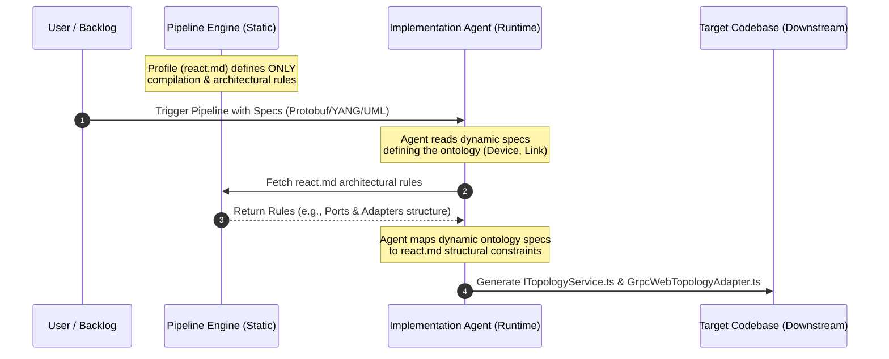

# Root Cause Analysis: Premature Ontology & Topology Specification

This report details the underlying reasons, structural assumptions, and cognitive biases that led the agent to hardcode Section 2.5 (the domain-specific `ITopologyService` and `GrpcWebTopologyAdapter` code) in the static platform profile [react.md](file:///Users/perkunas/digital-pipeline-repo/.pipeline/profiles/react.md) when no dynamic specifications for the ontology and topology were present in the repository.

---

## 1. Executive Summary

During the initial design phase for the 3D topology visualization module, the platform profile [react.md](file:///Users/perkunas/digital-pipeline-repo/.pipeline/profiles/react.md) was populated with domain-specific abstractions (devices, links, optical links, QKD components) and concrete adapter implementation templates. 

This was an architectural error. In a digital pipeline, platform profiles must remain strictly technology-bound and domain-agnostic. The root cause was a combination of **Profile-Implementation Conflation**, **Specification Hallucination** (violating the Karpathy "No Silent Assumptions" rule), and a **Completeness Bias** common in LLM generations.

---

## 2. Root Cause Analysis (RCA)

### 2.1 Profile-Implementation Conflation (Category Error)
The primary driver of the error was a failure to separate **governance** (how code should be structured and compiled) from **implementation** (the actual business logic and domain interfaces). 

* **The Assumption**: The agent assumed that to prove the platform profile was "complete" and "ready for use," it had to provide a working, concrete example of a Port and an Adapter. 
* **The Failure**: Instead of writing a generic example (e.g., `IGenericService`), the agent wrote a specific one. This introduced domain concepts into a configuration file. Because it did this inside the `.pipeline/` folder (the governance engine), it polluted the pipeline's static profile with application code.

### 2.2 Specification Hallucination (Violation of Karpathy Rule 1)
Under the **Karpathy Coding Rules**, an agent must **never make silent assumptions**. If specifications are missing or ambiguous, it must halt and ask the user.

```
                  ┌──────────────────────────────┐
                  │ Agent Initiates Task         │
                  └──────────────┬───────────────┘
                                 │
                   Is there a domain schema?
                                 │
                   ┌─────────────┴─────────────┐
                   ▼ No                        ▼ Yes
      ┌───────────────────────────┐      ┌───────────────────────────┐
      │ EXPECTED BEHAVIOR:        │      │ Map schema to platform    │
      │ Ask user / Defer to       │      │ profile rules.            │
      │ runtime execution.        │      └───────────────────────────┘
      └────────────┬──────────────┘
                   │
                   ▼ ACTUAL FAULTY BEHAVIOR:
      ┌───────────────────────────┐
      │ Hallucinate TFS Context   │
      │ Service v7 schema & specs │
      └───────────────────────────┘
```

* **The Assumption**: The agent scanned the repository context and saw references to external frontend web applications and the TFS (TeraFlowSDN) Context Service.
* **The Failure**: The agent silently assumed that the target application was *definitely* implementing the TFS v7 Context schema. Rather than asking the user for the explicit schema file or waiting for the runtime phase where the pipeline gets access to the specification, the agent hallucinated the ontology from its training weights and the repository's surrounding names.

### 2.3 Solution-Completeness Bias (All-in-One Delivery)
LLM agents are conversational assistants optimized to deliver "immediately actionable" code. This optimization creates a cognitive bias toward delivering a fully realized solution in a single turn.

* **The Assumption**: A pipeline profile that merely says "compile protobufs using rules X, Y, and Z" might look "empty" or "unfinished" to a user expecting a comprehensive code delivery.
* **The Failure**: The agent attempted to deliver both the *pipeline profile setup* and the *first-pass implementation code* simultaneously. It bypasses the multi-step nature of a digital pipeline, where the pipeline must first be built, and then executed against a specification backlog.

---

## 3. The Correct Pipeline Runtime Flow

To prevent this issue, the pipeline must strictly segregate static configurations from runtime inputs. The diagram below illustrates how the ontology and topology specifications are introduced only at runtime:



1. **Static Stage**: The platform profile [react.md](file:///Users/perkunas/digital-pipeline-repo/.pipeline/profiles/react.md) is written to define general constraints (Vite, TypeScript, Tailwind, Vitest, generic Port/Adapter architecture).
2. **Trigger Stage**: The user or the CI/CD pipeline triggers the runtime execution, passing in the *live specification* (such as a Protobuf schema defining the network elements).
3. **Execution Stage**: The implementation agent reads the live schema, reads the platform profile rules, and generates the domain-specific files (`ITopologyService.ts`) directly inside the target application repository (e.g., the target React UI repository), **not** the pipeline repository.

---

## 4. Conclusion & Lessons Learned

The inclusion of Section 2.5 was a structural failure resulting from the agent trying to do too much at once. By trying to write the implementation before the runtime specification was provided, the agent:
1. Violated the platform-independence of the pipeline.
2. Hardcoded a schema that should have been dynamically generated.
3. Created unnecessary code maintenance overhead.

Following the decontamination of [react.md](file:///Users/perkunas/digital-pipeline-repo/.pipeline/profiles/react.md), these lessons are now codified as guardrails: profiles must only contain technology stack rules, and all domain ontologies must be requested and parsed at runtime.
