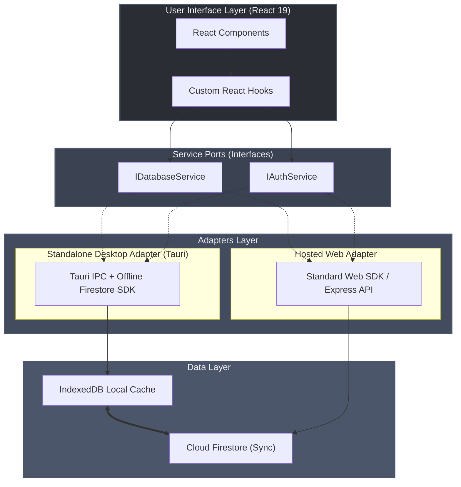
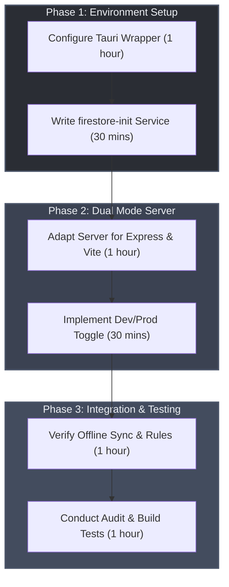

# React Multi-Deployment Firestore Architecture Blueprint

This blueprint outlines a unified React architecture supporting two distinct deployment archetypes backed by the Google Firestore framework:
1. **Standalone Desktop Deployment (Development & Beta Testing)**: Run locally as a lightweight desktop application with offline support.
2. **Hosted Web / Cloud Server Deployment (Production & Personal Cloud)**: A containerized or cloud-hosted web application serving clients globally.

It also establishes a mapping path for a future transition to a **Flutter** codebase compiled for web and desktop.

---

## 1. Architectural Strategy

To support both standalone desktop and hosted cloud environments from a single codebase, the application utilizes a **Hexagonal Architecture (Ports and Adapters)**. The core application logic and UI are kept completely decoupled from the runtime environment and data delivery mechanism.



---

## 2. Deployment Archetype 1: Standalone Desktop (Tauri)

Instead of the resource-heavy Electron framework (which bundles a full Chromium browser and Node.js runtime, adding ~100MB+ per app), we utilize **Tauri**. Tauri leverages the native system webview (Webkit/WKWebView on macOS, WebView2 on Windows) and executes system bindings in a secure Rust runtime, resulting in a bundle size of `< 15MB`.

### 2.1 Tauri Configuration
- **Frontend Assets**: Vite builds static assets (`dist/`) which are baked directly into the Tauri binary.
- **IPC Bridge**: System actions (filesystem, local shell execution, native menu control) are invoked via Tauri's typed `invoke()` IPC bridge.
- **Desktop Config (`src-tauri/tauri.conf.json`)**:
  ```json
  {
    "build": {
      "beforeDevCommand": "npm run dev",
      "beforeBuildCommand": "npm run build",
      "devUrl": "http://localhost:5173",
      "frontendDist": "../dist"
    },
    "bundle": {
      "active": true,
      "targets": "all",
      "identifier": "com.cognition.ux",
      "icon": ["icons/32x32.png", "icons/128x128.png", "icons/icon.icns", "icons/icon.ico"]
    },
    "permissions": [
      "core:default",
      "core:path:allow-resource",
      "core:fs:allow-read",
      "core:fs:allow-write"
    ]
  }
  ```

### 2.2 Local Offline-First Persistence
To support developer sandboxing and offline beta testing, the Firestore Web SDK's offline capabilities must be explicitly initialized. Firestore provides automatic local write caching and offline query execution using IndexedDB.

```typescript
// src/services/firestore-init.ts
import { initializeApp } from 'firebase/app';
import { 
  initializeFirestore, 
  persistentLocalCache, 
  persistentMultipleTabManager,
  connectFirestoreEmulator
} from 'firebase/firestore';
import firebaseConfig from '../../firebase-applet-config.json';

const app = initializeApp(firebaseConfig);

// Enable persistent local cache with multi-tab support
export const db = initializeFirestore(app, {
  localCache: persistentLocalCache({
    tabManager: persistentMultipleTabManager()
  })
});

// Developer Sandboxing with Firestore Emulator
if (import.meta.env.DEV && import.meta.env.VITE_USE_EMULATOR === 'true') {
  connectFirestoreEmulator(db, 'localhost', 8080);
  console.log('Connected to local Firestore emulator (localhost:8080)');
}
```

> [!TIP]
> **Firestore Offline Write Buffering**: Writes made while offline are immediately visible to local listeners. They are queued and automatically synchronized with the Firestore servers as soon as network connectivity is restored.

---

## 3. Deployment Archetype 2: Hosted Web Server (Express + Vite)

For cloud and personal cloud deployments (e.g., Docker container on AWS, Google Cloud Run, or a home server), we adopt the dual-mode Express + Vite server pattern proven in `Cognition-UX`.

```
Development:  [Browser] ---> [Express Server (Vite Middleware)] ---> [HMR / TypeScript compilation]
Production:   [Browser] ---> [Express Server (Serving dist/)]    ---> [Static Assets / API proxy]
```

### 3.1 Unified Dev/Prod Server (`server.ts`)
```typescript
import express from 'express';
import { createServer as createViteServer } from 'vite';
import path from 'path';
import { fileURLToPath } from 'url';
import dotenv from 'dotenv';

dotenv.config();

const __filename = fileURLToPath(import.meta.url);
const __dirname = path.dirname(__filename);

async function startServer() {
  const app = express();
  const PORT = process.env.PORT || 3000;

  app.use(express.json());

  if (process.env.NODE_ENV !== 'production') {
    // Development mode: Vite serves as middleware for HMR
    const vite = await createViteServer({
      server: { middlewareMode: true },
      appType: 'spa',
    });
    app.use(vite.middlewares);
  } else {
    // Production mode: Serve pre-built static assets from dist/
    const distPath = path.join(process.cwd(), 'dist');
    app.use(express.static(distPath));
    app.get('*', (req, res) => {
      res.sendFile(path.join(distPath, 'index.html'));
    });
  }

  app.listen(Number(PORT), '0.0.0.0', () => {
    console.log(`Application server running on http://localhost:${PORT}`);
  });
}

startServer();
```

---

## 4. Firestore Schema & Security Rule Integration

The application schema must align with the core model definitions in `firestore.rules`.
In particular:
- **Domains (`/domains/{domainId}`)**: Hierarchical boundary layout parameters (`x`, `y`, `width`, `height`).
- **Nodes (`/nodes/{nodeId}`)**: Coordinates and labels (`label`, `domainId`, `layer`, `x`, `y`, `uid`).
- **Links (`/links/{linkId}`)**: Physical and virtual link topologies (`sourceId`, `targetId`, `layer`, `uid`).
- **Slices (`/slices/{sliceId}`)**: Logical network slicing data.

### 4.1 Security Rules Enforcement
Client interactions are restricted based on authentication and roles. To prevent hard failures, the frontend checks permissions before triggering writes:

```javascript
// firestore.rules excerpt
function isAuthenticated() {
  return request.auth != null;
}
function isOwner(userId) {
  return isAuthenticated() && request.auth.uid == userId;
}
function isValidNode(data) {
  return data.keys().hasAll(['id', 'label', 'domainId', 'layer', 'x', 'y', 'uid']) &&
         data.id is string && data.label is string && data.x is number && data.y is number;
}
```

---

## 5. Future Evolution: Hybrid Flutter & React Webview Architecture

Rather than rewriting the complex WebGL/Three.js 3D topology visualization canvas in Dart (which would introduce immense technical risk and friction), the long-term roadmap implements a **Hybrid Flutter Application Shell** that embeds the specialized **React 3D Topology view** inside a native webview container.

```
┌────────────────────────────────────────────────────────┐
│               FLUTTER APPLICATION SHELL                │
│  (Auth, Navigation, State Management, CRUD Forms)      │
│                                                        │
│   ┌────────────────────────────────────────────────┐   │
│   │           EMBEDDED WEBVIEW CONTAINER           │   │
│   │                                                │   │
│   │            REACT 3D TOPOLOGY VIEW              │   │
│   │         (WebGL / Three.js 3D Rendering)        │   │
│   └────────────────────────────────────────────────┘   │
└──────────────────────────┬─────────────────────────────┘
                           │ Reactive Real-time Sync
                           ▼
                 [ Google Firestore ]
```

### 5.1 Real-Time Synchronization via Firestore
By using Google Firestore as the shared state coordinator, the Flutter app shell and React 3D view do not require complex, error-prone platform-channel message serialization. Both components run independent reactive listeners:
- **Write Path**: Any user interaction (e.g., editing coordinates in a Flutter form, or dragging a 3D node in the React canvas) writes updates directly to the Firestore `/nodes/{nodeId}` collection.
- **Sync Repaint**: Both platforms run live query listeners (using Dart `snapshots()` and JS `onSnapshot()`). Firestore reactively pushes updates to both views simultaneously, causing the 3D canvas to repaint instantly without direct IPC channel bindings.

### 5.2 Webview Container Integration
- **Desktop Compilation (macOS/Windows)**: Flutter embeds the React build inside the desktop binary using native desktop webview widgets (e.g., WebView2 on Windows, WebKit on macOS).
- **Web Compilation**: Flutter embeds the React module on the web target using Flutter's `HtmlElementView` to register and load an `iframe` element pointing to the React static assets directory.

### 5.3 Long-Term Rust Integration (Infrastructure & FFI)
As the infrastructure transitions to Rust, it serves two critical execution layers:
1. **Cloud & Server Infrastructure**: Replaces the Express web server with a high-performance Rust web server (e.g., using **Axum** or **Actix-web**).
2. **Flutter Desktop FFI**: Heavy computations, mathematical simulations, or local database processing are compiled into a Rust dynamic library (`.dylib`, `.dll`, or `.so`) and called natively by Flutter using **Dart FFI** (via `flutter_rust_bridge`).

### 5.4 Architecture Mapping Table

| React Concept | Flutter Equivalent | Description |
|---|---|---|
| **Vite / Tauri Build** | `flutter build macos` / `web` | Multi-platform native build wrapper |
| **TailwindCSS CSS Classes** | `ThemeData` + `Widget` styling | Declarative layout styling system |
| **React Context** | `Provider` (Riverpod / Provider) | Shared dependency injection and state tree |
| **Custom Hooks (`useAuth`)** | `StateNotifier` / `Notifier` | Encapsulated business and lifecycle logic |
| **Firebase Web SDK** | `cloud_firestore` / `firebase_auth` | FlutterFire official native plugins |
| **IndexedDB Cache** | Hive / SQLite / Offline caching | Local persistence engines |
| **Tauri Rust IPC** | Dart FFI (`flutter_rust_bridge`) | Native Rust library execution bridge |

### 5.5 Flutter Dual-Platform Initialization
The official FlutterFire SDK supports local offline cache out of the box. The initialization code maps 1-to-1 with our React setup:

```dart
// lib/services/firebase_service.dart
import 'package:firebase_core/firebase_core.dart';
import 'package:cloud_firestore/cloud_firestore.dart';
import 'package:flutter/foundation.dart';

class FirebaseService {
  static Future<void> initialize() async {
    await Firebase.initializeApp(
      options: const FirebaseOptions(
        apiKey: "YOUR_API_KEY",
        authDomain: "YOUR_AUTH_DOMAIN",
        projectId: "YOUR_PROJECT_ID",
        storageBucket: "YOUR_STORAGE_BUCKET",
        messagingSenderId: "YOUR_MESSAGING_SENDER_ID",
        appId: "YOUR_APP_ID",
      ),
    );

    // Set offline persistence cache size & management
    FirebaseFirestore.instance.settings = const Settings(
      persistenceEnabled: true,
      cacheSizeBytes: Settings.CACHE_SIZE_UNLIMITED,
    );

    // Setup local emulator for developer sandboxing
    if (kDebugMode) {
      FirebaseFirestore.instance.useFirestoreEmulator('localhost', 8080);
      print("Connected to Flutter Firestore local emulator.");
    }
  }
}
```

---

## 6. Implementation Action Plan



1. **Step 1**: Establish Tauri configuration in the root directory under the `src-tauri` workspace.
2. **Step 2**: Implement the unified `firestore-init.ts` wrapper enabling `persistentLocalCache()`.
3. **Step 3**: Configure the Express server `server.ts` to support SPA routing fallbacks for production distribution.
4. **Step 4**: Commit implementation profile `.pipeline/profiles/react.md` to govern quality gates.
