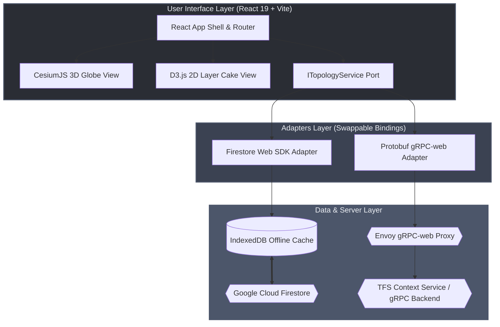
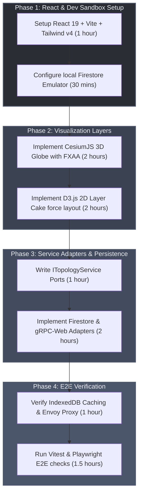

# React Web-Centric Single-Stack Deployment Architecture Blueprint (Option A)

This blueprint outlines the simplified web-centric architecture for the 3D topology visualization module. Following the adversarial audit critique, this blueprint establishes a **Single-Runtime React Web Application** (Option A), completely eliminating the hybrid Flutter shell wrapper and double-runtime WebView complexities.

---

## 1. Architectural Strategy

To maintain maximum runtime efficiency and a unified TypeScript/JavaScript toolchain, the entire application executes inside a single browser or native web runtime context. Data retrieval and visualization are decoupled using a strict **Hexagonal Architecture (Ports and Adapters)**.



- **Single Runtime**: Eliminates the Dart VM / Flutter C++ wrapper. Observability, debugging, and styling (Tailwind CSS v4) are unified inside a single JavaScript context.
- **Loose Coupling**: Rendering layers (CesiumJS and D3.js) bind exclusively to clean TypeScript Port interfaces (like `ITopologyService`), keeping them 100% database-agnostic.
- **Swappable Bindings**: The application can swap its data source from Firestore to a gRPC/Protobuf API simply by swapping the injected Adapter, leaving the UI components completely unchanged.

---

## 2. 3D & 2D Visualization Implementations

Following the reference pattern in `Cognition-UI-tsx`, the topology visualization is divided into two distinct components:

### 2.1 3D Earth Globe (CesiumJS via Resium)
Terrestrial nodes, LEO satellites in orbit, and physical fiber links are rendered on a 3D globe using **CesiumJS** (wrapped in React via the `resium` library).
* **High-DPI Sharp Rendering**: The viewer uses custom pixel ratio overrides to prevent blurriness on Retina/4K screens:
  ```typescript
  viewer.resolutionScale = Math.min(window.devicePixelRatio || 1.0, 2.0);
  viewer.useBrowserRecommendedResolution = false;
  ```
* **Anti-Aliasing**: Fast Approximate Anti-Aliasing (FXAA) post-processing is enabled for crisp line rendering:
  ```typescript
  if (viewer.scene.postProcessStages.fxaa) {
    viewer.scene.postProcessStages.fxaa.enabled = true;
  }
  ```
* **Terrain & Elevation**: Globe rendering enables depth-testing against 3D terrain to show realistic elevations:
  ```typescript
  viewer.scene.globe.depthTestAgainstTerrain = true;
  ```

### 2.2 2D Layer Cake (D3.js Force Layout)
To represent logical interfaces, VLAN configurations, and QKD keys, a horizontal "Layer Cake" view is drawn using SVG and **D3.js dynamic force layouts**.
* **Planes**: Nodes are partitioned into five horizontal bands:
  1. Space (LEO Orbit / Infrastructure)
  2. Layer 3 (IP/MPLS Core)
  3. Layer 2 (Carrier Access & Ethernet Switches)
  4. Layer 1/0 (Optical ROADM / Transport)
  5. QKD Plane (Quantum Key Distribution)
* **Alignment Forces**: Custom Y-axis alignment forces keep nodes inside their respective horizontal plane bands, while X-axis alignment forces distribute terrestrial nodes by longitude and satellites evenly across the space lane.

---

## 3. Persistence & Local Cache

Persistence rules map directly to the `NetworkService` database singleton structure:

### 3.1 Firestore Adapter & IndexedDB Caching
When running in Firestore mode, the Firebase Web SDK manages connection states and offline persistence.
* **IndexedDB Cache Persistence**: Offline writes and queries are buffered locally using the browser's IndexedDB cache. Writes are immediately reflected to local React snapshot listeners (`onSnapshot`) and automatically synced to the cloud upon reconnection.
* **Sandbox Configuration**: In developer sandboxes, the connection redirects to a local Firestore emulator running on port `8080`.

### 3.2 gRPC-Web Adapter & Envoy Proxy
When running in Protobuf mode, browser-based gRPC-web clients translate calls to HTTP/1.1. An Envoy proxy container terminates HTTP/1.1 and routes native HTTP/2 gRPC requests to the TFS `ContextService` container on port `1010`.
* **CORS & Headers**: Envoy handles CORS headers and allows authorization bearer tokens to pass through RPC metadata headers.

---

## 4. Deployment Archetypes

### 4.1 Archetype 1: Production Web Deployment (CDN or Container)
* **CDN / Static Hosting**: The compiled static directory (`dist/`) is deployed directly to static site hosting services (e.g., Firebase Hosting, Vercel, NGINX CDN).
* **Express Container**: For self-hosted cloud environments, Vite builds static assets served by an Express server.

### 4.2 Archetype 2: Local Developer Sandbox (`docker-compose.yml`)
To spin up the React frontend, Firestore Emulator, and Envoy proxy sidecar:

```yaml
version: '3.8'

services:
  frontend-dev:
    build:
      context: .
      dockerfile: Dockerfile
    ports:
      - "3000:3000"
    environment:
      - VITE_USE_EMULATOR=true
      - VITE_GRPC_ENDPOINT_URL=http://localhost:8080
    depends_on:
      - firestore-emulator
      - envoy-proxy

  firestore-emulator:
    image: mtlynch/firestore-emulator:latest
    ports:
      - "8080:8080" # Firestore emulator port

  envoy-proxy:
    image: envoyproxy/envoy:v1.28-latest
    volumes:
      - ./envoy.yaml:/etc/envoy/envoy.yaml
    ports:
      - "8082:8082" # gRPC-web proxy port
    depends_on:
      - context-service

  context-service:
    image: gintatkinson/tfs-v7-golden-context:latest
    ports:
      - "1010:1010" # Native gRPC port
```

---

## 5. Implementation Action Plan



1. **Step 1**: Initialize the Vite workspace using TailwindCSS v4 and configure Firestore Emulator redirections.
2. **Step 2**: Import the `resium` wrapper and configure D3 force alignment vectors for the Layer Cake plane separation.
3. **Step 3**: Establish the `ITopologyService` Port interface and write swappable database adapter classes (Firebase Web SDK vs. gRPC-web client classes).
4. **Step 4**: Run E2E test suites verifying that the map correctly caches and renders in offline states.
