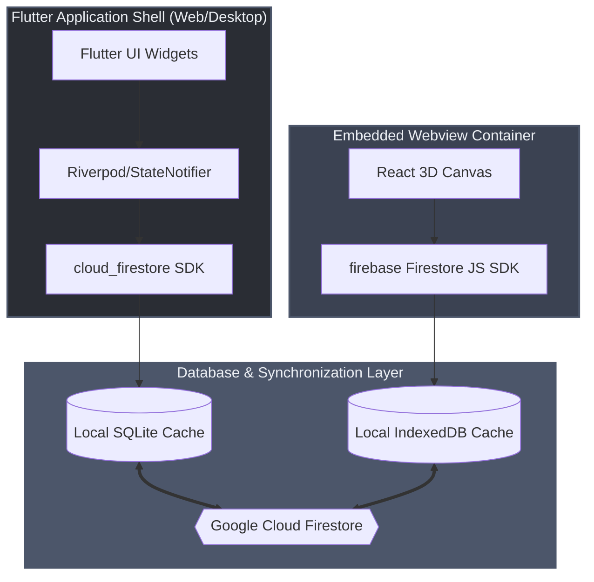
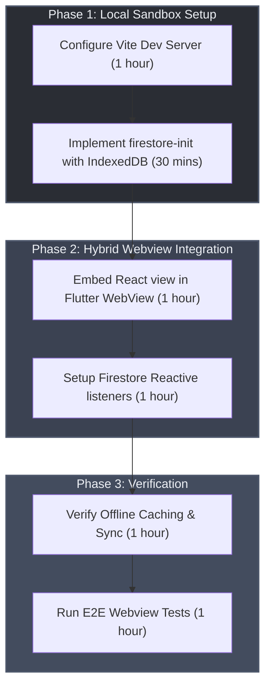

# React Firestore Hybrid Deployment Architecture Blueprint

This blueprint outlines the simplified architecture for the 3D topology visualization module. It completely eliminates Tauri/wrapper complexity in favor of a unified **Hybrid Flutter Shell + Embedded React** model for web and native desktop (macOS & Windows) deployments, backed by Google Firestore.

---

## 1. Architectural Strategy

Instead of wrapping a full React application in Tauri (which requires a complex Rust compilation toolchain), the core application shell (auth, navigation, CRUD forms) is implemented in **Flutter** (for both web and native desktop). The specialized React 3D view is embedded as a decoupled micro-frontend running in a native Webview inside the Flutter shell.



---

## 2. Deployment Archetype 1: Standalone React Dev Sandbox (Vite/Express)

For local development, testing, and isolated UI work on the 3D topology view, the React module runs as a standalone Vite web project.

### 2.1 Developer Local Offline-First Persistence
The React module uses the Firebase Web SDK's offline capabilities (`IndexedDB`) to support disconnected testing:

```typescript
// src/services/firestore-init.ts
import { initializeApp } from 'firebase/app';
import { 
  initializeFirestore, 
  persistentLocalCache, 
  persistentMultipleTabManager,
  connectFirestoreEmulator
} from 'firebase/firestore';
import firebaseConfig from '../../firebase-applet-config.json';

const app = initializeApp(firebaseConfig);

// Initialize Firestore with persistent IndexedDB cache
export const db = initializeFirestore(app, {
  localCache: persistentLocalCache({
    tabManager: persistentMultipleTabManager()
  })
});

// Developer Sandboxing with local emulator
if (import.meta.env.DEV && import.meta.env.VITE_USE_EMULATOR === 'true') {
  connectFirestoreEmulator(db, 'localhost', 8080);
  console.log('Connected to local Firestore emulator (localhost:8080)');
}
```

---

## 3. Deployment Archetype 2: Embedded Webview (Production Desktop/Web)

In production, the Flutter application acts as the compile-target host for macOS, Windows, and Web.

### 3.1 Webview Integration
* **Desktop targets (macOS/Windows)**: Flutter compiles to a native C++ application and embeds the React 3D topology module using native desktop webview widgets (e.g., WebView2 on Windows, WebKit/WKWebView on macOS).
* **Web targets**: Flutter embeds the React build as a static micro-frontend using an `iframe` element wrapper loaded via Flutter's `HtmlElementView`.

### 3.2 Decoupled Synchronization via Firestore
Rather than serialization/IPC bridges, data synchronizes reactively:
* **Write Path**: Any user edit (dragging a node in React or typing in a Flutter form) updates the Firestore `/nodes/{nodeId}` document.
- **Reactive Repaint**: Both the Flutter shell (via Dart `snapshots()`) and the React canvas (via JS `onSnapshot()`) listen to database changes. When a coordinate changes, the 3D view repaints automatically in real-time.

---

## 4. Platform Mapping Strategy (React to Flutter)

To maintain design parity across the hybrid layers, the React components and hooks correspond directly to Flutter widgets and providers:

| React Concept | Flutter Equivalent | Description |
|---|---|---|
| **Vite Dev Server** | `flutter run` | Local development server |
| **TailwindCSS Classes** | `ThemeData` + Widget styling | Declarative visual styling |
| **React Context** | Riverpod `Provider` | Shared state and dependency injection |
| **Custom Hooks (`useAuth`)** | `Notifier` / `StateNotifier` | Encapsulated business and auth logic |
| **Firebase Web SDK** | `cloud_firestore` / `firebase_auth` | FlutterFire native plugins |
| **IndexedDB Cache** | SQLite Cache / Hive | Local persistence engines |
| **JS/Webview Interface** | Dart `JavascriptChannel` | Host-to-Client fallback communication channel |

---

## 5. Implementation Action Plan



1. **Step 1**: Set up the standalone React Vite configuration for the 3D topology canvas.
2. **Step 2**: Configure the `firestore-init.ts` wrapper with `persistentLocalCache` for IndexedDB cache management.
3. **Step 3**: Embed the React webview in the Flutter shell and configure Firestore snapshot synchronizations.
4. **Step 4**: Verify write synchronizations, offline cache fallbacks, and emulator redirection.
