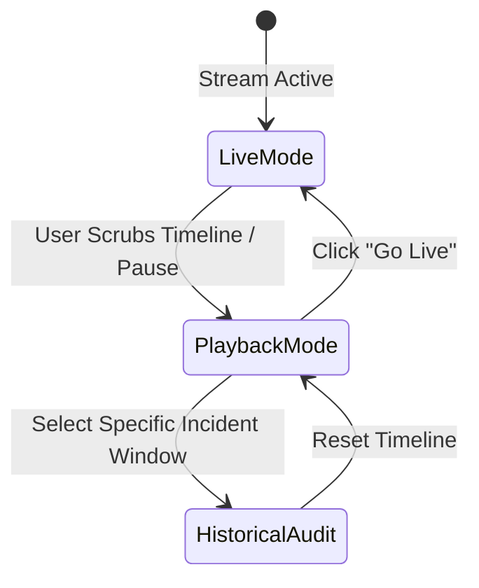
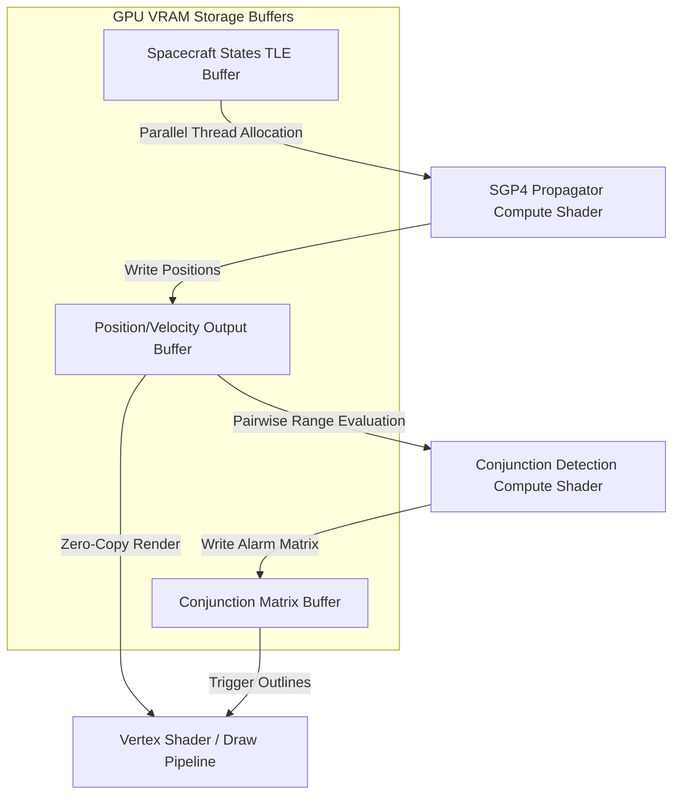

# Engineering Analysis: Spatial-Temporal (4D) UI Architecture & GPGPU Trajectory Pipeline

**Status**: PROPOSED / UNDER REVIEW  
**Date**: 2026-06-16  
**Target Domains**: Air Traffic Control, Satellite Telemetry, Subsea Logistics, Mars/Moon Exploration  
**Platform Scope**: React Web (WebGPU/WGSL) & Flutter Desktop/Web (Impeller/Metal/Vulkan)

---

## 1. Mathematical Foundation of 4D Coordinate Translation

Safety-critical command and control systems manage moving objects across different physical media. Each medium uses a distinct Coordinate Reference System (CRS). To display them in a unified viewport without rendering anomalies or precision loss (floating-point jitter), the UI Adapter must translate them to a unified normalized Cartesian viewport.

```mermaid
flowchart LR
    subgraph Input Coordinate Reference Systems
        A[Air (WGS84 / Geodetic)]
        B[Orbit (ICRF / J2000 Cartesian)]
        C[Body-Fixed (IAU2000 Mars/Moon)]
    end

    D[Unified ECEF / ECI Cartesian Frame]
    E[Double-Precision View Offset Translation]
    F[Normalized Viewport Coordinates]

    A --> D
    B --> D
    C --> D
    D --> E
    E -->|GPU Vertex Shader| F
```

### 1.1. Coordinate Reference Systems (CRS)
1. **Geodetic (WGS84)**: Used for aviation and maritime. Represented by Latitude ($\phi$), Longitude ($\lambda$), and Altitude ($h$).
2. **Earth-Centered Inertial (ECI / J2000)**: Used for orbital mechanics. Spacecraft positions are measured relative to the Earth's center, with axes aligned with distant stars (non-rotating relative to the Earth).
3. **Body-Fixed Spherical (IAU2000)**: Used for Moon/Mars surface rovers. Longitude, latitude, and local altitude relative to the planet's reference ellipsoid.
4. **Stellar & Galactic Coordinate Reference Systems**: Used for deep-space and extra-solar systems. Relative coordinates are defined centered on stellar barycenters or the Galactic coordinate center (e.g., Sagittarius A*), resolving coordinates through recursive tree transformation.

### 1.2. Conversion to Cartesian ECEF/ECI/Local Frame origin
To render these positions in a single WebGL/Impeller viewport, coordinates are converted to **Earth-Centered, Earth-Fixed (ECEF)** Cartesian coordinates $(X, Y, Z)$ using:

$$N(\phi) = \frac{a}{\sqrt{1 - e^2 \sin^2\phi}}$$

$$X = (N(\phi) + h) \cos\phi \cos\lambda$$

$$Y = (N(\phi) + h) \cos\phi \sin\lambda$$

$$Z = \left(N(\phi)(1 - e^2) + h\right) \sin\phi$$

*Where $a$ is the semi-major axis (6378137.0 m for WGS84) and $e^2$ is the first eccentricity squared ($6.69437999014 \times 10^{-3}$).*

### 1.3. Double-Precision Rendering Jitter Mitigation
Single-precision 32-bit floats (`float32`) only have 24 bits of mantissa, providing roughly 7 decimal digits of precision. For Earth coordinates in ECEF, 1 meter of precision requires representing values up to $6,378,137$, which consumes most of the precision, leading to "vertex jittering" at close zoom levels.
* **Mitigation**: The UI Adapter implements a **Camera-Relative Center Translation** on the CPU. The camera position $(X_{cam}, Y_{cam}, Z_{cam})$ is subtracted from all coordinates in double-precision (`float64`) *before* uploading vertices to the GPU buffer:

$$X_{rel} = X_{obj} - X_{cam}$$

The GPU receives relative coordinates close to $(0,0,0)$, allowing the 32-bit GPU shader to render sub-centimeter alignments with zero jitter.

---

## 2. Temporal Context & Time-Echo Synchronization

Managing moving objects requires a strict state machine to govern the relationship between **System Wall-Clock Time** ($t_{wall}$), **Live Telemetry Stream Time** ($t_{stream}$), and **Viewport Playback Time** ($t_{play}$).

### 2.1. Time-State Machine



* **Live Mode**: Viewport playback time locks to stream time ($t_{play} = t_{stream}$). Incoming WebSocket/gRPC packets immediately update position coordinates and alarms.
* **Playback Mode**: $t_{play}$ is independent. It increments based on a user multiplier ($1x, 2x, 10x, 100x$). Telemetry updates are pulled from local database buffers matching the current timestamp.
* **Historical Audit**: $t_{play}$ is locked to a specific window $[t_{start}, t_{end}]$. The system fetches raw telemetry logs, and the UI replays the event storm exactly as it occurred.

### 2.2. Preventing Event-Echo Loops in Temporal Changes
If the user scrubs the timeline:
1. The **TimelineScrubber** fires an `onTimeScrubbed(t)` interaction callback.
2. The global **Temporal Context** updates $t_{play}$ and pushes updates to the **TopologyMap** (moving nodes along their paths), **PropertyGrid** (loading values at time $t$), and **DensityTable** (loading historical alarms active at time $t$).
3. **Echo Guard**: The components must suppress outward event dispatches. If a component (e.g., the PropertyGrid) notices a change in properties due to $t_{play}$ changing, it must not fire `onPropertyChanged` events back to the repository gateway, which would contaminate live telemetry databases. Updates from temporal shifts are marked as `programmatic_playback` and processed silently.

---

## 3. Off-Thread Trajectory Interpolation & Dead Reckoning

In command and control, telemetry packets may arrive at varying intervals (e.g., aircraft transponders update at 1Hz, orbital satellites at 0.01Hz). The UI must display smooth animations at 60fps without blocky jumps.

### 3.1. Cubic Hermite Splines for Kinematic Paths
For atmospheric flights, we use Cubic Hermite Splines (Kochanek-Bartels splines) to interpolate position $\mathbf{P}(t)$ and velocity $\mathbf{V}(t)$ between telemetry points $\mathbf{P}_k$ at $t_k$ and $\mathbf{P}_{k+1}$ at $t_{k+1}$:

$$\mathbf{P}(t) = h_{00}(s)\mathbf{P}_k + h_{10}(s)(t_{k+1} - t_k)\mathbf{V}_k + h_{01}(s)\mathbf{P}_{k+1} + h_{11}(s)(t_{k+1} - t_k)\mathbf{V}_{k+1}$$

*Where $s = \frac{t - t_k}{t_{k+1} - t_k}$, and $h$ are the Hermite basis functions.*

### 3.2. Orbital Mechanics & Dead Reckoning (SGP4)
For orbiting objects, simple linear or cubic interpolation violates Kepler's laws, producing visually incorrect orbital curves.
* **Simplified General Perturbation 4 (SGP4)**: The background thread (Worker/Isolate) stores the spacecraft's **Two-Line Element (TLE)** parameters.
* **Propagation**: At any playback time $t_{play}$, the propagator evaluates SGP4 formulas using the TLE data to calculate the exact ECI position and velocity vector.

---

## 4. GPGPU Trajectory & Conjunction Compute Shaders

For $10,000+$ orbiting satellites and space debris elements, running SGP4 propagations and checking all pairs for conjunctions (collision risks) on the CPU causes instant thread starvation (complexities of $O(N^2)$ calculations).



### 4.1. WGSL SGP4 Compute Shader Pipeline
The TLE values are written into a GPU **Storage Buffer**. A compute shader allocates one thread per spacecraft:
1. The shader executes the SGP4 equations using Keplerian elements, calculating the coordinate vector $(X, Y, Z)$ at time $t_{play}$.
2. The coordinate results are written directly to an **Output Vertex Buffer** in VRAM.
3. The vertex shader reads this buffer directly to render the nodes on screen. The data never travels back to the CPU, eliminating memory bus overhead.

### 4.2. Pairwise Collision / Conjunction Shader
Following propagation, a second compute shader evaluates collision paths.
1. The shader runs in parallel over an $N \times N$ thread grid, where each thread $(i, j)$ calculates the Euclidean distance between satellite $i$ and satellite $j$:

$$d_{ij} = \sqrt{(X_i - X_j)^2 + (Y_i - Y_j)^2 + (Z_i - Z_j)^2}$$

2. If $d_{ij} < \text{threshold}$, the shader writes a conjunction warning into the **Conjunction Matrix Buffer** and flags an alarm state.
3. The render pipeline reads this state to draw red alarm rings around both nodes.

---

## 5. Platform Architecture Comparison: React vs. Flutter

Implementing double-precision camera offsets, time synchronization, and GPU-driven rendering requires different strategies in WebGPU (React) vs. Impeller (Flutter).

| Architectural Feature | React Web (WebGPU / Web Workers) | Flutter Desktop (Impeller / Dart Isolates) |
| :--- | :--- | :--- |
| **GPGPU Interface** | **WebGPU API**: Accesses GPU device queue and storage buffers via Javascript bindings. Shaders written in WGSL (WebGPU Shading Language). | **Impeller HAL**: Impeller uses Metal (macOS/iOS) or Vulkan (Windows/Linux) directly. Custom shaders written in GLSL and compiled to SPIR-V/MSL via offline compiler. |
| **Concurrency** | **Web Workers**: Thread communicating via `postMessage`. Shared buffers are configured using `SharedArrayBuffer` to avoid data copy latency. | **Dart Isolates**: Memory-isolated threads communicating via `SendPort`/`ReceivePort`. Large datasets are copied or passed via unmodifiable byte lists. |
| **3D Rendering Integration** | Rendered inside a `<canvas>` element managed by WebGL2 or WebGPU, overlaid with HTML context menus. | Rendered inside a `CustomPaint` or `Texture` widget with painting boundaries isolated via `RepaintBoundary`. |
| **Hit-Testing & Selection** | Ray casting using mouse coordinates translated into camera space, executed in the Web Worker. | Raw pointer coordinate ray-casting mapped through the RenderObject viewport transformation matrix. |

---

## 6. Implementation Specifications & Verifications

To enforce these architectural designs, the build linter checks the following constraints:

1. **Double-Precision Checker**:
   - TSX/Dart components must not bind raw absolute coordinate fields directly to vertex positions. They must use center-offset translation variables (e.g. `centerRelativePosition`).
2. **Event-Echo Verification**:
   - Any method updating the timeline playback scrubber must carry the annotation/modifier indicating programmatic silence (e.g., `@playOnly` or `isProgrammatic: true` check) to prevent triggering database updates.
3. **Worker Isolation**:
   - Imports of heavy orbit propagators (like `satellite.js` or Dart SGP4 libraries) are blocked inside UI component folders, restricting their use exclusively to Web Workers and Isolates.

---
