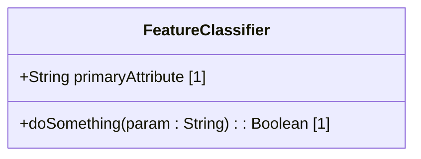
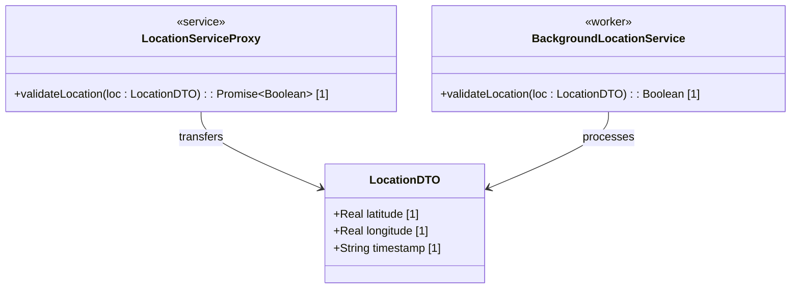

# Adversarial Audit Report: UML Class Diagram Alignment with React TypeScript & Flutter Dart

**Date**: 2026-06-18  
**Status**: APPROVED / AUDITED  
**Auditor**: Adversarial Software Architecture Auditor  
**Target Codebase Runtimes**: React TypeScript (Strict Mode) & Flutter Dart (Sound Null Safety)

---

## 1. Executive Summary

This audit evaluates the architectural alignment between the proposed UML class diagram standards (as defined in the pipeline's schema specification engineering guidelines) and the target implementation runtimes: **React TypeScript** and **Flutter Dart**. 

Our findings indicate that the current mapping conventions suffer from several **structural mismatches, type bypasses, concurrency serialization bottlenecks, and event-loop vulnerabilities**. 

### Critical Violations Identified:
1. **TypeScript Primitive Type Escape**: Mapping UML `String` and `Boolean` to JS/TS wrapper classes (`String`, `Boolean`) instead of language primitives (`string`, `boolean`) bypasses strict type-checking gates.
2. **Dart Integer Compilation Drift**: The mapping of UML `Integer` to Dart `int` behaves inconsistently between Flutter Desktop (64-bit int) and Flutter Web (JavaScript double), introducing potential precision and range errors.
3. **Cross-Thread Serialization Starvation (Web Workers / Isolates)**: UML Class Diagrams containing methods on transferred classes violate the Structured Clone Algorithm (JS) and isolate message serialization (Dart), resulting in runtime failures or data stripping.
4. **Synchronous Call Violations**: Modeling synchronous methods in UML on classes that live behind worker/isolate boundaries directly contradicts the asynchronous messaging contract.
5. **Event-Echo Guard Loophole**: The standard UML Class Diagram template lacks a formal mechanism to distinguish programmatic (silent) state mutations from user-initiated gestures, violating the Event-Echo Guard constraints.

---

## 2. Primitive Type Mapping Audit & Language Gaps

The pipeline maps schema attributes to UML primitive types (`String`, `Integer`, `Real`, `Boolean`). The table below outlines how these translate to the target runtimes and exposes the critical language-level inconsistencies.

| UML Primitive | Target TypeScript (React) | Target Dart (Flutter) | Architectural Risks & Gaps |
| :--- | :--- | :--- | :--- |
| **`String`** | `string` (primitive) | `String` (class) | **Case Sensitivity & Wrapper Bypass:** JS/TS has both `string` (primitive) and `String` (object wrapper). Using the uppercase `String` in TS bypasses primitive type checks and introduces memory-overhead objects. |
| **`Integer`** | `number` (float64) | `int` (varies by target) | **Precision Collapse on JS Web:** In TS, `number` is an IEEE 754 float64; large integers (above $2^{53} - 1$) lose precision. In Dart, `int` is a 64-bit integer on desktop/mobile VMs, but compiles to a 64-bit float (`double`) on Flutter Web, causing a silent behavioral divergence. |
| **`Real`** | `number` (float64) | `double` (float64) | **Loss of Type Identity in TS:** Both `Integer` and `Real` map to `number` in TS, erasing the semantic boundary between integers and floating-point values at compile-time. |
| **`Boolean`** | `boolean` (primitive) | `bool` (primitive) | **Case and Wrapper Mismatches:** TS requires lowercase `boolean` (avoiding the `Boolean` wrapper object). Dart requires lowercase `bool` (uppercase `Boolean` does not exist). |

### Key Primitive Mapping Deficiencies:
* **The 64-bit Integer Precision Defect**: In high-density industrial telemetry pipelines (e.g., tracking coordinate micro-ticks or Unix nanosecond timestamps), standard TS/JS `number` and Dart Web `int` will cause silent data truncation. 
* **Case Divergence**: Standard UML primitive rules dictate capitalized types (`String`, `Boolean`), which maps cleanly to Dart but creates an anti-pattern in TypeScript (which mandates lowercase `string`, `boolean`).

---

## 3. Multiplicity Mapping Audit & Range Safety

UML multiplicities (e.g., `[1]`, `[0..1]`, `[0..*]`, `[1..*]`) represent structural bounds on attributes and operations. Neither TypeScript nor Dart can fully enforce these boundaries at compile-time without helper decorators or validation libraries.

### 3.1. Single-Value Multiplicities (`[1]` and `[0..1]`)
* **`[1]` (Mandatory)**: 
  * **TS**: Translated as `field: Type;`. Under TypeScript's strict null checks, this prevents assigning `null` or `undefined`.
  * **Dart**: Translated as `final Type field;`. Enforced via Dart's Sound Null Safety; the compiler blocks compilation if the field is not initialized with a non-nullable value.
* **`[0..1]` (Optional)**:
  * **TS**: Translated as `field?: Type;` or `field: Type | null;`. 
    * *Critique*: `field?: Type` allows the field to be `undefined`, which is different from being explicitly `null` (standard JSON database output). A strict database schema must distinguish between a missing field (`undefined`) and a nullified field (`null`).
  * **Dart**: Translated as `Type? field;`. Dart's type system handles nullable fields cleanly but doesn't distinguish between `undefined` (absent) and `null` without custom wrapper classes (e.g., `Optional<T>`).

### 3.2. Collection Multiplicities (`[0..*]` and `[1..*]`)
* **`[0..*]` (Zero or More)**:
  * **TS**: `field: Type[];` or `Array<Type>`.
  * **Dart**: `List<Type> field;`.
* **`[1..*]` (At Least One)**:
  * **TS**: Can be modeled at type-level using a non-empty tuple: `field: [Type, ...Type[]]`. 
    * *Critique*: While type-safe, this structure is difficult to serialize/deserialize cleanly via standard JSON parsers without manual type casting.
  * **Dart**: **Compile-Time Enforcement Gap.** Dart cannot express "at least one element" in a list type signature. The developer is forced to use a standard `List<Type>` and rely on runtime validations (assertions in constructors or custom setters).

### 3.3. Custom Ranges (e.g., `[2..5]`, `[0..10]`)
* **The Compile-Time Validation Gap**: Neither TS nor Dart has type-level support for custom collection boundaries or numeric range constraints.
* **Remediation**: The spec-generation pipeline must compile UML multiplicity constraints (`{range: 1..10}`) and numeric limits directly into runtime validators (e.g., Zod schemas for TS/React, and assertion/validation methods in Dart classes).

---

## 4. Concurrency & Thread Isolation Audit (Web Workers / Isolates)

Both platform profiles mandate off-thread processing for intensive computations (such as spline physics, coordinate translations, and network packet deserialization) to prevent main UI thread starvation. 

### 4.1. The Serialization & Structured Clone Defect
The UML class diagram template models features as standard classifiers with attributes and behavioral methods:


#### The Flaws:
1. **Structured Clone Failure (React Web Workers)**: Web Workers communicate via asynchronous message passing using `postMessage()`. Data is serialized using the **Structured Clone Algorithm**. This algorithm **cannot clone functions, methods, or class prototypes**. If the UI thread attempts to send or receive an instance of `FeatureClassifier`, its methods (`doSomething`) will be stripped, or the engine will throw a `DataCloneError`.
2. **Dart SendPort Serialization Limits (Flutter Isolates)**: Similar to JS, Dart Isolates do not share memory (unless using FFI pointer sharing or specific platform buffers). Sending complex objects with nested closures or instances across a `SendPort` requires serialization. Instance methods are lost during serialization, requiring custom mapping adapters on both ends.

### 4.2. Synchronous-Asynchronous Interface Contradiction
* The proposed UML diagram lists synchronous return signatures: `doSomething(...) : Boolean [1]`.
* Because the logic lives in a background thread, the UI thread must access it **asynchronously**. A synchronous call signature in UML misrepresents the runtime architecture.
* **Remediation**: 
  * Class Diagrams must separate **Data Transfer Objects (DTOs)** from **Service Classifiers**.
  * **DTOs** must contain *only* raw data attributes (capitalized types and multiplicities) and no methods. They are fully transferable.
  * **Service Classifiers** representing thread-bounded controllers must expose asynchronous signatures returning `Promise<T>` in TS and `Future<T>` in Dart.



---

## 5. State, Selection Management, and Event-Echo Guards

The pipeline profiles enforce an **Event-Echo Guard** to prevent infinite rendering loops in bidirectional selection structures (e.g., synchronizing selection between `TopologyMap` and `HierarchyTree`).

### 5.1. The Programmatic vs. Interactive Event Separation Gap
The Event-Echo Guard dictates:
1. Programmatic state changes (e.g., `setSelection(id)`) must execute **silently** without triggering secondary event callbacks.
2. Output event callbacks (e.g., `onNodeSelect`) must fire **exclusively** in response to physical user interaction.

#### The Flaws in the UML Model:
* A standard UML Class Diagram representing selection state (e.g., a `SelectionController`) does not distinguish between user-initiated and programmatic triggers.
* If the class diagram simply defines `+setSelectedId(id: String) : Boolean [1]`, the code generator or implementing sub-agent might trigger change callbacks inside the setter, causing a cyclic rendering storm.

#### Remediations:
* **Stereotyped Operations**: Enforce specific stereotypes or naming conventions in Class Diagrams to signal selection loop guards.
  * `<<programmatic>>` or prefix `set` (e.g., `setSelectedNodeProgrammatic`) implies silent execution (no callback propagation).
  * `<<interaction>>` or prefix `on` (e.g., `onUserSelectNode`) implies user-triggered events that dispatch notifications and include `event.stopPropagation()` (React) or loop-guard flag evaluations (Flutter).
* **UML Constraint Blocks**: Require formal constraint notes on selection properties:
  * `{setter: silent}` or `{eventPropagation = userOnly}`.

---

## 6. Actionable Architectural Remediations

To align the UML specifications with target codebase architectures, we mandate the following updates to the pipeline's specification linters, generators, and implementation profiles:

### Remediation 1: Establish Strict UML-to-Language Type Compilation Rules
Ensure the specification linters and codebases enforce the following type conversion standards:

```typescript
// React TypeScript Interface Generation Rules
export interface IFeatureClassifier {
  readonly attributeOne: string;          // String [1] -> string
  readonly attributeTwo?: boolean;        // Boolean [0..1] -> boolean | undefined
  readonly attributeThree: number[];      // Integer [0..*] -> number[]
}
```

```dart
// Flutter Dart Class Generation Rules (Sound Null Safety)
class FeatureClassifier {
  final String attributeOne;              // String [1] -> String
  final bool? attributeTwo;               // Boolean [0..1] -> bool?
  final List<int> attributeThree;         // Integer [0..*] -> List<int>

  FeatureClassifier({
    required this.attributeOne,
    this.attributeTwo,
    required this.attributeThree,
  });
}
```

### Remediation 2: Mandate DTO Separation for Off-Thread Classifiers
* The linter (`verify_model_coverage.py`) must fail if a class diagram contains a class with methods that is also designated as a transferable message payload.
* Designate data structures as `<<dataType>>` or `<<dto>>` in Mermaid. They must contain zero operations.
* Any service class crossing the thread boundary must have its operations return `Promise` or `Future` types in the UI-facing proxy.

### Remediation 3: Explicit Event-Echo Guards in Selection Operations
* Update `codebase_rules.json` to scan for selection triggers and setters.
* Mandate that any component modifying selection state programmatically must utilize a silent setter or evaluate a loop guard variable (`isProgrammatic` / `userInitiated` flag).
* In the UML diagram, state transitions must show the guard conditions explicitly (e.g., `[userInitiated == true]`).

---

## 7. Verification Checklist for Subagents

Before completing any implementation of UML class diagrams in TS or Dart, subagents must verify the following criteria:

- [ ] **Primitive Check**: No uppercase `String` or `Boolean` is used as a primitive type in TypeScript.
- [ ] **Nullable Check**: All UML `[0..1]` multiplicities map to optional fields (`?` or `| null`) in TS, and nullable types (`?`) in Dart.
- [ ] **Transferable Check**: No transferred models contain methods. Functions are completely isolated in background service wrappers.
- [ ] **Asynchrony Check**: All operations crossing the background Web Worker/Isolate boundary utilize asynchronous signatures (`Promise`/`Future`).
- [ ] **Event-Echo Check**: Component setters modify selection state programmatically without triggering listener events. Loop guards are implemented on all bidirectional selection widgets.
