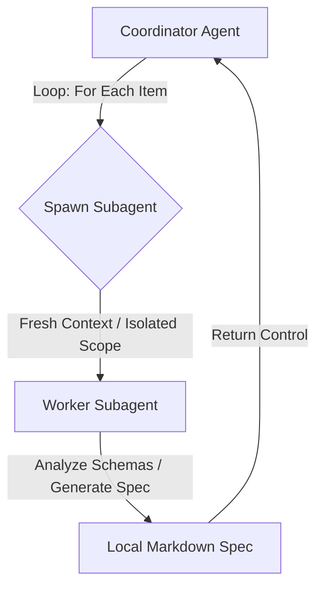

# Design: Isolated Subagent Lifecycles & Constraint-Driven Alternate Flows

This document details the design and implementation of context-isolated subagent execution in the specification engineering pipeline, alongside constraint-driven validation rules for Use Case alternate/exception flows and codebase compliance.

---

## 1. Context-Isolated Subagent Execution

To prevent context leakage and guarantee that each specification item (Epic, Feature, User Story, and Use Case) is engineered with zero residual state from prior steps, we have restructured the specification pipeline's dispatch mechanisms to use isolated subagents.

### Target Skill Configurations
* **[spec-orchestrator/SKILL.md](../../skills/spec-orchestrator/SKILL.md)**: Updated coordinator orchestration rules to mandate isolated subagent dispatch loops. The coordinator serves strictly as an orchestrator, invoking a fresh worker subagent for each target file.
* **[schema-specification-engineering/SKILL.md](../../skills/schema-specification-engineering/SKILL.md)**: Standardized isolated worker dispatches for Epic and Feature decomposition. 
* **[spec-user-story-engineering/SKILL.md](../../skills/spec-user-story-engineering/SKILL.md)**: Enforced isolated dispatches for generating OOA/OOD User Stories and UML sequence diagrams.
* **[spec-usecase-engineering/SKILL.md](../../skills/spec-usecase-engineering/SKILL.md)**: Mandated that each Use Case is processed by its own fresh, isolated subagent context.

### Conceptual Workflow

---

## 2. Constraint-Driven Use Case Alternate Flows Validation

Previously, the linter only verified a static floor (typically 2) for Alternate/Exception flows within a Use Case. This resulted in false positives, verifying 100% coverage even when a schema model defined many more validation rules than there were Alternate/Exception flows.

We have redesigned the linter to verify that the number of Alternate/Exception flows in a Use Case matches or exceeds the number of schema validation constraints defined in its referenced features.

### Linter Enhancements
* **Target File**: [uml.py](../../skills/spec-orchestrator/parity_auditor/src/parity_auditor/validators/uml.py)
* **Changes**:
  1. **Flow Parsing with Bullet Lookahead**: Modified the alternate flow splitter regex to support both `-` and `*` bullet list styles and parse the entire flow body (including numbered steps) by performing a lookahead for the next flow marker or the end of the block.
  2. **Schema Constraint Counting**: For each Use Case, the linter parses the realization matrix to locate all referenced feature files. It then scans those features' `### Validation & Constraints` (or `### 2. Validation & Constraints`) sections to count the defined validation constraints.
  3. **Constraint-Flow Parity Assertion**: Asserts that the Use Case defines at least `max(flow_limit, total_constraints)` Alternate/Exception flows. If the number of flows is fewer than the total count of validation constraints, the linter reports a compliance violation.
  4. **Title-Based Feature Resolution**: Enhanced the linter to handle tracker-linked feature references (e.g. `[Feature Title](https://.../issues/1)`). The linter extracts and normalizes the link's title text and dynamically maps it to the local feature file matching that title, ensuring constraints are successfully parsed offline even when file-path links are not present.

---

## 3. Codebase Bypass Loophole Validation Fix

Previously, the codebase linter raised "Compliance Bypass Loophole" errors if configured React/Flutter directories did not exist in the workspace, regardless of whether there was any code to validate. This blocked execution in empty/specification-only downstream projects (such as `dep-tst29`) or single-platform projects (React-only or Flutter-only).

### Fix Details
* **Target File**: [codebase.py](../../skills/spec-orchestrator/parity_auditor/src/parity_auditor/validators/codebase.py)
* **Changes**:
  * Added a `has_files_with_extensions` helper that scans the workspace for files of specific extensions (excluding meta/tool folders like `.git`, `skills`, `docs`, etc.).
  * Updated the validator to only trigger a loophole block for a missing configured directory if files matching the respective platform's file extensions are actually present in the workspace.

---

## 4. Verification

We verified the linter implementation using target repo testing:
* Target Repo Verification: Executed the updated linter directly inside the downstream projects (dep-tst29 and dep-tst30) and verified that it successfully resolved issue-linked features, counted constraints, and flagged missing alternate flows.
