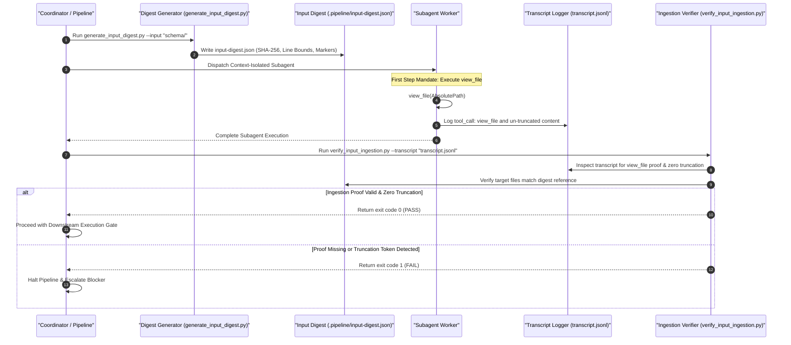

# 4-Stage Input Validation & Zero-Loss Propagation Architecture Blueprint

## Overview

The **Deterministic Input Validation & Zero-Loss Propagation Architecture** enforces strict engineering discipline, complete line-by-line file ingestion, and zero-loss requirement propagation across the `digital-pipeline-repo` ecosystem.

By requiring pre-computed input digests, direct `view_file` ingestion proofs, automated transcript log validation, and continuous verification gates, this architecture guarantees that specification files, schemas, and requirements are ingested with 100% fidelity without pre-summarization, token truncation, or silent parametric assumptions.

---

## The 4-Stage Architecture

### Stage 1: Pre-Ingestion Digest Generation (`generate_input_digest.py`)
Before dispatching context-isolated subagents or processing specifications, the coordinator executes `generate_input_digest.py` to scan input specification files (YANG, SysML, Markdown, etc.).
- Computes overall SHA-256 digest and file-level SHA-256 checksums.
- Calculates exact line counts and line-range bounds `[1, total_lines]`.
- Extracts structural section markers (headings, container declarations, node identifiers).
- Outputs the canonical reference structure to `.pipeline/input-digest.json`.

### Stage 2: Context-Isolated Subagent Dispatch & Direct Ingestion Mandate
Subagents are launched in context-isolated environments for specification, engineering, and implementation tasks.
- **First Step Mandate:** Every context-isolated subagent MUST execute `view_file` on the explicit target input file path as its very first action.
- Direct-path reading bypasses index cache limitations and eliminates parametric guessing.
- Ingestion of full line ranges guarantees complete structural fidelity.

### Stage 3: Post-Ingestion Transcript Verification (`verify_input_ingestion.py`)
Upon subagent completion, `verify_input_ingestion.py` inspects the execution transcript (`transcript.jsonl`).
- Validates that `view_file` was called for every target input file path listed in `.pipeline/input-digest.json`.
- Asserts zero `...` standalone truncation tokens or `<truncated N lines>` markers were emitted during input ingestion.
- Returns `exit 1` if ingestion proof is missing or if summarization tokens are detected, halting downstream workflows immediately.

### Stage 4: Zero-Loss Propagation & Downstream Enforcement
Downstream specification and code synthesis artifacts inherit the verified input digest.
- Verification gates validate complete structural coverage against `input-digest.json`.
- TDD RED-GREEN-REFACTOR cycles enforce zero documentation drift and zero contract breakage.
- All pipeline gates block state transitions unless transcript ingestion verification passes with `exit 0`.

---

## Architectural Sequence Diagram

---

## Verification & Compliance Matrix

| Component / Script | Location | Responsibility | Gate Exit Condition |
| :--- | :--- | :--- | :--- |
| **Input Digest Script** | `skills/spec-orchestrator/scripts/generate_input_digest.py` | Computes SHA-256, total lines, line bounds, and structural section markers | Generates valid `.pipeline/input-digest.json` |
| **Transcript Validator** | `scripts/verify_input_ingestion.py` | Audits `transcript.jsonl` for `view_file` calls & zero truncation | Returns `exit 0` on clean ingestion proof |
| **Test Suite Gate** | `tests/test_verify_input_ingestion.py` | Unit tests for digest generator, transcript validator & blueprint | Passes 100% in pytest suite |
| **Blueprint Specification** | `docs/designs/input-validation-architecture-blueprint.md` | Formal design specification & sequence diagram | Valid Mermaid & document integrity |
