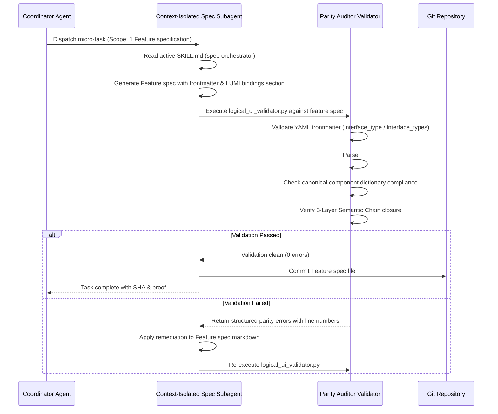

# LUMI (Logical User & Machine Interface) Framework Solution Blueprint

## 1. Executive Summary & Metamodel Vision

The **LUMI (Logical User & Machine Interface)** Framework is the core architectural foundation for platform-independent interface modeling within the Digital Engineering Agent Platform (DEAP). LUMI elevates and generalizes canonical Logical UI (LUI) principles across three primary operational interaction modalities:

1. **Visual GUI (Human-to-Machine / Logical UI)**
   - Abstract component models for graphical user interfaces across Web (React), Mobile (Flutter), Cockpit Displays (ARINC 661), and Electronic Flight Bags (EFB).
   - Core primitives: `StringInputField`, `NumericInputField`, `ToggleSwitch`, `ActionButton`, `TabbedContainer`, `CanvasWidget`.

2. **M2M API (Machine-to-Machine Interface)**
   - Declarative handler models for automated agentic interactions, inter-service calls, and tool dispatch.
   - Core primitives: `MCPToolHandler`, `RESTEndpointHandler`, `gRPCMethodHandler`, `GraphQLQueryHandler`.

3. **Hardware Bus (Physical & Embedded Register Interface)**
   - Memory-mapped, discrete, and bus-level hardware abstractions for real-time control, FPGA register banks, and avionics data buses.
   - Core primitives: `RegisterBuffer`, `DiscreteSignal`, `SerialDataStream`, `I2CBusDevice`.

### Unified Interface Abstraction Principles
- **Platform Independence**: Interface specifications define intent, data contracts, and safety constraints without coupling to concrete UI libraries, REST frameworks, or hardware toolchains.
- **Evolved 3-Layer Semantic Chain**: Every LUMI interface definition must bind through three mandatory layers:
  1. *Domain State & Signal Model*: Underpinning telemetry, data models, or hardware parameter buffers.
  2. *Logic & Safety State Management*: Safety statecharts, validators, or ViewModels.
  3. *Display & Actuator Interface Binding*: Concrete UI widget, API endpoint, or register buffer mapping.
- **Formal Grammar Compliance**: All interface definitions within Feature specifications strictly conform to an Extended Backus-Naur Form (EBNF) grammar.
- **Static Parity Auditing**: Enforced automatically offline by `logical_ui_validator.py` during build and CI pipeline runs.

---

## 2. Architecture & Metamodel Diagrams

### 2.1 Class Diagram: `LUMIInterfaceBinding` Hierarchy

```mermaid
classDiagram
    class LUMIInterfaceBinding {
        +String bindingId
        +String title
        +String description
        +String category
        +String domainStateRef
        +String safetyStateRef
        +Boolean isReadonly
        +Boolean validateBinding()
    }

    class VisualGUIBinding {
        +String widgetType
        +String labelText
        +String placeholder
        +String tooltipText
        +void renderWidget()
    }

    class M2MAPIBinding {
        +String protocolType
        +String endpointPath
        +String schemaRef
        +Integer timeoutMs
        +String invokeHandler(String payload)
    }

    class HardwareBusBinding {
        +String busType
        +String addressOffset
        +Integer bitWidth
        +String accessMode
        +String readRegister()
        +void writeRegister(String hexValue)
    }

    class StringInputField {
        +Integer minLength
        +Integer maxLength
        +String validationRegex
        +void onTextChanged(String text)
    }

    class NumericInputField {
        +Float minValue
        +Float maxValue
        +Integer precisionDigits
        +void onValueChanged(Float val)
    }

    class ToggleSwitch {
        +Boolean defaultState
        +void onToggled(Boolean state)
    }

    class ActionButton {
        +String actionIdentifier
        +void onPressed()
    }

    class TabbedContainer {
        +String activeTabId
        +void switchTab(String tabId)
    }

    class CanvasWidget {
        +Integer widthPx
        +Integer heightPx
        +void drawFrame()
    }

    class MCPToolHandler {
        +String toolName
        +String jsonSchemaArgs
        +String executionContext
        +String executeTool(String jsonArgs)
    }

    class RESTEndpointHandler {
        +String httpMethod
        +String routeTemplate
        +String requestBodySchema
        +String responseBodySchema
        +String handleRequest(String reqPayload)
    }

    class gRPCMethodHandler {
        +String serviceName
        +String methodName
        +String requestProto
        +String responseProto
        +String invokeGrpc(String protoPayload)
    }

    class GraphQLQueryHandler {
        +String operationName
        +String queryDocument
        +String executeQuery(String variablesJson)
    }

    class RegisterBuffer {
        +String addressOffset
        +Integer bitWidth
        +String bitfieldLayout
        +String readBuffer()
        +void writeBuffer(String hexData)
    }

    class DiscreteSignal {
        +String signalName
        +Boolean activeLevel
        +Boolean readSignalState()
    }

    class SerialDataStream {
        +Integer baudRate
        +String parityConfig
        +String streamData()
    }

    class I2CBusDevice {
        +String deviceAddress
        +String registerOffset
        +String transferI2C(String txData)
    }

    LUMIInterfaceBinding <|-- VisualGUIBinding
    LUMIInterfaceBinding <|-- M2MAPIBinding
    LUMIInterfaceBinding <|-- HardwareBusBinding

    VisualGUIBinding <|-- StringInputField
    VisualGUIBinding <|-- NumericInputField
    VisualGUIBinding <|-- ToggleSwitch
    VisualGUIBinding <|-- ActionButton
    VisualGUIBinding <|-- TabbedContainer
    VisualGUIBinding <|-- CanvasWidget

    M2MAPIBinding <|-- MCPToolHandler
    M2MAPIBinding <|-- RESTEndpointHandler
    M2MAPIBinding <|-- gRPCMethodHandler
    M2MAPIBinding <|-- GraphQLQueryHandler

    HardwareBusBinding <|-- RegisterBuffer
    HardwareBusBinding <|-- DiscreteSignal
    HardwareBusBinding <|-- SerialDataStream
    HardwareBusBinding <|-- I2CBusDevice
```



### 2.2 Sequence Diagram: Subagent Generation & Validation Flow



---

## 3. Schemas & Grammars

### 3.1 Frontmatter YAML Schema

Feature specification markdown files MUST declare interface metadata within their YAML frontmatter block. LUMI supports both scalar (`interface_type`) and array (`interface_types`) syntax for single-modality and hybrid multi-modality features respectively.

#### YAML Schema Definition

```yaml
type: object
required:
  - id
  - title
  - type
properties:
  id:
    type: string
    pattern: "^FEAT-[0-9]{3,}$"
  title:
    type: string
  type:
    type: string
    enum: ["feature"]
  interface_type:
    type: string
    enum: ["visual-gui", "m2m-api", "hardware-bus"]
    description: "Single primary interface modality scalar"
  interface_types:
    type: array
    items:
      type: string
      enum: ["visual-gui", "m2m-api", "hardware-bus"]
    minItems: 1
    uniqueItems: true
    description: "Array of interface modalities for hybrid features"
  lui_canonical_pattern:
    type: string
    enum:
      - "Pattern A (ARINC 661 Cockpit Display Systems)"
      - "Pattern B (Real-Time Safety Statecharts & Symbology)"
      - "Pattern C (Decoupled Operator Consoles & EFBs)"
      - "Pattern D (Automated M2M Agentic Tooling)"
      - "Pattern E (Hardware Bus Register Mapping)"
  layers:
    type: object
    required:
      - domain_state
      - logic_safety
      - interface_binding
    properties:
      domain_state:
        type: string
      logic_safety:
        type: string
      interface_binding:
        type: string
```

#### Syntax Examples

##### Example 1: Visual GUI Scalar Frontmatter
```yaml
---
id: FEAT-101
title: Display Altitude Control Settings
type: feature
interface_type: visual-gui
lui_canonical_pattern: "Pattern C (Decoupled Operator Consoles & EFBs)"
layers:
  domain_state: "AltitudeParameterBuffer"
  logic_safety: "AltitudeSafetyStatechart"
  interface_binding: "AltitudeSettingsConsole"
---
```

##### Example 2: Multi-Modality Array Frontmatter (GUI + M2M API + Hardware Bus)
```yaml
---
id: FEAT-202
title: Avionics Flight Computer Telemetry & Control
type: feature
interface_types:
  - visual-gui
  - m2m-api
  - hardware-bus
lui_canonical_pattern: "Pattern A (ARINC 661 Cockpit Display Systems)"
layers:
  domain_state: "FlightComputerTelemetryBuffer"
  logic_safety: "FlightControlSafetyStatechart"
  interface_binding: "CockpitDisplayAndRegisterMap"
---
```

### 3.2 EBNF Grammar for `## Logical UI & Interface Bindings`

All Feature specifications containing interface definitions MUST structure the `## Logical UI & Interface Bindings` section according to the following formal Extended Backus-Naur Form (EBNF) grammar:

```ebnf
LUMI_Section        ::= SectionHeader NL BindingBlock+ ;

SectionHeader       ::= "## Logical UI & Interface Bindings" ;

BindingBlock        ::= BindingHeader NL CategoryDecl NL ComponentDecl NL PropertyMapNL LayerChainNL ;

BindingHeader       ::= "### Binding: " BindingID ;
BindingID           ::= [A-Z0-9_\-]+ ;

CategoryDecl        ::= "**Category:** " CategoryType ;
CategoryType        ::= "Visual GUI" | "M2M API" | "Hardware Bus" ;

ComponentDecl       ::= "**Component:** " ComponentName ;
ComponentName       ::= "StringInputField" | "NumericInputField" | "ToggleSwitch" 
                      | "ActionButton" | "TabbedContainer" | "CanvasWidget"
                      | "MCPToolHandler" | "RESTEndpointHandler" | "gRPCMethodHandler" | "GraphQLQueryHandler"
                      | "RegisterBuffer" | "DiscreteSignal" | "SerialDataStream" | "I2CBusDevice" ;

PropertyMapNL       ::= PropertyHeader NL PropertyLine+ ;
PropertyHeader      ::= "**Properties:**" ;
PropertyLine        ::= "- " KeyName ": " ValueString ;

LayerChainNL        ::= LayerHeader NL Layer1Line NL Layer2Line NL Layer3Line ;
LayerHeader         ::= "**Evolved 3-Layer Chain:**" ;
Layer1Line          ::= "- Layer 1 (Domain State): " DomainRef ;
Layer2Line          ::= "- Layer 2 (Logic & Safety): " SafetyRef ;
Layer3Line          ::= "- Layer 3 (Interface Binding): " BindingRef ;

KeyName             ::= [a-zA-Z0-9_]+ ;
ValueString         ::= [^\n]+ ;
DomainRef           ::= [^\n]+ ;
SafetyRef           ::= [^\n]+ ;
BindingRef          ::= [^\n]+ ;
NL                  ::= "\n" ;
```

---

## 4. Canonical Interface Component & Handler Dictionary

### 4.1 Visual GUI Category Primitives

#### `StringInputField`
- **Description**: Textual input field with regex constraint validation and placeholder formatting.
- **Supported Properties**: `label`, `placeholder`, `minLength`, `maxLength`, `validationRegex`, `isMasked`.
- **Events**: `onTextChanged`, `onFocusLost`, `onSubmit`.
- **3-Layer Mapping**:
  - *Layer 1*: Bound to String parameter or buffer field.
  - *Layer 2*: Input validation state machine (Valid, Invalid, Submitting).
  - *Layer 3*: Rendered as `TextField` (Flutter) or `<input type="text">` (React).

#### `NumericInputField`
- **Description**: Bounded numeric input supporting integer and floating-point representations.
- **Supported Properties**: `label`, `minValue`, `maxValue`, `stepSize`, `precisionDigits`, `unit`.
- **Events**: `onValueChanged`, `onOverflow`.
- **3-Layer Mapping**:
  - *Layer 1*: Bound to Float/Int telemetry signal or scalar register.
  - *Layer 2*: Range check & saturation safety guard.
  - *Layer 3*: Rendered as `SpinBox` / `Slider` or `<input type="number">`.

#### `ToggleSwitch`
- **Description**: Binary state control switch for enabling or disabling functions.
- **Supported Properties**: `label`, `defaultState`, `activeText`, `inactiveText`, `isDisabled`.
- **Events**: `onToggled`.
- **3-Layer Mapping**:
  - *Layer 1*: Discrete boolean state flag.
  - *Layer 2*: Interlock guard verification.
  - *Layer 3*: Rendered as `Switch` (Flutter/React) or physical toggle widget.

#### `ActionButton`
- **Description**: Command trigger button for executing operations.
- **Supported Properties**: `label`, `actionId`, `confirmPrompt`, `isDangerous`.
- **Events**: `onPressed`.
- **3-Layer Mapping**:
  - *Layer 1*: Action request signal.
  - *Layer 2*: Command authorization & interlock check.
  - *Layer 3*: Rendered as `ElevatedButton` or HTML `<button>`.

---

### 4.2 M2M API Category Primitives

#### `MCPToolHandler`
- **Description**: Model Context Protocol (MCP) tool handler enabling LLM agents to execute programmatic functions.
- **Supported Properties**: `toolName`, `jsonSchemaArgs`, `executionContext`, `timeoutMs`, `rateLimit`.
- **Events**: `onToolInvoked`, `onToolCompleted`, `onToolFailed`.
- **3-Layer Mapping**:
  - *Layer 1*: Domain model service call / payload buffer.
  - *Layer 2*: Agentic security policy & schema validator.
  - *Layer 3*: MCP Server JSON-RPC 2.0 tool endpoint definition.

#### `RESTEndpointHandler`
- **Description**: HTTP/HTTPS REST endpoint specification for inter-system integration.
- **Supported Properties**: `httpMethod`, `routeTemplate`, `requestBodySchema`, `responseBodySchema`, `authScheme`.
- **Events**: `onRequestReceived`, `onResponseSent`, `onErrorRaised`.
- **3-Layer Mapping**:
  - *Layer 1*: Domain DTO mapping.
  - *Layer 2*: API rate limiting & authentication middleware.
  - *Layer 3*: OpenAPI / Express / FastAPI route definition.

#### `gRPCMethodHandler`
- **Description**: High-performance Remote Procedure Call handler over Protocol Buffers.
- **Supported Properties**: `serviceName`, `methodName`, `requestProto`, `responseProto`, `isStreaming`.
- **Events**: `onCallReceived`, `onStreamData`, `onStatusClosed`.
- **3-Layer Mapping**:
  - *Layer 1*: Protobuf message buffer.
  - *Layer 2*: gRPC interceptor safety gate.
  - *Layer 3*: gRPC server method implementation.

---

### 4.3 Hardware Bus Category Primitives

#### `RegisterBuffer`
- **Description**: Memory-mapped hardware register bank abstraction for FPGA and micro-controller peripherals.
- **Supported Properties**: `addressOffset`, `bitWidth`, `accessMode` (R, W, RW), `bitfieldLayout`, `resetValue`.
- **Events**: `onRegisterRead`, `onRegisterWritten`, `onOverflowError`.
- **3-Layer Mapping**:
  - *Layer 1*: Primitive hardware register state (`REGISTER_0`, `CONTROL_STATUS`).
  - *Layer 2*: Hardware FSM statechart & write lock.
  - *Layer 3*: VHDL/Verilog memory-mapped register interface or driver buffer.

#### `DiscreteSignal`
- **Description**: Single-bit physical GPIO or discrete signal line.
- **Supported Properties**: `signalName`, `activeLevel` (HIGH, LOW), `pullMode`, `isInterrupt`.
- **Events**: `onSignalEdge`, `onStateChanged`.
- **3-Layer Mapping**:
  - *Layer 1*: Hardware discrete line input/output.
  - *Layer 2*: Debounce filter & safety interrupt handler.
  - *Layer 3*: Physical pin / FPGA I/O pad binding.

---

## 5. Parity Auditor Validator Algorithm (`logical_ui_validator.py`)

The `LogicalUiValidator` in `skills/spec-orchestrator/parity_auditor/src/parity_auditor/validators/logical_ui_validator.py` evaluates all repository Feature specification markdown files against LUMI standards.

### 5.1 Parity Audit Workflow Algorithm

```python
class LogicalUiValidator:
    """Validator enforcing LUMI framework compliance across Feature specifications."""

    VALID_INTERFACE_MODALITIES = {"visual-gui", "m2m-api", "hardware-bus"}
    
    CANONICAL_COMPONENT_DICTIONARY = {
        "visual-gui": {
            "StringInputField", "NumericInputField", "ToggleSwitch",
            "ActionButton", "TabbedContainer", "CanvasWidget"
        },
        "m2m-api": {
            "MCPToolHandler", "RESTEndpointHandler",
            "gRPCMethodHandler", "GraphQLQueryHandler"
        },
        "hardware-bus": {
            "RegisterBuffer", "DiscreteSignal",
            "SerialDataStream", "I2CBusDevice"
        }
    }

    def validate_feature_spec(self, file_path: str, content: str) -> List[Finding]:
        findings = []
        
        # Step 1: Validate YAML Frontmatter
        frontmatter, markdown_body = self.extract_frontmatter(content)
        if not frontmatter:
            findings.append(Finding(file_path, 1, "ERR-LUMI-001", "Missing YAML frontmatter"))
            return findings

        interface_types = self.extract_interface_types(frontmatter)
        if not interface_types:
            findings.append(Finding(file_path, 1, "ERR-LUMI-002", 
                "Frontmatter must declare 'interface_type' (scalar) or 'interface_types' (array)"))
        else:
            for itype in interface_types:
                if itype not in self.VALID_INTERFACE_MODALITIES:
                    findings.append(Finding(file_path, 1, "ERR-LUMI-003", 
                        f"Invalid interface modality '{itype}'. Must be one of {self.VALID_INTERFACE_MODALITIES}"))

        # Step 2: Validate ## Logical UI & Interface Bindings section
        bindings_section = self.extract_section(markdown_body, "## Logical UI & Interface Bindings")
        if not bindings_section:
            findings.append(Finding(file_path, 1, "ERR-LUMI-004", 
                "Missing required section '## Logical UI & Interface Bindings'"))
            return findings

        # Step 3: Parse Binding Blocks & Validate EBNF Grammar
        binding_blocks = self.parse_binding_blocks(bindings_section)
        if not binding_blocks:
            findings.append(Finding(file_path, 1, "ERR-LUMI-005", 
                "Section '## Logical UI & Interface Bindings' contains no valid binding blocks"))

        for block in binding_blocks:
            # Check Category
            if block.category not in {"Visual GUI", "M2M API", "Hardware Bus"}:
                findings.append(Finding(file_path, block.line_no, "ERR-LUMI-006",
                    f"Invalid category '{block.category}' in binding block '{block.id}'"))

            # Check Component against Canonical Dictionary
            category_key = block.category.lower().replace(" ", "-")
            allowed_components = self.CANONICAL_COMPONENT_DICTIONARY.get(category_key, set())
            if block.component_name not in allowed_components:
                findings.append(Finding(file_path, block.line_no, "ERR-LUMI-007",
                    f"Component '{block.component_name}' is not in canonical dictionary for {block.category}"))

            # Step 4: Verify 3-Layer Semantic Chain Closure
            if not block.layer1_domain_ref or block.layer1_domain_ref == "N/A":
                findings.append(Finding(file_path, block.line_no, "ERR-LUMI-008",
                    f"Binding '{block.id}' missing Layer 1 (Domain State) reference"))
            if not block.layer2_safety_ref or block.layer2_safety_ref == "N/A":
                findings.append(Finding(file_path, block.line_no, "ERR-LUMI-009",
                    f"Binding '{block.id}' missing Layer 2 (Logic & Safety) reference"))
            if not block.layer3_binding_ref or block.layer3_binding_ref == "N/A":
                findings.append(Finding(file_path, block.line_no, "ERR-LUMI-010",
                    f"Binding '{block.id}' missing Layer 3 (Interface Binding) reference"))

        return findings
```

---

## 6. Constitution Amendment Specification `AMEND-0014`

Below is the formal text diff specification to update `.pipeline/constitution-amendments.md` and `.pipeline/constitution.md`.

```markdown
## AMEND-0014 — Universal LUMI (Logical User & Machine Interface) Framework Integration

- **Date:** 2026-08-09
- **Logged:** 2026-08-09
- **Motivating issue:** #375
- **Approved by:** "PROCEED" — user explicit prompt directive for official LUMI framework integration
- **Destructive:** no
- **Line count:** 165
- **Resulting SHA-256:** `[Calculated upon application]`

### Change

Section *Platform-Independent Specification Standards*, update LUI section to LUMI Framework.

Before:

> - **Logical UI (LUI) Platform-Independence**: All user interface specifications MUST be expressed using logical UI abstractions (LUI) rather than platform-specific UI widgets. LUI specifications define interface layout, data bindings, and user interaction contracts independently of concrete display technologies (React, Flutter, ARINC 661).

After:

> - **Universal LUMI (Logical User & Machine Interface) Framework**: All system interface specifications MUST be expressed using the universal LUMI framework across Visual GUI, M2M API, and Hardware Bus categories. Interface definitions must specify YAML frontmatter interface modalities (`interface_type` scalar or `interface_types` array), conform to the EBNF grammar under `## Logical UI & Interface Bindings`, utilize canonical dictionary primitives (`StringInputField`, `MCPToolHandler`, `RESTEndpointHandler`, `RegisterBuffer`), and close the full Evolved 3-Layer Semantic Chain.
```
