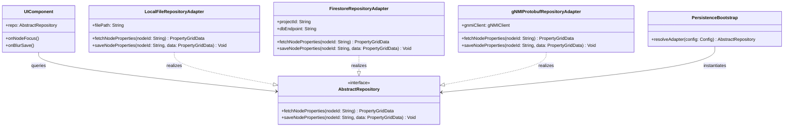

# Persistence Architecture Blueprint: Plug-and-Play Repository Design for React and Flutter

This document outlines the software architecture, class topologies, and deployment configurations for the persistence layer inside the Digital Systems Engineering Pipeline. It details how the baselines support transitions from standalone offline operations to distributed cloud databases or real-time telecom telemetry APIs (gNMI/Protobuf).

---

## 1. Decoupled Repository Pattern

To prevent platform lock-in and avoid database-specific dependencies from contaminating the UI/Presentation layers, both the React and Flutter applications implement a strict **Repository Pattern**. 

The UI widgets (such as the property grid and topology canvas) never communicate with database engines or network endpoints directly. Instead, they interact with an abstract interface. The concrete implementation is resolved at application startup using a dependency injection (DI) bootstrap routine.

### UML Class Diagram



---

## 2. Flutter Desktop Configurations

The Flutter Desktop baseline (`app_flutter`) serves as the starting framework for telecommunications operations. It supports four distinct persistence adapters, resolved via startup arguments or local configuration files:

### Option 1: Standalone Offline Local DB (SQLite FFI / Local File DB) - Selected Primary Default
* **Target Environment**: Standalone, air-gapped terminal apps running locally on operator laptops with no external network connectivity.
* **Mechanism**:
  * Implements a local file-based database adapter (`LocalFileRepositoryAdapter`).
  * Utilizes SQLite (`sqflite_common_ffi`) or simple structured JSON files located in the user's local App Data directory.
  * Enforces read-after-write consistency by flushing memory state to the local disk during UI focus-loss (blur) events.
  * **Plug-and-Play Backend Connectivity**: Designed to operate completely isolated by default, with hooks to easily plug in remote cloud synchronization or real-time equipment telemetry backends (`FirestoreRepositoryAdapter` or `gNMIProtobufRepositoryAdapter`) when network access is restored or required.

### Option 2: Air-Gapped Local Firebase Emulator
* **Target Environment**: Local testing, CI pipelines, and air-gapped developer environments where Firebase/Firestore APIs are functionally required for development parity but no active cloud connection is permitted.
* **Mechanism**:
  * Connects to a locally running instance of the Firebase/Firestore emulator (`http://127.0.0.1:8080`) over loopback.
  * Bypasses Google Cloud IAM and network credentials, using mock configuration environments.
  * Restores functional parity with the cloud build configuration (validating security rules, collections, queries) within an entirely offline local loop.

### Option 3: Cloud Sync (Remote Firestore)
* **Target Environment**: Shared, collaborative operations consoles where multiple operators monitor the same network slice.
* **Mechanism**:
  * Implements `FirestoreRepositoryAdapter` using Dart's native `HttpClient` to communicate with Google Cloud Firestore via REST or standard gRPC.
  * Connects directly to the cloud collections (e.g. `properties`), updating the UI in response to change notifications.
  * Supports offline cache fallback if remote connections drop.

### Option 4: Equipment Telemetry (gNMI / Protobuf)
* **Target Environment**: High-performance, real-time control terminals connected directly to network routers or Software-Defined Network (SDN) controllers.
* **Mechanism**:
  * Implements `gNMIProtobufRepositoryAdapter` to stream configuration parameters over a gRPC connection.
  * Serializes coordinates, node properties, and alarm severities into Protocol Buffer payloads defined by the OpenConfig gNMI specification.
  * Maps telemetry state updates (e.g. interface packet drops) to the 6 JSR 90 Alarm Severity levels, triggering dynamic repaints on the Canvas topology map.

---

## 3. Architectural Comparison: Standalone Local DB vs. Local Firebase Emulator

For local, air-gapped desktop environments, both Option 1 and Option 2 offer offline capabilities, but they differ significantly in design intent, dependencies, and operational overhead.

### Comparison Table

| Attribute | Option 1: Standalone Offline Local DB (SQLite FFI / File DB) | Option 2: Air-Gapped Local Firebase Emulator |
| :--- | :--- | :--- |
| **Primary Use Case** | Production deployment on operator workstations with no external network connectivity. | Local testing, CI pipelines, and air-gapped developer builds requiring Firebase feature parity. |
| **Runtime Dependencies** | None. Reads/writes directly to the local disk/OS file system via SQLite FFI or JSON. | Requires Java Runtime Environment (JRE), Node.js, and Firebase CLI to run the emulator suite. |
| **Resource Footprint** | Extremely lightweight (~few MBs of RAM, zero CPU idle overhead). | Heavy (runs a local Java process hosting the emulator suite). |
| **Data Persistence** | Direct file system access (`properties.json` or `.db` file). Survived restarts natively. | In-memory by default (requires `--import/--export` flags via CLI to persist state across runs). |
| **Upgrade/Flexibility** | Highly customizable; allows other backend adapters to plug in easily when needed. | Hard-locked to Firestore API structure; does not natively support non-Firebase backend adapters. |
| **Security Auditing** | Governed strictly by operating system and user-space file permission flags. | Bypasses production IAM; only enforces security rules locally. |

### Suitability Analysis

* **Option 1 (Standalone Offline Local DB)** is the **selected primary default** for desktop deployments. Because it runs with zero dependencies, it guarantees absolute reliability in high-security, air-gapped operational environments (such as field laptop deployments) where installing and running a local emulator suite (with Node, Java, etc.) is operationally infeasible and represents an unnecessary security surface.
* **Option 2 (Air-Gapped Local Firebase Emulator)** is highly suited for **development and testing environments**. It allows developers to test Firestore query structures, security rules, and real-time listeners locally before staging to a collaborative shared cloud console (Option 3), ensuring no functional drift occurs between the offline and online configurations.

---

## 4. React Web Configurations

The React baseline (`web_react`) acts as the web-based console interface. It supports two primary deployment profiles:

### Configuration A: Testing Mode (Local Emulator)
* **Target Environment**: Developer local machines and automated CI pipelines.
* **Mechanism**:
  * Connects to the local Firestore Emulator running at `http://127.0.0.1:8080` via standard HTTP Fetch operations.
  * Pre-seeds baseline records at boot time via a lightweight `SeedingManager` REST payload, ensuring developers can test forms, splitters, and validations without requiring live Google Cloud access keys.

### Configuration B: Production Mode (Cloud Firestore)
* **Target Environment**: Live hosted environments (Firebase App Hosting or Google Cloud Run).
* **Mechanism**:
  * Connects to the live Google Cloud Firestore production instance over HTTPS/WSS.
  * Enforces strict read/write security rules (checking user authentication tokens) and encrypts all telemetry data in transit.

---

## 5. Configuration Matrix

| Platform | Deployment Mode | Active Adapter | Transport Layer | Endpoint / Protocol | Security Layer |
| :--- | :--- | :--- | :--- | :--- | :--- |
| **Flutter Desktop** | Standalone (Default) | `LocalFileRepositoryAdapter` | Local Disk I/O | AppData / `properties.json` | OS File System permissions |
| **Flutter Desktop** | Air-Gapped Dev/Test | `FirestoreRepositoryAdapter` | HTTP / REST | 127.0.0.1:8080 (Emulator) | None (Local Sandbox) |
| **Flutter Desktop** | Shared Cloud | `FirestoreRepositoryAdapter` | HTTPS / REST | firestore.googleapis.com | API Key / Firebase Auth |
| **Flutter Desktop** | Telemetry Control | `gNMIProtobufRepositoryAdapter` | gRPC over HTTP/2 | Sockets / Protobuf streams | TLS / Mutual Auth (mTLS) |
| **React Web** | Testing | `FirestoreRepositoryAdapter` | HTTP / REST | 127.0.0.1:8080 (Emulator) | None (Local Sandbox) |
| **React Web** | Production | `FirestoreRepositoryAdapter` | HTTPS / WebSockets | firestore.googleapis.com | Firebase Security Rules |

---

## 6. Implementation Code Outlines

### Dart Abstractions (Flutter)

```dart
// lib/domain/repository.dart

import 'dart:convert';

// 1. Decoupled Data Model
class PropertyGridData {
  final double latitude;
  final double longitude;
  final double altitude;
  final String roomName;
  final int gridRow;
  final int gridColumn;
  final double maxVoltage;
  final double maxAllocatedPower;
  final String countryCode;
  final String locationType;

  PropertyGridData({
    required this.latitude,
    required this.longitude,
    required this.altitude,
    required this.roomName,
    required this.gridRow,
    required this.gridColumn,
    required this.maxVoltage,
    required this.maxAllocatedPower,
    required this.countryCode,
    required this.locationType,
  });

  Map<String, dynamic> toJson() => {
    'latitude': latitude,
    'longitude': longitude,
    'altitude': altitude,
    'roomName': roomName,
    'gridRow': gridRow,
    'gridColumn': gridColumn,
    'maxVoltage': maxVoltage,
    'maxAllocatedPower': maxAllocatedPower,
    'countryCode': countryCode,
    'locationType': locationType,
  };

  factory PropertyGridData.fromJson(Map<String, dynamic> json) {
    return PropertyGridData(
      latitude: (json['latitude'] ?? 0.0).toDouble(),
      longitude: (json['longitude'] ?? 0.0).toDouble(),
      altitude: (json['altitude'] ?? 0.0).toDouble(),
      roomName: json['roomName'] ?? '',
      gridRow: (json['gridRow'] ?? 0).toInt(),
      gridColumn: (json['gridColumn'] ?? 0).toInt(),
      maxVoltage: (json['maxVoltage'] ?? 0.0).toDouble(),
      maxAllocatedPower: (json['maxAllocatedPower'] ?? 0.0).toDouble(),
      countryCode: json['countryCode'] ?? 'US',
      locationType: json['locationType'] ?? 'room',
    );
  }
}

// 2. Abstract Repository Interface
abstract class AbstractRepository {
  Future<PropertyGridData> fetchProperties(String nodeId);
  Future<void> saveProperties(String nodeId, PropertyGridData data);
}

// 3. Local File Repository Adapter (Skeleton Structure)
class LocalFileRepositoryAdapter implements AbstractRepository {
  final String filePath;

  LocalFileRepositoryAdapter({required this.filePath});

  @override
  Future<PropertyGridData> fetchProperties(String nodeId) async {
    // TODO: Implement local file reading and JSON parsing logic.
    // 1. Check if local properties file exists at filePath.
    // 2. Read string payload from file.
    // 3. Decode JSON payload and extract nodeId map.
    // 4. Return PropertyGridData.fromJson(nodeMap).
    throw UnimplementedError('fetchProperties not implemented for LocalFileRepositoryAdapter');
  }

  @override
  Future<void> saveProperties(String nodeId, PropertyGridData data) async {
    // TODO: Implement local file writing logic.
    // 1. Read existing local file or initialize new map.
    // 2. Insert/Update serialized payload: data.toJson().
    // 3. Write JSON string back to filePath.
    // 4. Flush file to disk to enforce persistence guarantees.
    throw UnimplementedError('saveProperties not implemented for LocalFileRepositoryAdapter');
  }
}
```

### TypeScript Abstractions (React)

```typescript
// src/domain/repository.ts

export interface PropertyGridData {
  latitude: number;
  longitude: number;
  altitude: number;
  roomName: string;
  gridRow: number;
  gridColumn: number;
  maxVoltage: number;
  maxAllocatedPower: number;
  countryCode: string;
  locationType: string;
}

export interface AbstractRepository {
  fetchProperties(nodeId: string): Promise<PropertyGridData>;
  saveProperties(nodeId: string, data: PropertyGridData): Promise<void>;
}
```
