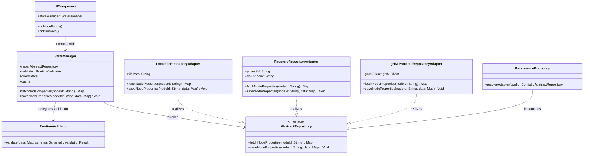

# Persistence Architecture Blueprint: Plug-and-Play Repository Design for React and Flutter

This document outlines the software architecture, class topologies, and deployment configurations for the persistence layer inside the Digital Systems Engineering Pipeline. It details how the baselines support transitions from standalone offline operations to distributed cloud databases or real-time telecom telemetry APIs (gNMI/Protobuf).

---

## 1. Schema-Agnostic Document Map Architecture

### Architectural Problem
Hardcoding domain-specific fields (such as `latitude`, `longitude`, `altitude`, `roomName`, `gridRow`, `gridColumn`, `maxVoltage`, `maxAllocatedPower`, `countryCode`, `locationType`, etc.) into persistence adapters, data transfer objects (DTOs), and repository interfaces violates Section 1.7 of the Project Constitution. Domain attributes vary dynamically across execution runs and deployment environments. A hardcoded data structure introduces tight compile-time coupling between the data transport/persistence layer and the domain-specific schemas. This makes the database adapters fragile and prevents reusing the persistence layer when targeting different domains or changing network topology schemas.

### Architectural Solution
To decouple the persistence layer completely from the active domain, the system transitions to a schema-agnostic document map interface (`Map<String, dynamic>` in Dart, `Record<string, any>` in TypeScript). Under this design, repository adapters treat node properties purely as generic, key-value document maps without compile-time knowledge of specific fields.
The UI components (such as the property grid and schema validator) dynamically resolve, layout, and validate these properties at runtime using the layout configuration asset (`logical-layout.json`). This ensures that changes to domain attributes require only configuration updates rather than rebuilding/re-compiling the persistence adapters or repository interfaces, making the persistence layer fully generic and reusable.

---

## 2. Decoupled Repository Pattern

To prevent platform lock-in and avoid database-specific dependencies from contaminating the UI/Presentation layers, both the React and Flutter applications implement a strict **Repository Pattern**. 

The UI widgets (such as the property grid and topology canvas) never communicate with database engines or network endpoints directly. Instead, they interact with an abstract interface. The concrete implementation is resolved at application startup using a dependency injection (DI) bootstrap routine.

### UML Class Diagram



---

## 3. Flutter Desktop Configurations

The Flutter Desktop baseline (`app_flutter`) serves as the starting framework for telecommunications operations. It supports four distinct persistence adapters, resolved via startup arguments or local configuration files:

### Option 1: Standalone Offline Local DB (SQLite FFI / Local File DB) - Selected Primary Default
* **Target Environment**: Standalone, air-gapped terminal apps running locally on operator laptops with no external network connectivity.
* **Mechanism**:
  * Implements a local file-based database adapter (`LocalFileRepositoryAdapter`).
  * Utilizes SQLite (`sqflite_common_ffi`) or simple structured JSON files located in the user's local App Data directory.
  * Enforces read-after-write consistency by flushing memory state to the local disk during UI focus-loss (blur) events.
  * **Concurrency & Race Hazard Mitigation**: Rapid blur events or UI updates can trigger concurrent file write operations, causing potential data corruption. To address this, the adapter uses a file lock (`Lock` from the `synchronized` library) combined with an Atomic Write pattern: data is first written to a temporary file (`.tmp`) and then renamed atomically to replace the main target file, guaranteeing file integrity.
  * **Plug-and-Play Backend Connectivity**: Designed to operate completely isolated by default, with hooks to easily plug in remote cloud synchronization or real-time equipment telemetry backends (`FirestoreRepositoryAdapter` or `gNMIProtobufRepositoryAdapter`) when network access is restored or required.

### Option 2: Air-Gapped Local Firebase Emulator
* **Target Environment**: Local testing, CI pipelines, and air-gapped developer environments where Firebase/Firestore APIs are functionally required for development parity but no active cloud connection is permitted.
* **Mechanism**:
  * Connects to a locally running instance of the Firebase/Firestore emulator (`http://127.0.0.1:8080`) over loopback.
  * Bypasses Google Cloud IAM and network credentials, using mock configuration environments.
  * Restores functional parity with the cloud build configuration (validating security rules, collections, queries) within an entirely offline local loop.

### Option 3: Cloud Sync (Remote Firestore)
* **Target Environment**: Shared, collaborative operations consoles where multiple operators monitor the same network slice.
* **Mechanism**:
  * Implements `FirestoreRepositoryAdapter` using Dart's native `HttpClient` to communicate with Google Cloud Firestore via REST or standard gRPC.
  * Connects directly to the cloud collections (e.g. `properties`), updating the UI in response to change notifications.
  * **Reactive Event Streaming**: Handles push-based server events reactively by exposing updates through the `watchProperties()` stream subscription, enabling real-time UI synchronization across multiple operators.
  * Supports offline cache fallback if remote connections drop.

### Option 4: Equipment Telemetry (gNMI / Protobuf)
* **Target Environment**: High-performance, real-time control terminals connected directly to network routers or Software-Defined Network (SDN) controllers.
* **Mechanism**:
  * Implements `gNMIProtobufRepositoryAdapter` to stream configuration parameters over a gRPC connection.
  * Serializes coordinates, node properties, and alarm severities into Protocol Buffer payloads defined by the OpenConfig gNMI specification.
  * **Reactive Telemetry Streaming**: Real-time push-based state updates are consumed reactively using the `watchProperties()` stream subscription.
  * Maps telemetry state updates (e.g. interface packet drops) to the 6 JSR 90 Alarm Severity levels, triggering dynamic repaints on the Canvas topology map.

---

## 4. Architectural Comparison: Standalone Local DB vs. Local Firebase Emulator

For local, air-gapped desktop environments, both Option 1 and Option 2 offer offline capabilities, but they differ significantly in design intent, dependencies, and operational overhead.

### Comparison Table

| Attribute | Option 1: Standalone Offline Local DB (SQLite FFI / File DB) | Option 2: Air-Gapped Local Firebase Emulator |
| :--- | :--- | :--- |
| **Primary Use Case** | Production deployment on operator workstations with no external network connectivity. | Local testing, CI pipelines, and air-gapped developer builds requiring Firebase feature parity. |
| **Runtime Dependencies** | None. Reads/writes directly to the local disk/OS file system via SQLite FFI or JSON. | Requires Java Runtime Environment (JRE), Node.js, and Firebase CLI to run the emulator suite. |
| **Resource Footprint** | Extremely lightweight (~few MBs of RAM, zero CPU idle overhead). | Heavy (runs a local Java process hosting the emulator suite). |
| **Data Persistence** | Direct file system access (`properties.json` or `.db` file). Survived restarts natively. | In-memory by default (requires `--import/--export` flags via CLI to persist state across runs). |
| **Upgrade/Flexibility** | Highly customizable; allows other backend adapters to plug in easily when needed. | Hard-locked to Firestore API structure; does not natively support non-Firebase backend adapters. |
| **Security Auditing** | Governed strictly by operating system and user-space file permission flags. | Bypasses production IAM; only enforces security rules locally. |

### Suitability Analysis

* **Option 1 (Standalone Offline Local DB)** is the **selected primary default** for desktop deployments. Because it runs with zero dependencies, it guarantees absolute reliability in high-security, air-gapped operational environments (such as field laptop deployments) where installing and running a local emulator suite (with Node, Java, etc.) is operationally infeasible and represents an unnecessary security surface.
* **Option 2 (Air-Gapped Local Firebase Emulator)** is highly suited for **development and testing environments**. It allows developers to test Firestore query structures, security rules, and real-time listeners locally before staging to a collaborative shared cloud console (Option 3), ensuring no functional drift occurs between the offline and online configurations.

---

## 5. Standardized Protobuf Payload Envelopes

To bridge the dynamic, schema-agnostic document map (`Map<String, dynamic>` / `Record<string, any>`) with strictly typed telemetry streams (Option 4 / gNMI), the architecture standardizes on `google.protobuf.Struct`.

Using `google.protobuf.Struct` allows the gNMI stream to safely encapsulate arbitrary JSON-like nested maps and lists without needing to define fixed Protobuf schema fields for every dynamic domain property. This retains the runtime schema flexibility of the repository layers while leveraging the transport efficiency and type-safety of gRPC streams.

---

## 6. React Web Configurations

The React baseline (`web_react`) acts as the web-based console interface. It supports dynamic configurations that can resolve backends based on deployment targets.

### Configuration A: Testing Mode (Local Emulator)
* **Target Environment**: Developer local machines and automated CI pipelines.
* **Mechanism**:
  * Connects to the local Firestore Emulator running at `http://127.0.0.1:8080` via standard HTTP Fetch operations.
  * Pre-seeds baseline records at boot time via a lightweight `SeedingManager` REST payload, ensuring developers can test forms, splitters, and validations without requiring live Google Cloud access keys.

### Configuration B: Production Mode (Cloud Firestore)
* **Target Environment**: Live hosted environments (Firebase App Hosting or Google Cloud Run).
* **Mechanism**:
  * Connects to the live Google Cloud Firestore production instance over HTTPS/WSS.
  * Enforces strict read/write security rules (checking user authentication tokens) and encrypts all telemetry data in transit.

### Configuration C: Standalone Offline (PWA)
* **Target Environment**: Standalone offline operations on operator tablets/laptops with no external network connectivity.
* **Mechanism**:
  * Uses `IndexedDBRepositoryAdapter` (backed by localForage or Dexie.js) to read and write to IndexedDB, giving field technicians offline parity.

---

## 7. Configuration Matrix

| Platform | Deployment Mode | Active Adapter | Transport Layer | Endpoint / Protocol | Security Layer |
| :--- | :--- | :--- | :--- | :--- | :--- |
| **Flutter Desktop** | Standalone (Default) | `LocalFileRepositoryAdapter` | Local Disk I/O | AppData / `properties.json` | OS File System permissions |
| **Flutter Desktop** | Air-Gapped Dev/Test | `FirestoreRepositoryAdapter` | HTTP / REST | 127.0.0.1:8080 (Emulator) | None (Local Sandbox) |
| **Flutter Desktop** | Shared Cloud | `FirestoreRepositoryAdapter` | HTTPS / REST | firestore.googleapis.com | API Key / Firebase Auth |
| **Flutter Desktop** | Telemetry Control | `gNMIProtobufRepositoryAdapter` | gRPC over HTTP/2 | Sockets / Protobuf streams | TLS / Mutual Auth (mTLS) |
| **React Web** | Standalone Offline (PWA) | `IndexedDBRepositoryAdapter` | Local Sockets/IndexedDB | browser local storage (localForage / Dexie.js) | Browser sandbox isolation |
| **React Web** | Testing | `FirestoreRepositoryAdapter` | HTTP / REST | 127.0.0.1:8080 (Emulator) | None (Local Sandbox) |
| **React Web** | Production | `FirestoreRepositoryAdapter` | HTTPS / WebSockets | firestore.googleapis.com | Firebase Security Rules |

---

## 8. Implementation Code Outlines

### Dart Abstractions (Flutter)

```dart
import 'dart:async';
import 'dart:convert';
import 'dart:io';
import 'package:synchronized/synchronized.dart';

// 1. Reactive Repository Interface
abstract class AbstractRepository {
  Future<Map<String, dynamic>> fetchProperties(String nodeId);
  Future<void> saveProperties(String nodeId, Map<String, dynamic> data);
  Stream<Map<String, dynamic>> watchProperties(String nodeId); 
}

// 2. Thread-Safe & Atomic Local File Adapter
class LocalFileRepositoryAdapter implements AbstractRepository {
  final String filePath;
  final Lock _fileLock = Lock();
  final Map<String, Map<String, dynamic>> _memoryCache = {};
  final StreamController<Map<String, dynamic>> _streamController = StreamController.broadcast();

  LocalFileRepositoryAdapter({required this.filePath});

  @override
  Future<Map<String, dynamic>> fetchProperties(String nodeId) async {
    if (_memoryCache.containsKey(nodeId)) return _memoryCache[nodeId]!;
    
    return await _fileLock.synchronized(() async {
      final file = File(filePath);
      if (!await file.exists()) return {};
      final data = jsonDecode(await file.readAsString());
      _memoryCache[nodeId] = data[nodeId] ?? {};
      return _memoryCache[nodeId]!;
    });
  }

  @override
  Stream<Map<String, dynamic>> watchProperties(String nodeId) async* {
    yield await fetchProperties(nodeId);
    yield* _streamController.stream
        .where((event) => event['nodeId'] == nodeId)
        .map((event) => event['data'] as Map<String, dynamic>);
  }

  @override
  Future<void> saveProperties(String nodeId, Map<String, dynamic> data) async {
    _memoryCache[nodeId] = data;
    _streamController.add({ 'nodeId': nodeId, 'data': data });

    await _fileLock.synchronized(() async {
      final file = File(filePath);
      Map<String, dynamic> allData = {};
      
      if (await file.exists()) {
        final content = await file.readAsString();
        if (content.isNotEmpty) allData = jsonDecode(content);
      }
      allData[nodeId] = data;

      final tempFile = File('$filePath.tmp');
      await tempFile.writeAsString(jsonEncode(allData), flush: true);
      await tempFile.rename(filePath); 
    });
  }
}
```

```dart
import 'package:flutter_riverpod/flutter_riverpod.dart';
import '../domain/repository.dart';
import '../validation/runtime_validator.dart'; 

// Provides the resolved repository interface via DI
final repositoryProvider = Provider<AbstractRepository>((ref) {
  throw UnimplementedError('Bootstrapped at startup based on config');
});

// StreamProvider handles loading states, error boundaries, and real-time updates automatically
final nodePropertiesProvider = StreamProvider.family<Map<String, dynamic>, String>((ref, nodeId) async* {
  final repo = ref.watch(repositoryProvider);
  
  // Listen to the stream and apply RuntimeValidator (Anti-Corruption Layer)
  await for (final rawData in repo.watchProperties(nodeId)) {
    // Validate against logical-layout.json schema
    if (RuntimeValidator.isValid(rawData)) {
      yield rawData; 
    } else {
      throw FormatException('Malformed telemetry data intercepted for: $nodeId');
    }
  }
});
```

### TypeScript Abstractions (React)

```typescript
export interface AbstractRepository {
  fetchProperties(nodeId: string): Promise<Record<string, any>>;
  saveProperties(nodeId: string, data: Record<string, any>): Promise<void>;
  watchProperties(
    nodeId: string, 
    onUpdate: (data: Record<string, any>) => void
  ): () => void; 
}

// src/hooks/useNodeProperties.ts
import { useEffect } from 'react';
import { useQuery, useMutation, useQueryClient } from '@tanstack/react-query';
import { useRepository } from '../context/DIContext'; 
import { nodeSchema } from '../schemas/validation'; 

export const useNodeProperties = (nodeId: string) => {
  const repo = useRepository();
  const queryClient = useQueryClient();

  // 1. Initial Fetch
  const query = useQuery({
    queryKey: ['node-properties', nodeId],
    queryFn: async () => {
      const data = await repo.fetchProperties(nodeId);
      return nodeSchema.parse(data); 
    },
  });

  // 2. Real-Time Subscription (Reactive watch)
  useEffect(() => {
    const unsubscribe = repo.watchProperties(nodeId, (realtimeData) => {
      try {
        const validatedData = nodeSchema.parse(realtimeData); 
        queryClient.setQueryData(['node-properties', nodeId], validatedData);
      } catch (e) {
        console.error("Stream payload failed validation", e);
      }
    });

    return () => unsubscribe(); 
  }, [nodeId, repo, queryClient]);

  // 3. Save Mutation
  const mutation = useMutation({
    mutationFn: async (data: Record<string, any>) => {
      const validData = nodeSchema.parse(data); 
      await repo.saveProperties(nodeId, validData);
    },
    onMutate: async (newData) => {
      await queryClient.cancelQueries({ queryKey: ['node-properties', nodeId] });
      queryClient.setQueryData(['node-properties', nodeId], newData);
    }
  });

  return { 
    properties: query.data, 
    isLoading: query.isLoading, 
    save: mutation.mutate 
  };
};
```

---

## 9. The YANG-Driven UI Pipeline

To handle network configuration models at enterprise scale (e.g., 300+ YANG modules representing 10,000+ classes), the architecture avoids manual class mirroring. Instead, it relies on a **YANG-Driven UI Pipeline** that automatically translates YANG schema models into declarative JSON layout configurations consumed directly by the generic `PropertyGrid`.

### Architectural Mapping: YANG to AttributeDefinition

YANG specifications natively supply the metadata required to dynamically render and validate user interfaces:

* **YANG Groupings & Containers** map directly to `sectionGroup`.
* **YANG Types** (e.g., `string`, `uint16`, `decimal64`) map to `type` (`string`, `int`, `double`).
* **YANG Enumerations** map to `enum` with the list of options stored under `options`.
* **YANG Validation Constraints** (e.g., `mandatory true`, `range "68..9216"`) map to `isRequired`, `minValue`, and `maxValue` constraints.

### Complex XPath Validations

Complex cross-field mathematical constraints represented by YANG `must` statements (such as slot overlap checks) are not evaluated locally in the Flutter/Dart UI. Instead:

1. The dynamic `PropertyGrid` performs localized type, boundary, and format validation on focus loss (blur).
2. When the data is saved, the generic `Map<String, dynamic>` payload is transmitted directly to the equipment via the gNMI stream.
3. The network device or Network Management System (NMS) evaluates the XPath `must` rules.
4. If a constraint fails, the resulting gRPC error message (e.g., `"Slot overlap detected!"`) is caught by the application's repository layer and surfaced directly to the user in the UI.

---

## 10. Engineering Directives

### Directive 1: Halt Hand-Written Dart Translation
Stop the development of manual Dart dummy classes (such as `PhysicalAddress` or `Velocity`). Legacy mock classes are retained exclusively for widget test isolation, but no new static models should be manually written.

### Directive 2: Build a YANG-to-JSON compilation step
Implement a build script in the CI/CD pipeline using **pyang** (the Python YANG validator/transformer) or **ygot** (YANG Go Tools) to parse source `.yang` files and generate the `List<AttributeDefinition>` JSON configurations. This script must compile and rebuild UI schemas automatically whenever hardware vendors update their models.

### Directive 3: Map gNMI Paths directly to UI Keys
Configure the compiler script to use the absolute YANG path as the attribute's `key` (e.g., `interfaces/interface/state/mtu` instead of `mtu`). The serialized map will compile directly into the telemetry payload envelopes required by gNMI streams.

