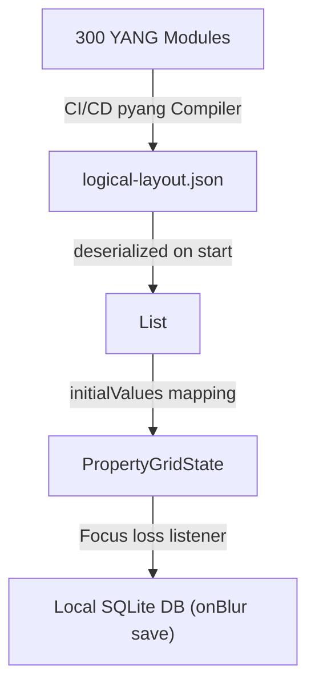

# Architecture Blueprint: YANG-Driven Logical UI (LUI) Pipeline

**Date**: June 2026
**Status**: APPROVED / MANDATED FOR SPRINT 1
**Target Environments**: React Web (Vite), Flutter (Desktop/Web), CI/CD Build Pipelines

**Source Modeling Language**: Strictly YANG (Telecommunications & SDN)
**Telemetry Transport**: gNMI / Protobuf `Struct`

---

## 1. Executive Summary

This blueprint establishes the **YANG-to-LUI (Logical UI) Translation Pipeline**.

To scale telecom control systems safely and efficiently, we are eliminating hardcoded Dart/TypeScript domain classes. The native **YANG schemas** provided by network equipment vendors will serve as the absolute single source of truth.

During the CI/CD build process, YANG files are parsed and transformed into platform-agnostic JSON Logical UI (LUI) schemas. The frontend (React/Flutter) acts purely as a high-performance **UI Adapter Shell**. At runtime, the UI dynamically renders input fields, topology maps, and tables based on the JSON schema, and populates them using real-time gNMI telemetry streams.

---

## 2. The YANG Translation Pipeline (Build-Time)

To prevent the frontend from needing a heavy, complex YANG parser in the browser or app, the translation happens entirely at build time.

### 2.1. The Schema Compiler

The DevOps pipeline will utilize **`pyang`** (an open-source Python YANG validator/parser) or **`ygot`** to parse `.yang` files and output the `logical-layout.json` used by the generic UI components.

**Mapping Rules (YANG to LUI JSON):**

| YANG Construct | Maps to LUI Property | UI Rendering Behavior |
| --- | --- | --- |
| `container` / `list` | `sectionGroup` | Visual layout cards, collapsible tabs, or DensityTable columns. |
| `leaf` | `AttributeDefinition` | Instantiates a data-bound form input. |
| `type string` / `uint32` | `type` | Determines UI widget (`TextField` vs. `NumberField`). |
| `type enumeration` | `options` | Generates a `Dropdown` menu populated with the enum choices. |
| `mandatory true` | `isRequired: true` | Client-side validation blocking the "Save" action. |
| `range` / `pattern` | `minValue` / `regexPattern` | Client-side declarative validation boundaries. |

### 2.2. Standardizing the UI Key (The YANG Path)

To perfectly align the UI with the backend telemetry streams, the `key` generated for every attribute in the LUI JSON **must be its exact YANG XPath**.

* *Example:* Instead of generating `key: 'mtu'`, the compiler generates `key: 'interfaces/interface/state/mtu'`.
* *Why?* When the user clicks "Save" in the generic UI, the resulting JSON payload is inherently formatted with the correct network path. It can be wrapped in a Protobuf envelope and sent back over gNMI with zero translation logic in the frontend.

---

## 3. UI Adapter Shells & Component Architecture (Run-Time)

The React and Flutter frontends will implement exactly seven platform-agnostic components (`HierarchyTree`, `ResizableSplitter`, `NavigationBreadcrumbs`, `PropertyGrid`, `TopologyMap`, `DensityTable`, `ContextualPanel`).

### 3.1. Zero UI Code Generation

Code generators must **never** output `.tsx` or `.dart` view widgets. Autogenerated UI files cause merge conflicts and overwrite performance optimizations. The generic UI components are written by hand, highly optimized, and simply read the JSON schema emitted by the YANG pipeline at runtime.

### 3.2. Preventing "Event-Echo" Render Storms

Because YANG hierarchies reflect deeply nested network topologies, bidirectional selection (e.g., clicking a node on the map highlights it in the tree, which triggers a map refocus) can cause infinite React/Flutter rendering loops.

* **The Guard:** AST Linters will enforce that programmatic property setters in React/Flutter *never* trigger output callbacks. Event propagation (`onSelect`, `onChange`) is strictly limited to actual user hardware interactions (clicks, keyboard).
* **Reflow Isolation:** Splitter resizes must update CSS variables directly in the DOM (React) or utilize `RepaintBoundary` widgets (Flutter) to prevent global layout subtree recalculations during drag operations.

---

## 4. High-Performance Telemetry & GPGPU Architecture

Telecom networks generate massive event storms (e.g., thousands of interface state changes during a fiber cut). The UI must handle massive influxes of Protobuf packets without freezing the main thread.

### 4.1. Off-Thread Data Processing & Micro-Batching

* **Thread Isolation:** gNMI streams are received and Protobuf packets are unpacked inside background threads (**Web Workers** in React, **Dart Isolates** in Flutter). The main UI thread never parses raw binary payloads.
* **100ms Micro-Batching:** The background worker accumulates incoming YANG state updates into a buffer. Every **100ms**, the worker deduplicates the events (e.g., if `admin-status` flips UP/DOWN rapidly, it only takes the latest state) and passes a single, flat JSON delta batch to the main UI thread.

### 4.2. GPU-Accelerated Topology Map

For rendering large network topologies (thousands of YANG `list` instances representing routers and links):

* **Decoupled Buffer Architecture:** To maintain strict separation between layout physics and domain state, the graphics pipeline splits the data into two isolated GPU memory buffers:
  * **Layout Position Buffer (Buffer A):** Contains only physical attributes (`struct Node { float x; float y; float dx; float dy; }`) computed by the force-directed layout engine.
  * **Attribute State Buffer (Buffer B):** Contains indices representing dynamic node telemetry states (e.g., status flags or color maps) updated only when gNMI updates arrive.
* **Physics & Status Shaders:** Force-directed layout physics are executed over Buffer A using WebGPU (React) or Impeller (Flutter) **Compute Shaders**. Node rasterization joins Buffer A and Buffer B in the vertex shader during rendering, avoiding any conditional branching on the GPU and ensuring 60fps zooming and panning regardless of telemetry volume.


---

## 5. Actionable Transition Directives (Sprint 1)

To execute this architecture, issue the following direct, YANG-specific orders to your engineering pods immediately:

### Directive 1: DevOps/Backend Pod (The YANG-to-JSON Compiler)

* **Task:** Build the YANG translation script.
* **Action:** Take a standard OpenConfig YANG file (e.g., `openconfig-interfaces.yang`). Write a Python script using `pyang` that walks the AST and outputs a `logical-layout.json` file. Ensure the `key` for each mapped attribute uses the absolute YANG XPath.

### Directive 2: Frontend UI Pod (The Property Grid Adapter)

* **Task:** Connect the `PropertyGrid` to the LUI JSON.
* **Action:** Delete the remaining hardcoded Dart/TS dummy classes (e.g., `Velocity`, `PhysicalAddress`, `ChassisContainmentSubsystem`). Feed the JSON output from Directive 1 directly into the generic `PropertyGrid` built in the last sprint. Verify that the UI correctly generates the form fields with the validation boundaries dictated by the original YANG file.

### Directive 3: State Management Pod (The Off-Thread Buffer)

* **Task:** Implement the telemetry bottleneck protection.
* **Action:** Create the background Dart Isolate / React Web Worker. Create a dummy gNMI stream that spams 10,000 YANG state updates per second using Protobuf `Struct` payloads. Implement the 100ms micro-batching buffer inside the worker, proving that the main UI thread only receives 10 clean, deduplicated updates per second and does not drop UI frames.

### Directive 4: Graphics Pod (Scaffold GPU Topology)

* **Task:** Establish the GPU rendering boundaries.
* **Action:** Implement a blank WebGPU (React) or Impeller (Flutter) canvas component. Write a simple compute shader that takes an array of dummy network nodes directly from VRAM and draws them, bypassing the CPU for coordinate updates.

---

## 6. Phase 1 Reference Implementation (First-Steps)

To prove this architecture, a fully functional reference implementation of the schema-agnostic data-binding shell was completed inside the Flutter baseline (`app_flutter`).



### 6.1. Dynamic Model Serialization

The schema-agnostic definition model is defined dynamically in Dart, omitting all hardcoded domain coordinate classes:

```dart
class AttributeDefinition {
  final String key;
  final String label;
  final String type; // 'double' | 'int' | 'string' | 'enum'
  final String sectionGroup;
  final List<String>? options;
  final bool isRequired;
  final String? regexPattern;
  final num? minValue;
  final num? maxValue;

  const AttributeDefinition({
    required this.key,
    required this.label,
    required this.type,
    required this.sectionGroup,
    this.options,
    this.isRequired = false,
    this.regexPattern,
    this.minValue,
    this.maxValue,
  });

  factory AttributeDefinition.fromJson(Map<String, dynamic> json) {
    return AttributeDefinition(
      key: json['key'] as String,
      label: json['label'] as String,
      type: json['type'] as String,
      sectionGroup: json['sectionGroup'] as String,
      options: (json['options'] as List<dynamic>?)?.map((e) => e as String).toList(),
      isRequired: json['isRequired'] as bool? ?? false,
      regexPattern: json['regexPattern'] as String?,
      minValue: json['minValue'] as num?,
      maxValue: json['maxValue'] as num?,
    );
  }
}
```

### 6.2. UI Lifecycle and Focus-Loss Persistence

The reference presentation grid `PropertyGrid` is fully decoupled from the database layers, accepting the dynamic attributes lists and returning validation inputs upstream using presentation callback delegates:

```dart
class PropertyGrid extends StatefulWidget {
  final List<AttributeDefinition>? attributes;
  final Map<String, dynamic> initialValues;
  final void Function(String key, dynamic value) onSave;
  
  // ...
}
```

* **Dynamic Bindings & Focus Locks**: In `didUpdateWidget()`, if only input values update (e.g. from real-time telemetry changes), the widget updates the text controller only if the target field is not currently active (`!focusNode.hasFocus`). This prevents the UI from stealing keyboard focus from the user mid-keystroke.
* **Safe Clean-up**: Disposes of text controllers and focus nodes in `dispose()` to prevent OOM memory leaks.
* **Blur-Save Validation**: Performs boundary and required checks dynamically. On focus loss (blur), it fires the `onSave` callback to flush the sanitized, validated payload to the persistence layer.

