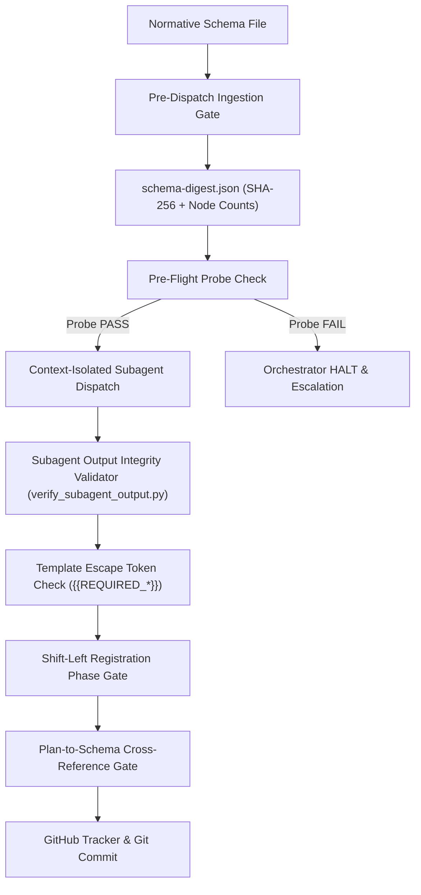
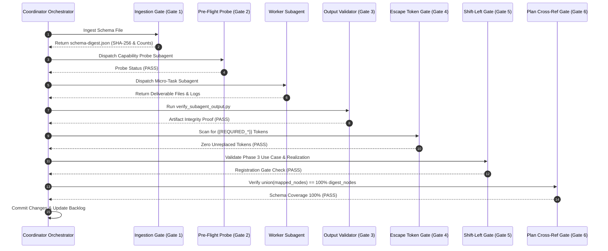
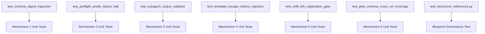

# Six Mechanical Enforcement Gates Solution Blueprint

## 1. Executive Summary & Architectural Vision

The Digital Engineering Agent Platform (DEAP) enforces strict engineering discipline, complete traceability, and deterministic behavior across autonomous multi-agent specification and implementation workflows. To guarantee zero hallucination, zero orphan requirements, zero silent coordinator file edits, and total structural coverage of input schemas, DEAP mandates **Six Core Deterministic Enforcement Mechanisms**.

These six mechanical gates act as physical constraints within the agent orchestrator and pipeline tooling, stopping non-compliant executions before state mutations or git commits can take place:

1. **Pre-Dispatch Schema Ingestion Gate**: Validates input schema digests (`schema-digest.json`) using SHA-256 verification and strict node accounting across containers, lists, leaves, typedefs, identities, and groupings.
2. **Runtime Capability Pre-Flight Probe Check**: Dispatches a lightweight probe subagent before Phase 2 (User Stories/Use Cases) and Phase 3 (Implementation) to verify subagent execution capabilities. The system HALTs immediately on probe failure, locking coordinator direct writes.
3. **Subagent Output Integrity Validator**: Executes `scripts/verify_subagent_output.py` to verify that subagents produce non-zero file sizes, verified file creation proof, valid issue URLs, and complete payloads.
4. **Template Placeholder Escape Tokens**: Enforces mandatory token replacement for `{{REQUIRED_JUSTIFICATION}}`, `{{REQUIRED_SOURCE_REF}}`, and `{{REQUIRED_LUI}}`. Any remaining escape token causes an immediate registration rejection.
5. **Shift-Left Registration-Time Phase Gate**: Validates Phase 3 Use Case flows, preconditions, and realization matrices at registration time prior to issue creation or branch commit.
6. **Plan-to-Schema Cross-Reference Gate**: Verifies `schema_nodes` mapping in `implementation_plan.md`, asserting that `union(mappings) == 100%` of elements in `schema-digest.json`.

---

## 2. Core Deterministic Enforcement Mechanisms

### 2.1 Mechanism 1: Pre-Dispatch Schema Ingestion Gate

The Pre-Dispatch Schema Ingestion Gate parses all input specification schemas (YANG, OpenAPI, SysML v2, Protobuf, etc.) prior to any subagent dispatch. It produces a deterministic `schema-digest.json` file.

- **SHA-256 Digest**: Computed over the canonicalized schema file bytes to guarantee cryptographic immutability.
- **Node Accounting**: Computes precise cardinalities for all structural schema elements:
  - `containers`: Structural container nodes.
  - `lists`: Array/list nodes.
  - `leaves`: Leaf attribute nodes.
  - `typedefs`: Custom type definitions.
  - `identities`: Identity/enum declarations.
  - `groupings`: Reusable structural groupings.

Subagents cannot be spawned until `schema-digest.json` is validated and locked in the session state.

### 2.2 Mechanism 2: Runtime Capability Pre-Flight Probe Check

To prevent partial or broken multi-agent dispatches, the orchestrator dispatches a lightweight **Probe Subagent** prior to entering Phase 2 (BDD User Story / UML Use Case Generation) or Phase 3 (Feature-Driven Implementation).

- **Probe Objective**: Validates subagent tool permissions (`view_file`, `write_to_file`, `replace_file_content`, `run_command`), environment paths, and model responsiveness.
- **Strict Halt Condition**: If the probe check fails or times out, the coordinator MUST immediately HALT execution and escalate to the user.
- **Direct Write Lock**: Direct file writes by the coordinator agent remain strictly locked (`ENFORCED_LOCK=TRUE`), preventing fallback to un-isolated direct edits.

### 2.3 Mechanism 3: Subagent Output Integrity Validator

The `scripts/verify_subagent_output.py` validator script executes immediately upon subagent completion. It performs automated verification on the subagent's delivered artifacts:

- **Non-Zero File Size**: Asserts `os.path.getsize(file_path) > 0` for all declared deliverables.
- **File Creation Proof**: Verifies physical file existence on the file system and validates `git status` output.
- **Tracker & Issue Link Proof**: Parses generated issue markdown files to verify valid GitHub issue URLs (`https://github.com/.../issues/N`) or tracker tokens.
- **Mermaid Syntax Proof**: Validates that all Mermaid diagrams in subagent outputs contain mandatory type headers and closed code fences.

### 2.4 Mechanism 4: Template Placeholder Escape Tokens

To prevent boilerplate leaks, placeholder text, or incomplete specifications from entering the repository, DEAP introduces **Template Placeholder Escape Tokens**:

- `{{REQUIRED_JUSTIFICATION}}`: Rationale and business value for the specification item.
- `{{REQUIRED_SOURCE_REF}}`: Concrete file path and line number reference to the normative source schema.
- `{{REQUIRED_LUI}}`: Full 3-layer Logical UI (LUI) semantic chain definition.

Registration tools (`reconcile_backlog.py`, spec registration scripts) scan all draft Markdown files for un-replaced tokens. If any instance of `{{REQUIRED_*}}` is detected, the operation fails with `Exit Code 42` and registration is aborted.

### 2.5 Mechanism 5: Shift-Left Registration-Time Phase Gate

Rather than deferring Use Case flow checks to late-stage CI/CD pipelines, the Shift-Left Phase Gate performs validation at **Registration Time** (before `git commit` or `gh issue create`):

- **Use Case Flow Integrity**: Verifies Actor, Preconditions, Main Success Scenario (1..N steps), Alternative Flows, and Postconditions.
- **Realization Matrix Completeness**: Validates that every Use Case maps to at least one User Story and Feature.
- **BDD Scenario Coverage**: Verifies Given-When-Then structure for all BDD scenarios.

### 2.6 Mechanism 6: Plan-to-Schema Cross-Reference Gate

To ensure 100% schema node coverage, `implementation_plan.md` must include a formal `schema_nodes` mapping table.

- **Union Set Assertion**: The gate calculates `union(plan_mapped_nodes)` and compares it against the complete set of schema nodes listed in `schema-digest.json`.
- **Completeness Formula**:
  $$\text{Coverage} = \frac{|\text{union}(\text{mapped\_nodes}) \cap \text{digest\_nodes}|}{|\text{digest\_nodes}|} = 1.0 \quad (100\%)$$
- **Zero Orphan Rule**: If any schema node in `schema-digest.json` is unmapped in `implementation_plan.md`, the plan validation fails and task execution is blocked.

---

## 3. Architecture & Sequence Diagrams

### 3.1 Component Architecture Diagram



### 3.2 Gate Lifecycle Sequence Diagram



---

## 4. Formal EBNF Grammar & JSON Schema Specifications

### 4.1 EBNF Grammar Specification

```ebnf
(* EBNF Grammar for DEAP Enforcement Gate Artifacts *)

SchemaDigestFile  ::= '{' SHA256Field ',' NodeCountsField '}' ;
SHA256Field       ::= '"sha256"' ':' String ;
NodeCountsField   ::= '"node_counts"' ':' '{' ContainerCount ',' ListCount ',' LeafCount ',' TypedefCount ',' IdentityCount ',' GroupingCount '}' ;

ContainerCount   ::= '"containers"' ':' Number ;
ListCount        ::= '"lists"' ':' Number ;
LeafCount        ::= '"leaves"' ':' Number ;
TypedefCount     ::= '"typedefs"' ':' Number ;
IdentityCount    ::= '"identities"' ':' Number ;
GroupingCount    ::= '"groupings"' ':' Number ;

VerificationReport ::= '{' TimestampField ',' ResultField ',' ChecksArray '}' ;
TimestampField     ::= '"timestamp"' ':' String ;
ResultField        ::= '"status"' ':' ('"PASS"' | '"FAIL"') ;
ChecksArray        ::= '"checks"' ':' '[' CheckItem { ',' CheckItem } ']' ;
CheckItem          ::= '{' '"file_path"' ':' String ',' '"non_zero"' ':' Boolean ',' '"creation_proof"' ':' Boolean ',' '"escape_tokens_clear"' ':' Boolean '}' ;

String             ::= '"' { Character } '"' ;
Number             ::= [ '-' ] Digit { Digit } ;
Boolean            ::= 'true' | 'false' ;
```

### 4.2 JSON Schema for `schema-digest.json`

```json
{
  "$schema": "http://json-schema.org/draft-07/schema#",
  "title": "SchemaDigest",
  "type": "object",
  "required": ["sha256", "node_counts"],
  "properties": {
    "sha256": {
      "type": "string",
      "pattern": "^[a-fA-F0-9]{64}$"
    },
    "node_counts": {
      "type": "object",
      "required": ["containers", "lists", "leaves", "typedefs", "identities", "groupings"],
      "properties": {
        "containers": { "type": "integer", "minimum": 0 },
        "lists": { "type": "integer", "minimum": 0 },
        "leaves": { "type": "integer", "minimum": 0 },
        "typedefs": { "type": "integer", "minimum": 0 },
        "identities": { "type": "integer", "minimum": 0 },
        "groupings": { "type": "integer", "minimum": 0 }
      },
      "additionalProperties": false
    }
  },
  "additionalProperties": false
}
```

### 4.3 JSON Schema for `verify_subagent_output.py` Report

```json
{
  "$schema": "http://json-schema.org/draft-07/schema#",
  "title": "SubagentVerificationReport",
  "type": "object",
  "required": ["timestamp", "status", "checks"],
  "properties": {
    "timestamp": { "type": "string", "format": "date-time" },
    "status": { "type": "string", "enum": ["PASS", "FAIL"] },
    "checks": {
      "type": "array",
      "items": {
        "type": "object",
        "required": ["file_path", "non_zero", "creation_proof", "escape_tokens_clear"],
        "properties": {
          "file_path": { "type": "string" },
          "non_zero": { "type": "boolean" },
          "creation_proof": { "type": "boolean" },
          "escape_tokens_clear": { "type": "boolean" }
        },
        "additionalProperties": false
      }
    }
  },
  "additionalProperties": false
}
```

---

## 5. Codebase Deliverables & Test Plan

### 5.1 Codebase Deliverables

| Deliverable Path | Description | Mechanism |
| :--- | :--- | :--- |
| `scripts/generate_schema_digest.py` | Schema parser and SHA-256 + node count digest generator | Mechanism 1 |
| `scripts/probe_subagent_capability.py` | Pre-flight subagent capability probe checker | Mechanism 2 |
| `scripts/verify_subagent_output.py` | Subagent output artifact integrity validator | Mechanism 3 |
| `scripts/check_template_escape_tokens.py` | Scanner for unreplaced `{{REQUIRED_*}}` tokens | Mechanism 4 |
| `scripts/validate_shift_left_phase_gate.py` | Shift-left Use Case flow and realization matrix checker | Mechanism 5 |
| `scripts/verify_plan_schema_cross_ref.py` | Cross-reference validator for `implementation_plan.md` schema coverage | Mechanism 6 |
| `docs/designs/six-mechanical-enforcement-gates-blueprint.md` | Official architectural solution blueprint | Governance |

### 5.2 Test Plan



1. **Unit Test Suite**:
   - Verify `schema-digest.json` generation and digest mismatch detection.
   - Test subagent probe failure escalation and zero coordinator write lock.
   - Verify `scripts/verify_subagent_output.py` against non-zero file sizes and missing files.
   - Test detection of `{{REQUIRED_JUSTIFICATION}}`, `{{REQUIRED_SOURCE_REF}}`, and `{{REQUIRED_LUI}}`.
   - Validate registration rejection on broken Use Case flows or unmapped features.
   - Assert `union(mappings) == 100%` verification failure when a node is omitted.
2. **Governance Test Suite**:
   - `tests/test_document_references.py` asserts existence, frontmatter metadata, mechanism specifications, Mermaid diagrams, EBNF grammar, JSON schemas, and test plan in `docs/designs/six-mechanical-enforcement-gates-blueprint.md`.
