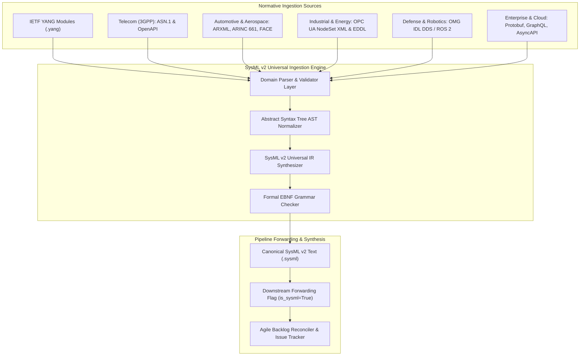
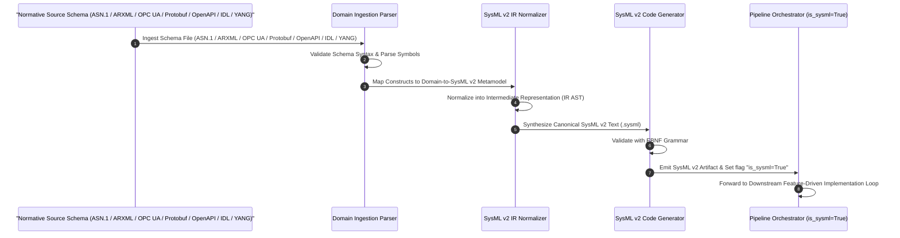
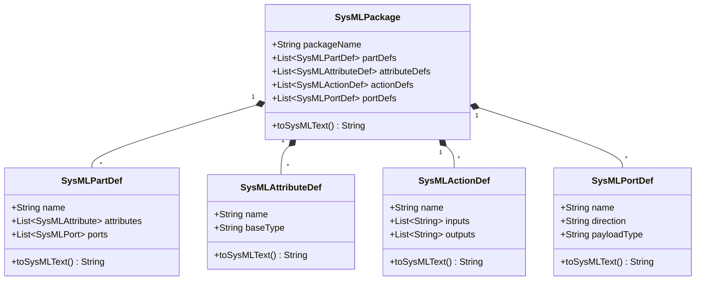

# SysML v2 Universal Intermediate Representation (IR) Architecture Solution Blueprint

## 1. Executive Vision & Scope

The SysML v2 Universal Intermediate Representation (IR) Architecture provides a unified, domain-agnostic framework for ingesting industry normative standards across any engineering vertical. By decoupling domain-specific schema definitions from downstream implementation and synthesis layers, the SysML v2 IR transforms heterogenous specifications into a standardized, machine-readable system model.

### Multi-Schema Domain Neutrality & Supported Normative Standards

IETF YANG (RFC 6020 / RFC 7950) is **only one example** of a schema format utilized in networking contexts. DEAP's SysML v2 Ingestion Skill is **100% schema-agnostic** across ALL industry schema standards, providing native parsing and AST normalization across every major engineering domain:

- **Telecom & Mobile Networks (3GPP TS)**: ASN.1 (Abstract Syntax Notation One - 3GPP TS 38.413 NGAP / 3GPP TS 36.413 S1AP specifications), OpenAPI 3.0/3.1 (5G Service-Based Architecture APIs).
- **Automotive & Aerospace**: AUTOSAR ARXML (Classic & Adaptive Platform XML), ARINC 661 XML (Cockpit Display Systems & User Interface Definitions), FACE Data Models (Future Airborne Capability Environment - Technical Standard), ISO / IEEE aerospace system engineering standards.
- **Industrial & Energy Systems**: OPC UA NodeSet XML (IEC 62541 Industrial Automation Information Models), EDDL (Electronic Device Description Language), IEEE 1471 / ISO/IEC/IEEE 42010 system architecture standards.
- **Defense, Robotics & Avionics**: OMG IDL (Interface Definition Language for DDS / ROS 2 middleware and real-time distributed systems).
- **Enterprise, Cloud & Web Services**: Protocol Buffers (.proto v2/v3 gRPC schemas), GraphQL Schemas, AsyncAPI (Event-driven architectures), JSON Schema.
- **Healthcare & Biomedical Systems**: FHIR XML/JSON (Fast Healthcare Interoperability Resources - HL7), CDISC (Clinical Data Interchange Standards Consortium data models).

Universal SysML v2 Intermediate Representation (IR) enables any platform-independent or domain-specific normative specification to be ingested, normalized into SysML v2 abstract syntax trees (AST), synthesized into canonical SysML v2 textual models (`.sysml`), and downstream forwarded with `is_sysml=True` across the automated digital pipeline.


## 2. Domain-to-SysML v2 Mapping Metamodel Table

The metamodel transformation maps domain-specific schema constructs directly into SysML v2 abstract syntax constructs. The transformation engine enforces explicit mappings across all major schema formats (ASN.1, ARXML, OPC UA NodeSet, Protobuf, OpenAPI, OMG IDL, YANG) directly into SysML v2 `package`, `attribute def`, `part def`, `port def`, and `action def` constructs according to the following canonical matrix:

| Schema Standard / Source Format | Source Metamodel Construct | SysML v2 Target Metamodel Element | SysML v2 Textual Representation | Semantic Description |
|---|---|---|---|---|
| **ASN.1 (3GPP / Telecom)** | `MODULE` | `package` | `package 'ModuleIdentifier' { ... }` | Top-level protocol module namespace |
| **ASN.1 (3GPP / Telecom)** | `INTEGER` / `OCTET STRING` / `ENUMERATED` | `attribute def` | `attribute def CustomTypeDef;` | Scalar type, bitstring, or enumerated value definition |
| **ASN.1 (3GPP / Telecom)** | `SEQUENCE` / `SET` / `CHOICE` | `part def` | `part def ProtocolPDU { ... }` | Structured Protocol Data Unit (PDU) or complex data type |
| **ASN.1 (3GPP / Telecom)** | Protocol IE / Information Element | `attribute` / `item` | `attribute ieField : CustomTypeDef;` | Individual data field within a PDU sequence |
| **ASN.1 (3GPP / Telecom)** | Procedure Code / Elementary Procedure | `action def` | `action def ExecuteProcedure { ... }` | Protocol procedure transaction or control message exchange |
| **ASN.1 (3GPP / Telecom)** | Service Access Point (SAP) Endpoint | `port def` | `port def TransportPort { ... }` | Protocol stack interface or signaling SAP endpoint |
| **AUTOSAR ARXML (Automotive)** | `AR-PACKAGE` | `package` | `package 'AutosarPackage' { ... }` | Top-level AUTOSAR package & architectural boundary |
| **AUTOSAR ARXML (Automotive)** | `ImplementationDataType` / `SwBaseType` | `attribute def` | `attribute def SignalType;` | Data type definition or hardware primitive mapping |
| **AUTOSAR ARXML (Automotive)** | `ApplicationPrimitiveComponentType` / `CompositionSwComponentType` | `part def` | `part def ECUComponent { ... }` | Software component (SWC) or composition structural block |
| **AUTOSAR ARXML (Automotive)** | `PPortPrototype` / `RPortPrototype` | `port def` | `port def BusInterfacePort { ... }` | Provided or Required interface port prototype |
| **AUTOSAR ARXML (Automotive)** | `ClientServerOperation` / `ModeSwitchInterface` | `action def` | `action def TriggerOperation { ... }` | Client-server operation invocation or mode switch action |
| **OPC UA NodeSet (Industrial)** | `UANodeSet` / `UANamespace` | `package` | `package 'IndustrialNamespace' { ... }` | Industrial automation information model namespace |
| **OPC UA NodeSet (Industrial)** | `UADataType` / `Structure` | `attribute def` | `attribute def NodeDataType;` | Industrial data type or structured variable definition |
| **OPC UA NodeSet (Industrial)** | `UAObjectType` / `UAVariableType` | `part def` | `part def AutomationObject { ... }` | Complex industrial object, device, or component definition |
| **OPC UA NodeSet (Industrial)** | `UAPort` / `ConnectionPoint` | `port def` | `port def FieldbusPort { ... }` | Physical fieldbus connection or logical pub/sub endpoint |
| **OPC UA NodeSet (Industrial)** | `UAMethod` / `ServiceCall` | `action def` | `action def ExecuteMethod { ... }` | OPC UA server method call or control action |
| **Protobuf (Cloud / Enterprise)** | `package` / `.proto` file | `package` | `package 'ProtoPackage' { ... }` | Protobuf package namespace encapsulation |
| **Protobuf (Cloud / Enterprise)** | `enum` / scalar primitive | `attribute def` | `attribute def ValueType;` | Scalar field type or enum definition |
| **Protobuf (Cloud / Enterprise)** | `message` / `struct` | `part def` | `part def PayloadMessage { ... }` | Structured payload or message definition block |
| **Protobuf (Cloud / Enterprise)** | gRPC channel endpoint / streaming port | `port def` | `port def ChannelPort { ... }` | gRPC transport endpoint or stream buffer port |
| **Protobuf (Cloud / Enterprise)** | `rpc` service method | `action def` | `action def InvokeRPC { ... }` | Remote procedure call invocation or gRPC stream operation |
| **OpenAPI 3.0/3.1 (REST / Web)** | Root API Spec / Namespace | `package` | `package 'APISpecification' { ... }` | RESTful API domain namespace |
| **OpenAPI 3.0/3.1 (REST / Web)** | `components/schemas` Data Type | `attribute def` | `attribute def ModelSchema;` | JSON Schema model, scalar format, or data type |
| **OpenAPI 3.0/3.1 (REST / Web)** | Path Item Object / Resource | `part def` | `part def ResourceEndpoint { ... }` | RESTful API resource block or service component |
| **OpenAPI 3.0/3.1 (REST / Web)** | Webhook / Callback Channel | `port def` | `port def CallbackPort { ... }` | Asynchronous callback interface or webhook port |
| **OpenAPI 3.0/3.1 (REST / Web)** | Path Operation (`get`, `post`, `put`) | `action def` | `action def ExecuteRequest { ... }` | HTTP request transaction or API operation |
| **OMG IDL (Defense / ROS 2)** | `module` | `package` | `package 'IDLModule' { ... }` | OMG IDL module encapsulation boundary |
| **OMG IDL (Defense / ROS 2)** | `typedef` / `enum` / primitive | `attribute def` | `attribute def FieldType;` | Value type or primitive identifier definition |
| **OMG IDL (Defense / ROS 2)** | `struct` / `union` / `interface` / `component` | `part def` | `part def DDSComponent { ... }` | Distributed component or message structure definition |
| **OMG IDL (Defense / ROS 2)** | `port` / `provides` / `uses` | `port def` | `port def DDSPubSubPort { ... }` | DDS Publisher/Subscriber or Component port |
| **OMG IDL (Defense / ROS 2)** | `op` / `operation` | `action def` | `action def InvokeOperation { ... }` | Synchronous/asynchronous interface operation definition |
| **IETF YANG (Networking)** | `module` / `submodule` | `package` | `package 'YANGModule' { ... }` | Network management module namespace |
| **IETF YANG (Networking)** | `typedef` / `identity` | `attribute def` | `attribute def CustomTypeDef;` | Value type definition or derived identity |
| **IETF YANG (Networking)** | `container` / `list` | `part def` | `part def SubSystemPart { ... }` | Structural block definition or configuration container |
| **IETF YANG (Networking)** | `interface` / endpoint buffer | `port def` | `port def ServicePort { ... }` | Network interface point or payload port |
| **IETF YANG (Networking)** | `rpc` / `action` | `action def` | `action def ExecuteAction { ... }` | Behavioral action or RPC invocation |
| **ARINC 661 (Avionics)** | `Application Definition` | `package` | `package 'AvionicsApp' { ... }` | Cockpit display application namespace |
| **ARINC 661 (Avionics)** | `Parameter Def` / Layer ID | `attribute def` | `attribute def ParameterDef;` | Display parameter or layer attribute definition |
| **ARINC 661 (Avionics)** | `Widget` Definition | `part def` | `part def WidgetDef { ... }` | Cockpit display graphical widget component |
| **ARINC 661 (Avionics)** | `BufferPort` / User Event Port | `port def` | `port def DisplayPort { ... }` | Communication buffer port or user interaction event |


## 3. Mermaid Architecture & Transformation Sequence Diagrams

### 3.1 Ingestion & Transformation Architecture



### 3.2 Transformation Sequence Diagram



### 3.3 SysML v2 IR Metamodel Class Diagram




## 4. Formal SysML v2 Synthesis EBNF Grammar

The canonical textual format (`.sysml`) generated by the IR synthesizer strictly conforms to the following Extended Backus-Naur Form (EBNF) grammar specification:

```ebnf
sysml_file         ::= { package_decl } ;
package_decl       ::= "package" S identifier S "{" S { package_body_elem } S "}" ;
package_body_elem  ::= attribute_def | part_def | action_def | port_def | import_stmt | comment ;

attribute_def      ::= "attribute" S "def" S identifier [ S ":" S identifier ] S ";" ;
part_def           ::= "part" S "def" S identifier S "{" S { part_body_elem } S "}" ;
part_body_elem     ::= attribute_decl | port_decl | part_decl | comment ;

attribute_decl     ::= "attribute" S identifier S ":" S identifier S ";" ;
port_decl          ::= "port" S identifier S ":" S identifier S ";" ;
part_decl          ::= "part" S identifier S ":" S identifier S ";" ;

action_def         ::= "action" S "def" S identifier S "{" S { action_body_elem } S "}" ;
action_body_elem   ::= in_param | out_param | comment ;
in_param           ::= "in" S "item" S identifier S ":" S identifier S ";" ;
out_param          ::= "out" S "item" S identifier S ":" S identifier S ";" ;

port_def           ::= "port" S "def" S identifier S "{" S [ port_body_elem ] S "}" ;
port_body_elem     ::= "inout" S "item" S identifier S ":" S identifier S ";" ;

import_stmt        ::= "import" S identifier "::*" S ";" ;
comment            ::= "//" { any_char } newline | "/*" { any_char } "*/" ;
identifier         ::= ( letter | "_" ) { letter | digit | "_" } ;
S                  ::= { whitespace } ;
```


## 5. Skill Architecture Spec for `skills/sysmlv2-schema-ingestion/SKILL.md`

The skill `skills/sysmlv2-schema-ingestion/SKILL.md` defines the subagent execution contract for automated schema ingestion.

### 5.1 Skill Frontmatter
```yaml
---
name: sysmlv2-schema-ingestion
description: "Ingests normative industry standards across all domains (ASN.1, ARXML, OPC UA NodeSet, OMG IDL, Protobuf, OpenAPI, ARINC 661, IETF YANG) and synthesizes canonical SysML v2 Intermediate Representation (IR) artifacts."
compatibility: "Python 3.9+, SysML v2 KerML / SysML parser tools"
---
```

### 5.2 Subagent Execution Protocol
1. **Ingest & Parse**: Load raw schema file from input path and validate structural integrity against domain schema rules.
2. **Transform to AST**: Translate constructs using the Domain-to-SysML v2 Mapping Metamodel Table into `SysMLPackage`, `SysMLPartDef`, `SysMLAttributeDef`, `SysMLActionDef`, and `SysMLPortDef` nodes.
3. **Synthesize Textual SysML v2**: Format AST nodes into standard SysML v2 textual syntax (`.sysml`).
4. **EBNF Validation**: Parse generated `.sysml` against the Formal SysML v2 Synthesis EBNF Grammar.
5. **Downstream Handoff**: Emit synthesized artifact to target destination and mark `is_sysml=True` in execution context.


## 6. Pipeline Integration & Downstream Forwarding Flow (`is_sysml=True`)

When normative schemas are ingested and synthesized into SysML v2 IR artifacts:

1. **Artifact Registration**: The synthesized SysML v2 model is persisted at `docs/sysmlv2/<domain>-spec.sysml`.
2. **Execution Context Flag**: The pipeline orchestrator sets `is_sysml=True` in the payload passed to all downstream subagents.
3. **Downstream 3-Layer Definition of Done**: Subagents (`spec-orchestrator`, `feature-driven-implementation`, `spec-implementation-auditor`) detect `is_sysml=True` and evaluate completeness against the 3-layer LUI semantic chain:
   - **Layer 1 (Domain State & Signal Model)**: Realized via SysML v2 `attribute def` and scalar property buffers.
   - **Layer 2 (Logic & Safety State Management)**: Realized via SysML v2 `part def` statecharts and `action def` behaviors.
   - **Layer 3 (Display & Actuator Interface Binding)**: Realized via SysML v2 `port def` bindings to target runtime UI/hardware widgets.
4. **Traceability & Continuous Re-synchronization**: Any modification to source normative specifications triggers re-execution of the ingestion engine, updating the `.sysml` IR and preserving end-to-end traceability without documentation drift.

