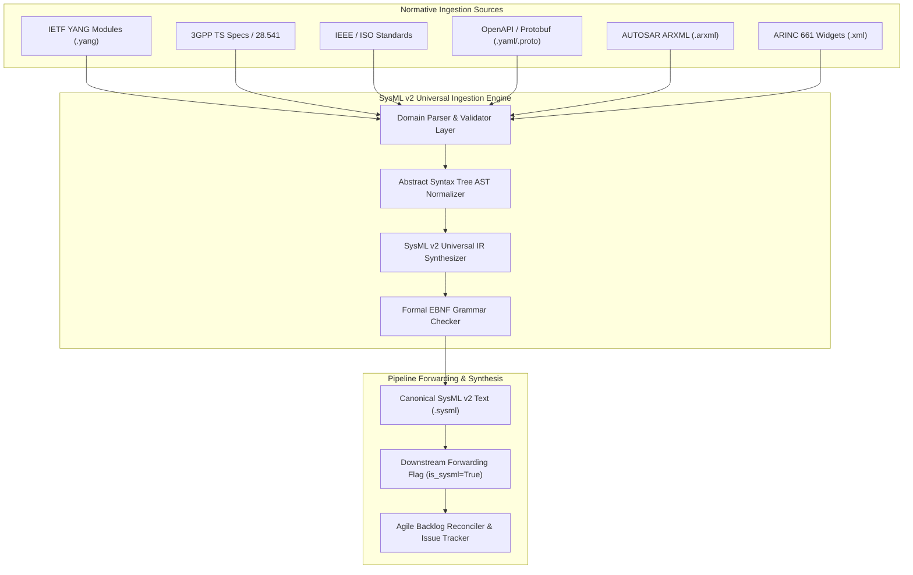
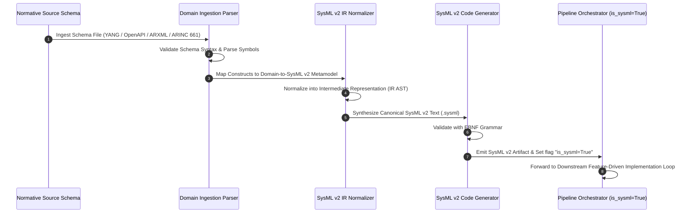
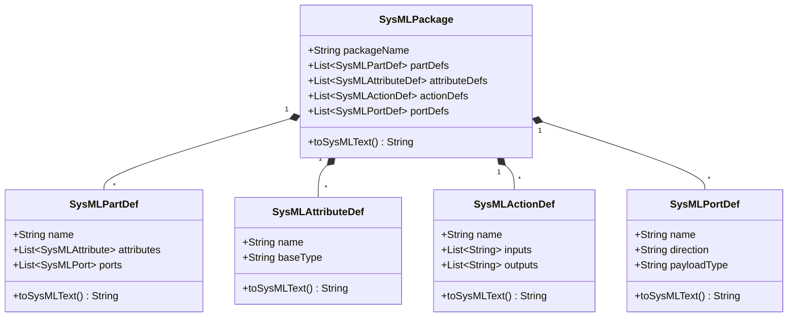

# SysML v2 Universal Intermediate Representation (IR) Architecture Solution Blueprint

## 1. Executive Vision & Scope

The SysML v2 Universal Intermediate Representation (IR) Architecture provides a unified, domain-agnostic framework for ingesting industry normative standards across any engineering vertical. By decoupling domain-specific schema definitions from downstream implementation and synthesis layers, the SysML v2 IR transforms heterogenous specifications into a standardized, machine-readable system model.

### Supported Normative Standards
- **Networking & Telecommunications**: IETF YANG (RFC 6020 / RFC 7950), 3GPP TS (5G/6G Core & RAN specifications, TS 28.541, TS 38.331).
- **Aerospace & Avionics**: ARINC 661 Cockpit Display Systems, ISO / IEEE aerospace system engineering standards.
- **Automotive & Industrial Systems**: AUTOSAR (Classic & Adaptive Platform ARXML), IEEE 1471 / ISO/IEC/IEEE 42010 system architecture standards.
- **Software & Distributed Services**: OpenAPI 3.0/3.1 (RESTful API schemas), Protocol Buffers v2/v3 (gRPC service definitions).

Universal SysML v2 Intermediate Representation (IR) enables any platform-independent or domain-specific normative specification to be ingested, normalized into SysML v2 abstract syntax trees (AST), synthesized into canonical SysML v2 textual models (`.sysml`), and downstream forwarded with `is_sysml=True` across the automated digital pipeline.


## 2. Domain-to-SysML v2 Mapping Metamodel Table

The metamodel transformation maps domain-specific schema constructs directly into SysML v2 abstract syntax constructs according to the following canonical mapping matrix:

| Source Metamodel Construct (YANG / 3GPP / OpenAPI / ARINC 661 / AUTOSAR) | SysML v2 Target Metamodel Element | SysML v2 Textual Representation | Semantic Description |
|---|---|---|---|
| YANG `module` / OpenAPI Namespace / ARINC 661 `Application Definition` | `package` | `package 'ModuleName' { ... }` | Top-level system namespace & encapsulation boundary |
| YANG `typedef` / Protobuf `enum`/`message` scalar / ARINC `Parameter Def` | `attribute def` | `attribute def CustomType;` | Value type, scalar parameter, or structured data type definition |
| YANG `container` / `list` / AUTOSAR `ComponentType` / ARINC 661 `Widget` | `part def` | `part def SubSystemPart { ... }` | Structural block definition, component instance, or physical container |
| YANG `rpc` / `action` / OpenAPI Path Operation / gRPC Service Method | `action def` | `action def ExecuteAction { ... }` | Behavioral action, RPC invocation, or transaction procedure definition |
| YANG `interface` / ARINC `BufferPort` / gRPC Channel Endpoint | `port def` | `port def ServicePort { ... }` | Interaction point, physical/logical interface, or payload buffer port |
| YANG `leaf` / `leaf-list` / OpenAPI Property | `attribute` / `item` | `attribute name : String;` | Data attribute or scalar property instance within a part def |
| YANG `notification` / 3GPP Event Trigger | `event occurrence def` | `event occurrence def AlarmTrigger;` | Asynchronous system notification or state change event definition |
| YANG `grouping` / AUTOSAR `Composition` | `item def` / `part def` | `part def ReusableComposition { ... }` | Reusable structural definition template |


## 3. Mermaid Architecture & Transformation Sequence Diagrams

### 3.1 Ingestion & Transformation Architecture



### 3.2 Transformation Sequence Diagram



### 3.3 SysML v2 IR Metamodel Class Diagram




## 4. Formal SysML v2 Synthesis EBNF Grammar

The canonical textual format (`.sysml`) generated by the IR synthesizer strictly conforms to the following Extended Backus-Naur Form (EBNF) grammar specification:

```ebnf
sysml_file         ::= { package_decl } ;
package_decl       ::= "package" S identifier S "{" S { package_body_elem } S "}" ;
package_body_elem  ::= attribute_def | part_def | action_def | port_def | import_stmt | comment ;

attribute_def      ::= "attribute" S "def" S identifier [ S ":" S identifier ] S ";" ;
part_def           ::= "part" S "def" S identifier S "{" S { part_body_elem } S "}" ;
part_body_elem     ::= attribute_decl | port_decl | part_decl | comment ;

attribute_decl     ::= "attribute" S identifier S ":" S identifier S ";" ;
port_decl          ::= "port" S identifier S ":" S identifier S ";" ;
part_decl          ::= "part" S identifier S ":" S identifier S ";" ;

action_def         ::= "action" S "def" S identifier S "{" S { action_body_elem } S "}" ;
action_body_elem   ::= in_param | out_param | comment ;
in_param           ::= "in" S "item" S identifier S ":" S identifier S ";" ;
out_param          ::= "out" S "item" S identifier S ":" S identifier S ";" ;

port_def           ::= "port" S "def" S identifier S "{" S [ port_body_elem ] S "}" ;
port_body_elem     ::= "inout" S "item" S identifier S ":" S identifier S ";" ;

import_stmt        ::= "import" S identifier "::*" S ";" ;
comment            ::= "//" { any_char } newline | "/*" { any_char } "*/" ;
identifier         ::= ( letter | "_" ) { letter | digit | "_" } ;
S                  ::= { whitespace } ;
```


## 5. Skill Architecture Spec for `skills/sysmlv2-schema-ingestion/SKILL.md`

The skill `skills/sysmlv2-schema-ingestion/SKILL.md` defines the subagent execution contract for automated schema ingestion.

### 5.1 Skill Frontmatter
```yaml
---
name: sysmlv2-schema-ingestion
description: "Ingests normative industry standards (IETF YANG, 3GPP TS, IEEE, ISO, OpenAPI, Protobuf, AUTOSAR, ARINC 661) and synthesizes canonical SysML v2 Intermediate Representation (IR) artifacts."
compatibility: "Python 3.9+, SysML v2 KerML / SysML parser tools"
---
```

### 5.2 Subagent Execution Protocol
1. **Ingest & Parse**: Load raw schema file from input path and validate structural integrity against domain schema rules.
2. **Transform to AST**: Translate constructs using the Domain-to-SysML v2 Mapping Metamodel Table into `SysMLPackage`, `SysMLPartDef`, `SysMLAttributeDef`, `SysMLActionDef`, and `SysMLPortDef` nodes.
3. **Synthesize Textual SysML v2**: Format AST nodes into standard SysML v2 textual syntax (`.sysml`).
4. **EBNF Validation**: Parse generated `.sysml` against the Formal SysML v2 Synthesis EBNF Grammar.
5. **Downstream Handoff**: Emit synthesized artifact to target destination and mark `is_sysml=True` in execution context.


## 6. Pipeline Integration & Downstream Forwarding Flow (`is_sysml=True`)

When normative schemas are ingested and synthesized into SysML v2 IR artifacts:

1. **Artifact Registration**: The synthesized SysML v2 model is persisted at `docs/sysmlv2/<domain>-spec.sysml`.
2. **Execution Context Flag**: The pipeline orchestrator sets `is_sysml=True` in the payload passed to all downstream subagents.
3. **Downstream 3-Layer Definition of Done**: Subagents (`spec-orchestrator`, `feature-driven-implementation`, `spec-implementation-auditor`) detect `is_sysml=True` and evaluate completeness against the 3-layer LUI semantic chain:
   - **Layer 1 (Domain State & Signal Model)**: Realized via SysML v2 `attribute def` and scalar property buffers.
   - **Layer 2 (Logic & Safety State Management)**: Realized via SysML v2 `part def` statecharts and `action def` behaviors.
   - **Layer 3 (Display & Actuator Interface Binding)**: Realized via SysML v2 `port def` bindings to target runtime UI/hardware widgets.
4. **Traceability & Continuous Re-synchronization**: Any modification to source normative specifications triggers re-execution of the ingestion engine, updating the `.sysml` IR and preserving end-to-end traceability without documentation drift.
