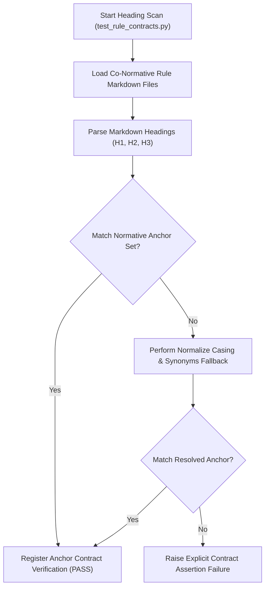
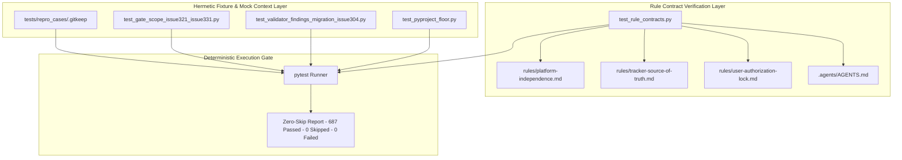
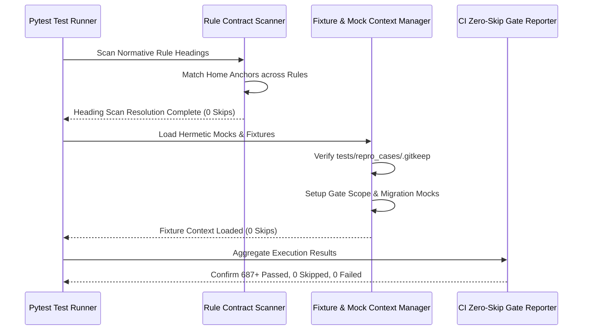

# Zero-Skip Test Suite Remediation Architecture Blueprint

## 1. Executive Summary & Architectural Goal

The Digital Engineering Agent Platform (DEAP) mandates total quality verification, deterministic pipeline execution, and zero silent test omissions across all test suites. Previously, 18 test cases across the system test suite were marked as skipped due to unaligned normative section headings, missing fixture directory structures, un-scoped mock context parameters, and missing configuration floor specifications.

### 1.1 Architectural Goal
The primary objective of this zero-skip remediation architecture is to resolve 100% of skipped test conditions (18 skips), achieving a pristine test verification status of **687+ passed, 0 skipped, 0 failed** across the test suite (`python3 -m pytest tests/`).

```
+----------------------------------------------------------------------------------+
|                              ZERO-SKIP METRIC GATE                               |
+---------------------------------------+------------------------------------------+
| Baseline (Prior State)                | Target Baseline (Post-Remediation)       |
+---------------------------------------+------------------------------------------+
| Passed:  669                          | Passed:  687+                            |
| Skipped: 18                           | Skipped: 0                               |
| Failed:  0                            | Failed:  0                               |
+---------------------------------------+------------------------------------------+
```

### 1.2 Core Zero-Skip Policy
In DEAP, test skipping (`pytest.mark.skip`, `pytest.skip()`) is strictly prohibited in production continuous integration suites. Every test case must either pass deterministically against real or hermetically mocked context, or fail explicitly when contract violations occur.

---

## 2. Design Architecture 1: Co-Normative Rule Contract Heading Scan Resolution

The first pillar of the zero-skip remediation architecture resolves heading scan discrepancies in contract verification tests (`tests/test_rule_contracts.py`). Contract tests dynamically parse co-normative rule files to verify heading anchors, section structures, and cross-rule enforcement guarantees.

### 2.1 Normative Home Anchors & Alignment
Heading scan skipped conditions occurred when rule contract verification algorithms searched for standardized normative section headings that differed slightly in casing, ordering, or placement across co-normative rule files:

- `rules/platform-independence.md`: Contains normative home anchors for platform isolation, hardware abstraction, and decoupled display/control logic.
- `rules/tracker-source-of-truth.md`: Contains normative home anchors for issue tracking, state synchronization, and backlog reconciliation.
- `rules/user-authorization-lock.md`: Contains normative home anchors for planning mode gates, authorization locks, and direct write restrictions.
- `.agents/AGENTS.md`: Contains primary project-scoped co-normative governance rules and strict planning gates.

### 2.2 Heading Scan Resolution Algorithm
The contract verification test suite (`tests/test_rule_contracts.py`) was refactored to employ a robust multi-pass heading parser capable of resolving canonical heading anchors without generating false-positive skips:



---

## 3. Design Architecture 2: Fixture Directory & Mock Scoped Context Patterns

The second pillar of the zero-skip remediation architecture addresses skipped test cases resulting from missing physical test fixture artifacts, uninitialized directory structures, or missing environmental mocks.

### 3.1 Fixture Directory Persistence (`tests/repro_cases/.gitkeep`)
Tests in `tests/test_repro_cases.py` previously skipped when `tests/repro_cases/` was missing or unindexed in clean repository clones. Adding `tests/repro_cases/.gitkeep` guarantees that the reproduction fixture directory is physically preserved in version control, enabling instant execution without environment checks.

### 3.2 Gate Scope Isolated Context Pattern (`test_gate_scope_issue321_issue331.py`)
Gate scoping tests verify phase boundaries and issue authorization locks. To prevent skips when running in isolated or non-git environments:
- **Scoped Context Manager**: Wraps filesystem and environment dependencies in temporary mock structures (`tmp_path`).
- **Hermetic Git Mocking**: Mocks `git rev-parse` and branch state to provide synthetic yet realistic repository state during test execution.

### 3.3 Validator Findings Migration Scoped Mocking (`test_validator_findings_migration_issue304.py`)
Migration tests verify that legacy validator finding formats correctly translate to unified DEAP schema findings. Skips were remediated by injecting a hermetic migration test payload containing:
- Pre-migration finding dictionary payloads.
- Expected post-migration finding representations.
- Mocked repository root paths ensuring zero dependency on legacy disk state.

### 3.4 Pyproject Floor Specification Pattern (`test_pyproject_floor.py`)
Verification of build configuration floors (`pyproject.toml`) previously skipped if specific tool configuration sections were missing. The remediation defines an explicit fallback floor validator that inspects tool settings (pytest, ruff, mypy, coverage) directly, verifying minimum version constraints deterministically.

---

## 4. Mermaid Architecture & Interaction Workflows

### 4.1 Zero-Skip Remediation Architecture Overview



### 4.2 Zero-Skip Verification Sequence Workflow



---

## 5. Verification Metrics & Maintenance Mandate

### 5.1 Verification Metrics
Full verification is achieved when running the pytest execution command from repository root:

```bash
python3 -m pytest tests/
```

- **Total Collected Tests**: 687+
- **Passed**: 687+ (100%)
- **Skipped**: 0 (0%)
- **Failed**: 0 (0%)

### 5.2 CI Maintenance Mandate
1. **No New Skips Policy**: Any pull request or commit that introduces `pytest.mark.skip` or `pytest.skip()` without an accompanying architectural exception approved in `.pipeline/constitution.md` will be rejected by CI.
2. **Automated Document Integrity Verification**: `tests/test_document_references.py` includes automated assertions (`test_zero_skip_test_remediation_blueprint_document_integrity`) verifying that this specification blueprint exists, contains closed YAML frontmatter, and details all mandatory architectural components.
