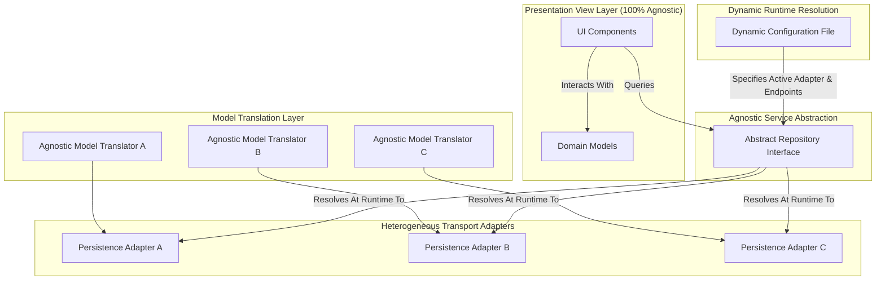

# Design Document: Decoupled Multi-Backend Persistence & Dynamic Layout Compliance

## 1. Context & Architectural Goals
This document specifies the design for implementing:
1. A **completely decoupled persistence layer** supporting a standalone local-first distribution (everything bundled and running locally) that can be dynamically reconfigured at runtime to target distributed deployments across various backend stacks.
2. **Support for Arbitrary Network/Persistence Interfaces:** The architecture is designed to accommodate any transport protocol, contract format, or wire-serialization method without affecting the presentation layer.
3. A **dynamic layout engine compliance** layer realizing resizable split workspaces, bottom-tabbed virtualized tables, and hardware-accelerated viewport layouts driven by project-wide design tokens.
4. Strict **high-density console visual standards** (Roboto/Inter 12px-13px text, 16px outline-only icons with thin 1.0px-1.2px stroke weights, and reactive-compliant `min-height: 32px` row structures).

---

## 2. Decoupled Persistence & Agnostic Transport Architecture
To ensure the system is ready for any future interface contract or transport mechanism, we structure our persistence layer using a strict **Repository-Adapter-Translator** pattern:

### Architectural Principles for Transport Agnosticism:

#### 1. Contract Independence
* The presentation layer is completely isolated from the transport protocol, database SDK, and serialization format.
* All UI components communicate with abstract repository interfaces using clean, platform-internal **Domain Models**.

#### 2. Encapsulated Adapters
* Each adapter implementation wraps a specific transport client or SDK.
* Any code generation or interface contracts required by external systems are contained entirely within their respective adapter boundaries.

#### 3. In-Adapter Model Translation
* Adapters must translate incoming transport-specific payloads into clean domain models, and translate domain models back into transport-specific payloads for outgoing requests.
* This ensures that changes to the external data interfaces never cascade into the presentation layer.

#### 4. Runtime Configuration Resolution
* Connection endpoints, active adapter types, and credentials are loaded dynamically at application bootstrap from an external configuration source.
* Switching adapters is achieved by modifying the runtime configuration, requiring no client recompilation.

---

## 3. High-Density Console Design Specs

### Typography & Spacing
* **Font Family:** `Roboto, Inter, sans-serif`
* **Base Text Sizes:**
  * Page Title: `18px` max (Medium)
  * Section/Table Headers: `13px`–`14px` (Semi-bold/Medium)
  * Body / Table Cells: `12px`–`13px` (Regular)
  * Labels / Captions: `11px`–`12px` (Regular)
* **Spacing Constraints:** Spacing is strictly aligned to an `8px` grid system.

### Vector Graphic (Icon) Constraints
* **Dimensions:** Contained within a fixed `16px × 16px` bounding viewport.
* **Stroke Weight:** Explicitly set to a thin stroke width of `1.0px` to `1.2px` max.
* **Aesthetics:** Icons are outline-only; solid/filled vectors are prohibited. Bounding padding is limited to `2px`.

### Reactive Table Row Sizing
* To prevent visual clipping or layout breaks when font scales or text wraps, rows must be **reactive-compliant**:
  * Set a minimum constraint of `min-height: 32px` instead of fixed heights.
  * Cell vertical padding is limited to `4px` top/bottom to maximize info density while allowing expansion.

---

## 4. Local Execution & Emulator Orchestration (Example Stack Profile)
When the application is bundled for a specific local-first stack profile (such as a database service or emulator), the configuration binds the corresponding adapters:

### 1. Stack Service Configuration Profile
Defines service parameters and emulator settings (e.g. port configuration, database schema files, and authorization rules) stored in the profile's configuration files (e.g. `firebase.json` or service configurations).

### 2. Standalone Installation Script
* Installs required system dependencies (e.g. runtimes, JDKs, or SDK command-line utilities).
* Bootstraps the local database engine/emulator in the background and runs a data migration/seeding script to populate baseline tables/documents.
* Stops the service once the migration completes.

---

## 5. Verification Plan

### Automated Coverage & Regressions
* Verify that there are no regressions in compilation or schema validation constraints.
* Run linter suite (`npm run lint` / `tsc --noEmit`) to verify that no direct imports of database SDKs leak into UI components.

### Manual Verification
* Run local setup scripts and verify configuration files compile successfully.
* Deploy built assets with a modified local config pointing to a local database endpoint to verify runtime adapter injection works correctly.
