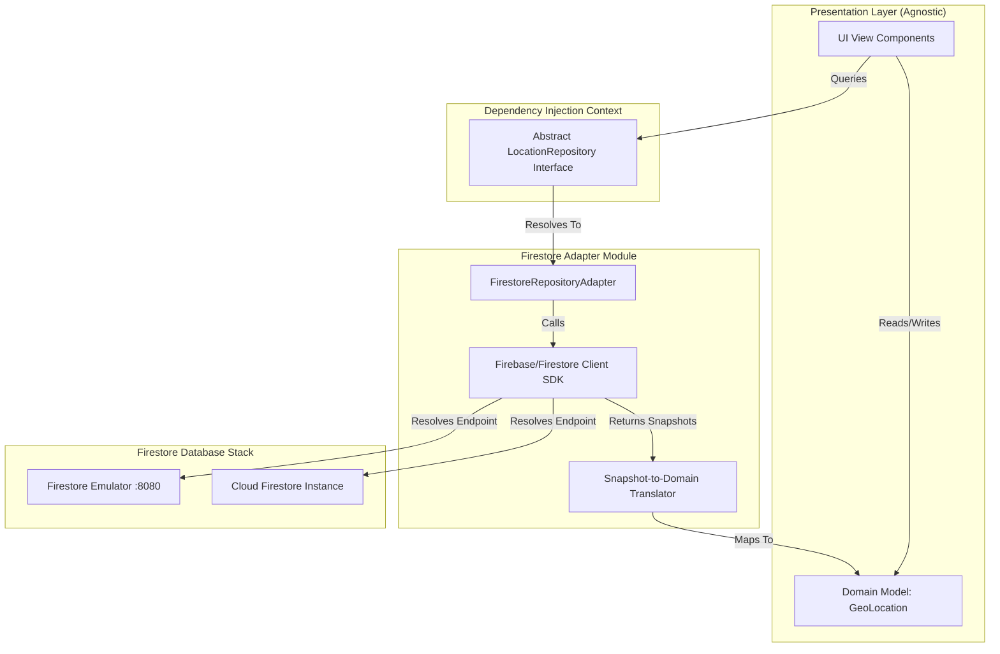

# Design Document: Decoupled Firestore Persistence Adapter & Local Emulator Orchestration

## 1. Context & Architectural Goals
This document details the concrete implementation design for the **Firestore Persistence Adapter** profile. 

This profile acts as one of the swappable backends under the abstract architecture defined in [feat-decoupled-persistence-layout-engine-design.md](file:///Users/perkunas/digital-pipeline-repo/docs/feat-decoupled-persistence-layout-engine-design.md). It satisfies the following goals:
1. **Decoupled Firestore Integration:** All Firestore SDK dependencies and client credentials are fully encapsulated inside the adapter module, with zero leaks into the presentation layer.
2. **Document to Domain Model Translation:** Translating Firestore Document snapshots into agnostic, UI-bound Domain Models.
3. **Local Standalone Run Capability:** Enabling local execution using the native Firestore emulator (port `8080`) with automated mock data seeding, requiring no internet connectivity or cloud credentials.
4. **Dynamic Configuration:** Resolving the connection mode (local emulator vs. cloud project) dynamically from the external runtime `config.json` at application bootstrap.

---

## 2. Abstraction & Interface Realization
The presentation layer consumes data using an abstract repository, which resolves to the Firestore adapter at runtime:



---

## 3. Firestore Schema & Document Structure
To persist the geodetic models, data is stored in two root collections: `nodes` and `links`.

### 1. `nodes` Collection
* **Document ID:** `uuid` (string, e.g. `node-01`)
* **Document Fields:**
  ```json
  {
    "uuid": "node-01",
    "name": "Tokyo-Gateway-01",
    "type": "ROUTER",
    "referenceFrame": {
      "astronomicalBody": "earth",
      "geodeticSystem": {
        "datum": "wgs-84",
        "coordAccuracy": 1.5,
        "heightAccuracy": 2.0
      }
    },
    "latitude": 35.6762,
    "longitude": 139.6503,
    "height": 40.5,
    "validityLimit": "2026-12-31T23:59:59Z"
  }
  ```

### 2. `links` Collection
* **Document ID:** `uuid` (string, e.g. `link-01`)
* **Document Fields:**
  ```json
  {
    "uuid": "link-01",
    "sourceNode": "node-01",
    "destNode": "node-02",
    "metric": 10,
    "status": "UP"
  }
  ```

---

## 4. Adapter & Translation Implementation
The concrete adapter maps the asynchronous database calls and real-time document streams into standard domain models.

### Interface Mapping Example (TypeScript)
```typescript
import { Firestore, collection, doc, getDocs, setDoc, DocumentSnapshot } from 'firebase/firestore';
import { LocationRepository } from '../interfaces/location-repository';
import { GeoLocation } from '../models/geo-location';

export class FirestoreRepositoryAdapter implements LocationRepository {
  constructor(private firestoreDb: Firestore) {}

  // 1. Snapshot-to-Domain Translation
  private translateSnapshot(snap: DocumentSnapshot): GeoLocation {
    const data = snap.data();
    if (!data) throw new Error(`Document ${snap.id} has no data`);
    return {
      id: snap.id,
      name: data.name,
      latitude: data.latitude,
      longitude: data.longitude,
      altitude: data.height,
      validUntil: new Date(data.validityLimit)
    };
  }

  // 2. Fetching & Mapping Documents
  public async getLocations(): Promise<GeoLocation[]> {
    const snap = await getDocs(collection(this.firestoreDb, 'nodes'));
    return snap.docs.map(doc => this.translateSnapshot(doc));
  }

  // 3. Serializing & Committing Changes
  public async saveLocation(loc: GeoLocation): Promise<void> {
    const docRef = doc(this.firestoreDb, 'nodes', loc.id);
    await setDoc(docRef, {
      name: loc.name,
      latitude: loc.latitude,
      longitude: loc.longitude,
      height: loc.altitude,
      validityLimit: loc.validUntil.toISOString()
    }, { merge: true });
  }
}
```

---

## 5. Local Emulator Orchestration Profile
To achieve standalone local execution without cloud stubs, the Firestore emulator is orchestrated locally.

### 1. Firebase Emulator Configuration (`firebase.json`)
Binds the Firestore emulator to port `8080` locally:
```json
{
  "firestore": {
    "rules": "firestore.rules"
  },
  "emulators": {
    "firestore": {
      "port": 8080
    },
    "ui": {
      "enabled": true
    }
  }
}
```

### 2. Standalone Seeding Script (`migrate-to-firestore.ts`)
An offline script runs at setup to purge previous data and seed baseline records:
```typescript
import { initializeApp } from 'firebase/app';
import { getFirestore, connectFirestoreEmulator, doc, setDoc } from 'firebase/firestore';

const app = initializeApp({ projectId: 'demo-local-topology' });
const db = getFirestore(app);
connectFirestoreEmulator(db, '127.0.0.1', 8080);

async function seed() {
  await setDoc(doc(db, 'nodes', 'node-01'), {
    name: "Tokyo-Gateway-01",
    latitude: 35.6762,
    longitude: 139.6503,
    height: 40.5
  });
  console.log("Mock data seeded successfully.");
}
seed().catch(console.error);
```

### 3. Setup Script (`install.sh`)
* Installs Node.js & Java (OpenJDK/JRE).
* Installs npm dependencies.
* Boots the emulator: `npx firebase-tools emulators:start --only firestore &`
* Runs `npx tsx migrate-to-firestore.ts` to populate the local database.
* Shuts down the emulator process.
