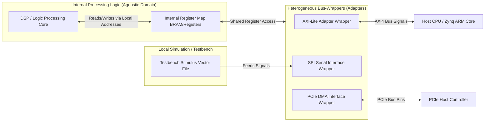
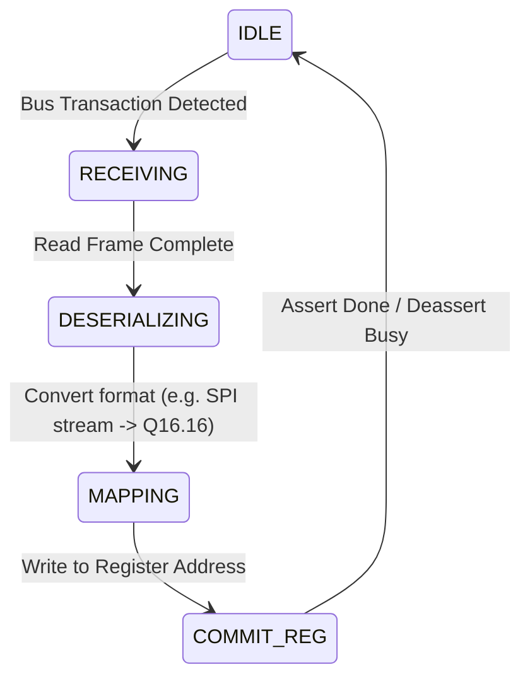

# Design Document: Hardware-Decoupled Persistence & Bus-Mapped Register Architecture (VHDL/FPGA Platform Profile)

## 1. Context & Architectural Goals
This document details the hardware design for implementing the decoupled, agnostic persistence specification as a synthesized digital system in **VHDL** on a **Xilinx FPGA** platform.

The core objectives are:
1. **Contract Decoupling in Silicon:** Isolating the core digital signal processing (DSP) or control logic from the physical IO transport protocol (e.g. SPI, I2C, UART, AXI-Lite, or PCIe).
2. **Memory-Mapped Register Abstraction:** Abstracting the geodetic database tables into a hardware **Register Map** utilizing fixed-point arithmetic representations.
3. **Heterogeneous Interface Mapping:** Supporting dynamic configuration of the transport wrapper (the adapter) to swap between serial testbenches (simulation) and physical bus synthesis (production hardware) without modifying the internal computation cores.

---

## 2. Decoupled Hardware Architecture
At the hardware description level, we implement the software adapter/repository pattern using **Bus-Wrappers** and **Finite State Machines (FSMs)**:

### Architectural Principles:
* **The Shared Register Map (The Repository):** An internal array of registers or Block RAM (BRAM) addresses containing the data model values. The internal DSP core and external interface wrappers share access to this register map.
* **Bus-Wrappers (The Adapters):** VHDL wrappers that translate specific bus protocol signals (such as AXI-Lite read/write handshake lines, or SPI serial clock/data frames) into local register address writes.
* **Data Format Translators:** FSM logic within the wrappers that converts raw serialized bits or floating-point bus packets into the internal fixed-point representation used by the FPGA DSP logic.

---

## 3. Register & Data Format Mapping
To realize the Yang geodetic specifications (`test-geo-location.yang`) in hardware registers, we define a 32-bit memory-mapped register configuration.

### Fixed-Point Coordinate Representation
To avoid the resource overhead of floating-point units (FPUs) in FPGA fabric, latitude, longitude, and height coordinates are stored as **32-bit two's complement fixed-point numbers (Q16.16 format)**:
* **Whole integer part:** 16 bits (signed).
* **Fractional part:** 16 bits.
* **Resolution:** $2^{-16} \approx 0.000015$ degrees (approx. 1.7 meters at the equator), which satisfies coordinate accuracy specifications.

### Register Map Table (Base Offset: `0x43C0_0000`)

| Address Offset | Register Name | Access Type | Description / Bit Fields |
| :--- | :--- | :--- | :--- |
| `0x00` | `CONTROL_STATUS` | R/W | Bit 0: Commit (Trigger update) Bit 1: Busy flag (Read-only) Bit 2: Error flag (Read-only) |
| `0x04` | `GEODETIC_SYSTEM` | R/W | Bits 1-0: Coordinate Choice (00=Unconfigured, 01=Ellipsoid, 10=Cartesian) Bits 7-2: Datum ID |
| `0x08` | `COORD_LAT_X` | R/W | Latitude or Cartesian X (32-bit Q16.16 format) |
| `0x0C` | `COORD_LON_Y` | R/W | Longitude or Cartesian Y (32-bit Q16.16 format) |
| `0x10` | `COORD_ALT_Z` | R/W | Altitude or Cartesian Z (32-bit Q16.16 format) |
| `0x14` | `VALIDITY_LIMIT` | R/W | Epoch timestamp indicating validity boundary |

---

## 4. Agnostic Transport Translation FSM
Each bus wrapper runs a VHDL Finite State Machine to handle interface-specific transactions and commit them to the internal registers.

### VHDL Translator FSM Details:
1. **IDLE:** Waits for interface-specific handshakes (e.g. AXI `AWVALID` and `WVALID` flags, or SPI Chip Select `CS_N` going low).
2. **RECEIVING:** Shifts in serialization data packets.
3. **DESERIALIZING:** Assembles bits into standard 32-bit hardware words.
4. **MAPPING:** Executes binary translation (e.g. converting IEEE-754 single-precision float inputs from a CPU into the internal Q16.16 fixed-point format).
5. **COMMIT_REG:** Asserts the register write enable to write values to internal registers, then returns to IDLE.

---

## 5. Standalone Simulation & Verification Plan

### 1. Standalone Simulation Testbench (Local Run)
For local development and E2E verification without physical hardware:
* We implement a testbench (`tb_geodetic_register_map.vhd`).
* The testbench reads test data shapes from a local configuration vector file (`stimulus.dat`) containing coordinate values.
* The testbench simulates the physical SPI clock and data lines, feeding the vectors into the wrapper, and asserts that the internal registers resolve to the expected values (e.g. checking that the Q16.16 output matches the input).

### 2. Distributed Synthesis (Production Run)
For physical deployment:
* The core VHDL code is synthesized using **Xilinx Vivado** targeting a specific FPGA board (e.g. Xilinx Zynq-7000 or UltraScale+ SoC).
* The registers are exposed to the host CPU (e.g. ARM Cortex core) over an **AXI4-Lite IP block**, allowing software operating systems to read/write hardware geodetic coordinates via memory-mapped pointer offsets (`/dev/mem`).
