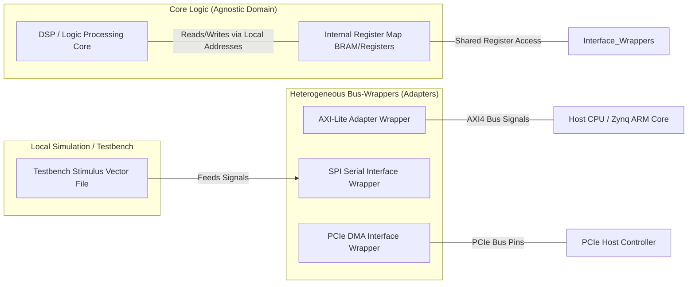
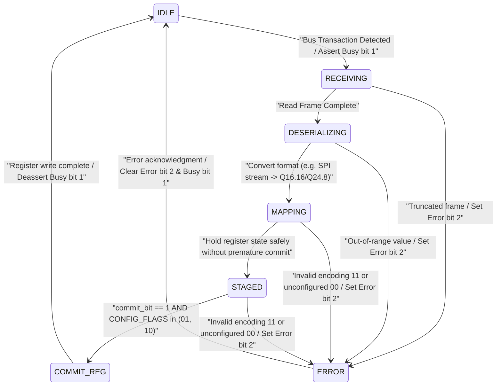

# Design Document: Hardware-Decoupled Persistence & Bus-Mapped Register Architecture (VHDL/FPGA Platform Profile)

## 1. Context & Architectural Goals
This document details the hardware design for implementing the decoupled, agnostic persistence specification as a synthesized digital system in **VHDL** on a **Xilinx FPGA** platform.

The core objectives are:
1. **Contract Decoupling in Silicon:** Isolating the core digital signal processing (DSP) or control logic from the physical IO transport protocol (e.g. SPI, I2C, UART, AXI-Lite, or PCIe).
2. **Memory-Mapped Register Abstraction:** Abstracting application database tables into a hardware **Register Map** utilizing fixed-point arithmetic representations.
3. **Heterogeneous Interface Mapping:** Supporting dynamic configuration of the transport wrapper (the adapter) to swap between serial testbenches (simulation) and physical bus synthesis (production hardware) without modifying the internal computation cores.

---

## 2. Decoupled Hardware Architecture
At the hardware description level, we implement the software adapter/repository pattern using **Bus-Wrappers** and **Finite State Machines (FSMs)**:

```mermaid
flowchart LR
    subgraph "Core Logic (Agnostic Domain)"
        DSP_Core["DSP / Logic Processing Core"]
        Reg_Map["Internal Register Map BRAM/Registers"]
    end

    subgraph "Heterogeneous Bus-Wrappers (Adapters)"
        AXI_Lite["AXI-Lite Adapter Wrapper"]
        SPI_Wrap["SPI Serial Interface Wrapper"]
        PCIe_Wrap["PCIe DMA Interface Wrapper"]
    end

    subgraph "Local Simulation / Testbench"
        TB_Stim["Testbench Stimulus Vector File"]
    end

    DSP_Core ---|"Reads/Writes via Local Addresses"| Reg_Map
    Reg_Map ---|"Shared Register Access"| Interface_Wrappers
    TB_Stim -->|"Feeds Signals"| SPI_Wrap
    AXI_Lite ---|"AXI4 Bus Signals"| Host_CPU["Host CPU / Zynq ARM Core"]
    PCIe_Wrap ---|"PCIe Bus Pins"| Ext_PCIe["PCIe Host Controller"]
```

### Architectural Principles:
* **The Shared Register Map (The Repository):** An internal array of registers or Block RAM (BRAM) addresses containing the data model values. The internal DSP core and external interface wrappers share access to this register map.
* **Bus-Wrappers (The Adapters):** VHDL wrappers that translate specific bus protocol signals (such as AXI-Lite read/write handshake lines, or SPI serial clock/data frames) into local register address writes.
* **Data Format Translators:** FSM logic within the wrappers that converts raw serialized bits or floating-point bus packets into the internal fixed-point representation used by the FPGA DSP logic.

---

## 3. Register & Data Format Mapping
To realize domain-neutral persistence in hardware registers, we define a 32-bit memory-mapped register configuration.

### Fixed-Point Abstract Data Representation
To avoid the resource overhead of floating-point units (FPUs) in FPGA fabric, values are stored as **32-bit two's complement fixed-point numbers**. Based on `CONFIG_FLAGS` bits 1-0 (Mode Choice), two distinct encodings are defined:

1. **Fixed-32 Representation (`CONFIG_FLAGS` bits 1-0 = `01`):**
   * Primary registers (`REGISTER_0`, `REGISTER_1`) use **Q16.16 signed format** (16 integer bits, 16 fractional bits), covering a representable range from **-32768 to +32767.99998**.
   * Resolution: $2^{-16} \approx 0.000015$, satisfying numerical accuracy specifications.
2. **Fixed-64 / High-Precision Representation (`CONFIG_FLAGS` bits 1-0 = `10`):**
   * Primary registers (`REGISTER_0`, `REGISTER_1`) use **Q24.8 signed format** (24 integer bits, 8 fractional bits), covering a representable range from **-8388608 to +8388607.996**.
   * Resolution: $2^{-8} = 0.00390625$.
3. **Auxiliary Data Register (`REGISTER_2`):**
   * `REGISTER_2` carries linear offset values under both variants and uses **Q24.8 signed format unconditionally** (range **-8388608 to +8388607.996**).

### Overflow & Error Handling
Register writes exceeding the selected variant's representable range MUST **leave the register unmodified** and set `CONTROL_STATUS` bit 2 (Error flag).

### Register Map Table (Base Offset: `0x43C0_0000`)

| Address Offset | Register Name | Access Type | Description / Bit Fields |
| :--- | :--- | :--- | :--- |
| `0x00` | `CONTROL_STATUS` | R/W | Bit 0: Commit (Trigger update) Bit 1: Busy flag (Read-only) Bit 2: Error flag (Read-only) |
| `0x04` | `CONFIG_FLAGS` | R/W | Bits 1-0: Mode Choice (00=Unconfigured, 01=Fixed-32, 10=Fixed-64) Bits 7-2: Profile ID |
| `0x08` | `REGISTER_0` | R/W | Dim_0 Primary Register (Q16.16 format for Mode 01 or Q24.8 format for Mode 10) |
| `0x0C` | `REGISTER_1` | R/W | Dim_1 Secondary Register (Q16.16 format for Mode 01 or Q24.8 format for Mode 10) |
| `0x10` | `REGISTER_2` | R/W | Dim_2 Auxiliary Register (Q24.8 format unconditionally) |
| `0x14` | `VALIDITY_LIMIT` | R/W | Epoch timestamp indicating validity boundary |

---

## 4. Agnostic Transport Translation FSM
Each bus wrapper runs a VHDL Finite State Machine to handle interface-specific transactions and commit them to the internal registers.

### FSM Realisation Matrix for `CONTROL_STATUS` Bits

| Bit | Bit Name | Access | FSM Assertion / Condition | State Transitions & Behavior |
| :--- | :--- | :--- | :--- | :--- |
| Bit 0 | Commit bit 0 | R/W | Guard condition for atomic commit | Asserted by host CPU to trigger commit; FSM checks `commit_bit == 1` in `STAGED` state before proceeding to `COMMIT_REG`. |
| Bit 1 | Busy bit 1 | Read-only | Asserted high during transaction processing | Asserted high when transitioning `IDLE --> RECEIVING`; remains high through `RECEIVING`, `DESERIALIZING`, `MAPPING`, `STAGED`, `COMMIT_REG`, and `ERROR`; deasserted low on returning to `IDLE`. |
| Bit 2 | Error bit 2 | Read-only | Asserted high on fault or invalid frame | Asserted high upon transition to `ERROR` state (triggered by invalid encoding `11`, unconfigured mode choice `00`, truncated frame, or out-of-range value); cleared on error acknowledgment transition `ERROR --> IDLE`. |

```mermaid
stateDiagram-v2
    IDLE --> RECEIVING : "Bus Transaction Detected / Assert Busy bit 1"
    RECEIVING --> DESERIALIZING : "Read Frame Complete"
    DESERIALIZING --> MAPPING : "Convert format (e.g. SPI stream -> Q16.16/Q24.8)"
    MAPPING --> STAGED : "Hold register state safely without premature commit"
    STAGED --> COMMIT_REG : "commit_bit == 1 AND CONFIG_FLAGS in (01, 10)"
    COMMIT_REG --> IDLE : "Register write complete / Deassert Busy bit 1"
    RECEIVING --> ERROR : "Truncated frame / Set Error bit 2"
    DESERIALIZING --> ERROR : "Out-of-range value / Set Error bit 2"
    MAPPING --> ERROR : "Invalid encoding 11 or unconfigured 00 / Set Error bit 2"
    STAGED --> ERROR : "Invalid encoding 11 or unconfigured 00 / Set Error bit 2"
    ERROR --> IDLE : "Error acknowledgment / Clear Error bit 2 & Busy bit 1"
```

### VHDL Translator FSM Details:
1. **IDLE:** Waits for interface-specific handshakes (e.g. AXI `AWVALID` and `WVALID` flags, or SPI Chip Select `CS_N` going low). Busy bit 1 and Error bit 2 are deasserted.
2. **RECEIVING:** Shifts in serialization data packets and asserts Busy bit 1. If a truncated frame is detected, transitions to **ERROR** and sets Error bit 2.
3. **DESERIALIZING:** Assembles bits into standard 32-bit hardware words. If an out-of-range value is detected, transitions to **ERROR** and sets Error bit 2.
4. **MAPPING:** Executes binary translation (e.g. converting IEEE-754 single-precision float inputs from a CPU into internal Q16.16 or Q24.8 fixed-point format). If invalid encoding (`11`) or unconfigured mode choice (`00`) is detected, transitions to **ERROR** and sets Error bit 2.
5. **STAGED:** Holds register state safely in staging registers without premature atomic commit. Guarded transition to **COMMIT_REG** occurs when `commit_bit == 1` (Commit bit 0) and `CONFIG_FLAGS` mode choice is valid (`01` Fixed-32 or `10` Fixed-64). If unconfigured (`00`) or invalid encoding (`11`), transitions to **ERROR** and sets Error bit 2.
6. **COMMIT_REG:** Asserts the internal register write enable to write values to target registers, then returns to **IDLE** while deasserting Busy bit 1.
7. **ERROR:** Sets Error bit 2. FSM remains in **ERROR** state holding error status until an error acknowledgment transaction is received, which transitions `ERROR --> IDLE`, clearing Error bit 2 and Busy bit 1.

---

## 5. Standalone Simulation & Verification Plan

### 1. Standalone Simulation Testbench & Golden Vector Oracle Verification Plan (Local Run)
For local development and E2E verification without physical hardware:
* We implement a parameterized testbench (`tb_register_map.vhd`).
* **Testbench Parameterization (`WRAPPER_KIND`):** The testbench instantiates the register map and binds a generic parameter `WRAPPER_KIND` taking values from (`SPI`, `AXI_LITE`, `PCIE`).
* **Golden Vector Oracle Test Requirements:** The testbench reads test data shapes from a local configuration vector file (`stimulus.dat`). The stimulus file declares IEEE-754 floating-point input vectors AND independently derived expected Q16.16 (Fixed-32) / Q24.8 (Fixed-64) golden fixed-point output vectors. The exact same `stimulus.dat` vector set runs against every configured value of `WRAPPER_KIND` (`SPI`, `AXI_LITE`, `PCIE`).
* The testbench simulates the physical clock and data lines for each interface, feeding the IEEE-754 input vectors into the active wrapper, and asserts that the internal registers resolve to the golden vector oracle outputs.
* **Mandated Verification Assertions:**
  1. **Nominal Conversion Accuracy:** Asserts that valid IEEE-754 input values correctly convert to nominal Q16.16 and Q24.8 fixed-point representations within 1 LSB tolerance.
  2. **Negative Two's Complement Sign Extension:** Asserts that negative register inputs correctly produce proper sign-extended two's complement fixed-point values.
  3. **LSB Rounding Mode:** Asserts that fractional rounding adheres to half-up LSB rounding rules without truncation drift.
  4. **Saturation & Error Flag on Overflow:** Asserts that register inputs exceeding representable range (-32768 to +32767.99998 for Q16.16, -8388608 to +8388607.996 for Q24.8) trigger register write inhibition and assert `CONTROL_STATUS` bit 2 (Error flag).
  5. **Cross-Wrapper Equivalence Assertion:** Verifies that writing the same vector through any adapter (`SPI_Wrap`, `AXI_Lite`, `PCIe_Wrap`) yields identical bit-level state in `REGISTER_0`, `REGISTER_1`, `REGISTER_2`, and `CONTROL_STATUS`. For each vector in `stimulus.dat`, resulting register contents are captured per wrapper and asserted bit-identical across all three adapters (`SPI_Wrap`, `AXI_Lite`, `PCIe_Wrap`). This assertion explicitly validates Objective 3 of Section 1; without it, the decoupling claim remains unasserted.
* **Negative Control Verification Requirement:** The verification suite MUST execute a negative control test where the conversion module is stubbed to pass-through IEEE-754 raw bits directly. The verification suite MUST fail if the conversion is stubbed to pass-through, confirming that the testbench detects broken or bypassed fixed-point conversion logic.

### 2. Objective-to-Assertion Matrix
The following matrix binds each architectural objective stated in Section 1 to its explicit verification assertion in Section 5:

| Section 1 Architectural Objective | Named Verification Assertion | Verification Scope & Target |
| :--- | :--- | :--- |
| **Objective 1: Contract Decoupling in Silicon** | Negative Control Verification & Interface Isolation Assertion | Asserts DSP/logic processing core operates strictly on internal register map address boundaries, decoupled from transport protocol framing. |
| **Objective 2: Memory-Mapped Register Abstraction** | Golden Vector Oracle & Nominal/Saturation Accuracy Assertions | Asserts vectors in `stimulus.dat` map to exact Q16.16/Q24.8 fixed-point state in `REGISTER_0`, `REGISTER_1`, `REGISTER_2`, and set `CONTROL_STATUS` bit 2 on overflow. |
| **Objective 3: Heterogeneous Interface Mapping** | Cross-Wrapper Equivalence Assertion | Asserts writing through any adapter (`SPI_Wrap`, `AXI_Lite`, `PCIe_Wrap`) under parameterized `WRAPPER_KIND` (`SPI`, `AXI_LITE`, `PCIE`) yields bit-identical state in `REGISTER_0`, `REGISTER_1`, `REGISTER_2`, and `CONTROL_STATUS`. |

### 3. Distributed Synthesis (Production Run)
For physical deployment:
* The core VHDL code is synthesized using **Xilinx Vivado** targeting a specific FPGA board (e.g. Xilinx Zynq-7000 or UltraScale+ SoC).
* The registers are exposed to the host CPU (e.g. ARM Cortex core) over an **AXI4-Lite IP block**, allowing software operating systems to read/write hardware registers via memory-mapped pointer offsets (`/dev/mem`).
