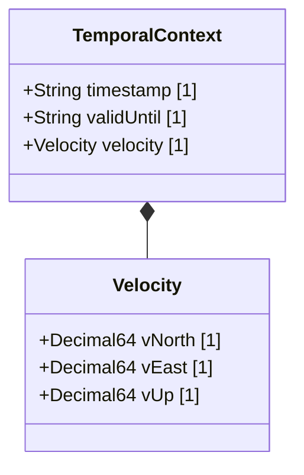

# Feature 03: Geolocation Dynamics and Temporal Context

## UML Class Diagram


## Interface Requirements

### 1. Payload Schema
The subsystem consumes and produces a state representation matching the following structure:
```json
{
  "timestamp": "2026-06-22T02:00:00.00Z",
  "validUntil": "2026-06-22T02:05:00.00Z",
  "velocity": {
    "vNorth": 12.345678901234,
    "vEast": -0.987654321098,
    "vUp": 0.000123456789
  }
}
```

### 3. Logical Operations & Interface Messages
1. Retrieve the active physical context.
2. Parse the geodetic velocity parameters.
3. Validate that the chronological expiration boundary is set after the initial tracking timestamp.

### 4. Logical Exception States & Validation Failures
1. Temporal overlap check: If the chronological boundary condition is violated (e.g. valid-until timestamp precedes the tracking timestamp), the system flags a validation failure and rejects the context change.
