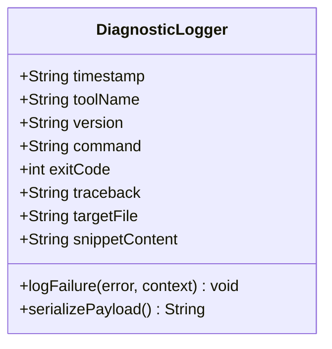

# Feature: Tooling-Side Automatic Diagnostic Payload Generation

## 1. Context
When linter or reconciler tooling commands fail during pipeline runs, downstream execution agents need a structured, machine-readable reproduction case to file bugs upstream. This feature automates the collection and serialization of diagnostic data and snippets when a tool fails.

## 2. UML Class Diagram

## 3. Interface Requirements
### 1. Payload Schema
The tool must serialize a JSON payload at `.pipeline/diagnostics/repro_payload_[timestamp].json` containing:
- `timestamp`: ISO-8601 string.
- `tooling`: Object with `name` and `version`.
- `context`: Object with `command`, `exit_code`, `downstream_repo` URL, and `commit_hash`.
- `failure`: Object with `traceback` and `error_summary`.
- `reproduction_case`: Object with `target_file`, `snippet_type`, and `snippet_content`.

### 4. Interactive Flow & States
1. The tool (linter/reconciler) runs standard validations.
2. If an exception or validation error is encountered, the tool intercepts the failure before exiting.
3. The tool gathers git state and logs, extracts the offending text block (e.g. alternate flows block), and writes the JSON payload file.
4. The tool exits with exit code 1.
