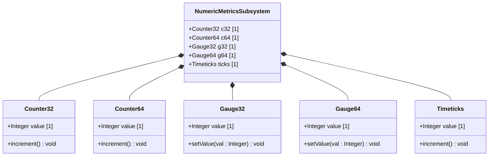

# Feature 04: Numeric and Identifier Metrics

## UML Class Diagram


## Interface Requirements

### 1. Payload Schema
The subsystem manages numeric telemetry and metrics serialized in the following structure:
```json
{
  "counter32": {
    "value": 1000
  },
  "counter64": {
    "value": 5000000000
  },
  "gauge32": {
    "value": 50
  },
  "gauge64": {
    "value": 12000
  },
  "timeticks": {
    "value": 360000
  }
}
```

### 3. Logical Operations & Interface Messages
1. Retrieve active metrics values.
2. Increment counters by standard step sizes.
3. Update gauge values with upper bound limits.

### 4. Logical Exception States & Validation Failures
1. Counter Wrap State: If a Counter32 exceeds its maximum 32-bit unsigned value, it resets to zero and continues tracking.
2. Gauge Range State: If a Gauge32 is set to a negative value or exceeds limits, a validation warning is registered and the change is rejected.
