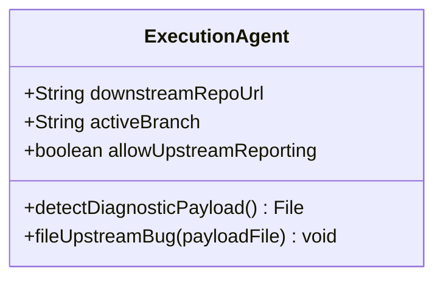

# Feature: Execution Agent Auto-Bug-Filing Interface

## 1. Context
To prevent execution agents from halting silently without reporting bugs, this feature updates downstream agent coordinator instructions to automatically parse diagnostic payloads and submit them as upstream issues.

## 2. UML Class Diagram

## 3. Interface Requirements
### 1. Payload Schema
- The agent reads `.pipeline/diagnostics/repro_payload_[timestamp].json`.
- The agent executes `gh issue create` using the payload file.

### 4. Interactive Flow & States
1. A pipeline command fails downstream.
2. The execution agent captures the non-zero exit code.
3. The agent checks if `allow_upstream_reporting` is enabled.
4. The agent searches for the latest file under `.pipeline/diagnostics/`.
5. The agent executes `gh issue create --repo gintatkinson/digital-pipeline-repo --title "Tooling Bug: [Command] failed" --body-file [payload_path] --label "feature"`.
6. The agent halts with the created issue URL.
