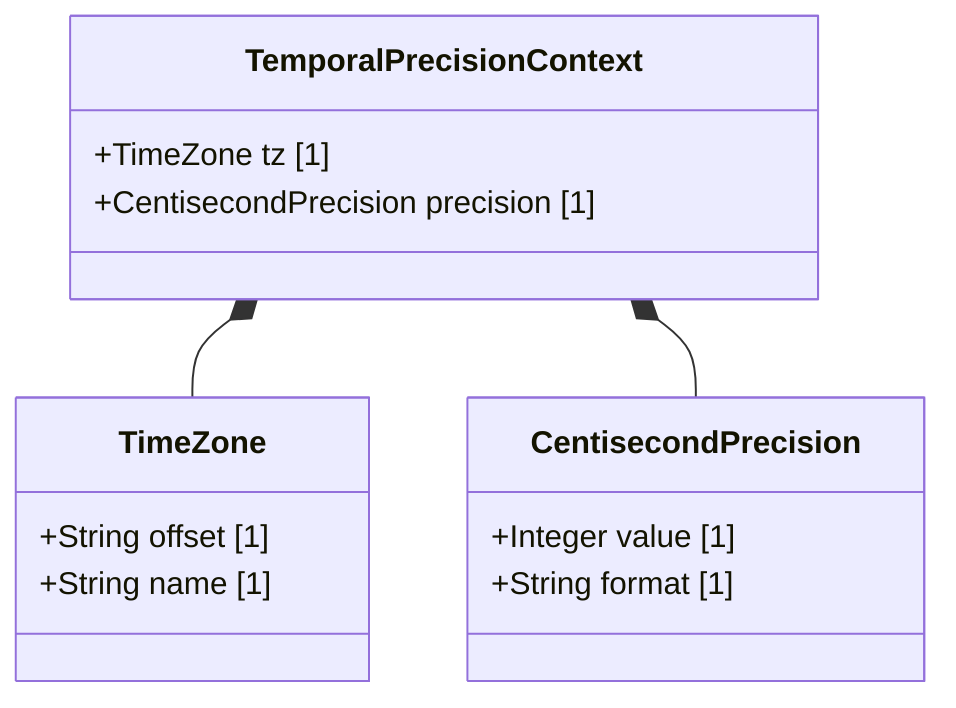

# Feature 05: Date, Time, and Temporal Precision

## UML Class Diagram


## Interface Requirements

### 1. Payload Schema
The subsystem serializes high-precision temporal references in the following structure:
```json
{
  "timezone": {
    "offset": "+08:00",
    "name": "Singapore Standard Time"
  },
  "precision": {
    "value": 15,
    "format": "centisecond"
  }
}
```

### 3. Logical Operations & Interface Messages
1. Parse ISO-8601 formatted timestamps.
2. Calculate time offsets based on timezone configuration.
3. Validate sub-second granularity for incoming events.

### 4. Logical Exception States & Validation Failures
1. Timezone format mismatch: If a timezone string is improperly structured (e.g. invalid offset format), the parser throws an exception and halts synchronization.
2. Underflow precision: If the input timestamp is missing centisecond fields, the system defaults the missing sub-seconds to zero.
