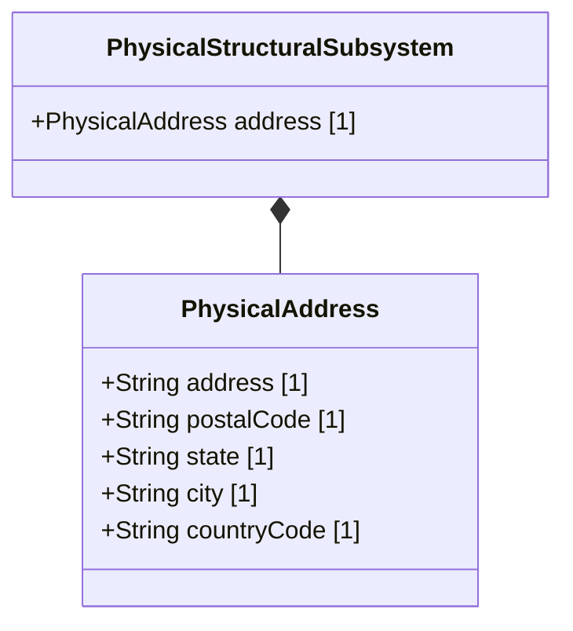

# Feature 06: Physical Addresses and Structural Identifiers

## UML Class Diagram


## Interface Requirements

### 1. Payload Schema
Physical location address payload structure is defined as follows:
```json
{
  "address": "123 Main St",
  "postalCode": "94016",
  "state": "California",
  "city": "San Francisco",
  "countryCode": "US"
}
```

### 3. Logical Operations & Interface Messages
1. Retrieve physical structural identities.
2. Validate country code format according to international codes.
3. Match structural address attributes.

### 4. Logical Exception States & Validation Failures
1. Invalid Country Code: If the `countryCode` parameter fails the 2-letter uppercase verification check, the address is marked invalid.
2. Missing Postal Information: If the postal code is absent in a region requiring it, a validation exception is raised.
