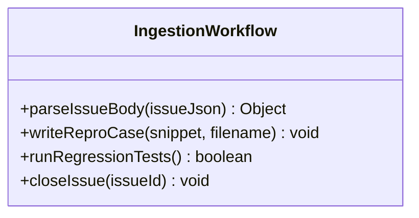

# Feature: Upstream Ingestion and Auto-Regression Testing

## 1. Context
Ensures that filed bugs are ingested into the upstream repository's test suite to verify fixes and prevent future regression of reported tooling issues.

## 2. UML Class Diagram

## 3. Interface Requirements
### 1. Payload Schema
- Input: GitHub Issue created by Feature 05.
- Output: Test file written to `tests/repro_cases/[issue_number].md`.

### 4. Interactive Flow & States
1. Upstream GitHub Action triggers on issue creation with `bug` or `feature` labels.
2. The Action parses the JSON payload from the issue description.
3. The Action writes the `snippet_content` to a local test file.
4. The Action executes the validators against the new test file to verify failure.
5. Post-patching, the suite ensures the case passes, merges the fix, and automatically closes the issue.
