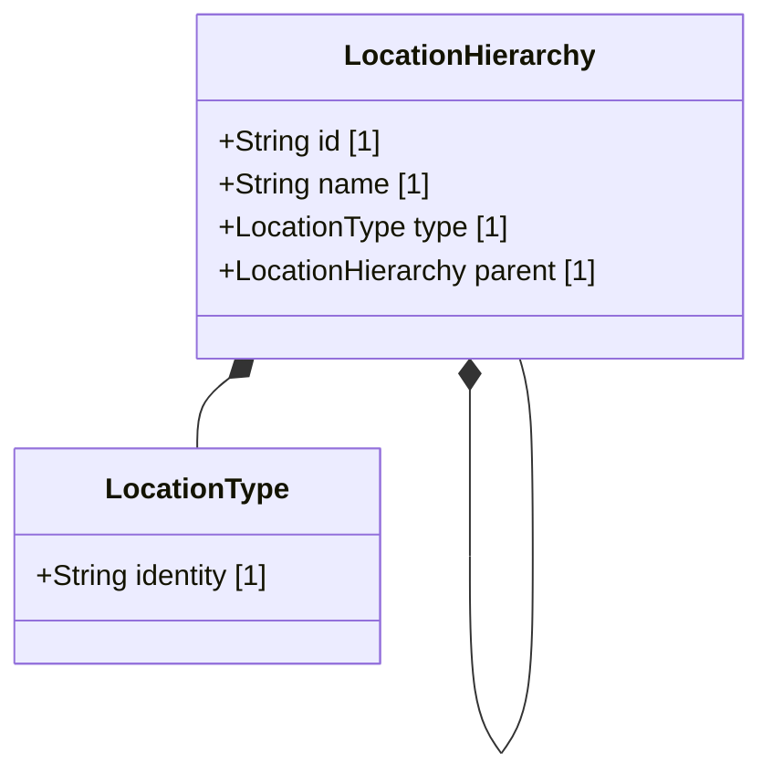

# Feature 07: Physical and Geographic Location Attributes

## UML Class Diagram


## Interface Requirements

### 1. Payload Schema
Locations and their hierarchy are represented by:
```json
{
  "id": "room-101",
  "name": "Server Room 101",
  "type": {
    "identity": "room"
  },
  "parent": {
    "id": "building-A",
    "name": "Building A",
    "type": {
      "identity": "building"
    }
  }
}
```

### 3. Logical Operations & Interface Messages
1. Retrieve active location hierarchy records.
2. Validate location identities against known standard values (`site`, `building`, `room`).
3. Ensure parent references resolve to valid active locations.

### 4. Logical Exception States & Validation Failures
1. Undefined Location Type: If a location maps to an identity other than the standard locations (e.g. unknown label), it throws an validation error.
2. Parent Reference Orphancy: If parent-child relationships reference a parent that does not exist in the catalog, validation fails.
