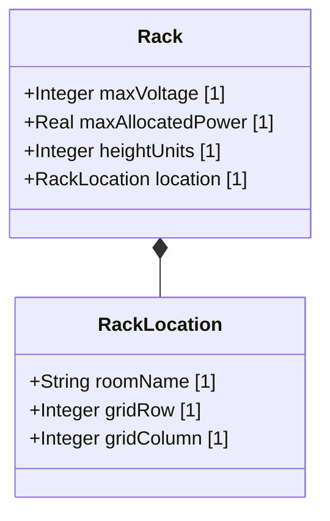

# Feature 08: Rack Structural Infrastructure

## UML Class Diagram


## Interface Requirements

### 1. Payload Schema
Rack configuration data payload format:
```json
{
  "maxVoltage": 480,
  "maxAllocatedPower": 15.5,
  "heightUnits": 42,
  "location": {
    "roomName": "DC-1",
    "gridRow": 12,
    "gridColumn": 4
  }
}
```

### 3. Logical Operations & Interface Messages
1. Retrieve infrastructure config profiles.
2. Verify dimensional capacities and layout limits.
3. Validate voltage and electrical capacity.

### 4. Logical Exception States & Validation Failures
1. Negative Capacity Violation: If voltage, height units, or power limits are configured below zero, the validator raises an exception.
2. Spatial Allocation Error: If rack coordinates are out of grid bounds, the layout update is rejected.
