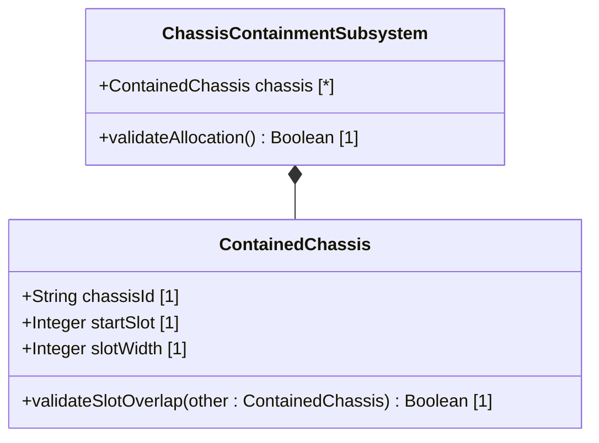

# Feature 09: Distributed Chassis Containment

## UML Class Diagram


## Interface Requirements

### 1. Payload Schema
Contained chassis specifications are payload-serialized as follows:
```json
{
  "chassisId": "chassis-node-9",
  "startSlot": 10,
  "slotWidth": 4
}
```

### 3. Logical Operations & Interface Messages
1. Retrieve active containment structures.
2. Place chassis within target U-slots inside a rack container.
3. Validate that slot ranges do not conflict or overlap with existing allocations.

### 4. Logical Exception States & Validation Failures
1. U-Slot Overlap Conflict: If a target U-slot range is already occupied, the allocation is denied and the containment status reports an exception.
2. Out-of-Rack Slot Range: If the target U-slot range exceeds the rack's defined capacity, validation fails.
