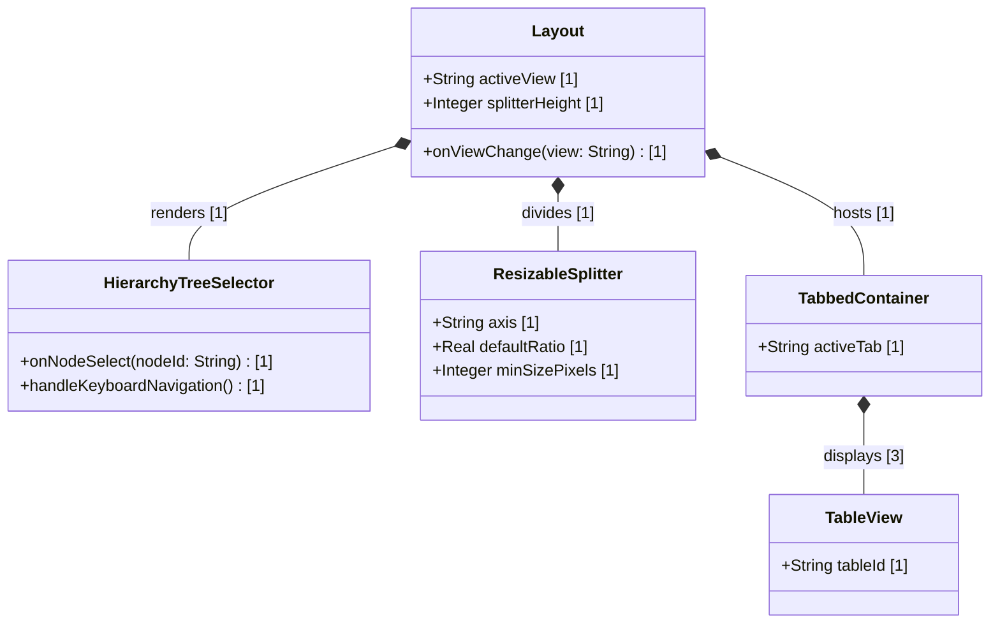

# Feature: Logical UI Layout Engine and Navigation Sidebar Shell

## UML Class Diagram


## Interface Requirements

### 1. Test Data Shape
```json
{
  "layoutConfig": {
    "sidebarWidth": "var(--alias-spacing-layout-sidebar-width)",
    "minPaneSize": "var(--alias-spacing-layout-min-pane-size)",
    "defaultRatio": 0.5,
    "axis": "horizontal"
  },
  "treeHierarchy": [
    {
      "id": "System",
      "label": "System",
      "children": [
        { "id": "Ingestion", "label": "Ingestion" },
        { "id": "Metrics", "label": "Metrics" },
        { "id": "Location", "label": "Location" }
      ]
    }
  ]
}
```

### 3. Visual Layout & Arrangement
- **Root Layout Shell**: Constraints enforce viewport boundaries using a row flex layout. Outer wrappers reset margins and specify hidden overflow bounds.
- **Tree Selector Sidebar**: Sidebar width is mapped to configuration tokens and structured as a flex column. Vertical scrolling is active while horizontal overflow is clipped.
- **Resizable Splitters**: Containers enforce reflow isolation with paint and layout containment rules. Inner list items and detail tables are excluded from active containment calculations.
- **High-Density Data Grid**: Table cell wrappers restrict row heights and apply compact vertical spacing to maximize visible entries.

### 4. Interactive Flow & States

#### Scenario 1: Switch Bottom Pane Tab
- **Given** the bottom workspace console is active and initialized with the "elements" (Items) tab selected.
- **When** the user clicks on the "alarms" (Status) tab selector.
- **Then** the UI updates the active tab state, highlights the "alarms" selector, and renders the active alarms data table.

#### Scenario 2: Navigate Hierarchy Tree Nodes via Keyboard
- **Given** the HierarchyTreeSelector navigation menu has focus and the "System" node is selected.
- **When** the user presses the "ArrowDown" keyboard key.
- **Then** the selection active focus moves to the next visible child node "Ingestion".

#### Scenario 3: Prevent Propagation on Splitter Pointer Events
- **Given** the layout splitter bar is mounted.
- **When** the user triggers pointer interactions to drag and resize the splitter pane.
- **Then** the layout event handlers capture pointer inputs, adjust height values, and explicitly block event propagation to isolate parent reflows.

---

## Source References
- **Project Constitution**: [constitution.md:L95-103](file:///Users/perkunas/digital-pipeline-repo/.pipeline/constitution.md#L95-L103) (Section 1.10 Layout Engine Compliance)
- **React Profile**: [react.md:L51-87](file:///Users/perkunas/digital-pipeline-repo/.pipeline/profiles/react.md#L51-L87) (Section 2 Visual Layout & Structure)
