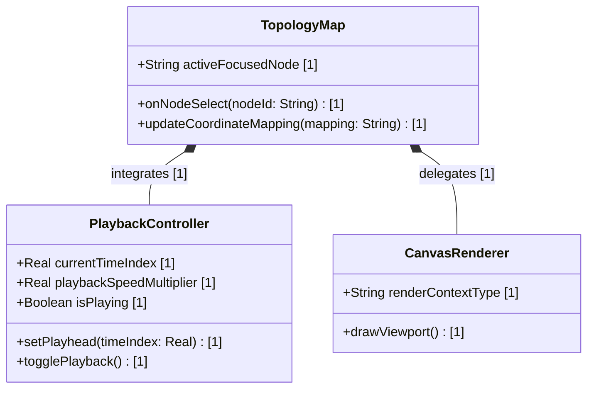

# Feature 11: Multi-Dimensional GPGPU Topology Canvas

## UML Class Diagram


## Interface Requirements

### 1. Test Data Shape
```json
{
  "coordinateMapping": {
    "x": "position/dim_0",
    "y": "position/dim_1",
    "z": "position/dim_2",
    "t": "position/time_index",
    "trajectory": "position/vector"
  },
  "nodes": [
    {
      "id": "Ingestion-Node",
      "label": "Ingestion",
      "position": { "dim_0": 10.5, "dim_1": 20.0, "dim_2": 0.0, "time_index": 1.0, "vector": [1.0, 0.0, 0.0] },
      "status": "Active"
    }
  ],
  "links": [
    {
      "source": "Ingestion-Node",
      "target": "Metrics-Node",
      "type": "data-flow"
    }
  ]
}
```

### 3. Visual Layout & Arrangement
- **Volumetric Bounds Viewport**: Hardware-accelerated canvas viewport container spanning the entire top pane height.
- **Timeline Overlay**: Timeline overlay at the bottom showing play/pause controls, slider playhead scrubber, and speed multipliers.

### 4. Interactive Flow & States

#### Scenario 1: Select Node on Canvas Highlights Sidebar Item
- **Given** the TopologyMap canvas is loaded and nodes are rendered.
- **When** the user clicks on the "Ingestion-Node" element.
- **Then** the UI captures the click event, updates the selection state, and highlights the corresponding node in the HierarchyTree.

#### Scenario 2: Playback scrubber updates timeline
- **Given** the PlaybackController is active and playing.
- **When** the user drags the playhead scrubber slider to time index 2.5.
- **Then** the canvas viewport redraws the nodes at their projected coordinates at time index 2.5.

---

## Source References
- **Project Constitution**: [constitution.md:L105-112](file:///Users/perkunas/digital-pipeline-repo/.pipeline/constitution.md#L105-L112) (Section 1.11 Multi-Dimensional Canvas Compliance)
- **React Profile**: [react.md:L89-115](file:///Users/perkunas/digital-pipeline-repo/.pipeline/profiles/react.md#L89-L115) (Section 3 GPGPU Telemetry Canvas Structure)
